# MosAIc Stack Data Flow Architecture

## Overview

This document describes how data flows through the MosAIc Stack, from user interactions to persistent storage, including CI/CD pipelines, AI orchestration, and inter-service communications.

## Primary Data Flows

### 1. Git Development Workflow

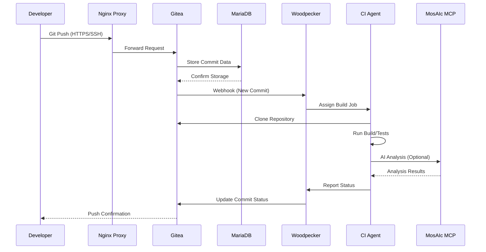

### 2. Documentation Workflow

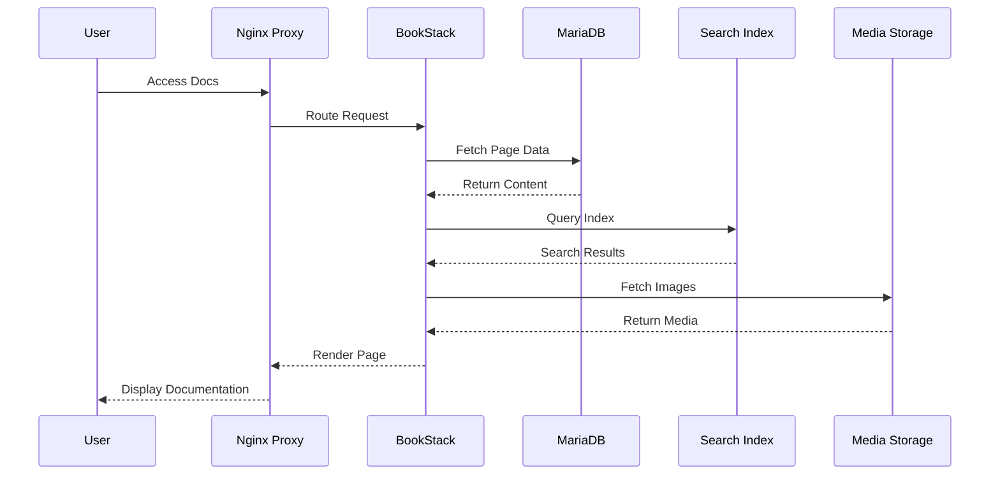

### 3. AI Orchestration Flow

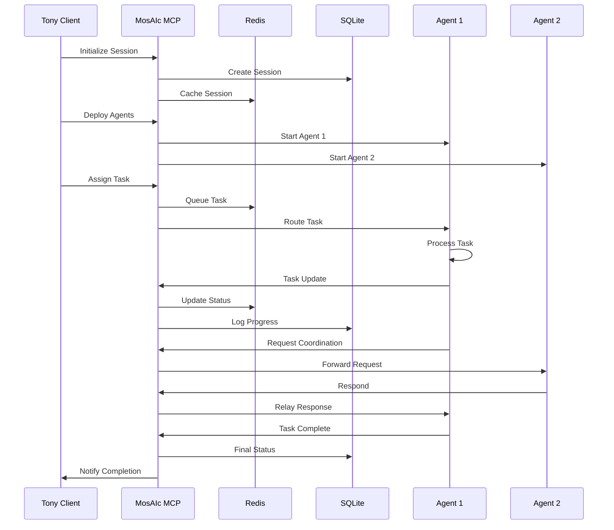

### 4. CI/CD Pipeline Flow

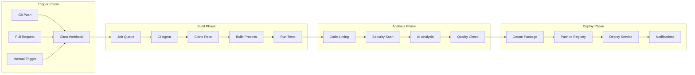

## Data Storage Patterns

### 1. Transactional Data

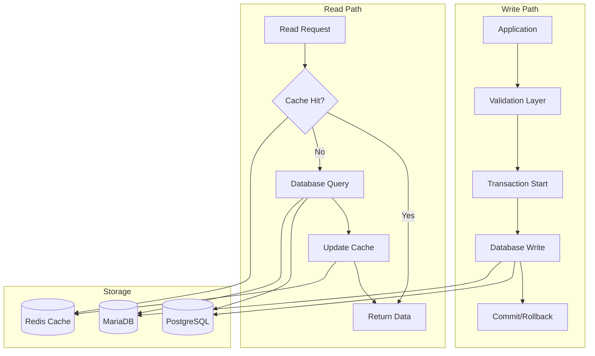

### 2. File Storage Patterns

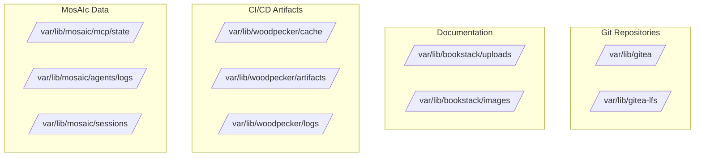

### 3. Cache Strategy

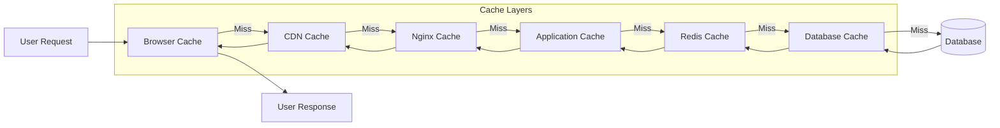

## Real-time Data Flows

### 1. WebSocket Connections

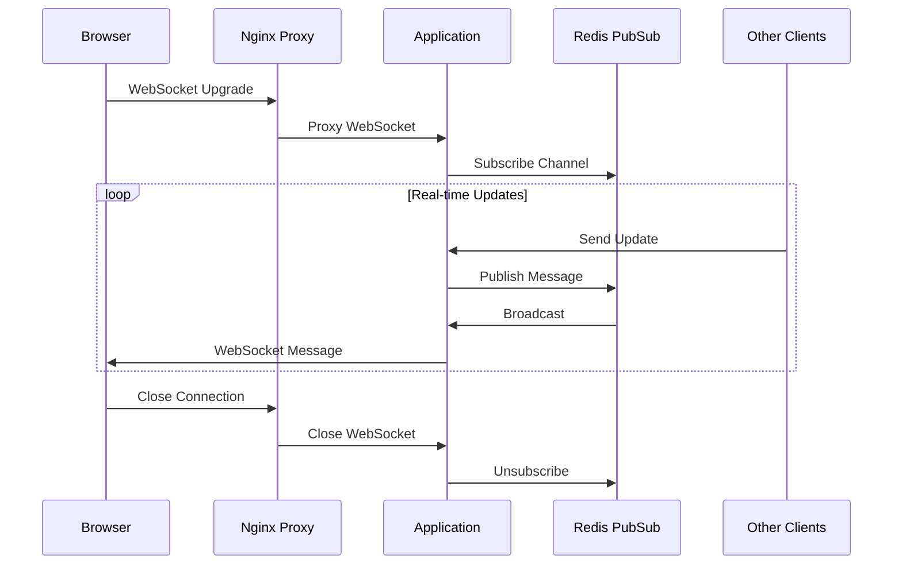

### 2. Event Streaming

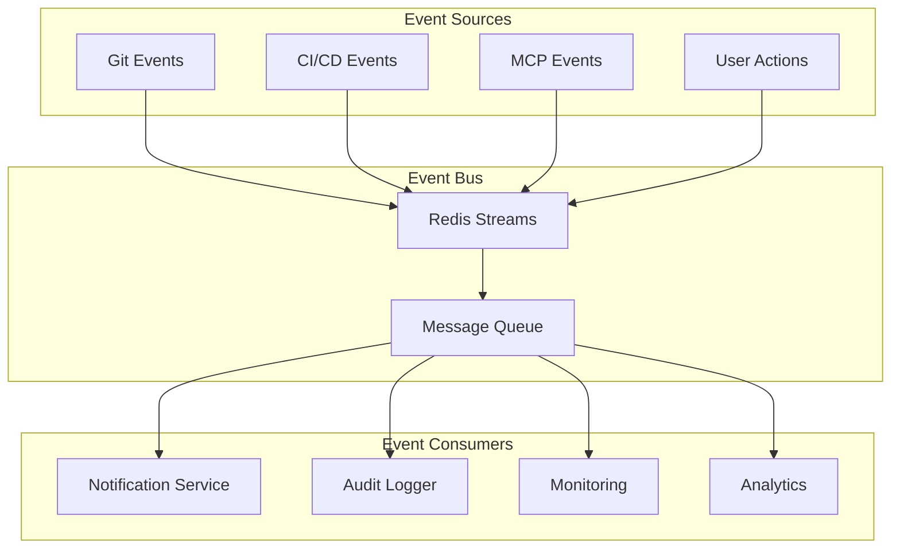

## Data Security Flows

### 1. Authentication Flow

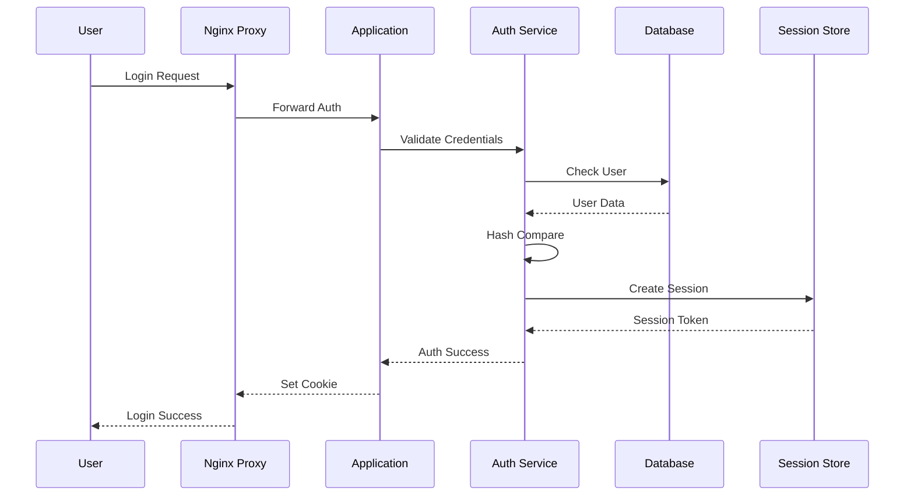

### 2. Data Encryption Flow

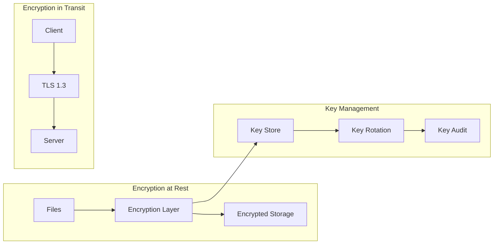

## Performance Optimization Flows

### 1. Query Optimization

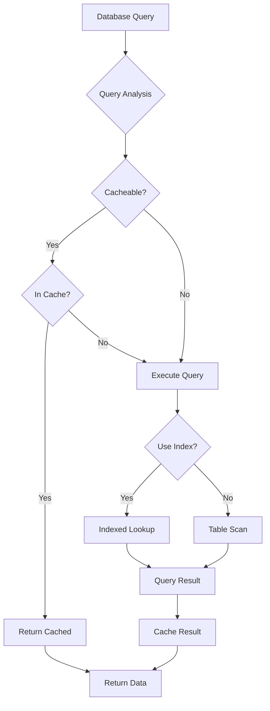

### 2. Asset Delivery

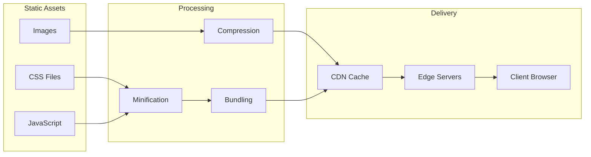

## Monitoring Data Flows

### 1. Metrics Collection

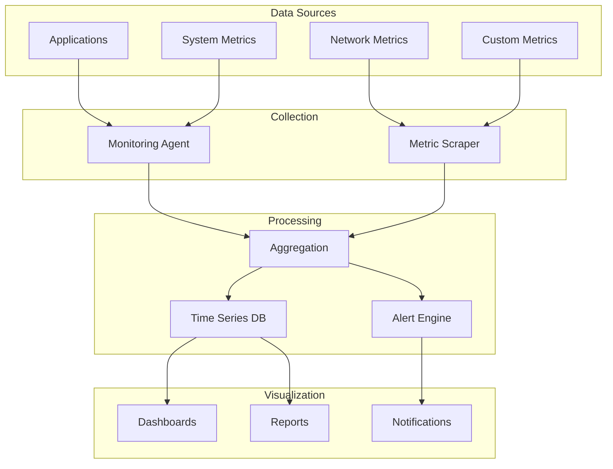

### 2. Log Aggregation

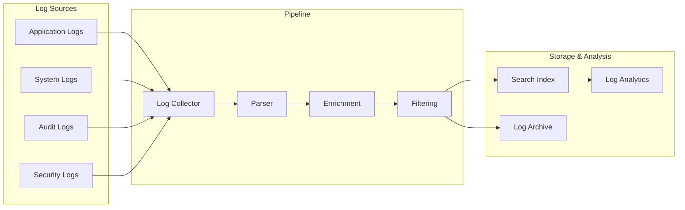

## Backup Data Flows

### 1. Incremental Backup

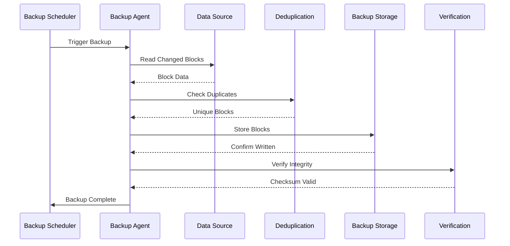

## Next Steps

- Review [Security Architecture](./security-architecture.md) for data protection details
- Check [Performance Tuning](../operations/performance-tuning.md) for optimization
- See [Monitoring Setup](../operations/monitoring.md) for data flow monitoring

---

*Last Updated: January 2025 | MosAIc Data Flow Architecture v1.0.0*