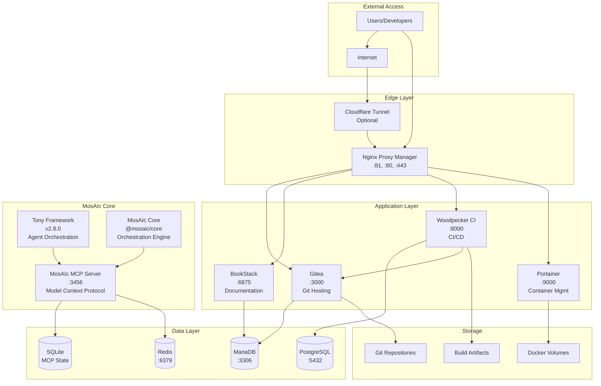
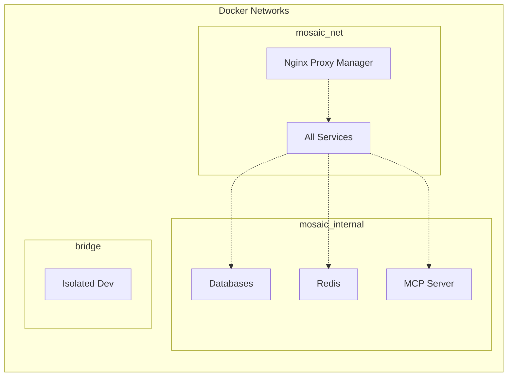
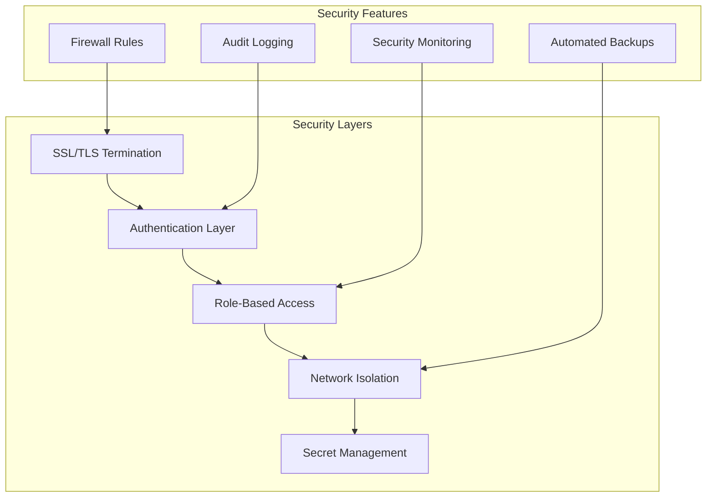
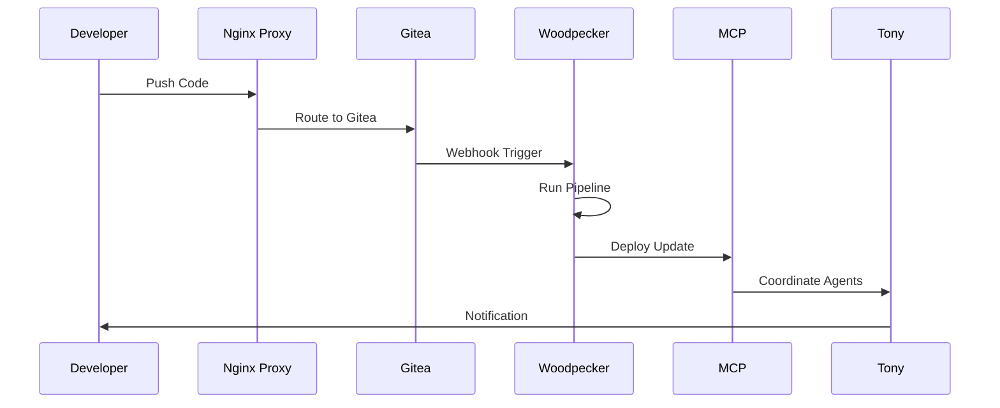

# MosAIc Stack Architecture Overview

## Introduction

The MosAIc Stack is a comprehensive enterprise development platform that integrates multiple services to provide a complete AI-powered development ecosystem. This document provides a high-level overview of the system architecture.

## System Architecture

## Component Layers

### 1. Edge Layer
- **Nginx Proxy Manager**: Handles all incoming traffic, SSL termination, and routing
- **Cloudflare Tunnel** (Optional): Secure external access without port forwarding

### 2. Application Layer
- **Gitea**: Self-hosted Git service for source code management
- **BookStack**: Documentation platform for project and API documentation
- **Woodpecker CI**: Continuous integration and deployment pipelines
- **Portainer**: Docker container management interface

### 3. MosAIc Core Layer
- **MosAIc MCP Server**: Model Context Protocol server for AI coordination
- **Tony Framework 2.8.0**: AI agent orchestration with MCP integration
- **@mosaic/core**: Central orchestration engine for multi-project coordination

### 4. Data Layer
- **PostgreSQL**: Primary database for Woodpecker CI and MosAIc Platform
- **MariaDB**: Database for Gitea and BookStack
- **Redis**: Caching and session management
- **SQLite**: Lightweight database for MCP state management

### 5. Storage Layer
- **Docker Volumes**: Persistent storage for all containers
- **Git Repositories**: Source code storage
- **Build Artifacts**: CI/CD build outputs and releases

## Network Architecture

## Port Mapping

| Service | Internal Port | External Port | Purpose |
|---------|--------------|---------------|---------|
| Nginx Proxy Manager | 80, 443, 81 | 80, 443, 81 | HTTP, HTTPS, Admin UI |
| Gitea | 3000 | - | Git hosting (proxied) |
| BookStack | 80 | 6875 | Documentation (proxied) |
| Woodpecker Server | 8000 | - | CI/CD UI (proxied) |
| Woodpecker Agent | 3000 | - | CI/CD agent |
| Portainer | 9000 | 9000 | Container management |
| PostgreSQL | 5432 | - | Database |
| MariaDB | 3306 | - | Database |
| Redis | 6379 | - | Cache |
| MosAIc MCP | 3456 | 3456 | MCP server (dev) |

## Security Architecture

## Data Flow

## High Availability Considerations

1. **Load Balancing**: Nginx Proxy Manager can distribute load across multiple instances
2. **Database Replication**: PostgreSQL and MariaDB support master-slave replication
3. **Container Orchestration**: Can be deployed on Docker Swarm or Kubernetes
4. **Backup Strategy**: Automated backups of all persistent data
5. **Monitoring**: Health checks and alerting for all services

## Scalability Design

The MosAIc Stack is designed to scale both vertically and horizontally:

- **Vertical Scaling**: Increase resources for individual services
- **Horizontal Scaling**: Add more instances behind load balancer
- **Microservices**: Each component can scale independently
- **Caching**: Redis reduces database load
- **CDN Integration**: Static assets can be served via CDN

## Next Steps

- Review [Service Documentation](../services/) for detailed component information
- Follow the [Deployment Guide](../deployment/complete-deployment-guide.md) to set up MosAIc
- Check [Operations Handbook](../operations/handbook.md) for maintenance procedures

---

*Last Updated: January 2025 | MosAIc Stack Architecture v1.0.0*