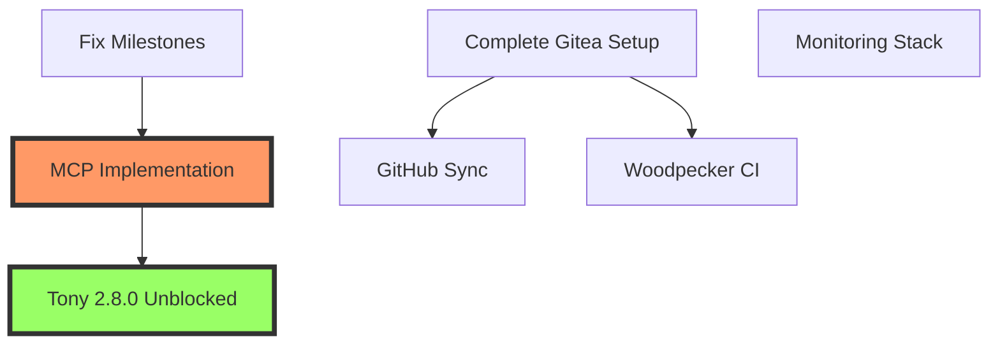

# MosAIc Infrastructure Task Breakdown

## Epic: E.002 - MosAIc Local Development Infrastructure

### Current Status
- ✅ PostgreSQL 17.5 deployed and running
- ✅ Redis 8.0.3 deployed and running  
- 🔄 Gitea 1.24.3 installation in progress
- ❌ Tony 2.8.0 blocked by MCP dependency
- ❌ Milestone sequencing issues in mosaic-mcp

### Priority 1: Unblock Tony 2.8.0 (CRITICAL)

#### F.002.01: Minimal MCP Implementation
**Owner**: MCP Integration Agent  
**Repository**: mosaic-mcp

- **S.002.01.01**: Create minimal MCP interface
  - T.002.01.01.01: Set up feature branch
  - T.002.01.01.02: Copy interface definitions from tony/mcp-unblock
  - T.002.01.01.03: Implement MCP server with TypeScript
  - T.002.01.01.04: Add PostgreSQL persistence layer
  - T.002.01.01.05: Create unit tests (90% coverage)
  - T.002.01.01.06: Integration tests with example agents
  - T.002.01.01.07: Update documentation
  - T.002.01.01.08: Create PR referencing Issue #81

**Estimated Time**: 4-6 hours  
**Blocker Removal**: Enables Tony 2.8.0 development immediately

### Priority 2: Fix Project Management Issues

#### F.002.02: Milestone Reorganization  
**Owner**: Milestone Fix Agent  
**Repository**: mosaic-mcp

- **S.002.02.01**: Fix milestone sequencing
  - T.002.02.01.01: Run milestone fix script
  - T.002.02.01.02: Move v0.1.0 to August 20
  - T.002.02.01.03: Move Issue #81 to v0.0.3 milestone
  - T.002.02.01.04: Create supporting issues
  - T.002.02.01.05: Update project documentation

**Estimated Time**: 1-2 hours  
**Impact**: Clarifies development timeline

### Priority 3: Complete Git Infrastructure

#### F.002.03: GitHub Synchronization
**Owner**: GitHub Sync Agent  
**Repository**: mosaic-sdk

- **S.002.03.01**: One-way Gitea to GitHub sync
  - T.002.03.01.01: Create webhook receiver service
  - T.002.03.01.02: Implement push synchronization
  - T.002.03.01.03: Add repository mapping configuration
  - T.002.03.01.04: Create Docker container
  - T.002.03.01.05: Write deployment documentation
  - T.002.03.01.06: Test with sample repository

**Estimated Time**: 3-4 hours  
**Dependency**: Gitea must be fully configured

### Priority 4: CI/CD Pipeline

#### F.002.04: Woodpecker CI Integration
**Owner**: CI/CD Integration Agent  
**Repository**: mosaic-sdk

- **S.002.04.01**: Woodpecker-Gitea integration
  - T.002.04.01.01: Create Gitea OAuth application
  - T.002.04.01.02: Configure Woodpecker environment
  - T.002.04.01.03: Set up Woodpecker agents
  - T.002.04.01.04: Create pipeline templates
  - T.002.04.01.05: Configure build caching
  - T.002.04.01.06: Document CI/CD workflows

**Estimated Time**: 3-4 hours  
**Dependency**: Gitea must be running

### Priority 5: Observability

#### F.002.05: Monitoring Stack
**Owner**: Monitoring Stack Agent  
**Repository**: mosaic-sdk

- **S.002.05.01**: Grafana Alloy deployment
  - T.002.05.01.01: Create monitoring docker-compose
  - T.002.05.01.02: Configure Prometheus scraping
  - T.002.05.01.03: Set up Loki log aggregation
  - T.002.05.01.04: Create Grafana dashboards
  - T.002.05.01.05: Configure alerts
  - T.002.05.01.06: Document access and usage

**Estimated Time**: 4-5 hours  
**Dependency**: None (can run in parallel)

## Execution Order

## Success Metrics

1. **Tony 2.8.0 Development**: Can proceed within 6 hours
2. **Local Development**: Fully functional Gitea with CI/CD within 24 hours
3. **Monitoring**: Complete observability within 24 hours
4. **Documentation**: All components documented and accessible

## Risk Mitigation

- **Risk**: Gitea configuration issues
  - **Mitigation**: GitHub sync can be delayed if needed
  
- **Risk**: MCP implementation complexity
  - **Mitigation**: Minimal interface focuses only on essential features

- **Risk**: Agent coordination failures
  - **Mitigation**: Each agent has independent tasks with clear success criteria