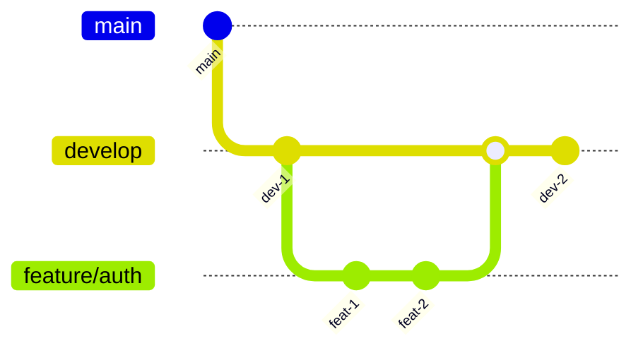

# Git Branching Strategy

The MosAIc Stack follows a modified GitFlow branching strategy optimized for continuous delivery.

## Branch Types

### Main Branches

#### `main` (Production)
- Always deployable
- Protected branch with required reviews
- Only accepts merges from `release/*` and `hotfix/*`
- Tagged with version numbers

#### `develop` (Integration)
- Integration branch for features
- Next release candidate
- Protected with CI checks
- Base for feature branches

### Supporting Branches

#### Feature Branches (`feature/*`)
```bash
# Create feature branch
git checkout develop
git pull origin develop
git checkout -b feature/TASK-123-user-authentication

# Work on feature
git add .
git commit -m "feat(auth): implement JWT authentication"

# Keep updated with develop
git fetch origin
git rebase origin/develop

# Push feature
git push origin feature/TASK-123-user-authentication
```

#### Release Branches (`release/*`)
```bash
# Create release branch
git checkout develop
git checkout -b release/1.2.0

# Bump version
npm version minor
git commit -m "chore: bump version to 1.2.0"

# After testing, merge to main
git checkout main
git merge --no-ff release/1.2.0
git tag -a v1.2.0 -m "Release version 1.2.0"

# Merge back to develop
git checkout develop
git merge --no-ff release/1.2.0
```

#### Hotfix Branches (`hotfix/*`)
```bash
# Create hotfix from main
git checkout main
git checkout -b hotfix/1.2.1

# Fix issue
git commit -m "fix: resolve critical security issue"

# Merge to main
git checkout main
git merge --no-ff hotfix/1.2.1
git tag -a v1.2.1 -m "Hotfix version 1.2.1"

# Merge to develop
git checkout develop
git merge --no-ff hotfix/1.2.1
```

## Naming Conventions

### Branch Names
```
feature/TASK-123-short-description
bugfix/TASK-456-fix-memory-leak
release/1.2.0
hotfix/1.2.1
chore/update-dependencies
docs/api-documentation
```

### Tag Names
```
v1.0.0          # Release versions
v1.0.0-rc.1     # Release candidates
v1.0.0-beta.1   # Beta versions
v1.0.0-alpha.1  # Alpha versions
```

## Workflow Examples

### Feature Development



1. **Start Feature**
   ```bash
   git checkout develop
   git pull origin develop
   git checkout -b feature/TASK-123-oauth-integration
   ```

2. **Develop Feature**
   ```bash
   # Make changes
   git add src/auth/oauth.ts
   git commit -m "feat(auth): add OAuth provider interface"
   
   # Add tests
   git add src/auth/__tests__/oauth.test.ts
   git commit -m "test(auth): add OAuth provider tests"
   ```

3. **Keep Updated**
   ```bash
   # Rebase on latest develop
   git fetch origin
   git rebase origin/develop
   
   # Resolve conflicts if any
   git add .
   git rebase --continue
   ```

4. **Create Pull Request**
   ```bash
   git push origin feature/TASK-123-oauth-integration
   # Create PR via Git platform
   ```

### Release Process

1. **Create Release Branch**
   ```bash
   git checkout develop
   git pull origin develop
   git checkout -b release/2.0.0
   ```

2. **Prepare Release**
   ```bash
   # Update version
   npm version major
   
   # Update changelog
   npm run changelog
   git add CHANGELOG.md
   git commit -m "docs: update changelog for 2.0.0"
   
   # Run final tests
   npm test
   npm run e2e
   ```

3. **Deploy Release**
   ```bash
   # Merge to main
   git checkout main
   git merge --no-ff release/2.0.0
   
   # Tag release
   git tag -a v2.0.0 -m "Release version 2.0.0"
   git push origin main --tags
   
   # Merge back to develop
   git checkout develop
   git merge --no-ff release/2.0.0
   git push origin develop
   ```

### Hotfix Process

1. **Create Hotfix**
   ```bash
   # Check current production version
   git checkout main
   git pull origin main
   git describe --tags
   
   # Create hotfix branch
   git checkout -b hotfix/2.0.1
   ```

2. **Apply Fix**
   ```bash
   # Make critical fix
   git add src/critical-fix.ts
   git commit -m "fix: resolve data corruption issue"
   
   # Add test
   git add src/__tests__/critical-fix.test.ts
   git commit -m "test: verify data corruption fix"
   ```

3. **Deploy Hotfix**
   ```bash
   # Update version
   npm version patch
   
   # Merge to main
   git checkout main
   git merge --no-ff hotfix/2.0.1
   git tag -a v2.0.1 -m "Hotfix version 2.0.1"
   git push origin main --tags
   
   # Merge to develop
   git checkout develop
   git merge --no-ff hotfix/2.0.1
   git push origin develop
   ```

## Branch Protection Rules

### Main Branch
- Require pull request reviews (2 reviewers)
- Dismiss stale reviews
- Require status checks:
  - CI/CD pipeline
  - Test coverage
  - Code quality scan
- Require branches to be up to date
- Include administrators
- Restrict force pushes

### Develop Branch
- Require pull request reviews (1 reviewer)
- Require status checks:
  - Unit tests
  - Linting
  - Build verification
- Restrict force pushes

## Commit Guidelines

### Message Format
```
<type>(<scope>): <subject>

<body>

<footer>
```

### Examples
```bash
# Feature commit
git commit -m "feat(auth): add multi-factor authentication

- Implement TOTP generation and validation
- Add QR code generation for authenticator apps
- Include rate limiting for failed attempts

Closes #234"

# Fix commit
git commit -m "fix(api): prevent race condition in user update

Multiple concurrent updates to the same user were causing
data inconsistency. Added optimistic locking to ensure
data integrity.

Fixes #456"
```

## Pull Request Process

### PR Template
```markdown
## Description
Brief description of changes

## Type of Change
- [ ] Bug fix (non-breaking change)
- [ ] New feature (non-breaking change)
- [ ] Breaking change
- [ ] Documentation update

## Testing
- [ ] Unit tests pass
- [ ] Integration tests pass
- [ ] Manual testing completed

## Checklist
- [ ] Code follows style guidelines
- [ ] Self-review completed
- [ ] Documentation updated
- [ ] No new warnings
- [ ] Tests added/updated
```

### Review Process
1. **Author**: Create PR with description
2. **CI**: Automated checks run
3. **Reviewers**: Code review
4. **Author**: Address feedback
5. **Reviewers**: Approve changes
6. **Maintainer**: Merge PR

## Merge Strategies

### Feature to Develop
```bash
# Squash merge for clean history
git checkout develop
git merge --squash feature/TASK-123
git commit -m "feat: complete TASK-123 implementation"
```

### Release to Main
```bash
# No-FF merge to preserve branch history
git checkout main
git merge --no-ff release/1.0.0
```

### Develop to Feature (Update)
```bash
# Rebase to maintain linear history
git checkout feature/TASK-123
git rebase develop
```

## Conflict Resolution

### Rebase Conflicts
```bash
# Start rebase
git rebase develop

# Resolve conflicts in editor
# Stage resolved files
git add .

# Continue rebase
git rebase --continue

# Or abort if needed
git rebase --abort
```

### Merge Conflicts
```bash
# During merge
git merge develop

# Resolve conflicts
# Use mergetool if configured
git mergetool

# Complete merge
git add .
git commit
```

## Best Practices

1. **Keep branches short-lived**
   - Feature branches: < 1 week
   - Release branches: < 3 days
   - Hotfix branches: < 1 day

2. **Regular integration**
   - Rebase feature branches daily
   - Merge to develop frequently
   - Keep PRs small and focused

3. **Clear communication**
   - Use descriptive branch names
   - Write meaningful commit messages
   - Update PR descriptions
   - Comment on complex changes

4. **Clean history**
   - Squash feature commits
   - Use rebase for updates
   - Avoid merge commits in features
   - Tag all releases

---

For more Git workflows, see:
- [Commit Standards](../standards/01-commit-messages.md)
- [Code Review Process](./02-code-review.md)
- [Release Management](./03-release-process.md)