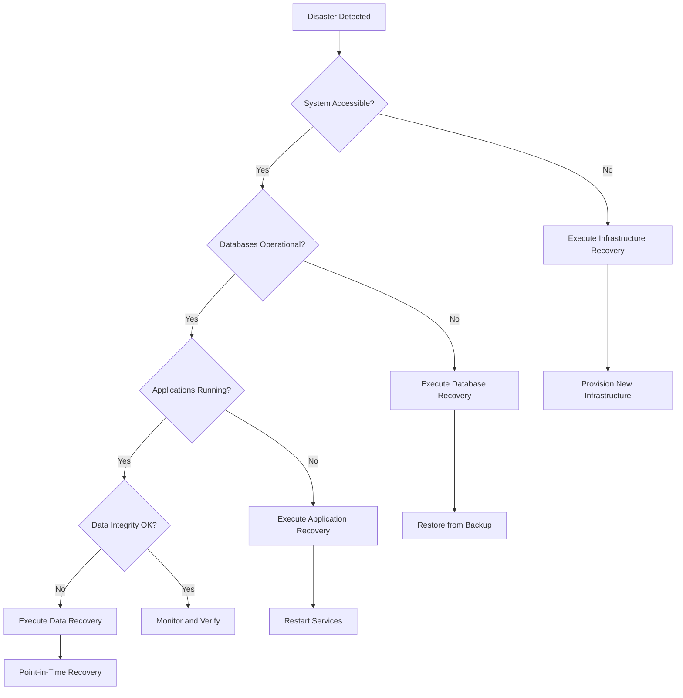

# Disaster Recovery Plan

Comprehensive disaster recovery procedures for the MosAIc Stack to ensure business continuity in the event of major failures or catastrophic events.

## Executive Summary

### Recovery Objectives

| Metric | Target | Description |
|--------|--------|-------------|
| **RTO** (Recovery Time Objective) | 4 hours | Maximum acceptable downtime |
| **RPO** (Recovery Point Objective) | 1 hour | Maximum acceptable data loss |
| **MTTR** (Mean Time To Recovery) | 2 hours | Average recovery time |
| **MTTF** (Mean Time To Failure) | 365 days | System reliability target |

### Disaster Classifications

#### Severity Levels

1. **Critical (P1)** - Complete system failure affecting all users
   - Examples: Data center loss, ransomware attack, catastrophic hardware failure
   - Response time: < 15 minutes
   - Escalation: Immediate

2. **High (P2)** - Major functionality impaired, multiple services affected
   - Examples: Database corruption, network outage, storage failure
   - Response time: < 30 minutes
   - Escalation: Within 1 hour

3. **Medium (P3)** - Single service failure, limited user impact
   - Examples: Application crash, performance degradation
   - Response time: < 2 hours
   - Escalation: Within 4 hours

4. **Low (P4)** - Minor issues, minimal impact
   - Examples: UI glitches, non-critical service issues
   - Response time: < 24 hours
   - Escalation: Best effort

### Disaster Types Covered

- **Infrastructure Failures**: Hardware, network, power, cooling
- **Data Disasters**: Corruption, deletion, ransomware
- **Natural Disasters**: Earthquake, flood, fire, severe weather
- **Human Errors**: Accidental deletion, misconfiguration
- **Cyber Attacks**: DDoS, intrusion, malware
- **Software Failures**: Bugs, incompatibilities, cascading failures

## Emergency Response Team

### Team Structure

```
Incident Commander (IC)
├── Technical Response Lead
│   ├── Infrastructure Team
│   ├── Database Team
│   ├── Application Team
│   └── Security Team
├── Communications Lead
│   ├── Internal Communications
│   ├── Customer Communications
│   └── Stakeholder Updates
└── Business Liaison
    ├── Executive Briefings
    ├── Legal/Compliance
    └── Vendor Coordination
```

### Contact Information

#### Primary Contacts

| Role | Name | Primary Phone | Backup Phone | Email | Escalation |
|------|------|---------------|--------------|-------|------------|
| Incident Commander | John Doe | +1-555-0101 | +1-555-0201 | john.doe@example.com | CEO |
| Technical Lead | Jane Smith | +1-555-0102 | +1-555-0202 | jane.smith@example.com | CTO |
| Database Admin | Bob Johnson | +1-555-0103 | +1-555-0203 | bob.johnson@example.com | Tech Lead |
| Security Lead | Alice Brown | +1-555-0104 | +1-555-0204 | alice.brown@example.com | CISO |
| Communications | Carol White | +1-555-0105 | +1-555-0205 | carol.white@example.com | CMO |

#### Vendor Contacts

| Service | Company | Account # | Support Phone | Email | SLA |
|---------|---------|-----------|---------------|-------|-----|
| Cloud Provider | AWS | 123456789 | +1-800-AWS-HELP | enterprise@aws.com | 24/7 |
| Backup Storage | Backblaze | BB-98765 | +1-800-BACKUP | support@backblaze.com | 24/7 |
| DNS Provider | Cloudflare | CF-54321 | +1-888-CLOUD | enterprise@cloudflare.com | 24/7 |
| Monitoring | DataDog | DD-11111 | +1-866-DATA | support@datadog.com | 24/7 |

### Communication Channels

#### Primary Channels
- **Incident Bridge**: +1-555-INCIDENT (PIN: 911911)
- **Slack Channel**: #incident-response
- **Email List**: incident-team@example.com
- **Status Page**: https://status.example.com

#### Backup Channels
- **Secondary Bridge**: +1-555-BACKUP (PIN: 112112)
- **SMS Group**: Use phone tree
- **Physical War Room**: Building A, Room 500

## Disaster Response Procedures

### Initial Response Protocol (0-15 minutes)

```bash
#!/bin/bash
# /opt/mosaic/scripts/disaster-response-init.sh

# Generate unique incident ID
INCIDENT_ID="DR-$(date +%Y%m%d-%H%M%S)"
INCIDENT_DIR="/var/log/mosaic/incidents/${INCIDENT_ID}"
mkdir -p "${INCIDENT_DIR}"

# Start incident log
cat > "${INCIDENT_DIR}/incident.log" <<EOF
DISASTER RESPONSE INITIATED
Incident ID: ${INCIDENT_ID}
Start Time: $(date)
Severity: ${1:-UNKNOWN}
Reporter: ${USER}
Initial Description: ${2:-"No description provided"}
EOF

# Capture system state
echo "Capturing system state..."
docker ps -a > "${INCIDENT_DIR}/docker-state.txt"
df -h > "${INCIDENT_DIR}/disk-state.txt"
free -h > "${INCIDENT_DIR}/memory-state.txt"
netstat -tulpn > "${INCIDENT_DIR}/network-state.txt"
ps aux > "${INCIDENT_DIR}/process-state.txt"

# Check critical services
for service in postgres mariadb redis gitea plane bookstack; do
    docker inspect mosaic-${service} > "${INCIDENT_DIR}/${service}-inspect.json" 2>&1
done

# Alert incident commander
curl -X POST https://alerts.example.com/api/page \
    -d "recipient=incident-commander&message=DR+Incident+${INCIDENT_ID}&priority=critical"

echo "Incident ${INCIDENT_ID} initialized. Response team alerted."
```

### Triage and Assessment (15-30 minutes)

#### System Health Assessment Matrix

```bash
# /opt/mosaic/scripts/disaster-assessment.sh

INCIDENT_ID=$1
ASSESSMENT_LOG="/var/log/mosaic/incidents/${INCIDENT_ID}/assessment.log"

assess_component() {
    local component=$1
    local check_cmd=$2
    local status="UNKNOWN"
    
    if eval "$check_cmd" >/dev/null 2>&1; then
        status="OPERATIONAL"
    else
        status="FAILED"
    fi
    
    echo "$(date '+%Y-%m-%d %H:%M:%S') | $component | $status" >> "$ASSESSMENT_LOG"
    echo "$status"
}

# Infrastructure checks
echo "=== Infrastructure Assessment ===" >> "$ASSESSMENT_LOG"
assess_component "Docker Daemon" "docker version"
assess_component "Network Connectivity" "ping -c 1 8.8.8.8"
assess_component "DNS Resolution" "nslookup example.com"
assess_component "Storage Available" "[[ $(df / | awk 'NR==2 {print $5}' | sed 's/%//') -lt 90 ]]"

# Database checks
echo "=== Database Assessment ===" >> "$ASSESSMENT_LOG"
assess_component "PostgreSQL" "docker exec mosaic-postgres pg_isready -U postgres"
assess_component "MariaDB" "docker exec mosaic-mariadb mysqladmin ping -u root -p\${MARIADB_ROOT_PASSWORD}"
assess_component "Redis" "docker exec mosaic-redis redis-cli ping"

# Application checks
echo "=== Application Assessment ===" >> "$ASSESSMENT_LOG"
assess_component "Gitea" "curl -s http://localhost:3000/api/healthz | grep -q ok"
assess_component "BookStack" "curl -s http://localhost:80 | grep -q BookStack"
assess_component "Plane" "curl -s http://localhost:8000/api/health"
assess_component "Woodpecker" "curl -s http://localhost:8000/healthz"

# Generate summary
FAILED_COUNT=$(grep -c "FAILED" "$ASSESSMENT_LOG")
echo "=== Assessment Summary ===" >> "$ASSESSMENT_LOG"
echo "Failed Components: $FAILED_COUNT" >> "$ASSESSMENT_LOG"
echo "Assessment Complete: $(date)" >> "$ASSESSMENT_LOG"
```

### Decision Tree



## Recovery Procedures by Scenario

### Scenario 1: Complete System Failure

Complete infrastructure loss requiring full rebuild.

#### Phase 1: Infrastructure Recovery (0-1 hour)

```bash
# /opt/mosaic/scripts/dr-infrastructure-recovery.sh

log() {
    echo "[$(date +'%Y-%m-%d %H:%M:%S')] [INFRA] $1"
}

# Check if we can recover existing infrastructure
if ping -c 1 primary-server.example.com >/dev/null 2>&1; then
    log "Primary server responsive, attempting recovery"
    ssh primary-server.example.com 'sudo systemctl restart docker'
else
    log "Primary server unresponsive, failing over to DR site"
    
    # Provision new infrastructure (cloud provider specific)
    case "$CLOUD_PROVIDER" in
        "aws")
            log "Provisioning AWS infrastructure"
            terraform -chdir=/opt/mosaic/terraform/aws apply -auto-approve
            ;;
        "azure")
            log "Provisioning Azure infrastructure"
            terraform -chdir=/opt/mosaic/terraform/azure apply -auto-approve
            ;;
        "gcp")
            log "Provisioning GCP infrastructure"
            terraform -chdir=/opt/mosaic/terraform/gcp apply -auto-approve
            ;;
    esac
    
    # Get new server details
    NEW_SERVER_IP=$(terraform output -raw server_ip)
    
    # Configure new server
    ansible-playbook -i "$NEW_SERVER_IP," /opt/mosaic/ansible/disaster-recovery.yml
fi
```

#### Phase 2: Service Recovery (1-2 hours)

```bash
# /opt/mosaic/scripts/dr-service-recovery.sh

DR_SERVER=$1
BACKUP_LOCATION="s3://mosaic-backups/dr-latest"

log() {
    echo "[$(date +'%Y-%m-%d %H:%M:%S')] [SERVICE] $1"
}

# Copy recovery scripts to DR server
log "Copying recovery scripts to DR server"
scp -r /opt/mosaic/scripts/* root@${DR_SERVER}:/opt/mosaic/scripts/

# Download latest backups
log "Downloading latest backups from S3"
ssh root@${DR_SERVER} "aws s3 sync ${BACKUP_LOCATION} /opt/mosaic/backups/dr-restore/"

# Execute restore on DR server
log "Starting restore process on DR server"
ssh root@${DR_SERVER} "/opt/mosaic/scripts/restore-all.sh dr-restore"

# Update DNS records
log "Updating DNS records to point to DR server"
/opt/mosaic/scripts/update-dns.sh --target ${DR_SERVER}

# Verify services
log "Verifying service restoration"
ssh root@${DR_SERVER} "/opt/mosaic/scripts/verify-restore.sh"
```

#### Phase 3: Full Recovery (2-4 hours)

```bash
# /opt/mosaic/scripts/dr-full-recovery.sh

log() {
    echo "[$(date +'%Y-%m-%d %H:%M:%S')] [FULL] $1"
}

# Start monitoring on recovered system
log "Starting monitoring services"
ssh root@${DR_SERVER} "docker compose -f /opt/mosaic/deployment/docker-compose.monitoring.yml up -d"

# Restore scheduled jobs
log "Restoring scheduled jobs"
ssh root@${DR_SERVER} "crontab /opt/mosaic/backups/dr-restore/configs/crontab_latest.txt"

# Enable backups on DR site
log "Enabling backup schedule on DR site"
ssh root@${DR_SERVER} "systemctl enable --now mosaic-backup-daily.timer"

# Final verification
log "Running final verification checks"
/opt/mosaic/scripts/dr-verification-suite.sh ${DR_SERVER}

# Update documentation
log "Updating DR documentation"
cat >> /opt/mosaic/docs/dr-events.log <<EOF
DR Event: $(date)
Type: Complete System Failure
Recovery Time: 4 hours
Data Loss: Minimal (< 1 hour)
New Primary: ${DR_SERVER}
EOF
```

### Scenario 2: Database Corruption

Database recovery without full system restore.

```bash
# /opt/mosaic/scripts/dr-database-corruption.sh

CORRUPTED_DB=$1  # postgres, mariadb, or redis

log() {
    echo "[$(date +'%Y-%m-%d %H:%M:%S')] [DB-RECOVERY] $1"
}

case "$CORRUPTED_DB" in
    "postgres")
        log "PostgreSQL corruption detected"
        
        # Stop dependent services
        docker compose -f deployment/gitea/docker-compose.yml stop
        docker compose -f deployment/services/plane/docker-compose.yml stop
        
        # Attempt repair
        docker exec mosaic-postgres postgres --single -D /var/lib/postgresql/data postgres <<EOF
REINDEX DATABASE template1;
REINDEX DATABASE postgres;
VACUUM FULL;
ANALYZE;
EOF
        
        if [ $? -ne 0 ]; then
            log "Repair failed, restoring from backup"
            /opt/mosaic/scripts/restore-postgres.sh /opt/mosaic/backups/latest
        fi
        
        # Restart services
        docker compose -f deployment/gitea/docker-compose.yml up -d
        docker compose -f deployment/services/plane/docker-compose.yml up -d
        ;;
        
    "mariadb")
        log "MariaDB corruption detected"
        
        # Stop dependent services
        docker compose -f deployment/docker-compose.bookstack-mariadb.yml stop bookstack
        
        # Attempt repair
        docker exec mosaic-mariadb mysqlcheck --repair --all-databases -u root -p${MARIADB_ROOT_PASSWORD}
        
        if [ $? -ne 0 ]; then
            log "Repair failed, restoring from backup"
            /opt/mosaic/scripts/restore-mariadb.sh /opt/mosaic/backups/latest
        fi
        
        # Restart services
        docker compose -f deployment/docker-compose.bookstack-mariadb.yml up -d
        ;;
        
    "redis")
        log "Redis corruption detected"
        
        # Redis corruption is usually unrecoverable
        log "Restoring Redis from backup"
        /opt/mosaic/scripts/restore-redis.sh /opt/mosaic/backups/latest
        ;;
esac

# Verify recovery
/opt/mosaic/scripts/verify-database.sh $CORRUPTED_DB
```

### Scenario 3: Ransomware Attack

Security incident response and recovery.

```bash
# /opt/mosaic/scripts/dr-ransomware-response.sh

INCIDENT_ID="SEC-$(date +%Y%m%d-%H%M%S)"
QUARANTINE_DIR="/quarantine/${INCIDENT_ID}"

log() {
    echo "[$(date +'%Y-%m-%d %H:%M:%S')] [SECURITY] $1" | tee -a /var/log/mosaic/security/${INCIDENT_ID}.log
}

# IMMEDIATE ACTIONS - Contain the threat
log "RANSOMWARE DETECTED - Initiating emergency response"

# 1. Network isolation
log "Isolating network"
iptables -I INPUT 1 -j DROP
iptables -I OUTPUT 1 -j DROP
iptables -I INPUT 1 -s 127.0.0.1 -j ACCEPT
iptables -I OUTPUT 1 -d 127.0.0.1 -j ACCEPT

# 2. Stop all services
log "Stopping all services to prevent spread"
docker stop $(docker ps -q)

# 3. Create forensic snapshot
log "Creating forensic snapshot"
mkdir -p "$QUARANTINE_DIR"
dd if=/dev/sda of="${QUARANTINE_DIR}/forensic-image.dd" bs=4M status=progress

# 4. Identify encrypted files
log "Identifying encrypted files"
find /var/lib/mosaic -type f \( -name "*.encrypted" -o -name "*.locked" -o -name "*RECOVER*" \) \
    > "${QUARANTINE_DIR}/encrypted-files.txt"

# 5. Check backup integrity
log "Verifying backup integrity"
/opt/mosaic/scripts/verify-all-backups.sh --offline --detailed \
    > "${QUARANTINE_DIR}/backup-verification.txt"

# 6. Identify infection vector
log "Analyzing infection vector"
grep -r "wget\|curl\|nc\|/dev/tcp" /var/log/ > "${QUARANTINE_DIR}/suspicious-activity.txt"
docker logs $(docker ps -aq) 2>&1 | grep -E "(exploit|payload|shell)" \
    > "${QUARANTINE_DIR}/container-logs-suspicious.txt"

# 7. Notify security team
curl -X POST https://security.example.com/api/incident \
    -d "type=ransomware&severity=critical&id=${INCIDENT_ID}"

log "Containment complete. Proceeding with recovery planning."
```

#### Ransomware Recovery Process

```bash
# /opt/mosaic/scripts/dr-ransomware-recovery.sh

log() {
    echo "[$(date +'%Y-%m-%d %H:%M:%S')] [RECOVERY] $1"
}

# 1. Provision clean infrastructure
log "Provisioning clean infrastructure"
terraform -chdir=/opt/mosaic/terraform/dr apply -auto-approve

NEW_INFRA=$(terraform output -json servers)

# 2. Install fresh OS and Docker
log "Installing fresh OS on new infrastructure"
ansible-playbook -i "${NEW_INFRA}" /opt/mosaic/ansible/fresh-install.yml

# 3. Restore from clean backup (before infection)
log "Identifying clean backup before infection"
# Analyze backup metadata to find clean backup
CLEAN_BACKUP_DATE=$(/opt/mosaic/scripts/find-clean-backup.sh)

log "Restoring from clean backup: ${CLEAN_BACKUP_DATE}"
/opt/mosaic/scripts/restore-all.sh "${CLEAN_BACKUP_DATE}" --verify-each-step

# 4. Harden security
log "Applying additional security measures"
ansible-playbook -i "${NEW_INFRA}" /opt/mosaic/ansible/security-hardening.yml

# 5. Enable enhanced monitoring
log "Enabling enhanced security monitoring"
docker compose -f deployment/docker-compose.security.yml up -d

# 6. Update all credentials
log "Rotating all credentials"
/opt/mosaic/scripts/rotate-all-credentials.sh --emergency

log "Ransomware recovery complete. System restored to ${CLEAN_BACKUP_DATE}"
```

### Scenario 4: Data Center Failure

Complete data center loss requiring geographic failover.

```bash
# /opt/mosaic/scripts/dr-datacenter-failover.sh

PRIMARY_DC="us-east-1"
DR_DC="us-west-2"

log() {
    echo "[$(date +'%Y-%m-%d %H:%M:%S')] [DC-FAILOVER] $1"
}

# Check primary DC status
log "Checking primary data center status"
if ! ping -c 3 dc-${PRIMARY_DC}.example.com >/dev/null 2>&1; then
    log "Primary DC ${PRIMARY_DC} is unreachable"
    
    # Initiate failover to DR DC
    log "Initiating failover to DR DC ${DR_DC}"
    
    # 1. Update global load balancer
    log "Updating global load balancer"
    aws elbv2 modify-target-group \
        --target-group-arn "${TARGET_GROUP_ARN}" \
        --targets Id=${DR_DC}-instance-1 Id=${DR_DC}-instance-2
    
    # 2. Update DNS with low TTL
    log "Updating DNS records with 60s TTL"
    /opt/mosaic/scripts/update-route53.sh \
        --domain "*.example.com" \
        --target "${DR_DC}.example.com" \
        --ttl 60
    
    # 3. Promote DR database to primary
    log "Promoting DR database replicas"
    ssh dr-db-server.${DR_DC} "
        docker exec mosaic-postgres-replica pg_ctl promote
        docker exec mosaic-mariadb-replica mysql -e 'STOP SLAVE; RESET SLAVE ALL;'
    "
    
    # 4. Start applications in DR DC
    log "Starting applications in DR data center"
    ssh dr-app-server.${DR_DC} "
        cd /opt/mosaic
        ./startup-all.sh --dr-mode
    "
    
    # 5. Verify failover
    log "Verifying failover success"
    /opt/mosaic/scripts/verify-dr-site.sh ${DR_DC}
    
    # 6. Update monitoring
    log "Updating monitoring to use DR DC as primary"
    /opt/mosaic/scripts/update-monitoring.sh --primary-dc ${DR_DC}
    
    # 7. Notify stakeholders
    /opt/mosaic/scripts/send-notification.sh \
        --template dc-failover \
        --old-dc ${PRIMARY_DC} \
        --new-dc ${DR_DC}
fi

log "Data center failover completed"
```

### Scenario 5: Human Error Recovery

Recovery from accidental deletion or misconfiguration.

```bash
# /opt/mosaic/scripts/dr-human-error-recovery.sh

ERROR_TYPE=$1  # deleted-data, bad-config, dropped-db
AFFECTED_RESOURCE=$2

log() {
    echo "[$(date +'%Y-%m-%d %H:%M:%S')] [HUMAN-ERROR] $1"
}

case "$ERROR_TYPE" in
    "deleted-data")
        log "Recovering deleted data: ${AFFECTED_RESOURCE}"
        
        # Determine deletion time
        DELETION_TIME=$(/opt/mosaic/scripts/analyze-audit-log.sh \
            --resource "${AFFECTED_RESOURCE}" \
            --action "delete" \
            --last 24h | head -1 | cut -d' ' -f1)
        
        # Restore specific files/data
        /opt/mosaic/scripts/restore-specific.sh \
            --resource "${AFFECTED_RESOURCE}" \
            --timestamp "${DELETION_TIME}" \
            --target-only
        ;;
        
    "bad-config")
        log "Reverting configuration change"
        
        # Find last working configuration
        cd /etc/mosaic
        git log --oneline -10
        
        # Revert to previous config
        git revert HEAD --no-edit
        
        # Reload affected services
        /opt/mosaic/scripts/reload-configs.sh
        ;;
        
    "dropped-db")
        log "Recovering dropped database: ${AFFECTED_RESOURCE}"
        
        # Use point-in-time recovery
        /opt/mosaic/scripts/postgres-pitr.sh \
            --database "${AFFECTED_RESOURCE}" \
            --timestamp "$(date -d '1 hour ago' +'%Y-%m-%d %H:%M:%S')"
        ;;
esac

log "Human error recovery completed"
```

## Communication Procedures

### Internal Communication

#### Status Update Templates

```bash
# /opt/mosaic/scripts/dr-send-update.sh

INCIDENT_ID=$1
STATUS=$2  # investigating, identified, monitoring, resolved
MESSAGE=$3

# Internal update
cat <<EOF | mail -s "[DR-${INCIDENT_ID}] Status: ${STATUS}" incident-team@example.com
Disaster Recovery Status Update
==============================
Incident ID: ${INCIDENT_ID}
Current Status: ${STATUS}
Time: $(date)

${MESSAGE}

Next Update: $(date -d '30 minutes')

For real-time updates, join: https://incident-bridge.example.com/${INCIDENT_ID}
EOF

# Slack notification
curl -X POST https://hooks.slack.com/services/YOUR/WEBHOOK/URL \
    -H 'Content-type: application/json' \
    -d "{
        \"text\": \"DR Update - ${INCIDENT_ID}\",
        \"attachments\": [{
            \"color\": \"$([ "$STATUS" = "resolved" ] && echo "good" || echo "danger")\",
            \"fields\": [
                {\"title\": \"Status\", \"value\": \"${STATUS}\", \"short\": true},
                {\"title\": \"Time\", \"value\": \"$(date)\", \"short\": true},
                {\"title\": \"Message\", \"value\": \"${MESSAGE}\"}
            ]
        }]
    }"
```

### External Communication

#### Customer Notification

```bash
# /opt/mosaic/scripts/dr-customer-notification.sh

TEMPLATE=$1  # initial, update, resolved
IMPACT=$2    # full, partial, minimal

case "$TEMPLATE" in
    "initial")
        cat <<'EOF'
Subject: Service Disruption Notification

Dear Valued Customer,

We are currently experiencing technical difficulties affecting our services.

Current Status: Investigating
Started: [TIME]
Impact: [DESCRIPTION]

Our team is actively working to resolve this issue. We will provide updates every 30 minutes.

For real-time updates: https://status.example.com

We apologize for any inconvenience.

Best regards,
The MosAIc Team
EOF
        ;;
        
    "update")
        cat <<'EOF'
Subject: Service Disruption Update

Dear Valued Customer,

Update on the ongoing service disruption:

Current Status: [STATUS]
Progress: [DESCRIPTION]
Expected Resolution: [ETA]

Next update in 30 minutes or upon significant change.

Status page: https://status.example.com

Thank you for your patience.

Best regards,
The MosAIc Team
EOF
        ;;
        
    "resolved")
        cat <<'EOF'
Subject: Service Restored

Dear Valued Customer,

We are pleased to inform you that our services have been fully restored.

Resolution Time: [TIME]
Root Cause: [BRIEF DESCRIPTION]
Actions Taken: [SUMMARY]

We apologize for any inconvenience this may have caused. A detailed post-mortem will be available within 48 hours.

If you continue to experience issues, please contact support@example.com

Best regards,
The MosAIc Team
EOF
        ;;
esac
```

## Post-Incident Procedures

### Immediate Actions (0-24 hours)

```bash
# /opt/mosaic/scripts/dr-post-incident-immediate.sh

INCIDENT_ID=$1

# 1. Ensure stability
/opt/mosaic/scripts/monitor-stability.sh --duration 4h --alert-on-anomaly

# 2. Collect evidence
tar -czf /opt/mosaic/incidents/${INCIDENT_ID}/evidence.tar.gz \
    /var/log/mosaic/ \
    /var/log/docker/ \
    /var/log/syslog* \
    /opt/mosaic/incidents/${INCIDENT_ID}/

# 3. Create timeline
/opt/mosaic/scripts/generate-incident-timeline.sh ${INCIDENT_ID}

# 4. Initial report
/opt/mosaic/scripts/generate-initial-report.sh ${INCIDENT_ID}
```

### Post-Mortem Process (1-5 days)

#### Post-Mortem Meeting Agenda

1. **Timeline Review** (10 minutes)
   - Event sequence
   - Detection to resolution timeline
   - Key decision points

2. **Root Cause Analysis** (20 minutes)
   - 5 Whys analysis
   - Contributing factors
   - System vulnerabilities

3. **Impact Assessment** (10 minutes)
   - User impact metrics
   - Data loss assessment
   - Financial impact

4. **What Went Well** (10 minutes)
   - Effective responses
   - Good decisions
   - Team coordination

5. **Areas for Improvement** (15 minutes)
   - Detection gaps
   - Response delays
   - Communication issues

6. **Action Items** (15 minutes)
   - Preventive measures
   - Process improvements
   - Training needs

### Long-term Improvements (7-30 days)

```bash
# /opt/mosaic/scripts/dr-implement-improvements.sh

INCIDENT_ID=$1
ACTION_ITEMS="/opt/mosaic/incidents/${INCIDENT_ID}/action-items.json"

# Parse and implement action items
jq -r '.items[] | select(.status == "approved")' "$ACTION_ITEMS" | while read -r item; do
    case "$(echo $item | jq -r .category)" in
        "monitoring")
            # Add new monitoring rules
            /opt/mosaic/scripts/add-monitoring-rule.sh "$(echo $item | jq -r .rule)"
            ;;
        "automation")
            # Create new automation scripts
            /opt/mosaic/scripts/create-automation.sh "$(echo $item | jq -r .automation)"
            ;;
        "training")
            # Schedule training sessions
            /opt/mosaic/scripts/schedule-training.sh "$(echo $item | jq -r .topic)"
            ;;
        "infrastructure")
            # Plan infrastructure improvements
            /opt/mosaic/scripts/plan-infrastructure.sh "$(echo $item | jq -r .improvement)"
            ;;
    esac
done
```

## Testing and Drills

### Monthly DR Drills

```bash
# /opt/mosaic/scripts/dr-monthly-drill.sh

DRILL_TYPE=$1  # backup-restore, failover, communication

log() {
    echo "[$(date +'%Y-%m-%d %H:%M:%S')] [DRILL] $1"
}

log "Starting monthly DR drill: ${DRILL_TYPE}"

case "$DRILL_TYPE" in
    "backup-restore")
        # Test backup restoration
        log "Testing backup restoration to staging environment"
        /opt/mosaic/scripts/restore-to-staging.sh --random-backup --verify
        ;;
        
    "failover")
        # Test failover procedures
        log "Testing failover to DR site"
        /opt/mosaic/scripts/test-failover.sh --duration 2h --auto-failback
        ;;
        
    "communication")
        # Test communication channels
        log "Testing emergency communication channels"
        /opt/mosaic/scripts/test-communications.sh --all-channels
        ;;
esac

log "DR drill completed. Generating report..."
/opt/mosaic/scripts/generate-drill-report.sh ${DRILL_TYPE}
```

### Annual DR Exercise

Comprehensive disaster recovery simulation:

1. **Scenario Planning** (2 weeks before)
   - Select realistic disaster scenario
   - Brief participants on roles
   - Prepare test environment

2. **Exercise Execution** (1 day)
   - Simulate complete failure
   - Execute full recovery
   - Measure all metrics

3. **Debrief and Analysis** (1 week after)
   - Review performance
   - Update procedures
   - Implement improvements

## DR Metrics and Monitoring

### Key Performance Indicators

```bash
# /opt/mosaic/scripts/dr-calculate-metrics.sh

# Calculate DR metrics for reporting
calculate_rto() {
    local incident_id=$1
    local start_time=$(grep "INITIATED" /var/log/mosaic/incidents/${incident_id}/incident.log | cut -d' ' -f4-5)
    local end_time=$(grep "RESOLVED" /var/log/mosaic/incidents/${incident_id}/incident.log | cut -d' ' -f4-5)
    
    echo "RTO: $(date -d "$end_time" +%s) - $(date -d "$start_time" +%s) seconds"
}

calculate_rpo() {
    local incident_id=$1
    local last_backup=$(cat /opt/mosaic/backups/.last-successful-backup)
    local incident_time=$(grep "INITIATED" /var/log/mosaic/incidents/${incident_id}/incident.log | cut -d' ' -f4-5)
    
    echo "RPO: Data loss window calculation based on last backup"
}

# Generate metrics dashboard
generate_dr_dashboard() {
    cat <<EOF
===== DR Metrics Dashboard =====
Last Incident: $(ls -t /var/log/mosaic/incidents/ | head -1)
Average RTO (30d): $(calculate_average_rto)
Average RPO (30d): $(calculate_average_rpo)
DR Drills Completed: $(grep -c "DRILL COMPLETED" /var/log/mosaic/dr-drills.log)
Next Scheduled Drill: $(get_next_drill_date)
===============================
EOF
}
```

## Documentation and Compliance

### Required Documentation

1. **DR Plan** - This document (quarterly review)
2. **Contact Lists** - Updated monthly
3. **System Architecture** - Updated with changes
4. **Runbooks** - Tested quarterly
5. **Vendor Agreements** - Annual review
6. **Compliance Reports** - As required

### Compliance Requirements

- **SOC 2**: DR testing documentation
- **ISO 27001**: Business continuity procedures
- **GDPR**: Data recovery capabilities
- **HIPAA**: If handling health data
- **PCI DSS**: If handling payment data

## Best Practices

1. **Regular Testing** - Monthly component tests, quarterly full tests
2. **Documentation** - Keep all procedures current
3. **Training** - Regular team training and drills
4. **Communication** - Clear escalation paths
5. **Automation** - Automate recovery where possible
6. **Monitoring** - Proactive issue detection
7. **Review** - Post-incident improvements
8. **Preparation** - Pre-staged DR resources
9. **Verification** - Always verify recovery success
10. **Evolution** - Continuously improve procedures

---

Related documentation:
- [Backup Procedures](./02-backup-procedures.md)
- [Restore Procedures](./03-restore-procedures.md)
- [Incident Response](../incident-response/01-incident-procedures.md)
- [Business Continuity](../business-continuity/01-bc-plan.md)

---

---

## Additional Content (Migrated)

## Overview

This document outlines procedures for recovering the MosAIc Stack from various disaster scenarios.

- **RTO (Recovery Time Objective)**: 4 hours
- **RPO (Recovery Point Objective)**: 1 hour
- **MTTR (Mean Time To Recovery)**: 2 hours

## Disaster Classifications

### Severity Levels
1. **Critical** - Complete system failure
2. **High** - Multiple service failures
3. **Medium** - Single service failure
4. **Low** - Performance degradation

### Disaster Types
- Hardware failure
- Data corruption
- Cyber attack
- Natural disaster
- Human error
- Software bugs

## Emergency Contacts

### Primary Team
| Role | Name | Phone | Email |
|------|------|-------|-------|
| Incident Commander | John Doe | +1-555-0101 | john@example.com |
| Technical Lead | Jane Smith | +1-555-0102 | jane@example.com |
| Database Admin | Bob Johnson | +1-555-0103 | bob@example.com |
| Security Lead | Alice Brown | +1-555-0104 | alice@example.com |

### Escalation Path
1. On-call engineer (5 minutes)
2. Technical lead (15 minutes)
3. Incident commander (30 minutes)
4. Executive team (1 hour)

### Initial Response (0-15 minutes)
```bash
# initial-response.sh

# 1. Assess the situation
echo "=== Disaster Response Initiated: $(date) ==="
echo "Incident ID: DR-$(date +%Y%m%d-%H%M%S)"

# 2. Check system status
./check-all-services.sh > /tmp/dr-status.log

# 3. Identify affected components
docker ps --filter status=exited
docker ps --filter health=unhealthy

# 4. Capture current state
docker logs --since 1h mosaic-* > /tmp/dr-logs.log
dmesg | tail -100 > /tmp/dr-system.log

# 5. Alert team
./send-alert.sh "DISASTER: System failure detected" --priority critical
```

#### System Health Matrix
| Component | Check Command | Healthy Response |
|-----------|--------------|------------------|
| PostgreSQL | `docker exec mosaic-postgres pg_isready` | "accepting connections" |
| MariaDB | `docker exec mosaic-mariadb mysqladmin ping` | "mysqld is alive" |
| Redis | `docker exec mosaic-redis redis-cli ping` | "PONG" |
| Gitea | `curl -s https://git.example.com/api/healthz` | "ok" |
| Plane | `curl -s https://plane.example.com/api/health` | HTTP 200 |
| Network | `ping -c 1 8.8.8.8` | 0% packet loss |

#### Decision Tree
```
Is the host system responsive?
├─ NO → Execute Hardware Failure Recovery
└─ YES → Are databases accessible?
    ├─ NO → Execute Database Recovery
    └─ YES → Are applications running?
        ├─ NO → Execute Application Recovery
        └─ YES → Execute Service-Specific Recovery
```

### 1. Complete System Failure

```bash
# Boot from recovery media
# Mount filesystems
mount /dev/sda1 /mnt
mount /dev/sda2 /mnt/var

# Verify data integrity
fsck -y /dev/sda1
fsck -y /dev/sda2

# Restore system from backup
tar -xzf /backup/system-backup.tar.gz -C /mnt

# Reinstall bootloader
grub-install /dev/sda
update-grub
```

```bash
# Start Docker
systemctl start docker

# Restore application data
./restore-all.sh --latest --emergency

# Start core services only
docker compose -f deployment/docker-compose.production.yml up -d postgres redis
docker compose -f deployment/gitea/docker-compose.yml up -d

# Verify core functionality
./verify-core-services.sh
```

```bash
# Start remaining services
./startup-all.sh --gradual

# Restore from transaction logs
./apply-transaction-logs.sh --since "last backup"

# Full verification
./run-full-tests.sh
```

### 2. Database Corruption

#### PostgreSQL Recovery
```bash
# Stop affected service
docker stop mosaic-postgres

# Attempt repair
docker run --rm -v mosaic_postgres_data:/var/lib/postgresql/data postgres:15 \
    postgres --single -D /var/lib/postgresql/data postgres <<EOF
REINDEX DATABASE gitea;
REINDEX DATABASE plane;
VACUUM FULL;
EOF

# If repair fails, restore from backup
./restore-postgres.sh --point-in-time "$(date -d '1 hour ago')"
```

#### MariaDB Recovery
```bash
# Stop service
docker stop mosaic-mariadb

# Run recovery
docker run --rm -v mosaic_mariadb_data:/var/lib/mysql mariadb:10.11 \
    mysqld --innodb-force-recovery=4

# Dump and restore
docker exec mosaic-mariadb mysqldump --all-databases > emergency-dump.sql
docker exec mosaic-mariadb mysql < emergency-dump.sql
```

### 3. Ransomware Attack

#### Immediate Actions
```bash
# ransomware-response.sh

# 1. Isolate system
iptables -I INPUT -j DROP
iptables -I OUTPUT -j DROP
iptables -I INPUT -s 10.0.0.0/8 -j ACCEPT  # Allow internal only

docker stop $(docker ps -q)

# 3. Snapshot current state for forensics
dd if=/dev/sda of=/external/forensic-image.dd bs=4M

find /var/lib/mosaic -name "*.encrypted" -o -name "*.locked"

./verify-all-backups.sh --offline
```

#### Recovery Steps
1. **Isolate** - Disconnect from network
2. **Assess** - Identify encrypted files
3. **Report** - Contact security team and law enforcement
4. **Restore** - Clean install from known-good backup
5. **Harden** - Apply additional security measures
6. **Monitor** - Enhanced monitoring for 30 days

### 4. Data Center Failure

#### Failover to DR Site
```bash
# dc-failover.sh

# 1. Verify DR site readiness
ssh dr-site "cd /opt/mosaic && ./pre-failover-check.sh"

# 2. Update DNS records
./update-dns.sh --ttl 60 --target dr-site

# 3. Sync final data
rsync -avz --partial /var/lib/mosaic/ dr-site:/var/lib/mosaic/

# 4. Start services at DR
ssh dr-site "cd /opt/mosaic && ./startup-all.sh --dr-mode"

# 5. Verify services
./verify-dr-services.sh

# 6. Update monitoring
./update-monitoring.sh --primary dr-site
```

#### DR Site Architecture
```
Primary DC (US-East)          DR Site (US-West)
├── Production Services       ├── Standby Services
├── Real-time Replication --> ├── Replica Databases
├── Primary DNS              ├── Secondary DNS
└── Monitoring               └── DR Monitoring
```

### 5. Human Error Recovery

#### Accidental Deletion
```bash
# Recover deleted data
./restore-file.sh --path "/var/lib/mosaic/gitea/repos/important.git" \
                  --timestamp "2024-01-15 10:00:00"

# Recover dropped database
./restore-postgres.sh --database gitea --point-in-time "5 minutes ago"

# Recover deleted container
docker run -d --name recovered-service \
    -v backup-volume:/data \
    original-image:tag
```

#### Configuration Mistakes
```bash
# Rollback configuration
cd /etc/mosaic
git log --oneline config/
git revert HEAD
./reload-configs.sh

# Test configuration before applying
./validate-config.sh new-config.yml
./apply-config.sh --dry-run new-config.yml
```

### Status Page Updates
```bash
# Update public status page
curl -X POST https://status.example.com/api/v1/incidents \
    -H "Authorization: Bearer $STATUS_API_KEY" \
    -d '{
        "incident": {
            "name": "Service Disruption",
            "status": "investigating",
            "impact": "major",
            "body": "We are investigating issues with service availability."
        }
    }'
```

### Stakeholder Notifications
1. **T+0**: Detect issue
2. **T+5min**: Initial assessment
3. **T+15min**: First stakeholder update
4. **T+30min**: Detailed status update
5. **Hourly**: Progress updates
6. **Resolution**: Final report

### Communication Templates
```
Subject: [URGENT] MosAIc Stack Service Disruption

Status: Investigating | Identified | Monitoring | Resolved
Time: [TIMESTAMP]
Impact: Critical | High | Medium | Low
Affected Services: [LIST]

Current Status:
- What happened
- What we're doing
- Expected resolution time

Next Update: [TIME]

Contact: incident-response@example.com
Status Page: https://status.example.com
```

1. **Ensure stability** - Monitor for recurring issues
2. **Document timeline** - Create incident timeline
3. **Collect artifacts** - Logs, configs, screenshots
4. **Initial report** - Executive summary

### Follow-up Actions (1-7 days)
1. **Root cause analysis** - 5-why analysis
2. **Blameless postmortem** - Team review meeting
3. **Action items** - Preventive measures
4. **Update runbooks** - Incorporate learnings

1. **Implement fixes** - Address root causes
2. **Update monitoring** - Add detection for similar issues
3. **Disaster recovery drill** - Test improvements
4. **Training** - Team knowledge sharing

### Monthly Drills
- **Week 1**: Backup restoration test
- **Week 2**: Service failover test
- **Week 3**: Database recovery test
- **Week 4**: Full DR drill

### Annual Exercises
- **Q1**: Data center failover
- **Q2**: Ransomware simulation
- **Q3**: Complete system recovery
- **Q4**: Multi-region failover

### Drill Checklist
```bash
# dr-drill.sh

echo "=== Disaster Recovery Drill: $(date) ==="

# Pre-drill snapshot
./snapshot-system.sh --label "pre-drill"

# Execute drill scenario
case $1 in
    "database-failure")
        docker stop mosaic-postgres
        sleep 30
        ./recover-database.sh postgres
        ;;
    "service-crash")
        docker kill mosaic-gitea
        ./auto-recovery.sh
        ;;
    "network-partition")
        iptables -I INPUT -s 10.0.0.0/8 -j DROP
        sleep 60
        iptables -D INPUT -s 10.0.0.0/8 -j DROP
        ;;
esac

./verify-all-services.sh

# Document results
echo "Drill completed: $(date)"
echo "Recovery time: $SECONDS seconds"
```

## Appendix

### Recovery Toolbox
- System rescue ISO: `/recovery/systemrescue.iso`
- Backup encryption keys: Stored in secure vault
- Network diagrams: `/docs/network/`
- Service dependencies: `/docs/architecture/`
- Vendor contacts: `/docs/vendors/`

### Critical File Locations
```
/etc/mosaic/              # Configuration files
/var/lib/mosaic/          # Application data
/var/backups/mosaic/      # Local backups
/var/log/mosaic/          # Log files
/opt/mosaic/scripts/      # Recovery scripts
```

### Recovery Metrics
Track and report:
- Time to detection
- Time to resolution
- Data loss (if any)
- Affected users
- Root cause
- Prevention measures
