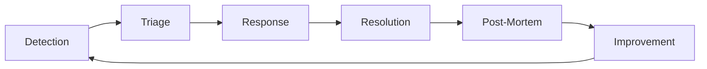

# Incident Response Procedures

Comprehensive procedures for detecting, responding to, and resolving incidents in the MosAIc Stack environment.

## Incident Response Framework

### Overview

The MosAIc incident response framework provides structured procedures for handling service disruptions, security events, and operational issues. Our goal is to minimize impact, restore services quickly, and learn from each incident.

### Core Principles

1. **Life Safety First** - Human safety always takes precedence
2. **Clear Communication** - Transparent, timely updates to all stakeholders
3. **Blameless Culture** - Focus on improvement, not blame
4. **Continuous Improvement** - Learn from every incident
5. **Automation Where Possible** - Reduce human error and response time

### Incident Severity Levels

| Severity | Name | Description | Response Time | Example |
|----------|------|-------------|---------------|---------|
| **P1** | Critical | Complete service outage affecting all users | < 15 minutes | Database cluster failure |
| **P2** | High | Major functionality impaired, many users affected | < 30 minutes | API service down |
| **P3** | Medium | Minor functionality affected, some users impacted | < 2 hours | Single container crash |
| **P4** | Low | Minimal impact, cosmetic issues | < 24 hours | UI formatting issue |
| **P5** | Info | No immediate impact, informational only | Best effort | Documentation typo |

### Incident Lifecycle



## Detection and Alerting

### Automated Detection Systems

#### Monitoring Infrastructure

```yaml
# Prometheus Alert Rules
groups:
  - name: critical_alerts
    interval: 30s
    rules:
      # Service availability
      - alert: ServiceDown
        expr: up{job=~"mosaic-.*"} == 0
        for: 2m
        labels:
          severity: critical
          service: "{{ $labels.job }}"
        annotations:
          summary: "Service {{ $labels.job }} is down"
          description: "{{ $labels.instance }} has been down for more than 2 minutes"
          runbook_url: "https://docs.example.com/runbooks/service-down"
          
      # High error rate
      - alert: HighErrorRate
        expr: |
          rate(http_requests_total{status=~"5.."}[5m]) > 0.05
        for: 5m
        labels:
          severity: high
        annotations:
          summary: "High error rate on {{ $labels.service }}"
          description: "Error rate is {{ $value }}% for {{ $labels.service }}"
          
      # Database issues
      - alert: DatabaseConnectionFailure
        expr: |
          mysql_up == 0 or pg_up == 0
        for: 1m
        labels:
          severity: critical
        annotations:
          summary: "Database connection failure"
          description: "Cannot connect to {{ $labels.instance }}"
          
      # Resource exhaustion
      - alert: HighMemoryUsage
        expr: |
          (1 - (node_memory_MemAvailable_bytes / node_memory_MemTotal_bytes)) > 0.90
        for: 5m
        labels:
          severity: high
        annotations:
          summary: "High memory usage on {{ $labels.instance }}"
          description: "Memory usage is above 90% (current: {{ $value }}%)"
          
      - alert: DiskSpaceLow
        expr: |
          (node_filesystem_avail_bytes{mountpoint="/"} / node_filesystem_size_bytes) < 0.10
        for: 5m
        labels:
          severity: high
        annotations:
          summary: "Low disk space on {{ $labels.instance }}"
          description: "Less than 10% disk space remaining"
```

#### Log-Based Detection

```bash
#!/bin/bash
# /opt/mosaic/scripts/log-monitor.sh

# Monitor logs for critical patterns
tail -F /var/log/mosaic/*.log | while read line; do
    # Check for panic/fatal errors
    if echo "$line" | grep -E "(panic|fatal|FATAL|PANIC)" >/dev/null; then
        /opt/mosaic/scripts/create-incident.sh \
            --severity high \
            --source "log-monitor" \
            --message "Fatal error detected: $line"
    fi
    
    # Check for security events
    if echo "$line" | grep -E "(unauthorized|breach|exploit|injection)" >/dev/null; then
        /opt/mosaic/scripts/create-incident.sh \
            --severity critical \
            --source "security-monitor" \
            --message "Security event detected: $line"
    fi
    
    # Check for repeated errors
    if echo "$line" | grep -E "ERROR" >/dev/null; then
        ERROR_COUNT=$((ERROR_COUNT + 1))
        if [ $ERROR_COUNT -gt 100 ]; then
            /opt/mosaic/scripts/create-incident.sh \
                --severity medium \
                --source "error-rate" \
                --message "High error rate detected: $ERROR_COUNT errors in monitoring window"
            ERROR_COUNT=0
        fi
    fi
done
```

### Manual Detection Methods

1. **User Reports**
   - Support ticket system
   - Status page comments
   - Direct communication channels

2. **Routine Checks**
   - Daily service verification
   - Weekly performance reviews
   - Monthly security audits

3. **Synthetic Monitoring**
   - User journey testing
   - API endpoint monitoring
   - Performance benchmarking

## Initial Response Procedures

### Incident Commander Role

The first responder becomes the Incident Commander (IC) until formally handed off. The IC is responsible for:

1. **Assessing severity** and impact
2. **Coordinating response** efforts
3. **Communication** with stakeholders
4. **Decision making** during the incident
5. **Post-incident** activities

### Initial Response Checklist

```bash
#!/bin/bash
# /opt/mosaic/scripts/incident-response-init.sh

# This script is run by the first responder

INCIDENT_ID="INC-$(date +%Y%m%d-%H%M%S)"
INCIDENT_DIR="/var/log/mosaic/incidents/${INCIDENT_ID}"

# Create incident workspace
mkdir -p "${INCIDENT_DIR}"/{logs,screenshots,notes,artifacts}

# Initialize incident log
cat > "${INCIDENT_DIR}/incident.log" <<EOF
INCIDENT RESPONSE INITIATED
==========================
Incident ID: ${INCIDENT_ID}
Start Time: $(date)
Initial Responder: ${USER}
Severity: ${1:-UNKNOWN}
Initial Report: ${2:-"Manual detection"}

Initial State Capture:
EOF

# Capture system state
echo "=== System State ===" >> "${INCIDENT_DIR}/incident.log"
docker ps -a >> "${INCIDENT_DIR}/incident.log"
df -h >> "${INCIDENT_DIR}/incident.log"
free -h >> "${INCIDENT_DIR}/incident.log"
uptime >> "${INCIDENT_DIR}/incident.log"

# Quick health check
echo "=== Service Health ===" >> "${INCIDENT_DIR}/incident.log"
for service in postgres mariadb redis gitea plane bookstack; do
    echo -n "mosaic-${service}: " >> "${INCIDENT_DIR}/incident.log"
    if docker ps | grep -q "mosaic-${service}"; then
        echo "RUNNING" >> "${INCIDENT_DIR}/incident.log"
    else
        echo "DOWN" >> "${INCIDENT_DIR}/incident.log"
    fi
done

# Create incident in tracking system
curl -X POST https://api.example.com/incidents \
    -H "Content-Type: application/json" \
    -d '{
        "id": "'${INCIDENT_ID}'",
        "severity": "'${1:-UNKNOWN}'",
        "status": "investigating",
        "commander": "'${USER}'"
    }'

echo "Incident ${INCIDENT_ID} created."
echo "Workspace: ${INCIDENT_DIR}"
echo "Next steps:"
echo "1. Assess severity and impact"
echo "2. Page additional responders if needed"
echo "3. Begin investigation and mitigation"
```

### Severity Assessment

```bash
#!/bin/bash
# /opt/mosaic/scripts/assess-incident-severity.sh

INCIDENT_ID=$1

# Automated severity assessment based on impact
calculate_severity() {
    local users_affected=$1
    local services_down=$2
    local data_risk=$3
    local security_issue=$4
    
    # P1 - Critical
    if [ "$users_affected" == "all" ] || [ "$services_down" -gt 3 ] || [ "$security_issue" == "yes" ]; then
        echo "P1"
        return
    fi
    
    # P2 - High  
    if [ "$users_affected" == "many" ] || [ "$services_down" -gt 1 ] || [ "$data_risk" == "yes" ]; then
        echo "P2"
        return
    fi
    
    # P3 - Medium
    if [ "$users_affected" == "some" ] || [ "$services_down" -eq 1 ]; then
        echo "P3"
        return
    fi
    
    # P4 - Low
    echo "P4"
}

# Interactive assessment
echo "=== Incident Severity Assessment ==="
echo "Incident ID: ${INCIDENT_ID}"
echo

read -p "Users affected (all/many/some/few): " USERS
read -p "Number of services down: " SERVICES
read -p "Risk of data loss (yes/no): " DATA_RISK
read -p "Security issue (yes/no): " SECURITY

SEVERITY=$(calculate_severity "$USERS" "$SERVICES" "$DATA_RISK" "$SECURITY")

echo
echo "Assessed Severity: ${SEVERITY}"

# Update incident record
curl -X PATCH https://api.example.com/incidents/${INCIDENT_ID} \
    -H "Content-Type: application/json" \
    -d '{"severity": "'${SEVERITY}'"}'

# Page appropriate responders based on severity
case $SEVERITY in
    "P1")
        /opt/mosaic/scripts/page-oncall.sh --all --priority critical
        /opt/mosaic/scripts/notify-executives.sh --incident ${INCIDENT_ID}
        ;;
    "P2")
        /opt/mosaic/scripts/page-oncall.sh --primary --priority high
        ;;
    "P3")
        /opt/mosaic/scripts/notify-oncall.sh --incident ${INCIDENT_ID}
        ;;
esac
```

## Response Coordination

### Incident Command Structure

```
Incident Commander (IC)
├── Technical Lead
│   ├── Infrastructure Team
│   ├── Application Team
│   └── Database Team
├── Communications Lead
│   ├── Internal Updates
│   ├── Customer Communication
│   └── Status Page Updates
└── Subject Matter Experts
    ├── Security (if needed)
    ├── Vendor Support
    └── Business Stakeholders
```

### Communication Channels

#### Primary Channels

1. **Incident Bridge**
   ```bash
   # Join incident bridge
   BRIDGE_URL="https://meet.example.com/incident-${INCIDENT_ID}"
   echo "Join incident bridge: ${BRIDGE_URL}"
   ```

2. **Slack Channel**
   ```bash
   # Create incident channel
   curl -X POST https://slack.com/api/conversations.create \
     -H "Authorization: Bearer $SLACK_TOKEN" \
     -d "name=incident-${INCIDENT_ID}" \
     -d "is_private=false"
   ```

3. **Status Page**
   ```bash
   # Update public status
   /opt/mosaic/scripts/update-status-page.sh \
     --incident "${INCIDENT_ID}" \
     --status "investigating" \
     --message "We are investigating reports of service disruption"
   ```

### Response Runbooks

#### Service-Specific Runbooks

Each service has specific response procedures:

```bash
#!/bin/bash
# /opt/mosaic/scripts/runbooks/execute-runbook.sh

SERVICE=$1
ISSUE=$2

case "${SERVICE}" in
    "postgres")
        case "${ISSUE}" in
            "connection-pool-exhausted")
                /opt/mosaic/scripts/runbooks/postgres/fix-connection-pool.sh
                ;;
            "replication-lag")
                /opt/mosaic/scripts/runbooks/postgres/fix-replication.sh
                ;;
            "corruption")
                /opt/mosaic/scripts/runbooks/postgres/handle-corruption.sh
                ;;
        esac
        ;;
        
    "gitea")
        case "${ISSUE}" in
            "high-load")
                /opt/mosaic/scripts/runbooks/gitea/handle-high-load.sh
                ;;
            "storage-full")
                /opt/mosaic/scripts/runbooks/gitea/cleanup-storage.sh
                ;;
        esac
        ;;
        
    "redis")
        case "${ISSUE}" in
            "memory-full")
                /opt/mosaic/scripts/runbooks/redis/clear-memory.sh
                ;;
            "persistence-failure")
                /opt/mosaic/scripts/runbooks/redis/fix-persistence.sh
                ;;
        esac
        ;;
esac
```

## Common Incident Scenarios

### Scenario 1: Database Connection Pool Exhaustion

**Symptoms:**
- Application timeouts
- "Too many connections" errors
- Slow response times

**Response:**

```bash
#!/bin/bash
# /opt/mosaic/scripts/runbooks/postgres/fix-connection-pool.sh

log() { echo "[$(date +'%Y-%m-%d %H:%M:%S')] $1"; }

log "Diagnosing PostgreSQL connection pool exhaustion"

# 1. Check current connections
log "Current connection count:"
docker exec mosaic-postgres psql -U postgres -c "
    SELECT count(*) as total,
           state,
           application_name
    FROM pg_stat_activity
    GROUP BY state, application_name
    ORDER BY count(*) DESC;"

# 2. Identify problematic connections
log "Long-running queries:"
docker exec mosaic-postgres psql -U postgres -c "
    SELECT pid, 
           now() - pg_stat_activity.query_start AS duration, 
           state,
           query 
    FROM pg_stat_activity 
    WHERE (now() - pg_stat_activity.query_start) > interval '5 minutes'
    AND state != 'idle';"

# 3. Terminate idle connections
log "Terminating idle connections older than 10 minutes:"
docker exec mosaic-postgres psql -U postgres -c "
    SELECT pg_terminate_backend(pid) 
    FROM pg_stat_activity 
    WHERE state = 'idle' 
    AND (now() - pg_stat_activity.state_change) > interval '10 minutes';"

# 4. Increase connection limit temporarily
log "Increasing max_connections temporarily:"
docker exec mosaic-postgres psql -U postgres -c "
    ALTER SYSTEM SET max_connections = 300;"
docker restart mosaic-postgres

# 5. Identify and fix application issues
log "Checking application connection pools:"
for app in gitea plane woodpecker; do
    container="mosaic-${app}"
    if docker ps | grep -q "$container"; then
        log "Restarting ${app} to reset connection pools"
        docker restart "$container"
    fi
done

log "Connection pool issue mitigated. Monitor for recurrence."
```

### Scenario 2: Disk Space Exhaustion

**Symptoms:**
- Write failures
- Container crashes
- Database errors

**Response:**

```bash
#!/bin/bash
# /opt/mosaic/scripts/runbooks/system/fix-disk-space.sh

log() { echo "[$(date +'%Y-%m-%d %H:%M:%S')] $1"; }

log "Responding to disk space exhaustion"

# 1. Identify space usage
log "Current disk usage:"
df -h | grep -E "(^Filesystem|/var/lib/mosaic)"

log "Largest directories:"
du -sh /var/lib/mosaic/* | sort -hr | head -10

# 2. Emergency cleanup
log "Performing emergency cleanup..."

# Clean Docker artifacts
log "Cleaning Docker system:"
docker system prune -af --volumes
FREED=$(docker system df | grep "Total reclaimed")
log "Docker cleanup: ${FREED}"

# Clean old logs
log "Cleaning old logs:"
find /var/log -name "*.log" -mtime +7 -exec rm {} \;
find /var/log/mosaic -name "*.log" -mtime +3 -exec gzip {} \;

# Clean old backups
log "Cleaning old backups:"
find /opt/mosaic/backups -name "*.tar.gz" -mtime +14 -delete

# Clean temp files
log "Cleaning temporary files:"
rm -rf /tmp/*
rm -rf /var/tmp/*

# 3. Service-specific cleanup
log "Service-specific cleanup:"

# Gitea cleanup
docker exec gitea gitea admin maintenance --run

# PostgreSQL vacuum
docker exec mosaic-postgres psql -U postgres -c "VACUUM FULL;"

# Redis memory cleanup
docker exec mosaic-redis redis-cli MEMORY PURGE

# 4. Verify space recovered
log "Disk usage after cleanup:"
df -h | grep -E "(^Filesystem|/var/lib/mosaic)"

# 5. Implement prevention
log "Scheduling regular cleanup job:"
cat > /etc/cron.daily/mosaic-cleanup <<'EOF'
#!/bin/bash
/opt/mosaic/scripts/routine-cleanup.sh
EOF
chmod +x /etc/cron.daily/mosaic-cleanup

log "Disk space issue resolved"
```

### Scenario 3: Memory Leak

**Symptoms:**
- Gradually increasing memory usage
- OOM killer activating
- Performance degradation

**Response:**

```bash
#!/bin/bash
# /opt/mosaic/scripts/runbooks/system/fix-memory-leak.sh

log() { echo "[$(date +'%Y-%m-%d %H:%M:%S')] $1"; }

log "Investigating memory leak"

# 1. Identify memory consumers
log "Top memory consumers:"
docker stats --no-stream --format "table {{.Container}}\t{{.MemUsage}}\t{{.MemPerc}}" | sort -k3 -hr

# 2. Collect memory profiles
for container in $(docker ps --format "{{.Names}}" | grep mosaic); do
    log "Memory details for ${container}:"
    docker exec "$container" sh -c 'ps aux | sort -k4 -nr | head -5' 2>/dev/null || true
done

# 3. Restart affected containers
log "Restarting high-memory containers:"
for container in $(docker stats --no-stream --format "{{.Container}}\t{{.MemPerc}}" | awk '$2 > 80 {print $1}'); do
    if [[ "$container" == mosaic-* ]]; then
        log "Restarting ${container} (memory > 80%)"
        docker restart "$container"
        sleep 10
    fi
done

# 4. Apply memory limits
log "Applying memory limits to prevent future issues:"
for service in gitea plane bookstack; do
    docker update --memory 2g --memory-swap 2g "mosaic-${service}"
done

# 5. Enable memory monitoring
log "Enabling enhanced memory monitoring:"
cat > /opt/mosaic/scripts/monitor-memory.sh <<'EOF'
#!/bin/bash
while true; do
    docker stats --no-stream --format "{{.Container}}\t{{.MemPerc}}" | \
    while read container usage; do
        usage_int=${usage%.*}
        if [ "$usage_int" -gt 85 ]; then
            echo "WARNING: ${container} memory usage at ${usage}%"
            # Alert or auto-restart logic here
        fi
    done
    sleep 60
done
EOF

chmod +x /opt/mosaic/scripts/monitor-memory.sh
nohup /opt/mosaic/scripts/monitor-memory.sh > /var/log/mosaic/memory-monitor.log 2>&1 &

log "Memory leak mitigation complete"
```

### Scenario 4: Security Incident

**Symptoms:**
- Unauthorized access attempts
- Suspicious processes
- Unexpected network traffic
- Modified files

**Response:**

```bash
#!/bin/bash
# /opt/mosaic/scripts/runbooks/security/incident-response.sh

log() { echo "[$(date +'%Y-%m-%d %H:%M:%S')] [SECURITY] $1"; }

INCIDENT_ID="SEC-$(date +%Y%m%d-%H%M%S)"

log "SECURITY INCIDENT DETECTED - ID: ${INCIDENT_ID}"

# 1. CONTAIN - Isolate the threat
log "Isolating system from network"
# Preserve localhost and internal communication
iptables -I INPUT 1 -i lo -j ACCEPT
iptables -I INPUT 2 -s 172.16.0.0/12 -j ACCEPT
iptables -I INPUT 3 -j DROP
iptables -I OUTPUT 1 -o lo -j ACCEPT
iptables -I OUTPUT 2 -d 172.16.0.0/12 -j ACCEPT
iptables -I OUTPUT 3 -m state --state NEW -j DROP

# 2. ASSESS - Determine scope
log "Assessing compromise scope"

# Check for suspicious processes
log "Suspicious processes:"
ps aux | grep -E "(nc|netcat|wget|curl|python.*-c|perl.*-e)" | grep -v grep

# Check for unauthorized SSH keys
log "Checking SSH keys:"
find /home -name "authorized_keys" -exec md5sum {} \; > /tmp/ssh-keys-${INCIDENT_ID}.txt

# Check for modified system files
log "Checking system file integrity:"
debsums -c 2>/dev/null || rpm -Va 2>/dev/null

# Check container integrity
log "Checking container modifications:"
for container in $(docker ps -q); do
    docker diff "$container" > "/tmp/container-diff-${container}-${INCIDENT_ID}.txt"
done

# 3. COLLECT - Gather evidence
log "Collecting forensic evidence"
mkdir -p "/forensics/${INCIDENT_ID}"

# Network connections
netstat -pantu > "/forensics/${INCIDENT_ID}/netstat.txt"
ss -pantu > "/forensics/${INCIDENT_ID}/ss.txt"

# Process list
ps auxwww > "/forensics/${INCIDENT_ID}/processes.txt"
lsof -n > "/forensics/${INCIDENT_ID}/open-files.txt"

# Recent commands
find /home -name ".*history" -exec cp {} "/forensics/${INCIDENT_ID}/" \;

# System logs
tar -czf "/forensics/${INCIDENT_ID}/logs.tar.gz" /var/log/

# 4. ERADICATE - Remove threat
log "Beginning threat eradication"

# Kill suspicious processes
pkill -f "(nc|netcat|wget|curl|python.*-c|perl.*-e)"

# Remove suspicious files
# (Manual review required before deletion)

# 5. RECOVER - Restore services
log "Recovery phase - requires manual verification"
echo "Next steps:"
echo "1. Review forensic evidence in /forensics/${INCIDENT_ID}"
echo "2. Identify and patch vulnerability"
echo "3. Restore from clean backup if needed"
echo "4. Re-enable network with: iptables -F"
echo "5. Monitor for recurrence"

# 6. Alert security team
curl -X POST https://security.example.com/api/incident \
    -H "Content-Type: application/json" \
    -d '{
        "id": "'${INCIDENT_ID}'",
        "type": "compromise",
        "severity": "critical",
        "host": "'$(hostname)'"
    }'

log "Security incident response initiated. Manual intervention required."
```

## Communication Templates

### Internal Communication

#### Initial Alert
```bash
#!/bin/bash
# /opt/mosaic/scripts/send-internal-alert.sh

INCIDENT_ID=$1
SEVERITY=$2
IMPACT=$3

cat <<EOF | mail -s "[${SEVERITY}] Incident ${INCIDENT_ID}: Service Disruption" engineering@example.com
INCIDENT ALERT
==============
Incident ID: ${INCIDENT_ID}
Severity: ${SEVERITY}
Time: $(date)
Impact: ${IMPACT}

Initial assessment indicates service disruption affecting ${IMPACT}.

Incident Commander: ${USER}
Bridge: https://meet.example.com/incident-${INCIDENT_ID}
Slack: #incident-${INCIDENT_ID}

This is an automated alert. Updates will follow.
EOF
```

#### Status Update
```bash
#!/bin/bash
# /opt/mosaic/scripts/send-status-update.sh

INCIDENT_ID=$1
STATUS=$2  # investigating, identified, monitoring, resolved
UPDATE=$3

# Determine update color for Slack
case $STATUS in
    "investigating") COLOR="warning" ;;
    "identified") COLOR="danger" ;;
    "monitoring") COLOR="good" ;;
    "resolved") COLOR="good" ;;
    *) COLOR="warning" ;;
esac

# Send to Slack
curl -X POST https://hooks.slack.com/services/YOUR/WEBHOOK/URL \
    -H 'Content-type: application/json' \
    -d '{
        "channel": "#incident-'${INCIDENT_ID}'",
        "attachments": [{
            "color": "'${COLOR}'",
            "title": "Incident '${INCIDENT_ID}' Update",
            "fields": [
                {"title": "Status", "value": "'${STATUS}'", "short": true},
                {"title": "Time", "value": "'$(date)'", "short": true},
                {"title": "Update", "value": "'${UPDATE}'", "short": false}
            ]
        }]
    }'
```

### External Communication

#### Customer Notification
```bash
#!/bin/bash
# /opt/mosaic/scripts/send-customer-notification.sh

TEMPLATE=$1  # initial, update, resolved

case $TEMPLATE in
    "initial")
        cat <<'EOF'
Subject: Service Disruption Notification

We are currently experiencing technical difficulties with our services. Our team is actively investigating and working to resolve the issue.

Current Status: Investigating
Affected Services: [LIST]
Started: [TIME]

We apologize for any inconvenience and will provide updates as we learn more.

For real-time updates, please visit: https://status.example.com
EOF
        ;;
        
    "update")
        cat <<'EOF'
Subject: Service Disruption Update

We continue to work on resolving the service disruption.

Current Status: [STATUS]
Progress: We have identified [CAUSE] and are implementing a fix.
Estimated Resolution: [ETA]

We appreciate your patience and will update you again in 30 minutes or when the issue is resolved.

Status page: https://status.example.com
EOF
        ;;
        
    "resolved")
        cat <<'EOF'
Subject: Service Restored

We are pleased to inform you that the service disruption has been resolved.

Resolution Time: [TIME]
Services Affected: [LIST]
Root Cause: [BRIEF EXPLANATION]

We sincerely apologize for any inconvenience this may have caused. We are taking steps to prevent similar issues in the future.

If you continue to experience any problems, please contact our support team.

Thank you for your patience and understanding.
EOF
        ;;
esac
```

### Status Page Updates

```bash
#!/bin/bash
# /opt/mosaic/scripts/update-status-page.sh

INCIDENT_ID=""
STATUS=""
MESSAGE=""
AFFECTED_COMPONENTS=""

# Parse arguments
while [[ $# -gt 0 ]]; do
    case $1 in
        --incident) INCIDENT_ID="$2"; shift 2 ;;
        --status) STATUS="$2"; shift 2 ;;
        --message) MESSAGE="$2"; shift 2 ;;
        --components) AFFECTED_COMPONENTS="$2"; shift 2 ;;
        *) echo "Unknown option: $1"; exit 1 ;;
    esac
done

# Update status page via API
curl -X POST https://api.statuspage.io/v1/pages/${STATUSPAGE_PAGE_ID}/incidents \
    -H "Authorization: OAuth ${STATUSPAGE_API_KEY}" \
    -H "Content-Type: application/json" \
    -d '{
        "incident": {
            "name": "Service Disruption - '${INCIDENT_ID}'",
            "status": "'${STATUS}'",
            "impact_override": "major",
            "body": "'${MESSAGE}'",
            "component_ids": ['${AFFECTED_COMPONENTS}'],
            "deliver_notifications": true
        }
    }'
```

## Post-Incident Activities

### Immediate Actions (0-24 hours)

```bash
#!/bin/bash
# /opt/mosaic/scripts/post-incident-immediate.sh

INCIDENT_ID=$1
INCIDENT_DIR="/var/log/mosaic/incidents/${INCIDENT_ID}"

log() { echo "[$(date +'%Y-%m-%d %H:%M:%S')] $1"; }

# 1. Mark incident as resolved
log "Marking incident ${INCIDENT_ID} as resolved"
echo "RESOLVED: $(date)" >> "${INCIDENT_DIR}/incident.log"

# 2. Collect final artifacts
log "Collecting post-incident artifacts"
docker logs $(docker ps -aq) > "${INCIDENT_DIR}/logs/all-container-logs.txt" 2>&1
dmesg > "${INCIDENT_DIR}/logs/kernel-logs.txt"

# 3. Create timeline
log "Generating incident timeline"
/opt/mosaic/scripts/generate-timeline.sh "${INCIDENT_ID}" > "${INCIDENT_DIR}/timeline.md"

# 4. Calculate metrics
DURATION=$(calculate_incident_duration "${INCIDENT_ID}")
AFFECTED_USERS=$(estimate_affected_users "${INCIDENT_ID}")

# 5. Send initial summary
cat > "${INCIDENT_DIR}/initial-summary.md" <<EOF
# Incident ${INCIDENT_ID} Initial Summary

**Duration**: ${DURATION}
**Affected Users**: ${AFFECTED_USERS}
**Services Impacted**: $(list_affected_services "${INCIDENT_ID}")

## Quick Summary
$(generate_quick_summary "${INCIDENT_ID}")

## Next Steps
- [ ] Schedule post-mortem meeting
- [ ] Complete detailed analysis
- [ ] Identify action items
- [ ] Update runbooks

*Full post-mortem to follow within 48 hours*
EOF

# 6. Notify stakeholders
/opt/mosaic/scripts/send-notification.sh \
    --template "incident-resolved" \
    --incident "${INCIDENT_ID}" \
    --summary "${INCIDENT_DIR}/initial-summary.md"
```

### Post-Mortem Process

#### Post-Mortem Template

```markdown
# Post-Mortem: [Incident ID]

**Date**: [Date of Incident]  
**Authors**: [List of Authors]  
**Status**: [Draft/Final]  
**Severity**: [P1/P2/P3/P4]

## Executive Summary
[1-2 paragraphs summarizing the incident, impact, and key learnings]

## Impact
- **Duration**: [Start time] to [End time] ([Total duration])
- **Affected Users**: [Number or percentage]
- **Services Impacted**: [List of services]
- **Data Loss**: [Yes/No, details if applicable]
- **Financial Impact**: [If applicable]

## Timeline
| Time | Event | Who |
|------|-------|-----|
| HH:MM | Monitoring alert triggered | Automated |
| HH:MM | First responder acknowledged | [Name] |
| HH:MM | Incident commander assigned | [Name] |
| HH:MM | Root cause identified | [Name] |
| HH:MM | Mitigation applied | [Name] |
| HH:MM | Service restored | [Name] |
| HH:MM | Incident resolved | [Name] |

## Root Cause Analysis

### What Happened
[Detailed technical explanation of what went wrong]

### Why It Happened (5 Whys)
1. **Why did the service fail?**
   - [Answer]
2. **Why did [previous answer] happen?**
   - [Answer]
3. **Why did [previous answer] happen?**
   - [Answer]
4. **Why did [previous answer] happen?**
   - [Answer]
5. **Why did [previous answer] happen?**
   - [Root cause]

### Contributing Factors
- [Factor 1]
- [Factor 2]
- [Factor 3]

## Response Analysis

### What Went Well
- [Positive aspect 1]
- [Positive aspect 2]
- [Positive aspect 3]

### What Could Be Improved
- [Improvement area 1]
- [Improvement area 2]
- [Improvement area 3]

## Lessons Learned

## Action Items
| Action | Owner | Due Date | Status |
|--------|-------|----------|--------|
| [Action 1] | [Name] | [Date] | Open |
| [Action 2] | [Name] | [Date] | Open |
| [Action 3] | [Name] | [Date] | Open |

## Supporting Documentation
- [Link to incident logs]
- [Link to monitoring dashboards]
- [Link to customer communications]
```

### Improvement Implementation

```bash
#!/bin/bash
# /opt/mosaic/scripts/implement-post-mortem-actions.sh

INCIDENT_ID=$1
ACTIONS_FILE="/var/log/mosaic/incidents/${INCIDENT_ID}/action-items.json"

log() { echo "[$(date +'%Y-%m-%d %H:%M:%S')] $1"; }

# Read and implement each action item
jq -r '.actions[]' "$ACTIONS_FILE" | while IFS= read -r action; do
    ACTION_ID=$(echo "$action" | jq -r '.id')
    ACTION_TYPE=$(echo "$action" | jq -r '.type')
    ACTION_DESC=$(echo "$action" | jq -r '.description')
    
    log "Implementing action ${ACTION_ID}: ${ACTION_DESC}"
    
    case $ACTION_TYPE in
        "monitoring")
            # Add new monitoring rule
            RULE=$(echo "$action" | jq -r '.rule')
            echo "$RULE" >> /etc/prometheus/rules/incident-${INCIDENT_ID}.yml
            docker exec prometheus promtool check rules /etc/prometheus/rules/incident-${INCIDENT_ID}.yml
            docker exec prometheus kill -HUP 1
            ;;
            
        "runbook")
            # Create or update runbook
            RUNBOOK_PATH="/opt/mosaic/runbooks/$(echo "$action" | jq -r '.runbook')"
            mkdir -p "$(dirname "$RUNBOOK_PATH")"
            echo "$action" | jq -r '.content' > "$RUNBOOK_PATH"
            chmod +x "$RUNBOOK_PATH"
            ;;
            
        "automation")
            # Create automation script
            SCRIPT_PATH="/opt/mosaic/scripts/auto/$(echo "$action" | jq -r '.script')"
            mkdir -p "$(dirname "$SCRIPT_PATH")"
            echo "$action" | jq -r '.content' > "$SCRIPT_PATH"
            chmod +x "$SCRIPT_PATH"
            ;;
            
        "configuration")
            # Update configuration
            CONFIG_FILE=$(echo "$action" | jq -r '.file')
            CONFIG_KEY=$(echo "$action" | jq -r '.key')
            CONFIG_VALUE=$(echo "$action" | jq -r '.value')
            # Backup current config
            cp "$CONFIG_FILE" "${CONFIG_FILE}.backup.$(date +%Y%m%d)"
            # Update config (method depends on file type)
            ;;
    esac
    
    # Mark action as implemented
    jq --arg id "$ACTION_ID" '.actions |= map(if .id == $id then .status = "implemented" else . end)' \
        "$ACTIONS_FILE" > "${ACTIONS_FILE}.tmp" && mv "${ACTIONS_FILE}.tmp" "$ACTIONS_FILE"
done

log "Post-mortem action implementation complete"
```

## Incident Metrics and Reporting

### Key Metrics Tracking

```bash
#!/bin/bash
# /opt/mosaic/scripts/calculate-incident-metrics.sh

MONTH=${1:-$(date +%Y-%m)}

# Calculate MTTR (Mean Time To Recovery)
calculate_mttr() {
    local total_duration=0
    local incident_count=0
    
    for incident_dir in /var/log/mosaic/incidents/INC-${MONTH}*; do
        if [ -d "$incident_dir" ]; then
            start_time=$(grep "INITIATED" "$incident_dir/incident.log" | head -1 | cut -d' ' -f4-)
            end_time=$(grep "RESOLVED" "$incident_dir/incident.log" | tail -1 | cut -d' ' -f4-)
            
            if [ -n "$start_time" ] && [ -n "$end_time" ]; then
                duration=$(( $(date -d "$end_time" +%s) - $(date -d "$start_time" +%s) ))
                total_duration=$((total_duration + duration))
                incident_count=$((incident_count + 1))
            fi
        fi
    done
    
    if [ $incident_count -gt 0 ]; then
        echo "scale=2; $total_duration / $incident_count / 60" | bc
    else
        echo "0"
    fi
}

# Calculate incident frequency by severity
calculate_frequency() {
    for severity in P1 P2 P3 P4; do
        count=$(find /var/log/mosaic/incidents -name "INC-${MONTH}*" -type d \
            -exec grep -l "Severity: $severity" {}/incident.log \; 2>/dev/null | wc -l)
        echo "${severity}: ${count}"
    done
}

# Generate monthly report
cat > "/var/log/mosaic/reports/incident-report-${MONTH}.md" <<EOF
# Incident Report - ${MONTH}

## Summary Statistics
- **Total Incidents**: $(find /var/log/mosaic/incidents -name "INC-${MONTH}*" -type d | wc -l)
- **MTTR**: $(calculate_mttr) minutes
- **Customer-Impacting**: $(grep -l "customer.*impact" /var/log/mosaic/incidents/INC-${MONTH}*/incident.log | wc -l)

## Incidents by Severity
$(calculate_frequency)

## Top Root Causes
$(analyze_root_causes)

## Improvement Trends
$(compare_with_previous_months)

## Action Items Status
$(track_action_items_status)
EOF
```

### Continuous Improvement

```bash
#!/bin/bash
# /opt/mosaic/scripts/incident-improvement-tracker.sh

# Track improvement metrics over time
track_improvements() {
    local metrics_db="/var/lib/mosaic/metrics.db"
    
    # Create metrics database if not exists
    sqlite3 "$metrics_db" <<EOF
CREATE TABLE IF NOT EXISTS incident_metrics (
    month TEXT PRIMARY KEY,
    total_incidents INTEGER,
    mttr_minutes REAL,
    p1_incidents INTEGER,
    p2_incidents INTEGER,
    post_mortems_completed INTEGER,
    action_items_completed INTEGER,
    repeat_incidents INTEGER
);
EOF
    
    # Calculate and store current month metrics
    local month=$(date +%Y-%m)
    local total=$(find /var/log/mosaic/incidents -name "INC-${month}*" -type d | wc -l)
    local mttr=$(calculate_mttr "$month")
    local p1=$(count_by_severity "P1" "$month")
    local p2=$(count_by_severity "P2" "$month")
    local postmortems=$(find /var/log/mosaic/incidents/INC-${month}* -name "postmortem.md" | wc -l)
    local actions_completed=$(count_completed_actions "$month")
    local repeats=$(count_repeat_incidents "$month")
    
    sqlite3 "$metrics_db" <<EOF
INSERT OR REPLACE INTO incident_metrics 
VALUES ('$month', $total, $mttr, $p1, $p2, $postmortems, $actions_completed, $repeats);
EOF
    
    # Generate trend analysis
    generate_trend_report "$metrics_db"
}

# Generate improvement recommendations
generate_recommendations() {
    local trends_file="/var/log/mosaic/reports/incident-trends.json"
    
    # Analyze patterns and generate recommendations
    python3 <<EOF
import json
import statistics

with open('$trends_file', 'r') as f:
    trends = json.load(f)

recommendations = []

# Check MTTR trend
mttr_values = [m['mttr'] for m in trends['monthly_metrics']]
if len(mttr_values) > 3:
    recent_avg = statistics.mean(mttr_values[-3:])
    overall_avg = statistics.mean(mttr_values)
    if recent_avg > overall_avg * 1.2:
        recommendations.append({
            'priority': 'high',
            'area': 'response_time',
            'recommendation': 'MTTR is increasing. Review incident response procedures and automation.'
        })

# Check repeat incidents
repeat_rate = trends['repeat_incident_rate']
if repeat_rate > 0.15:
    recommendations.append({
        'priority': 'high',
        'area': 'root_cause',
        'recommendation': f'High repeat incident rate ({repeat_rate:.1%}). Focus on permanent fixes.'
    })

# Output recommendations
for rec in recommendations:
    print(f"[{rec['priority'].upper()}] {rec['area']}: {rec['recommendation']}")
EOF
}
```

## Testing and Drills

### Incident Response Drills

```bash
#!/bin/bash
# /opt/mosaic/scripts/run-incident-drill.sh

DRILL_TYPE=${1:-random}  # random, database, network, security

log() { echo "[$(date +'%Y-%m-%d %H:%M:%S')] [DRILL] $1"; }

log "Starting incident response drill: ${DRILL_TYPE}"

# Create drill incident
DRILL_ID="DRILL-$(date +%Y%m%d-%H%M%S)"
mkdir -p "/var/log/mosaic/drills/${DRILL_ID}"

# Select drill scenario
case $DRILL_TYPE in
    "database")
        SCENARIO="PostgreSQL connection pool exhaustion"
        # Simulate database issue
        docker exec mosaic-postgres sh -c "
            for i in {1..200}; do
                psql -U postgres -c 'SELECT pg_sleep(300);' &
            done
        "
        ;;
        
    "network")
        SCENARIO="Network latency spike"
        # Simulate network issues
        tc qdisc add dev eth0 root netem delay 500ms
        ;;
        
    "security")
        SCENARIO="Suspicious activity detected"
        # Trigger security alerts
        echo "SECURITY BREACH SIMULATION" >> /var/log/auth.log
        ;;
        
    "random")
        # Pick random scenario
        SCENARIOS=("database" "network" "security" "storage" "memory")
        RANDOM_SCENARIO=${SCENARIOS[$RANDOM % ${#SCENARIOS[@]}]}
        exec $0 "$RANDOM_SCENARIO"
        ;;
esac

# Start timer
START_TIME=$(date +%s)

# Wait for detection and response
log "Drill initiated. Waiting for response..."
log "Scenario: ${SCENARIO}"

# Monitor response
timeout 300 bash -c '
while true; do
    if [ -f "/var/log/mosaic/incidents/INC-*/drill-detected" ]; then
        echo "Drill detected by team!"
        break
    fi
    sleep 10
done
'

# Calculate response time
END_TIME=$(date +%s)
RESPONSE_TIME=$((END_TIME - START_TIME))

# Clean up drill effects
case $DRILL_TYPE in
    "database")
        docker exec mosaic-postgres sh -c "
            SELECT pg_terminate_backend(pid)
            FROM pg_stat_activity
            WHERE query LIKE '%pg_sleep%';
        "
        ;;
    "network")
        tc qdisc del dev eth0 root
        ;;
esac

# Generate drill report
cat > "/var/log/mosaic/drills/${DRILL_ID}/report.md" <<EOF
# Incident Response Drill Report

**Drill ID**: ${DRILL_ID}  
**Type**: ${DRILL_TYPE}  
**Scenario**: ${SCENARIO}  
**Date**: $(date)  
**Response Time**: ${RESPONSE_TIME} seconds

## Observations
- Detection method: [Manual/Automated]
- First responder: [Name]
- Correct diagnosis: [Yes/No]
- Appropriate response: [Yes/No]

## Areas for Improvement
- [Improvement 1]
- [Improvement 2]

## Score: [X/10]
EOF

log "Drill completed. Report: /var/log/mosaic/drills/${DRILL_ID}/report.md"
```

## Best Practices

1. **Fast Detection**
   - Comprehensive monitoring coverage
   - Low-latency alerting
   - Clear severity definitions

2. **Clear Communication**
   - Regular status updates
   - Single source of truth
   - Defined roles and responsibilities

3. **Efficient Response**
   - Well-documented runbooks
   - Automated remediation where possible
   - Regular training and drills

4. **Thorough Analysis**
   - Blameless post-mortems
   - Root cause analysis
   - Actionable improvements

5. **Continuous Improvement**
   - Track metrics over time
   - Implement lessons learned
   - Regular process reviews

6. **Team Readiness**
   - On-call rotation clarity
   - Access to necessary tools
   - Regular training updates

7. **Documentation**
   - Keep runbooks current
   - Document all procedures
   - Maintain contact lists

8. **Automation**
   - Automate detection
   - Automate common fixes
   - Automate communications

9. **Practice**
   - Regular drills
   - Scenario planning
   - Cross-training

10. **Learning Culture**
    - Share knowledge
    - Celebrate improvements
    - Learn from failures

---

Related documentation:
- [Monitoring Setup](../monitoring/setup.md)
- [Alerting Rules](../monitoring/alerting.md)
- [Disaster Recovery](../backup-recovery/04-disaster-recovery.md)
- [Security Procedures](../../security/incident-response.md)