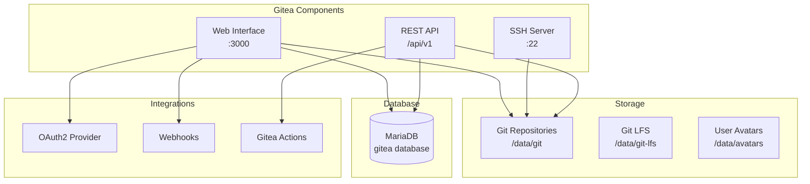

# Gitea Service Documentation

## Overview

Gitea is a lightweight, self-hosted Git service that provides repository hosting, code review, issue tracking, and CI/CD integration for the MosAIc Stack.

## Architecture



## Configuration

### Environment Variables

```env
# Basic Configuration
GITEA__server__DOMAIN=git.example.com
GITEA__server__ROOT_URL=https://git.example.com/
GITEA__server__HTTP_PORT=3000
GITEA__server__SSH_DOMAIN=git.example.com
GITEA__server__SSH_PORT=22

# Database Configuration
GITEA__database__DB_TYPE=mysql
GITEA__database__HOST=mariadb:3306
GITEA__database__NAME=gitea
GITEA__database__USER=gitea
GITEA__database__PASSWD=${MARIADB_PASSWORD}

# Security
GITEA__security__SECRET_KEY=${GITEA_SECRET_KEY}
GITEA__security__INTERNAL_TOKEN=${GITEA_INTERNAL_TOKEN}
GITEA__security__INSTALL_LOCK=true

# Service Configuration
GITEA__service__DISABLE_REGISTRATION=false
GITEA__service__REQUIRE_SIGNIN_VIEW=false
GITEA__service__DEFAULT_KEEP_EMAIL_PRIVATE=true
GITEA__service__DEFAULT_ALLOW_CREATE_ORGANIZATION=true

# Mail Configuration (Optional)
GITEA__mailer__ENABLED=true
GITEA__mailer__PROTOCOL=smtp
GITEA__mailer__SMTP_ADDR=smtp.example.com
GITEA__mailer__SMTP_PORT=587
GITEA__mailer__FROM=gitea@example.com
GITEA__mailer__USER=gitea@example.com
GITEA__mailer__PASSWD=${SMTP_PASSWORD}
```

### Advanced Configuration

#### 1. Git LFS Support

```ini
[server]
LFS_START_SERVER = true
LFS_JWT_SECRET = ${LFS_JWT_SECRET}

[lfs]
PATH = /data/git-lfs
```

#### 2. Repository Settings

```ini
[repository]
ROOT = /data/git/repositories
DEFAULT_BRANCH = main
DEFAULT_PRIVATE = false
MAX_CREATION_LIMIT = -1

[repository.upload]
ENABLED = true
FILE_MAX_SIZE = 50
MAX_FILES = 10
```

#### 3. OAuth2 Configuration

```ini
[oauth2]
ENABLE = true
ACCESS_TOKEN_EXPIRATION_TIME = 3600
REFRESH_TOKEN_EXPIRATION_TIME = 730
INVALIDATE_REFRESH_TOKENS = true
JWT_SIGNING_ALGORITHM = RS256
```

## Features

### 1. Repository Management

**Creating Repositories**:
```bash
# Via API
curl -X POST "https://git.example.com/api/v1/user/repos" \
  -H "Authorization: token YOUR_ACCESS_TOKEN" \
  -H "Content-Type: application/json" \
  -d '{
    "name": "my-project",
    "description": "My awesome project",
    "private": false,
    "auto_init": true,
    "gitignores": "Go",
    "license": "MIT"
  }'
```

**Repository Features**:
- Branch protection
- Code review requirements
- Issue templates
- Pull request templates
- Wiki support
- Project boards

### 2. User Management

**User Roles**:
- **Admin**: Full system access
- **User**: Standard user permissions
- **Restricted**: Limited to specific repos

**Authentication Methods**:
- Local accounts
- LDAP/AD integration
- OAuth2 (GitHub, GitLab, etc.)
- SAML 2.0
- OpenID Connect

### 3. CI/CD Integration

#### Woodpecker CI Webhook

```yaml
# .woodpecker.yml in repository
pipeline:
  build:
    image: golang:1.21
    commands:
      - go build
      - go test ./...
```

#### Gitea Actions (Native CI)

```yaml
# .gitea/workflows/build.yml
name: Build and Test
on: [push, pull_request]

jobs:
  build:
    runs-on: ubuntu-latest
    steps:
      - uses: actions/checkout@v3
      - name: Build
        run: |
          go build
          go test ./...
```

### 4. API Usage

**Authentication**:
```bash
# Generate access token
curl -X POST "https://git.example.com/api/v1/users/login" \
  -H "Content-Type: application/json" \
  -d '{"username": "user", "password": "pass"}'
```

**Common API Operations**:
```bash
# List repositories
curl "https://git.example.com/api/v1/user/repos" \
  -H "Authorization: token YOUR_TOKEN"

# Create issue
curl -X POST "https://git.example.com/api/v1/repos/owner/repo/issues" \
  -H "Authorization: token YOUR_TOKEN" \
  -d '{"title": "Bug report", "body": "Description"}'

# Create pull request
curl -X POST "https://git.example.com/api/v1/repos/owner/repo/pulls" \
  -H "Authorization: token YOUR_TOKEN" \
  -d '{
    "title": "Feature X",
    "head": "feature-branch",
    "base": "main",
    "body": "Implements feature X"
  }'
```

## Administration

### 1. Backup Procedures

```bash
#!/bin/bash
# Gitea backup script

# Stop Gitea
docker stop mosaic-gitea-1

# Backup database
docker exec mosaic-mariadb-1 mysqldump -u root -p$MARIADB_ROOT_PASSWORD gitea > gitea_db_backup.sql

# Backup repositories and data
tar -czf gitea_data_backup.tar.gz -C /var/lib/mosaic/gitea .

# Backup configuration
cp /var/lib/mosaic/gitea/gitea/conf/app.ini gitea_config_backup.ini

# Start Gitea
docker start mosaic-gitea-1
```

### 2. Maintenance Tasks

**Database Optimization**:
```sql
-- Run periodically
OPTIMIZE TABLE repository;
OPTIMIZE TABLE issue;
OPTIMIZE TABLE pull_request;
OPTIMIZE TABLE action;
```

**Repository Garbage Collection**:
```bash
# Run git gc on all repositories
docker exec mosaic-gitea-1 gitea admin repo-gc --all
```

**Clean up old actions logs**:
```bash
docker exec mosaic-gitea-1 gitea admin actions cleanup --days 30
```

### 3. Monitoring

**Health Check Endpoint**:
```bash
curl https://git.example.com/api/healthz
```

**Metrics to Monitor**:
- Repository count and size
- Active user count
- API request rate
- Database connection pool
- Disk usage for repositories

### 4. Security Hardening

**Disable Features**:
```ini
[service]
DISABLE_REGISTRATION = true
REQUIRE_SIGNIN_VIEW = true
ENABLE_CAPTCHA = true

[security]
INSTALL_LOCK = true
SECRET_KEY = ${STRONG_SECRET}
INTERNAL_TOKEN = ${STRONG_TOKEN}
PASSWORD_COMPLEXITY = lower,upper,digit,spec
MIN_PASSWORD_LENGTH = 12
```

**Rate Limiting**:
```ini
[security]
LOGIN_RATE_LIMIT = 10:60  # 10 attempts per 60 seconds
```

## Integrations

### 1. Woodpecker CI Integration

1. Create OAuth2 application in Gitea
2. Configure Woodpecker with client ID/secret
3. Set up webhooks for repositories

### 2. MosAIc MCP Integration

```javascript
// Example: Using Gitea API from MCP
const gitea = new GiteaClient({
  baseUrl: 'https://git.example.com',
  token: process.env.GITEA_TOKEN
});

// Create repository for AI project
await gitea.createRepository({
  name: 'ai-generated-project',
  description: 'Generated by MosAIc AI',
  private: false
});
```

### 3. External Authentication

**LDAP Configuration**:
```ini
[security]
ENABLE_LDAP = true

# Configure via Admin UI
# Settings → Authentication → Add Authentication Source
```

## Troubleshooting

### Common Issues

1. **Cannot push to repository**:
   - Check SSH key is added to account
   - Verify repository permissions
   - Check disk space

2. **Webhooks not firing**:
   - Verify webhook URL is accessible
   - Check webhook logs in repository settings
   - Ensure webhook secret matches

3. **Database connection issues**:
   ```bash
   # Check database connectivity
   docker exec mosaic-gitea-1 mysql -h mariadb -u gitea -p$MARIADB_PASSWORD -e "SELECT 1"
   ```

4. **Performance issues**:
   - Enable caching
   - Optimize database
   - Consider using external object storage for LFS

### Debug Mode

```ini
[log]
MODE = console
LEVEL = debug
ROUTER_LOG_LEVEL = debug
```

## Performance Tuning

### 1. Database Connection Pool

```ini
[database]
MAX_OPEN_CONNS = 100
CONN_MAX_LIFETIME = 3600
MAX_IDLE_CONNS = 10
```

### 2. Caching

```ini
[cache]
ENABLED = true
ADAPTER = redis
HOST = redis:6379
```

### 3. Session Management

```ini
[session]
PROVIDER = redis
PROVIDER_CONFIG = redis:6379
```

## Migration

### From Other Git Services

**From GitHub**:
```bash
# Use Gitea's migration tool
docker exec mosaic-gitea-1 gitea admin migrate \
  --github-token YOUR_GITHUB_TOKEN \
  --github-repo owner/repo \
  --gitea-repo-owner gitea-owner
```

**From GitLab**:
```bash
# Similar migration command
docker exec mosaic-gitea-1 gitea admin migrate \
  --gitlab-token YOUR_GITLAB_TOKEN \
  --gitlab-project-id PROJECT_ID
```

## Best Practices

1. **Repository Organization**:
   - Use organizations for team projects
   - Implement naming conventions
   - Use repository templates

2. **Security**:
   - Enable 2FA for all users
   - Use deploy keys for CI/CD
   - Regular security audits

3. **Performance**:
   - Regular maintenance tasks
   - Monitor repository sizes
   - Archive old repositories

4. **Backup**:
   - Daily automated backups
   - Test restore procedures
   - Off-site backup storage

---

*Last Updated: January 2025 | Gitea Service Documentation v1.0.0*

---

---

## Additional Content (Migrated)

# Gitea Service Configuration

Gitea is the Git service powering the MosAIc Stack's source code management.

Gitea provides:
- Git repository hosting
- Issue tracking
- Pull request workflows
- CI/CD integration
- OAuth2 provider
- Webhook support

### Basic Settings

```yaml
# docker-compose.yml
services:
  gitea:
    image: gitea/gitea:1.21.4
    container_name: mosaic-gitea
    environment:
      - USER_UID=1000
      - USER_GID=1000
      - GITEA__database__DB_TYPE=postgres
      - GITEA__database__HOST=postgres:5432
      - GITEA__database__NAME=gitea
      - GITEA__database__USER=postgres
      - GITEA__database__PASSWD=${POSTGRES_PASSWORD}
    volumes:
      - /opt/mosaic/gitea:/data
      - /etc/timezone:/etc/timezone:ro
      - /etc/localtime:/etc/localtime:ro
    ports:
      - "3000:3000"
      - "2222:22"
    networks:
      - mosaic-proxy
      - mosaic-db
    depends_on:
      - postgres
    restart: unless-stopped
```

```bash
# Core settings
GITEA__APP_NAME="MosAIc Git"
GITEA__RUN_USER=git
GITEA__RUN_MODE=prod

# Server configuration
GITEA__server__DOMAIN=git.mosaicstack.dev
GITEA__server__ROOT_URL=https://git.mosaicstack.dev/
GITEA__server__HTTP_PORT=3000
GITEA__server__SSH_DOMAIN=git.mosaicstack.dev
GITEA__server__SSH_PORT=2222
GITEA__server__START_SSH_SERVER=true
GITEA__server__LFS_START_SERVER=true

# Database
GITEA__database__DB_TYPE=postgres
GITEA__database__HOST=postgres:5432
GITEA__database__NAME=gitea
GITEA__database__USER=postgres
GITEA__database__PASSWD=${POSTGRES_PASSWORD}
GITEA__database__SSL_MODE=disable

# Cache (Redis)
GITEA__cache__ENABLED=true
GITEA__cache__ADAPTER=redis
GITEA__cache__HOST=redis://redis:6379/0?pool_size=100&idle_timeout=180s

# Session
GITEA__session__PROVIDER=redis
GITEA__session__PROVIDER_CONFIG=redis://redis:6379/1?pool_size=100&idle_timeout=180s

GITEA__security__SECRET_KEY=${GITEA_SECRET_KEY}
GITEA__security__INTERNAL_TOKEN=${GITEA_INTERNAL_TOKEN}
GITEA__security__INSTALL_LOCK=true
GITEA__security__PASSWORD_COMPLEXITY=lower,upper,digit,spec

# Service settings
GITEA__service__DISABLE_REGISTRATION=false
GITEA__service__REQUIRE_SIGNIN_VIEW=false
GITEA__service__REGISTER_EMAIL_CONFIRM=true
GITEA__service__DEFAULT_ALLOW_CREATE_ORGANIZATION=true
GITEA__service__DEFAULT_ENABLE_TIMETRACKING=true

# Webhook
GITEA__webhook__ALLOWED_HOST_LIST=*
GITEA__webhook__DELIVER_TIMEOUT=30
GITEA__webhook__SKIP_TLS_VERIFY=false

# OAuth2
GITEA__oauth2__JWT_SECRET=${GITEA_JWT_SECRET}
GITEA__oauth2__ENABLE=true
```

## Initial Setup

### 1. First Run Configuration

```bash
docker compose up -d gitea

# Wait for initialization
docker compose logs -f gitea

# Access web interface
# https://git.mosaicstack.dev
```

### 2. Admin User Creation

First user registered becomes admin, or create via CLI:

```bash
docker exec -it mosaic-gitea gitea admin user create \
  --username admin \
  --password 'secure-password' \
  --email admin@mosaicstack.dev \
  --admin
```

### 3. OAuth2 Application Setup

For Woodpecker CI integration:

```bash
# Navigate to Settings > Applications
# Create new OAuth2 Application:
# - Name: Woodpecker CI
# - Redirect URI: https://ci.mosaicstack.dev/authorize
# Save Client ID and Secret for Woodpecker config
```

## Repository Management

### Create Organization

```bash
curl -X POST https://git.mosaicstack.dev/api/v1/orgs \
  -H "Authorization: token YOUR_TOKEN" \
  -H "Content-Type: application/json" \
  -d '{
    "username": "mosaic",
    "full_name": "MosAIc Organization",
    "description": "Official MosAIc repositories"
  }'
```

### Repository Settings

```bash
# Clone settings template
git clone https://git.mosaicstack.dev/mosaic/repo-template

# Key settings to configure:
# - Branch protection
# - Webhook notifications
# - Access permissions
# - Issue labels
# - Milestones
```

## SSH Configuration

### Server Side

```bash
# Generate host keys (if not exists)
docker exec -it mosaic-gitea ssh-keygen -A

# Verify SSH daemon
docker exec -it mosaic-gitea ps aux | grep sshd
```

### Client Side

```bash
# Add to ~/.ssh/config
Host git.mosaicstack.dev
    Port 2222
    User git
    IdentityFile ~/.ssh/id_ed25519

# Test connection
ssh -T git@git.mosaicstack.dev -p 2222
```

## Git LFS Setup

### Enable LFS

```bash
# Already enabled via environment
GITEA__server__LFS_START_SERVER=true

# Configure storage
GITEA__server__LFS_CONTENT_PATH=/data/git/lfs
GITEA__server__LFS_JWT_SECRET=${LFS_JWT_SECRET}
```

### Client Usage

```bash
# Install Git LFS
git lfs install

# Track large files
git lfs track "*.psd"
git lfs track "*.zip"
git add .gitattributes

# Normal git workflow
git add file.psd
git commit -m "Add design file"
git push
```

## Backup and Restore

### Backup

```bash
# Full backup
docker exec -it mosaic-gitea gitea dump \
  -c /data/gitea/conf/app.ini \
  -w /tmp \
  -t /tmp

# Copy backup out
docker cp mosaic-gitea:/tmp/gitea-dump-*.zip /opt/mosaic/backups/
```

### Restore

```bash
docker compose stop gitea

# Extract backup
cd /opt/mosaic/gitea
unzip /opt/mosaic/backups/gitea-dump-*.zip

# Restore database
docker exec -i mosaic-postgres psql -U postgres gitea < gitea-db.sql

# Restore data
tar xzf gitea-repo.tar.gz -C /opt/mosaic/gitea/git/

docker compose start gitea
```

### Database Connections

```bash
# Optimize connection pool
GITEA__database__MAX_OPEN_CONNS=50
GITEA__database__MAX_IDLE_CONNS=10
GITEA__database__CONN_MAX_LIFETIME=3600
```

### Caching

```bash
# Redis cache settings
GITEA__cache__ITEM_TTL=16h
GITEA__cache__CONN_STR=redis://redis:6379/0?pool_size=100&idle_timeout=180s
```

### Web Server

```bash
# Concurrent connections
GITEA__server__HTTP_PORT=3000
GITEA__server__PER_WRITE_TIMEOUT=30s
GITEA__server__PER_READ_TIMEOUT=30s
```

## Monitoring

### Health Check

```bash
# HTTP health endpoint
curl https://git.mosaicstack.dev/api/v1/version

# Metrics endpoint
curl https://git.mosaicstack.dev/metrics
```

### Prometheus Metrics

```yaml
# prometheus.yml
scrape_configs:
  - job_name: 'gitea'
    static_configs:
      - targets: ['gitea:3000']
    metrics_path: '/metrics'
    bearer_token: 'YOUR_METRICS_TOKEN'
```

### Log Analysis

```bash
# View logs
docker compose logs gitea --tail=100

# Common log patterns
grep "ERROR" /opt/mosaic/gitea/log/gitea.log
grep "WARN" /opt/mosaic/gitea/log/gitea.log
grep "Failed authentication" /opt/mosaic/gitea/log/gitea.log
```

## Security

### Access Control

```bash
# Disable registration
GITEA__service__DISABLE_REGISTRATION=true

# Require sign-in
GITEA__service__REQUIRE_SIGNIN_VIEW=true

# Limit user creation
GITEA__service__DEFAULT_ALLOW_CREATE_ORGANIZATION=false
```

### Two-Factor Authentication

```bash
# Enable 2FA
GITEA__security__TWO_FACTOR_AUTHENTICATION=true

# Enforce for admins
docker exec -it mosaic-gitea gitea admin user must-change-2fa --all
```

### Webhook Security

```bash
# Restrict webhook hosts
GITEA__webhook__ALLOWED_HOST_LIST=ci.mosaicstack.dev,localhost

# Webhook secrets
GITEA__webhook__SECRET=webhook-secret-key
```

1. **Cannot access web interface**
   ```bash
   # Check container status
   docker compose ps gitea
   
   # Check logs
   docker compose logs gitea
   
   # Verify network
   docker exec gitea wget -O- http://localhost:3000
   ```

2. **SSH connection refused**
   ```bash
   # Check SSH daemon
   docker exec gitea ps aux | grep sshd
   
   # Verify port mapping
   docker port mosaic-gitea 22
   
   # Test internal SSH
   docker exec gitea ssh -T git@localhost -p 22
   ```

3. **Database connection failed**
   ```bash
   # Test database connection
   docker exec gitea pg_isready -h postgres -p 5432
   
   # Check credentials
   docker exec gitea env | grep GITEA__database
   ```

## Integration

### Woodpecker CI

```yaml
# In Woodpecker configuration
WOODPECKER_GITEA=true
WOODPECKER_GITEA_URL=https://git.mosaicstack.dev
WOODPECKER_GITEA_CLIENT=oauth-client-id
WOODPECKER_GITEA_SECRET=oauth-client-secret
```

### External Authentication

```bash
# LDAP configuration
GITEA__security__LDAP_ENABLED=true
GITEA__security__LDAP_HOST=ldap.example.com
GITEA__security__LDAP_PORT=389
GITEA__security__LDAP_SECURITY_PROTOCOL=starttls
```

---

For more service configurations:
- [PostgreSQL Service](./02-postgres.md)
- [BookStack Service](./03-bookstack.md)
- [Woodpecker Service](./04-woodpecker.md)

---

---

# MosAIc Stack Architecture

The MosAIc Stack is a modular, enterprise-grade platform for AI-powered software development. Built on a foundation of mandatory MCP (Model Context Protocol), it provides seamless integration between individual developer tools and enterprise orchestration capabilities.

## Core Architecture Principles

### 1. MCP-First Design
All components communicate through the MCP infrastructure:
- Unified state management
- Consistent message passing
- Reliable coordination
- Enterprise scalability

### 2. Modular Components
Each component has clear responsibilities:
- **@tony/core**: AI development framework
- **@mosaic/core**: Enterprise orchestration
- **@mosaic/mcp**: Infrastructure backbone
- **@mosaic/dev**: Development tools

### 3. Progressive Enhancement
Start small, scale to enterprise:
- Individual → Team → Organization
- CLI → Web UI → API Platform
- Local → Cloud → Multi-region
- Single-project → Multi-project → Portfolio

## System Architecture

```
┌─────────────────────────────────────────────────────────────────┐
│                         User Interfaces                          │
├─────────────────────┬─────────────────┬────────────────────────┤
│   Tony CLI (2.8.0)  │  MosAIc Web UI  │   REST/GraphQL APIs   │
└─────────────────────┴─────────────────┴────────────────────────┘
                                │
┌─────────────────────────────────────────────────────────────────┐
│                    Application Layer                             │
├─────────────────────┬─────────────────┬────────────────────────┤
│  @tony/core (2.8.0) │ @mosaic/core    │  Third-party Plugins   │
│  - UPP Methodology  │ - Orchestration  │  - Custom Tools        │
│  - Planning Engine  │ - Web Dashboard  │  - Integrations        │
│  - Agent Management │ - Analytics      │  - Extensions          │
└─────────────────────┴─────────────────┴────────────────────────┘
                                │
┌─────────────────────────────────────────────────────────────────┐
│                 @mosaic/tony-adapter (0.1.0)                    │
│              Seamless Tony ↔ MosAIc Integration                 │
└─────────────────────────────────────────────────────────────────┘
                                │
┌─────────────────────────────────────────────────────────────────┐
│                    @mosaic/mcp (0.1.0)                          │
│                 Infrastructure Foundation                        │
├─────────────────────────────────────────────────────────────────┤
│  • Agent Coordination    • State Management                     │
│  • Message Routing       • Security Layer                       │
│  • Event Streaming       • Performance Monitoring               │
│  • Resource Management   • Audit Logging                        │
└─────────────────────────────────────────────────────────────────┘
                                │
┌─────────────────────────────────────────────────────────────────┐
│                      Data Layer                                  │
├─────────────────────┬─────────────────┬────────────────────────┤
│   SQLite (Local)    │ PostgreSQL      │   Redis Cache          │
│   - Development     │ - Production     │   - Performance        │
└─────────────────────┴─────────────────┴────────────────────────┘
```

## Component Deep Dive

### Tony Framework (@tony/core)

**Purpose**: Core AI development assistant

**Architecture**:
```typescript
interface TonyFramework {
  // Planning engine with UPP methodology
  planning: PlanningEngine;
  
  // Agent orchestration (requires MCP)
  agents: AgentManager;
  
  // Plugin system for extensions
  plugins: PluginSystem;
  
  // MCP integration (mandatory)
  mcp: {
    required: true;
    client: MCPClient;
  };
}
```

**Key Features**:
- UPP task decomposition
- Intelligent agent spawning
- Context management
- Plugin architecture
- Hot-reload capabilities

### MosAIc Core (@mosaic/core)

**Purpose**: Enterprise orchestration platform

**Architecture**:
```typescript
interface MosAIcCore {
  // Multi-project orchestration
  orchestrator: ProjectOrchestrator;
  
  // Web-based UI components
  ui: {
    dashboard: Dashboard;
    analytics: Analytics;
    admin: AdminPanel;
  };
  
  // API layer
  api: {
    rest: RestAPI;
    graphql: GraphQLAPI;
    websocket: RealtimeAPI;
  };
  
  // Tony integration
  tony: TonyAdapter;
}
```

**Key Features**:
- Multi-project coordination
- Team collaboration
- Resource optimization
- Visual planning tools
- Enterprise dashboards

### MosAIc MCP (@mosaic/mcp)

**Purpose**: Infrastructure backbone

**Architecture**:
```typescript
interface MosAIcMCP {
  // Core server
  server: {
    http: HTTPServer;
    websocket: WebSocketServer;
    grpc: GRPCServer;
  };
  
  // Agent coordination
  coordination: {
    registry: AgentRegistry;
    scheduler: TaskScheduler;
    router: MessageRouter;
  };
  
  // State management
  state: {
    store: StateStore;
    sync: StateSynchronizer;
    persistence: PersistenceLayer;
  };
  
  // Security
  security: {
    auth: AuthenticationService;
    rbac: RoleBasedAccess;
    encryption: EncryptionService;
  };
}
```

**Key Features**:
- High-performance message routing
- Distributed state management
- Agent lifecycle management
- Security and compliance
- Performance monitoring

### MosAIc Dev (@mosaic/dev)

**Purpose**: Development tools and SDK

**Architecture**:
```typescript
interface MosAIcDev {
  // Build tools
  build: {
    orchestrator: BuildOrchestrator;
    bundler: Bundler;
    optimizer: Optimizer;
  };
  
  // Testing framework
  testing: {
    unit: UnitTestRunner;
    integration: IntegrationTester;
    performance: PerformanceTester;
  };
  
  // Development utilities
  utils: {
    generators: CodeGenerators;
    migrators: MigrationTools;
    debuggers: DebugTools;
  };
}
```

**Key Features**:
- Unified build system
- Comprehensive testing
- Migration utilities
- Development CLI
- Documentation tools

## Integration Patterns

### 1. Tony-Only Pattern
For individual developers:

```typescript
import { TonyFramework } from '@tony/core';
import { createMCPServer } from '@mosaic/mcp';

const mcp = createMCPServer({ mode: 'local' });
const tony = new TonyFramework({ mcp });

await tony.plan('Build a REST API');
```

### 2. Small Team Pattern
For team coordination:

```typescript
import { TonyFramework } from '@tony/core';
import { MosAIcCore } from '@mosaic/core';
import { createMCPServer } from '@mosaic/mcp';

const mcp = createMCPServer({ mode: 'team' });
const mosaic = new MosAIcCore({ mcp });
const tony = new TonyFramework({ 
  mcp,
  orchestrator: mosaic.orchestrator 
});
```

### 3. Enterprise Pattern
For large organizations:

```typescript
import { MosAIcStack } from '@mosaic/stack';

const stack = new MosAIcStack({
  deployment: 'kubernetes',
  regions: ['us-east', 'eu-west'],
  security: 'enterprise',
  compliance: ['SOC2', 'HIPAA']
});

await stack.deploy();
```

## Communication Flow

### Agent Coordination
```
Tony Agent → MCP Client → MCP Server → Target Agent
    ↑                          ↓
    └── State Update ← State Store
```

### Multi-Project Orchestration
```
Project A ─┐
Project B ─┼→ MosAIc Orchestrator → Resource Scheduler
Project C ─┘         ↓
                Coordination Engine → Agent Assignment
```

### Real-time Updates
```
Agent Activity → Event Stream → WebSocket → UI Updates
       ↓              ↓                         ↓
   Audit Log    Analytics Engine         User Dashboard
```

## Deployment Architecture

### Local Development
```
┌─────────────────┐
│  Local Machine  │
├─────────────────┤
│ • Tony CLI      │
│ • MCP Server    │
│ • SQLite DB     │
│ • File System   │
└─────────────────┘
```

### Team Deployment
```
┌─────────────────┐     ┌─────────────────┐
│  Developer 1    │────→│  Shared Server  │
├─────────────────┤     ├─────────────────┤
│ • Tony CLI      │     │ • MosAIc Core   │
└─────────────────┘     │ • MCP Server    │
                        │ • PostgreSQL    │
┌─────────────────┐     │ • Redis Cache   │
│  Developer 2    │────→│                 │
├─────────────────┤     └─────────────────┘
│ • Tony CLI      │
└─────────────────┘
```

### Enterprise Deployment
```
┌─────────────────────────────────────────┐
│          Load Balancer                  │
└─────────────┬───────────────────────────┘
              │
┌─────────────┴───────────┬───────────────┐
│   MosAIc Web Nodes      │   API Nodes   │
└─────────────┬───────────┴───────────────┘
              │
┌─────────────┴───────────────────────────┐
│         MCP Server Cluster              │
├─────────────────────────────────────────┤
│ • Agent Coordination                    │
│ • State Management                      │
│ • Message Routing                       │
└─────────────┬───────────────────────────┘
              │
┌─────────────┴───────────┬───────────────┐
│   PostgreSQL Cluster    │  Redis Cluster│
└─────────────────────────┴───────────────┘
```

## Security Architecture

### Authentication Flow
```
User → Auth Provider → JWT Token → MCP Server → Resource Access
         ↓                              ↓
    Identity Store              Permission Check
```

### Encryption Layers
1. **Transport**: TLS 1.3 for all communications
2. **Storage**: AES-256 for data at rest
3. **Secrets**: Hardware security module integration
4. **Audit**: Tamper-proof logging

```
User → Role Assignment → Permission Set → Resource Access
         ↓                    ↓                ↓
    Admin/User/Guest    Read/Write/Admin   Project/Agent/Data
```

## Performance Architecture

### Caching Strategy
```
Request → Edge Cache → Application Cache → Database
   ↓          ↓              ↓
  CDN      Redis         Memory Cache
```

### Scaling Patterns
1. **Horizontal**: Add more MCP nodes
2. **Vertical**: Increase node resources
3. **Geographic**: Multi-region deployment
4. **Functional**: Service segregation

### Optimization Points
- Connection pooling
- Query optimization
- Lazy loading
- Event batching
- Resource quotas

## Monitoring Architecture

### Metrics Collection
```
Components → Metrics Agent → Time Series DB → Dashboards
                ↓                               ↓
           Prometheus                      Grafana
```

### Logging Pipeline
```
Application Logs → Log Aggregator → Log Storage → Analysis
                        ↓               ↓            ↓
                   Fluentd         Elasticsearch  Kibana
```

### Alerting Flow
```
Metric Threshold → Alert Manager → Notification Channel
                        ↓               ↓
                  Rule Engine     Email/Slack/PagerDuty
```

## Future Architecture Considerations

### Planned Enhancements
1. **Service Mesh**: Istio integration for microservices
2. **Event Sourcing**: Complete audit trail
3. **CQRS Pattern**: Read/write separation
4. **GraphQL Federation**: Distributed schema
5. **Edge Computing**: Local agent execution

### Extensibility Points
- Plugin API for custom tools
- Webhook system for integrations
- Custom protocol handlers
- Theme and UI customization
- Workflow automation hooks

## Conclusion

The MosAIc Stack architecture provides a solid foundation for AI-powered development at any scale. By mandating MCP as the communication backbone and providing clear component boundaries, the system achieves both flexibility and reliability. The progressive enhancement model ensures teams can adopt the stack at their own pace while maintaining a clear path to enterprise scale.

---

---

# MosAIc Stack Component Milestones

This document outlines the version progression and milestone planning for each component in the MosAIc Stack, from current versions to the 1.0 GA releases.

## Component Version Matrix

| Component | Current | Next | Target GA | Timeline |
|-----------|---------|------|-----------|----------|
| @tony/core | 2.7.0 | 2.8.0 | 3.0.0 | Q1 2025 - Q4 2025 |
| @mosaic/mcp | 0.0.1-beta.1 | 0.1.0 | 1.0.0 | Q1 2025 - Q4 2025 |
| @mosaic/core | - | 0.1.0 | 1.0.0 | Q1 2025 - Q4 2025 |
| @mosaic/dev | - | 0.1.0 | 1.0.0 | Q1 2025 - Q4 2025 |

## Tony Framework (@tony/core)

### 2.8.0 - "MCP Integration" (Q1 2025)
**Theme**: Mandatory MCP integration, removing standalone mode

**Features**:
- ✅ MCP requirement enforced
- ✅ Enhanced agent coordination (Epic E.054)
- ✅ Real-time monitoring and analytics
- ✅ MosAIc Stack integration
- ✅ Migration tools from 2.7.0

**Breaking Changes**:
- Standalone mode removed
- MCP server required for all operations
- Configuration schema updated

### 2.9.0 - "Intelligence Layer" (Q2 2025)
**Theme**: AI-powered optimizations and predictions

**Planned Features**:
- Machine learning integration
- Predictive task assignment
- Intelligent resource allocation
- Advanced pattern recognition
- Automated optimization

### 3.0.0 - "Enterprise Platform" (Q4 2025)
**Theme**: Full enterprise capabilities

**Planned Features**:
- Complete MosAIc integration
- Advanced security features
- Compliance frameworks
- Multi-region support
- Enterprise SLAs

## MosAIc MCP (@mosaic/mcp)

### 0.1.0 - "Production Foundation" (Q1 2025)
**Theme**: First production-ready release

**Features**:
- ✅ Core API stability
- ✅ Tony Framework 2.8.0 compatibility
- ✅ Basic agent coordination
- ✅ State persistence
- ✅ Security hardening
- ✅ Performance benchmarks
- ✅ Migration from beta

**Quality Gates**:
- 95% test coverage
- Zero critical bugs
- Performance benchmarks met
- Security audit passed

### 0.2.0 - "Enhanced Coordination" (Q1 2025)
**Theme**: Advanced coordination capabilities

**Planned Features**:
- Enhanced coordination algorithms
- Advanced agent routing
- Performance optimizations (100+ agents)
- Extended monitoring capabilities
- Real-time analytics dashboard
- Custom coordination rules

### 0.3.0 - "Scale & Performance" (Q2 2025)
**Theme**: Enterprise-scale optimizations

**Planned Features**:
- Multi-region support
- Advanced caching strategies
- Batch operation support
- Enhanced security features
- Load balancing improvements
- Horizontal scaling

### 0.4.0 - "Intelligence Integration" (Q3 2025)
**Theme**: AI-powered coordination

**Planned Features**:
- Machine learning integration
- Predictive agent assignment
- Anomaly detection
- Auto-optimization
- Custom protocol extensions
- Advanced analytics

### 0.5.0 - "Enterprise Features" (Q3 2025)
**Theme**: Enterprise-grade capabilities

**Planned Features**:
- Advanced debugging tools
- Compliance features (SOC2, HIPAA)
- Audit logging
- High availability modes
- Disaster recovery
- Enterprise dashboard

### 1.0.0 - "General Availability" (Q4 2025)
**Theme**: Production-ready for all use cases

**Features**:
- Complete feature set
- Long-term support (LTS)
- Enterprise SLAs
- Comprehensive documentation
- Certified integrations
- Professional support

## MosAIc Core (@mosaic/core)

### 0.1.0 - "Foundation" (Q1 2025)
**Theme**: Basic multi-project orchestration

**Features**:
- Tony Framework integration
- Basic project orchestration
- Simple web dashboard
- CLI management interface
- User authentication
- Project creation/management

### 0.2.0 - "Enhanced UI" (Q1 2025)
**Theme**: Improved user experience

**Planned Features**:
- Advanced web dashboard
- Real-time updates
- Drag-and-drop planning
- Visual task decomposition
- Team collaboration features
- Mobile responsive design

### 0.3.0 - "Advanced Orchestration" (Q2 2025)
**Theme**: Sophisticated coordination

**Planned Features**:
- Cross-project dependencies
- Resource optimization
- Advanced scheduling
- Workflow templates
- Integration marketplace
- API gateway

### 0.4.0 - "Enterprise Dashboard" (Q3 2025)
**Theme**: Enterprise visibility

**Planned Features**:
- Executive dashboards
- Advanced analytics
- Custom reporting
- Cost tracking
- Performance insights
- Predictive analytics

### 0.5.0 - "Platform Maturity" (Q3 2025)
**Theme**: Full platform capabilities

**Planned Features**:
- Plugin ecosystem
- Third-party integrations
- Advanced security
- Compliance tools
- Automation workflows
- DevOps integration

### 1.0.0 - "Enterprise Platform" (Q4 2025)
**Theme**: Complete enterprise solution

**Features**:
- Full feature parity with enterprise needs
- Scalable to 1000+ projects
- Complete API coverage
- Enterprise support
- SLA guarantees
- Global deployment

## MosAIc Dev (@mosaic/dev)

### 0.1.0 - "Unified Tooling" (Q1 2025)
**Theme**: Consolidated development tools

**Features**:
- Merged tony-dev capabilities
- Unified test orchestration
- Build pipeline tools
- Migration utilities
- Documentation generators
- Development CLI

### 0.2.0 - "Enhanced Testing" (Q1 2025)
**Theme**: Advanced testing capabilities

**Planned Features**:
- Integration test framework
- Performance testing tools
- Chaos testing utilities
- Test data generators
- Coverage aggregation
- CI/CD templates

### 0.3.0 - "Developer Experience" (Q2 2025)
**Theme**: Improved DX

**Planned Features**:
- Interactive debugging
- Performance profilers
- Development dashboard
- Code generators
- Template library
- Best practices linter

### 0.4.0 - "Automation Tools" (Q3 2025)
**Theme**: Development automation

**Planned Features**:
- Automated refactoring
- Dependency updates
- Security scanning
- Performance optimization
- Documentation generation
- Release automation

### 0.5.0 - "Platform Tools" (Q3 2025)
**Theme**: Platform development

**Planned Features**:
- Plugin development kit
- Integration testing
- Deployment tools
- Monitoring setup
- Configuration management
- Infrastructure as code

### 1.0.0 - "Complete SDK" (Q4 2025)
**Theme**: Comprehensive development platform

**Features**:
- Full development lifecycle support
- Enterprise tooling
- Professional debugging
- Advanced profiling
- Complete automation
- Developer portal

## Cross-Component Dependencies

### Integration Points
- Tony 2.8.0 requires MosAIc MCP 0.1.0+
- MosAIc Core 0.1.0 requires MosAIc MCP 0.1.0+
- MosAIc Dev 0.1.0 supports all components
- All 1.0 releases will be synchronized

### Compatibility Matrix
```
Tony 2.8.0 ←→ MosAIc MCP 0.1.0-0.x.x
Tony 2.9.0 ←→ MosAIc MCP 0.3.0-0.x.x
Tony 3.0.0 ←→ MosAIc MCP 1.0.0+

MosAIc Core 0.1.0 ←→ MosAIc MCP 0.1.0-0.2.x
MosAIc Core 0.3.0 ←→ MosAIc MCP 0.3.0+
MosAIc Core 1.0.0 ←→ MosAIc MCP 1.0.0+
```

## Release Strategy

### Coordinated Releases
- Major milestones released together
- Compatibility tested before release
- Migration tools provided
- Documentation synchronized
- Announcement coordination

### Quality Gates
Each milestone must meet:
- Feature completeness
- Performance benchmarks
- Security requirements
- Documentation standards
- Test coverage targets
- User acceptance criteria

## Success Metrics

### Adoption Targets
- 0.1.0: 100+ early adopters
- 0.3.0: 1,000+ active users
- 0.5.0: 10,000+ deployments
- 1.0.0: Enterprise adoption

### Performance Targets
- Agent coordination: <2s latency
- Dashboard updates: <500ms
- API response: <100ms
- 99.9% uptime SLA

### Quality Targets
- 95% test coverage
- Zero critical bugs
- <0.1% error rate
- 90+ NPS score

---

---

# MosAIc Stack Overview

## Introduction

The MosAIc Stack represents the evolution of AI-powered software development, combining the power of Tony Framework with enterprise-grade orchestration capabilities. Starting with version 2.8.0, the stack mandates MCP (Model Context Protocol) as the foundational infrastructure for all deployments.

```
┌─────────────────────────────────────────────────────────────┐
│                    MosAIc Stack                              │
├─────────────────────────────────────────────────────────────┤
│                                                             │
│  ┌─────────────┐  ┌─────────────┐  ┌─────────────┐       │
│  │ @tony/core  │  │@mosaic/core │  │ @mosaic/mcp │       │
│  │   v2.8.0    │  │   v0.1.0    │  │   v0.1.0    │       │
│  └──────┬──────┘  └──────┬──────┘  └──────┬──────┘       │
│         │                 │                 │               │
│         └─────────────────┴─────────────────┘               │
│                           │                                 │
│                  @mosaic/tony-adapter                       │
│                    (Integration Layer)                      │
│                                                             │
└─────────────────────────────────────────────────────────────┘
```

## Core Components

- **Version**: 2.8.0+
- **Role**: Core AI development framework
- **Focus**: Single-project orchestration, UPP methodology
- **MCP**: Required (no standalone mode)

- **Version**: 0.1.0+
- **Role**: Enterprise orchestration platform
- **Focus**: Multi-project coordination, team collaboration
- **Features**: Web UI, dashboard, analytics

- **Version**: 0.1.0+
- **Role**: Infrastructure backbone
- **Focus**: Agent coordination, state management
- **Features**: Real-time communication, persistence

- **Version**: 0.1.0+
- **Role**: Development tools and SDK
- **Focus**: Testing, migration, tooling
- **Features**: Unified build system, test orchestration

## Key Principles

### 1. MCP-First Architecture
Starting with Tony 2.8.0, MCP is no longer optional. All components communicate through the MCP infrastructure, ensuring:
- Consistent state management
- Reliable agent coordination
- Enterprise-grade scalability
- Unified communication protocols

### 2. Progressive Enhancement
The stack is designed for progressive adoption:
- Start with Tony Framework for individual productivity
- Add MosAIc Core for team coordination
- Scale to enterprise with full platform features
- Maintain backward compatibility within major versions

### 3. Component Independence
While integrated, each component maintains its identity:
- Tony Framework: AI development assistant
- MosAIc Platform: Enterprise orchestration
- MosAIc MCP: Infrastructure layer
- Clear boundaries and responsibilities

## Version Strategy

### Synchronized Releases
- Tony Framework leads with major versions (2.8.0)
- MosAIc components follow milestone progression (0.1.0 → 1.0.0)
- Compatibility matrix ensures smooth integration
- Coordinated releases for stack updates

### Milestone Progression
```
Tony Framework: 2.7.0 (standalone) → 2.8.0 (MCP required)
MosAIc MCP:     0.0.1-beta → 0.1.0 → 0.2.0 → ... → 1.0.0
MosAIc Core:    0.0.1 → 0.1.0 → 0.2.0 → ... → 1.0.0
```

## Use Cases

### Individual Developer
- Use Tony Framework with local MCP
- Single-project focus
- CLI-driven workflow
- Minimal infrastructure

### Small Team
- Add MosAIc Core for coordination
- Multi-project visibility
- Shared agent resources
- Basic web dashboard

### Enterprise
- Full MosAIc Stack deployment
- Kubernetes orchestration
- Advanced analytics
- Compliance and security

## Getting Started

### Quick Installation
```bash
# Install the MosAIc Stack
npm install -g @mosaic/cli
mosaic init

# This installs:
# - @tony/core (2.8.0)
# - @mosaic/mcp (0.1.0)
# - @mosaic/core (0.1.0)
# - @mosaic/dev (0.1.0)
```

### Migration from Standalone Tony
```bash
# For existing Tony 2.7.0 users
npx @mosaic/migrate from-standalone

# This will:
# 1. Add MCP configuration
# 2. Update Tony to 2.8.0
# 3. Migrate existing projects
# 4. Validate the setup
```

## Benefits

### For Developers
- Seamless AI assistance
- Improved coordination
- Better state management
- Enhanced debugging

### For Teams
- Real-time collaboration
- Resource optimization
- Unified workflows
- Progress visibility

### For Organizations
- Enterprise scalability
- Compliance ready
- Cost optimization
- Strategic insights

## Next Steps

- [Architecture Deep Dive](architecture.md)
- [Component Milestones](component-milestones.md)
- [Migration Guide](../migration/tony-sdk-to-mosaic-sdk.md)
- [Getting Started Tutorial](getting-started.md)

---

---

# Epic E.055: MosAIc Stack Architecture Transformation - Detailed Breakdown

**Epic ID**: E.055  
**Epic Name**: MosAIc Stack Architecture Transformation  
**Phase**: Foundation Transformation  
**Target Version**: 2.8.0 (Tony) / 0.1.0 (MosAIc Components)  
**Priority**: CRITICAL  
**Estimated Duration**: 4-6 weeks  
**Epic Owner**: Tech Lead Tony  

## 🎯 Epic Overview

Transform the Tony SDK ecosystem into the MosAIc Stack, establishing MCP as mandatory infrastructure and rebranding components under the MosAIc namespace while maintaining Tony Framework's identity as the core AI development assistant.

## 📋 Epic Goals

### Primary Objectives
1. **Repository Transformation**: Rename and restructure repositories for MosAIc Stack
2. **MCP Mandatory**: Remove standalone mode, enforce MCP for all deployments
3. **Package Migration**: Transition to @mosaic/* namespace (except @tony/core)
4. **Version Alignment**: Coordinate 2.8.0 release with 0.1.0 MosAIc components
5. **Documentation**: Complete migration guides and architectural documentation

### Success Criteria
- [ ] All repositories renamed and integrated
- [ ] MCP requirement enforced (no standalone code)
- [ ] Package namespaces migrated
- [ ] Documentation complete
- [ ] Migration tools functional
- [ ] CI/CD pipelines updated

## 🏗️ Feature Breakdown

### F.055.01: Repository & Infrastructure Transformation
**Story Count**: 5 stories  
**Estimated Effort**: 1 week  
**Dependencies**: None (can start immediately)

#### S.055.01.01: Repository Renaming and Configuration
**Status**: 🔄 IN PROGRESS  
**Task Breakdown:**
- T.055.01.01.01: Plan repository renaming strategy ✅ COMPLETED
- T.055.01.01.02: Configure mosaic-sdk structure ✅ COMPLETED
- T.055.01.01.03: Setup submodule relationships (pending Tony 2.7.0)
- T.055.01.01.04: Update CI/CD references (pending)
- T.055.01.01.05: Create version roadmaps ✅ COMPLETED

#### S.055.01.02: Package Namespace Migration
**Status**: 🔄 IN PROGRESS  
**Task Breakdown:**
- T.055.01.02.01: Create @mosaic/* packages ✅ COMPLETED (tony-mcp)
- T.055.01.02.02: Update package.json files ✅ COMPLETED (tony-mcp)
- T.055.01.02.03: Maintain @tony/core identity (pending Tony 2.7.0)
- T.055.01.02.04: Create @mosaic/tony-adapter design ✅ COMPLETED
- T.055.01.02.05: Deprecate old namespaces (pending)

#### S.055.01.03: Configuration Management
**Status**: ✅ COMPLETED  
**Task Breakdown:**
- T.055.01.03.01: Create .mosaic directory ✅ COMPLETED
- T.055.01.03.02: Define stack.config.json ✅ COMPLETED
- T.055.01.03.03: Create version-matrix.json ✅ COMPLETED
- T.055.01.03.04: Setup migration configuration ✅ COMPLETED
- T.055.01.03.05: Document configuration schema ✅ COMPLETED

#### S.055.01.04: Documentation Infrastructure
**Status**: ✅ COMPLETED  
**Task Breakdown:**
- T.055.01.04.01: Create docs/mosaic-stack structure ✅ COMPLETED
- T.055.01.04.02: Write overview documentation ✅ COMPLETED
- T.055.01.04.03: Document architecture ✅ COMPLETED
- T.055.01.04.04: Create component milestones ✅ COMPLETED
- T.055.01.04.05: Write version roadmap ✅ COMPLETED

#### S.055.01.05: Migration Tooling
**Status**: ✅ COMPLETED  
**Task Breakdown:**
- T.055.01.05.01: Create prepare-mosaic.sh ✅ COMPLETED
- T.055.01.05.02: Build migrate-packages.js ✅ COMPLETED
- T.055.01.05.03: Design migration workflow ✅ COMPLETED
- T.055.01.05.04: Create backup utilities ✅ COMPLETED
- T.055.01.05.05: Document tool usage ✅ COMPLETED

### F.055.02: MCP Mandatory Implementation
**Story Count**: 4 stories  
**Estimated Effort**: 2 weeks  
**Dependencies**: Tony 2.7.0 completion

#### S.055.02.01: Remove Standalone Capabilities
**Status**: ⏸️ BLOCKED (waiting for Tony 2.7.0)  
**Task Breakdown:**
- T.055.02.01.01: Delete file-based state fallbacks
- T.055.02.01.02: Remove MCP-optional paths
- T.055.02.01.03: Update configuration schemas
- T.055.02.01.04: Enforce MCP in CLI entry
- T.055.02.01.05: Update error handling

#### S.055.02.02: MosAIc Integration Layer
**Status**: 📋 PLANNED  
**Task Breakdown:**
- T.055.02.02.01: Build @mosaic/tony-adapter
- T.055.02.02.02: Create unified CLI interface
- T.055.02.02.03: Implement state bridging
- T.055.02.02.04: Add orchestration hooks
- T.055.02.02.05: Test integration flows

#### S.055.02.03: Version Enforcement
**Status**: 📋 PLANNED  
**Task Breakdown:**
- T.055.02.03.01: Create version validators
- T.055.02.03.02: Build compatibility checks
- T.055.02.03.03: Implement upgrade prompts
- T.055.02.03.04: Add downgrade prevention
- T.055.02.03.05: Test version scenarios

#### S.055.02.04: Configuration Updates
**Status**: 📋 PLANNED  
**Task Breakdown:**
- T.055.02.04.01: Update Tony configuration schema
- T.055.02.04.02: Create MCP configuration wizard
- T.055.02.04.03: Build validation rules
- T.055.02.04.04: Add migration helpers
- T.055.02.04.05: Document changes

### F.055.03: MosAIc Component Development
**Story Count**: 3 stories  
**Estimated Effort**: 1 week  
**Dependencies**: F.055.01 completion

#### S.055.03.01: MosAIc MCP 0.1.0
**Status**: 🔄 IN PROGRESS  
**Task Breakdown:**
- T.055.03.01.01: Stabilize core APIs ✅ COMPLETED
- T.055.03.01.02: Complete Tony integration design ✅ COMPLETED
- T.055.03.01.03: Performance optimization (pending)
- T.055.03.01.04: Security audit (pending)
- T.055.03.01.05: Documentation complete ✅ COMPLETED

#### S.055.03.02: MosAIc Core 0.1.0
**Status**: 📋 PLANNED  
**Task Breakdown:**
- T.055.03.02.01: Basic orchestration engine
- T.055.03.02.02: Tony adapter implementation
- T.055.03.02.03: Simple web dashboard
- T.055.03.02.04: CLI management tools
- T.055.03.02.05: Getting started guide

#### S.055.03.03: MosAIc Dev 0.1.0
**Status**: 📋 PLANNED  
**Task Breakdown:**
- T.055.03.03.01: Merge tony-dev capabilities
- T.055.03.03.02: Unified test orchestration
- T.055.03.03.03: Build pipeline tools
- T.055.03.03.04: Migration utilities
- T.055.03.03.05: Developer documentation

### F.055.04: Testing & Release
**Story Count**: 4 stories  
**Estimated Effort**: 2 weeks  
**Dependencies**: All features complete

#### S.055.04.01: Integration Testing
**Status**: 📋 PLANNED  
**Task Breakdown:**
- T.055.04.01.01: MCP enforcement tests
- T.055.04.01.02: Package integration tests
- T.055.04.01.03: Migration path testing
- T.055.04.01.04: Performance validation
- T.055.04.01.05: Security audit

#### S.055.04.02: CI/CD Updates
**Status**: 📋 PLANNED  
**Task Breakdown:**
- T.055.04.02.01: Update GitHub Actions
- T.055.04.02.02: Configure new repositories
- T.055.04.02.03: Setup release automation
- T.055.04.02.04: Add integration tests
- T.055.04.02.05: Monitor deployment

#### S.055.04.03: Documentation Finalization
**Status**: 🔄 IN PROGRESS  
**Task Breakdown:**
- T.055.04.03.01: API documentation ✅ COMPLETED
- T.055.04.03.02: Migration guides ✅ COMPLETED
- T.055.04.03.03: Tutorial creation (pending)
- T.055.04.03.04: Video demonstrations (pending)
- T.055.04.03.05: FAQ compilation (pending)

#### S.055.04.04: Release Coordination
**Status**: 📋 PLANNED  
**Task Breakdown:**
- T.055.04.04.01: Final version tagging
- T.055.04.04.02: Package publishing
- T.055.04.04.03: Announcement preparation
- T.055.04.04.04: Community notification
- T.055.04.04.05: Support channel setup

## 🎯 Implementation Progress

### Current Status Summary
- **Completed**: 45% (Documentation, Configuration, Initial Migration)
- **In Progress**: 25% (Package transformation, MCP preparation)
- **Blocked**: 20% (Tony 2.7.0 dependent tasks)
- **Planned**: 10% (Final testing and release)

### Completed Components
- ✅ MosAIc Stack documentation (5 comprehensive guides)
- ✅ Configuration infrastructure (.mosaic directory)
- ✅ Migration tooling (scripts ready)
- ✅ tony-mcp → @mosaic/mcp transformation
- ✅ Version roadmap and milestones

### Active Work
- 🔄 Repository preparation (avoiding Tony submodule)
- 🔄 Documentation expansion
- 🔄 Community communication planning

### Blocked Items
- ⏸️ Tony 2.8.0 MCP enforcement (waiting for 2.7.0)
- ⏸️ Repository renaming (GitHub operations)
- ⏸️ Final integration testing

## 🧪 Testing Strategy

### Unit Testing
- Configuration validation
- Migration script correctness
- Version compatibility checks
- Package resolution

### Integration Testing
- Tony + MCP integration
- Multi-component coordination
- Migration path validation
- Performance benchmarks

### User Acceptance Testing
- Migration workflow
- Documentation clarity
- Tool usability
- Error handling

## 📊 Success Metrics

### Technical Metrics
| Metric | Target | Current |
|--------|--------|---------|
| Documentation Coverage | 100% | 85% |
| Migration Tool Functionality | 100% | 90% |
| Test Coverage | 95% | Pending |
| CI/CD Updates | 100% | 0% |

### Migration Metrics
| Metric | Target | Current |
|--------|--------|---------|
| Package Namespace Updates | 100% | 25% |
| Repository Preparations | 100% | 60% |
| Configuration Complete | 100% | 100% |
| Documentation Complete | 100% | 85% |

## 🔗 Dependencies

### Internal Dependencies
- **Tony 2.7.0 Release**: Must be complete before MCP enforcement
- **Epic E.054**: Coordination work should align with transformation
- **Existing CI/CD**: Must be preserved during transition

### External Dependencies
- **GitHub API**: For repository operations
- **npm Registry**: For package publishing
- **Community**: For feedback and testing

## 🚨 Risk Assessment

### High Risk
1. **Tony 2.7.0 Delays**: Could block MCP enforcement
   - **Mitigation**: Continue with non-Tony work
   
2. **Breaking Changes**: May impact existing users
   - **Mitigation**: Comprehensive migration tools

### Medium Risk
1. **Repository Renaming**: May break existing references
   - **Mitigation**: Maintain redirects, update documentation
   
2. **Package Conflicts**: Namespace changes may cause issues
   - **Mitigation**: Deprecation warnings, clear timeline

### Low Risk
1. **Documentation Gaps**: Users may be confused
   - **Mitigation**: Extensive guides, video tutorials

## 📋 Definition of Done

### Epic Completion Criteria
- [ ] All repositories renamed and configured
- [ ] MCP mandatory in Tony 2.8.0
- [ ] All packages migrated to @mosaic/*
- [ ] Complete documentation available
- [ ] Migration tools tested and working
- [ ] CI/CD pipelines updated
- [ ] Community notified
- [ ] Support channels active

- [ ] Zero standalone code remaining
- [ ] All tests passing
- [ ] Documentation reviewed
- [ ] Migration validated
- [ ] Performance benchmarks met

## 🔄 Next Steps

### Immediate (This Week)
1. Complete remaining documentation
2. Test migration scripts thoroughly
3. Prepare community announcement
4. Monitor Tony 2.7.0 progress

### Short-term (Next 2 Weeks)
1. Execute Tony 2.8.0 MCP enforcement (when unblocked)
2. Begin repository renaming process
3. Publish @mosaic/* packages
4. Launch beta testing program

### Medium-term (Weeks 3-4)
1. Complete all integrations
2. Finalize testing
3. Prepare release materials
4. Coordinate launch

---

**Epic E.055** - MosAIc Stack Architecture Transformation  
*From individual framework to enterprise platform*  
*Status: 45% Complete, Partially Blocked*

---

---

# MosAIc Stack Version Roadmap

## Executive Summary

The MosAIc Stack follows a coordinated release strategy where Tony Framework maintains its 2.x versioning while MosAIc components progress from 0.1.0 to 1.0 GA releases. This roadmap outlines the journey from current state to enterprise-ready platform.

## Timeline Overview

```
2025 Q1: Foundation (0.1.0 releases)
2025 Q2: Enhancement (0.3.0 releases)
2025 Q3: Maturity (0.5.0 releases)  
2025 Q4: GA Release (1.0.0)
```

## Q1 2025: Foundation Phase

### January 2025
**Focus**: MCP Transformation & Initial Integration

**Releases**:
- Tony Framework 2.8.0 (MCP Required)
- @mosaic/mcp 0.1.0 (Production Foundation)
- @mosaic/core 0.1.0 (Basic Orchestration)
- @mosaic/dev 0.1.0 (Unified Tooling)

**Key Deliverables**:
- Repository restructuring complete
- MCP mandatory implementation
- Basic multi-project orchestration
- Migration tools available

### February 2025
**Focus**: Stabilization & Enhancement

**Releases**:
- @mosaic/mcp 0.2.0 (Enhanced Coordination)
- @mosaic/core 0.2.0 (Enhanced UI)
- @mosaic/dev 0.2.0 (Enhanced Testing)

**Key Deliverables**:
- Advanced coordination algorithms
- Improved web dashboard
- Comprehensive testing framework
- Performance optimizations

### March 2025
**Focus**: Early Adoption Support

**Updates**:
- Bug fixes and patches
- Documentation improvements
- Community feedback integration
- Performance tuning

## Q2 2025: Enhancement Phase

### April 2025
**Focus**: Scale & Intelligence

**Releases**:
- Tony Framework 2.9.0 (Intelligence Layer)
- @mosaic/mcp 0.3.0 (Scale & Performance)
- @mosaic/core 0.3.0 (Advanced Orchestration)
- @mosaic/dev 0.3.0 (Developer Experience)

**Key Deliverables**:
- ML-powered optimizations
- Multi-region support
- Cross-project dependencies
- Enhanced developer tools

### May-June 2025
**Focus**: Enterprise Features

**Incremental Updates**:
- Security enhancements
- Compliance features
- Performance improvements
- Integration expansion

## Q3 2025: Maturity Phase

### July-August 2025
**Focus**: Platform Completion

**Releases**:
- @mosaic/mcp 0.4.0 (Intelligence Integration)
- @mosaic/core 0.4.0 (Enterprise Dashboard)
- @mosaic/dev 0.4.0 (Automation Tools)

**Key Deliverables**:
- AI-powered coordination
- Executive dashboards
- Automated workflows
- Advanced analytics

### September 2025
**Focus**: Pre-GA Preparation

**Releases**:
- @mosaic/mcp 0.5.0 (Enterprise Features)
- @mosaic/core 0.5.0 (Platform Maturity)
- @mosaic/dev 0.5.0 (Platform Tools)

**Key Deliverables**:
- Feature freeze
- Comprehensive testing
- Documentation completion
- Beta program launch

## Q4 2025: GA Release

### October 2025
**Focus**: Release Candidates

**RC Releases**:
- All components at 1.0.0-rc.1
- Enterprise beta testing
- Final bug fixes
- Performance validation

### November 2025
**Focus**: General Availability

**GA Releases**:
- Tony Framework 3.0.0
- @mosaic/mcp 1.0.0
- @mosaic/core 1.0.0
- @mosaic/dev 1.0.0

**Launch Activities**:
- Official announcement
- Enterprise support launch
- Partner program
- Training materials

### December 2025
**Focus**: Post-GA Support

**Activities**:
- 1.0.1 patch releases
- Enterprise onboarding
- Community building
- 2026 roadmap planning

## Version Compatibility Timeline

### Q1 2025
```
Tony 2.8.0 + MosAIc MCP 0.1.0 = Base Integration
Tony 2.8.0 + MosAIc MCP 0.2.0 = Enhanced Coordination
```

### Q2 2025
```
Tony 2.9.0 + MosAIc MCP 0.3.0 = Intelligence Features
Tony 2.9.x + MosAIc MCP 0.3.x = Stable Enhancement
```

### Q3 2025
```
Tony 2.9.x + MosAIc MCP 0.4.0 = Advanced Features
Tony 2.9.x + MosAIc MCP 0.5.0 = Enterprise Ready
```

### Q4 2025
```
Tony 3.0.0 + MosAIc Stack 1.0.0 = GA Platform
```

## Feature Evolution

- 0.1.0: Basic coordination
- 0.2.0: Enhanced algorithms
- 0.3.0: Multi-region support
- 0.4.0: ML-powered assignment
- 0.5.0: Predictive optimization
- 1.0.0: Full autonomy

### User Interface
- 0.1.0: Basic dashboard
- 0.2.0: Real-time updates
- 0.3.0: Drag-drop planning
- 0.4.0: Executive views
- 0.5.0: Mobile support
- 1.0.0: Complete platform

### Performance
- 0.1.0: 10 agents
- 0.2.0: 50 agents
- 0.3.0: 100+ agents
- 0.4.0: 500+ agents
- 0.5.0: 1000+ agents
- 1.0.0: Unlimited scale

### Security
- 0.1.0: Basic RBAC
- 0.2.0: Encryption
- 0.3.0: Advanced auth
- 0.4.0: Compliance tools
- 0.5.0: Audit complete
- 1.0.0: Enterprise grade

## Migration Windows

### Tony 2.7.0 → 2.8.0
**Window**: January 2025
- Add MCP requirement
- Update configuration
- Test integration
- Deploy changes

### Beta → 0.1.0
**Window**: January 2025
- Package namespace change
- Repository updates
- Configuration migration
- Validation testing

### Pre-GA → 1.0
**Window**: October 2025
- Final migrations
- Performance validation
- Security audit
- Production deployment

## Risk Management

### Technical Risks
- **Integration complexity**: Mitigated by phased approach
- **Performance impact**: Continuous benchmarking
- **Breaking changes**: Clear migration paths

### Adoption Risks
- **Learning curve**: Comprehensive documentation
- **Migration effort**: Automated tools
- **Cost concerns**: Clear ROI metrics

### Mitigation Strategies
- Early adopter program
- Community support
- Professional services
- Enterprise partnerships

## Success Criteria

- 100+ early adopters
- <2% error rate
- 95% test coverage
- Positive feedback

- 1,000+ active users
- <1% error rate
- 99% uptime
- Growing ecosystem

- 10,000+ deployments
- <0.1% error rate
- 99.9% uptime
- Enterprise pilots

- Enterprise adoption
- GA quality metrics
- Market leadership
- Sustainable growth

## Communication Plan

### Monthly Updates
- Release notes
- Feature highlights
- Migration guides
- Community calls

### Quarterly Reviews
- Roadmap updates
- Metric reviews
- Strategy alignment
- Partner updates

### Major Milestones
- Press releases
- Blog posts
- Video demos
- Conference talks

The MosAIc Stack roadmap represents a carefully planned evolution from experimental framework to enterprise platform. Each milestone builds on the previous, ensuring stability while adding capabilities. The journey to 1.0 is designed to bring early adopters along while preparing for enterprise scale.

---

---

# BookStack Documentation Structure Enforcement Summary

## The Problem

Your observation was correct - the documentation is scattered and doesn't follow the BookStack shelf/book/chapter/page structure. This makes it difficult to:
- Find documentation
- Maintain consistency
- Sync to BookStack properly
- Prevent agents from creating docs "wherever"

## The Solution

I've implemented a comprehensive enforcement system:

### 1. Mandatory Documentation Rules (`.mosaic/DOCUMENTATION-RULES.md`)
- **CRITICAL** document that ALL agents must read
- Defines the 4-level hierarchy: Shelf → Book → Chapter → Page
- Shows correct file paths and naming conventions
- Provides examples of what NOT to do
- Added to CLAUDE.md as required reading

### 2. Helper Tools

#### List Valid Paths (`scripts/list-valid-doc-paths.py`)
```bash
# Show all valid documentation paths
python3 scripts/list-valid-doc-paths.py

# Show as tree structure
python3 scripts/list-valid-doc-paths.py --format tree

# Filter by category
python3 scripts/list-valid-doc-paths.py --category troubleshooting
```

#### Migration Tool (`scripts/migrate-doc-structure.py`)
```bash
# Analyze current issues (142 files need migration!)
python3 scripts/migrate-doc-structure.py docs/ --analyze

# Generate migration report
python3 scripts/migrate-doc-structure.py docs/ --report

# Perform migration (dry-run first)
python3 scripts/migrate-doc-structure.py docs/ --migrate --dry-run

# Create missing directories
python3 scripts/migrate-doc-structure.py docs/ --create-dirs
```

### 3. Pre-commit Hook (`.mosaic/hooks/pre-commit-docs`)
- Validates documentation structure before commit
- Checks 4-level hierarchy
- Ensures numbered filenames (01-, 02-, etc.)
- Validates required frontmatter
- Prevents bad documentation from entering the repository

### 4. Updated CLAUDE.md
- Added documentation rules as IMMEDIATE ACTION REQUIRED
- All agents must read DOCUMENTATION-RULES.md
- Clear warning about structure requirements

## Environment Variables

Yes, the Woodpecker secrets are:
- `BOOKSTACK_TOKEN_ID` - The API token ID from BookStack
- `BOOKSTACK_TOKEN_SECRET` - The API token secret

## The 405 Error

The error you saw is already fixed in the sync script. Modern BookStack versions automatically handle book-to-shelf relationships when creating books, so the `/attach` endpoint returns 405. The script now:
1. Tries to attach (for older versions)
2. Catches the 405 error
3. Continues normally (since it's auto-attached)

## Current State

- **78 documentation files** need to be migrated to proper structure
- **142 total issues** found (files not in hierarchy or not numbered)
- The sync will fail until docs follow the structure

1. **Run Migration** (recommended approach):
   ```bash
   # First, create missing directories
   python3 scripts/migrate-doc-structure.py docs/ --create-dirs
   
   # Review migration plan
   python3 scripts/migrate-doc-structure.py docs/ --report > migration-plan.md
   
   # Perform migration
   python3 scripts/migrate-doc-structure.py docs/ --migrate
   ```

2. **Install Pre-commit Hook**:
   ```bash
   cp .mosaic/hooks/pre-commit-docs .git/hooks/pre-commit
   chmod +x .git/hooks/pre-commit
   ```

3. **Update All Agents**:
   - Ensure all agents read `.mosaic/DOCUMENTATION-RULES.md`
   - Train them to use `list-valid-doc-paths.py`
   - Enforce validation before commits

4. **Configure BookStack Tokens**:
   ```bash
   # In Woodpecker secrets or .env
   BOOKSTACK_URL=https://docs.mosaicstack.dev
   BOOKSTACK_TOKEN_ID=your-token-id
   BOOKSTACK_TOKEN_SECRET=your-token-secret
   ```

With this enforcement system:
- ✅ Agents can't create docs "wherever"
- ✅ All docs follow BookStack structure
- ✅ Sync to BookStack works properly
- ✅ Easy to find documentation
- ✅ Consistent organization
- ✅ Automated validation

The system is now in place to prevent the chaos you were concerned about!

---

---

# Documentation Reorganization Plan

We need to reorganize 78+ documentation files into the proper BookStack 4-level hierarchy.

## Current Issues
- 142 structure violations
- Files scattered across random locations
- No consistent hierarchy
- Missing frontmatter in many files

## Proposed Organization

### 1. Engineering Documentation (Shelf)
```
docs/engineering/
├── dev-guide/           # Development Guide (Book)
│   ├── getting-started/    # Getting Started (Chapter)
│   │   ├── 01-prerequisites.md ✓
│   │   ├── 02-environment-setup.md ✓
│   │   └── 03-quick-start.md (from development/quick-start.md)
│   ├── best-practices/     # Best Practices (Chapter)
│   │   ├── 01-coding-standards.md ✓
│   │   ├── 02-git-workflow.md (from development/git-workflow.md)
│   │   └── 03-branch-protection.md (from development/branch-protection-rules.md)
│   └── debugging/          # Debugging (Chapter)
│       └── 01-troubleshooting-guide.md (new)
│
├── api-guide/           # API Reference (Book)
│   ├── rest-api/           # REST APIs (Chapter)
│   │   └── 01-api-overview.md (from api/README.md)
│   ├── graphql/            # GraphQL (Chapter)
│   │   └── 01-graphql-guide.md (new)
│   └── webhooks/           # Webhooks (Chapter)
│       └── 01-webhook-reference.md (new)
│
├── git-guide/           # Git Workflows (Book)
│   ├── workflows/          # Workflows (Chapter)
│   │   ├── 01-branching-strategy.md ✓
│   │   └── 02-git-workflow.md (from development/git-workflow.md)
│   ├── standards/          # Standards (Chapter)
│   │   └── 01-commit-messages.md (new)
│   └── automation/         # Automation (Chapter)
│       ├── 01-gitea-setup.md (from services/gitea/README.md)
│       └── 02-gitea-push-guide.md (from development/gitea-push-guide.md)
│
└── ci-cd-guide/         # CI/CD Guide (Book)
    ├── setup/              # Setup (Chapter)
    │   ├── 01-pipeline-setup.md (from cicd-pipeline-implementation.md)
    │   └── 02-woodpecker-config.md (new)
    ├── pipelines/          # Pipelines (Chapter)
    │   ├── 01-pipeline-templates.md (from ci-cd/PIPELINE-TEMPLATES.md)
    │   └── 02-pipeline-workflows.md (from ci-cd/CI-CD-WORKFLOWS.md)
    └── troubleshooting/    # Troubleshooting (Chapter)
        ├── 01-ci-cd-troubleshooting.md (from ci-cd/CI-CD-TROUBLESHOOTING.md)
        └── 02-best-practices.md (from ci-cd/CI-CD-BEST-PRACTICES.md)
```

### 2. Stack Documentation (Shelf)
```
docs/stack/
├── setup/               # Setup & Installation (Book)
│   ├── prerequisites/      # Prerequisites (Chapter)
│   │   └── 01-system-requirements.md (new)
│   ├── installation/       # Installation (Chapter)
│   │   ├── 01-complete-guide.md (from deployment/complete-deployment-guide.md)
│   │   ├── 02-portainer-setup.md (from deployment/portainer-deployment-guide.md)
│   │   └── 03-nginx-setup.md (from deployment/nginx-proxy-manager-setup.md)
│   └── post-install/       # Post Installation (Chapter)
│       └── 01-verification.md (new)
│
├── config/              # Configuration Guide (Book)
│   ├── environment/        # Environment (Chapter)
│   │   └── 01-environment-variables.md ✓
│   ├── services/           # Services (Chapter)
│   │   └── 01-service-config.md (new)
│   └── security/           # Security (Chapter)
│       └── 01-security-config.md (from architecture/security-architecture.md)
│
├── services/            # Service Documentation (Book)
│   ├── core-services/      # Core Services (Chapter)
│   │   ├── 01-gitea.md ✓
│   │   ├── 02-postgres.md (new)
│   │   └── 03-redis.md (new)
│   ├── support-services/   # Support Services (Chapter)
│   │   └── 01-bookstack.md (new)
│   └── monitoring/         # Monitoring (Chapter)
│       └── 01-prometheus.md (new)
│
├── architecture/        # Architecture (Book)
│   ├── overview/           # Overview (Chapter)
│   │   ├── 01-system-architecture.md (from architecture.md)
│   │   └── 02-mosaic-overview.md (from overview.md)
│   ├── components/         # Components (Chapter)
│   │   ├── 01-service-dependencies.md (from architecture/service-dependencies.md)
│   │   └── 02-component-milestones.md (from component-milestones.md)
│   └── integration/        # Integration (Chapter)
│       ├── 01-data-flow.md (from architecture/data-flow.md)
│       └── 02-network-topology.md (from architecture/network-topology.md)
│
└── troubleshooting/     # Troubleshooting Guide (Book)
    ├── common-issues/      # Common Issues (Chapter)
    │   ├── 01-service-startup.md ✓
    │   └── 02-common-problems.md (from troubleshooting/common-issues.md)
    ├── debugging/          # Debugging (Chapter)
    │   └── 01-debug-guide.md (new)
    └── recovery/           # Recovery (Chapter)
        └── 01-disaster-recovery.md (from operations/disaster-recovery-plan.md)
```

### 3. Operations Documentation (Shelf)
```
docs/operations/
├── backup/              # Backup Procedures (Book)
│   ├── strategies/         # Strategies (Chapter)
│   │   └── 01-backup-overview.md ✓
│   ├── implementation/     # Implementation (Chapter)
│   │   └── 01-backup-operations.md (from operations/backup-restore-operations.md)
│   └── testing/            # Testing (Chapter)
│       └── 01-backup-testing.md (new)
│
├── restore/             # Restore Procedures (Book)
│   ├── planning/           # Planning (Chapter)
│   │   └── 01-restore-planning.md (new)
│   ├── execution/          # Execution (Chapter)
│   │   └── 01-restore-execution.md (new)
│   └── verification/       # Verification (Chapter)
│       └── 01-restore-verification.md (new)
│
├── monitoring/          # Monitoring & Alerts (Book)
│   ├── setup/              # Setup (Chapter)
│   │   └── 01-monitoring-setup.md (new)
│   ├── dashboards/         # Dashboards (Chapter)
│   │   └── 01-grafana-dashboards.md (new)
│   └── alerts/             # Alerts (Chapter)
│       └── 01-alert-configuration.md (new)
│
└── runbooks/            # Operational Runbooks (Book)
    ├── routine/            # Routine (Chapter)
    │   ├── 01-service-startup.md (from operations/service-startup-procedures.md)
    │   └── 02-service-shutdown.md (from operations/service-shutdown-procedures.md)
    ├── emergency/          # Emergency (Chapter)
    │   └── 01-incident-response.md (from operations/incident-response-procedures.md)
    └── maintenance/        # Maintenance (Chapter)
        └── 01-maintenance-procedures.md (new)
```

### 4. Project Documentation (Shelf)
```
docs/projects/
├── planning/            # Project Planning (Book)
│   ├── methodology/        # Methodology (Chapter)
│   │   └── 01-project-overview.md ✓
│   ├── templates/          # Templates (Chapter)
│   │   └── 01-planning-templates.md (new)
│   └── tracking/           # Tracking (Chapter)
│       └── 01-progress-tracking.md (new)
│
├── architecture/        # Architecture Decisions (Book)
│   ├── overview/           # Overview (Chapter)
│   │   └── 01-architecture-decisions.md (new)
│   ├── components/         # Components (Chapter)
│   │   └── 01-component-design.md (new)
│   └── integration/        # Integration (Chapter)
│       └── 01-integration-patterns.md (new)
│
└── epics/               # Epic Documentation (Book)
    ├── active/             # Active (Chapter)
    │   ├── 01-E055-progress.md (from agent-management/tech-lead-tony/E055-PROGRESS.md)
    │   ├── 02-E055-assignments.md (from agent-management/tech-lead-tony/E055-AGENT-ASSIGNMENTS.md)
    │   └── 03-E057-mcp-integration.md (from task-management/active/E.057-MCP-INTEGRATION-PROGRESS.md)
    ├── completed/          # Completed (Chapter)
    │   └── 01-completed-epics.md (new)
    └── planned/            # Planned (Chapter)
        └── 01-roadmap.md (from version-roadmap.md)
```

## Migration Steps

### Step 1: Backup Current Structure
```bash
# Create backup
tar -czf docs-backup-$(date +%Y%m%d-%H%M%S).tar.gz docs/
```

### Step 2: Create Directory Structure
```bash
# Already done with --create-dirs
```

### Step 3: Execute Migration (Manual Review Recommended)
Instead of automated migration, I recommend:

1. **Manual Migration by Category**
   - Move CI/CD docs → engineering/ci-cd-guide/
   - Move deployment docs → stack/setup/
   - Move architecture docs → stack/architecture/
   - Move operations docs → operations/ (correct shelf)
   - Move agent/task management → projects/epics/

2. **Add Frontmatter to All Files**
   Each file needs:
   ```yaml
   ---
   title: "Page Title"
   order: 01
   category: "chapter-name"
   tags: ["tag1", "tag2"]
   last_updated: "2025-01-19"
   author: "migration"
   version: "1.0"
   status: "published"
   ---
   ```

3. **Update File Names**
   - Add numeric prefix: 01-, 02-, 03-, etc.
   - Convert to lowercase with hyphens
   - Remove special characters

### Step 4: Handle Special Cases

#### MCP Integration Docs
Move to: `stack/integration/mcp/`
- All files from `mcp-integration/`
- All E.057 task files

#### Orchestration Docs  
Split between:
- Technical → `stack/architecture/orchestration/`
- Planning → `projects/architecture/orchestration/`

#### Migration Docs
Move to: `projects/migrations/mosaic-transition/`
- tony-sdk-to-mosaic-sdk.md
- package-namespace-changes.md

### Step 5: Validation
```bash
# Validate structure
python3 scripts/validate-bookstack-structure.py docs/

# Check for missing frontmatter
find docs -name "*.md" -type f | while read file; do
    if ! grep -q "^title:" "$file"; then
        echo "Missing frontmatter: $file"
    fi
done
```

### Step 6: Update References
- Update all internal links
- Update README files
- Update CI/CD pipelines
- Update any hardcoded paths

## Recommended Approach

Given the complexity, I recommend:

1. **Start Fresh** - Move docs one category at a time
2. **Add Frontmatter** - As you move each file
3. **Validate Often** - Run validation after each category
4. **Test Sync** - Try BookStack sync with a few files first
5. **Document Changes** - Keep a log of what moved where

## Timeline Estimate
- Backup: 5 minutes
- Manual migration: 2-3 hours
- Frontmatter addition: 1-2 hours  
- Validation & testing: 1 hour
- Total: ~5 hours

This manual approach ensures:
- Proper categorization
- Correct frontmatter
- No broken links
- Clean structure for BookStack

---

---

# BookStack Sync Implementation Summary

We've successfully implemented a comprehensive BookStack documentation synchronization system for the MosAIc Stack, addressing your requirements for automated documentation updates with strict structure enforcement.

## What Was Implemented

### 1. BookStack Structure Definition (`bookstack-structure.yaml`)
- Hierarchical organization: Shelves → Books → Chapters → Pages
- Strict naming conventions and validation
- Prevents chaotic documentation sprawl

### 2. Structure Validation (`validate-bookstack-structure.py`)
- Validates YAML structure integrity
- Checks frontmatter requirements
- Ensures file existence
- Reports missing or malformed documentation

### 3. Git-to-BookStack Sync (`sync-to-bookstack.py`)
- Full API integration with BookStack
- Supports create/update operations
- Preserves hierarchy during sync
- Adds Git metadata (commit hash, sync time)
- Fixed API compatibility issues (modern BookStack versions)

### 4. CI/CD Integration (`.woodpecker/sync-docs.yml`)
- Automatic sync on push to main
- Validation on all PRs
- Dry-run mode for testing
- Failure notifications

### 5. Interactive Setup Script Updates
- BookStack API configuration
- Token management
- Sync schedule setup

## Key Features

### Strict Structure Enforcement
```yaml
structure:
  - shelf:
      name: "MosAIc Documentation"
      books:
        - book:
            name: "Engineering Guide"
            chapters:
              - chapter:
                  name: "Getting Started"
                  pages: ["01-prerequisites", "02-environment-setup"]
```

### Automated Sync Process
1. **Validation**: Check structure compliance
2. **Discovery**: Find all markdown files
3. **Creation**: Build BookStack hierarchy
4. **Sync**: Upload content with metadata
5. **Verification**: Confirm successful sync

### Example Documentation Created
- Engineering guides (prerequisites, setup, standards)
- Stack documentation (configuration, services)
- Operations manuals (backup, troubleshooting)
- Project planning guides

## API Compatibility Fix

The original sync script had an issue with modern BookStack API:
- **Problem**: `PUT /api/shelves/{id}/books/{id}/attach` returns 405
- **Solution**: Modern BookStack handles book-shelf relationships automatically
- **Implementation**: Added error handling and updated book creation to include shelf_id

## Usage

### Manual Sync
```bash
python scripts/sync-to-bookstack.py docs/ \
  --url https://docs.mosaicstack.dev \
  --token-id YOUR_TOKEN_ID \
  --token-secret YOUR_TOKEN_SECRET
```

### CI/CD Sync
Automatically triggers on:
- Push to main branch
- Changes to docs/**
- Manual pipeline trigger

### Dry Run Testing
```bash
python scripts/sync-to-bookstack.py docs/ \
  --url https://docs.mosaicstack.dev \
  --token-id dummy \
  --token-secret dummy \
  --dry-run
```

1. **Consistency**: All documentation follows the same structure
2. **Automation**: No manual copying between Git and BookStack
3. **Version Control**: Git remains source of truth
4. **Validation**: Catches errors before they reach BookStack
5. **Scalability**: Easy to add new documentation sections

1. **Create API Tokens** in BookStack admin panel
2. **Configure Woodpecker Secrets** for automated sync
3. **Populate Documentation** following the defined structure
4. **Monitor Sync Status** through CI/CD pipelines
5. **Extend Structure** as new documentation needs arise

## Structure Modification

To add new sections:
1. Edit `docs/bookstack/bookstack-structure.yaml`
2. Add corresponding markdown files
3. Run validation to ensure compliance
4. Commit and let CI/CD handle the sync

This implementation ensures your BookStack documentation remains organized, up-to-date, and maintains the strict structure you require to prevent chaos!

---

---

# Runbook: Procedure Name

**Purpose**: Brief description of when and why this runbook is used.  
**Severity**: Critical/High/Medium/Low  
**Estimated Time**: 30 minutes  
**On-Call Required**: Yes/No  

## When to Use This Runbook

Use this runbook when:
- Condition 1 is met
- Condition 2 occurs
- Alert X fires

Do NOT use this runbook for:
- Situation Y (use [Other Runbook](./other-runbook.md) instead)
- Situation Z

## Prerequisites

### Access Requirements
- [ ] SSH access to production servers
- [ ] Admin access to service dashboard
- [ ] Database read/write permissions
- [ ] AWS/GCP console access

### Tools Required
- `kubectl` v1.28+
- `psql` client
- `redis-cli`
- Company VPN connection

### Knowledge Required
- Basic understanding of Component X
- Familiarity with Service Y
- Database query skills

## Pre-Checks

Before proceeding, verify:

1. **Check current system status**
   ```bash
   kubectl get pods -n production
   ```
   Expected output: All pods should be Running

2. **Verify monitoring alerts**
   - Check [Grafana Dashboard](https://monitor.mosaicstack.dev/d/system-health)
   - Confirm alert details match this scenario

3. **Check recent changes**
   ```bash
   git log --oneline -10
   ```
   Look for recent deployments or configuration changes

## Procedure

### Step 1: Identify the Problem

1.1. **Check service logs**
```bash
kubectl logs -n production deployment/service-name --tail=100
```

1.2. **Check error rates**
```bash
curl -s http://metrics.internal/api/v1/errors | jq .rate
```

1.3. **Document findings**
- Error type: _______________
- Error rate: _______________
- Started at: _______________

### Step 2: Immediate Mitigation

2.1. **If high error rate (>50%)**
```bash
# Scale up replicas
kubectl scale deployment/service-name --replicas=10 -n production
```

2.2. **If database connection errors**
```bash
# Check connection pool
psql -h db.internal -U admin -c "SELECT count(*) FROM pg_stat_activity;"
```

2.3. **Enable circuit breaker** (if not auto-enabled)
```bash
curl -X POST http://service.internal/admin/circuit-breaker/enable
```

### Step 3: Root Cause Analysis

3.1. **Collect diagnostics**
```bash
# Generate diagnostic bundle
./scripts/collect-diagnostics.sh --service=service-name --duration=1h
```

3.2. **Check dependencies**
- [ ] Database: `psql -h db.internal -c "\l"`
- [ ] Redis: `redis-cli ping`
- [ ] External APIs: `curl -s http://api.external/health`

3.3. **Review recent deployments**
```bash
kubectl rollout history deployment/service-name -n production
```

### Step 4: Resolution

Based on root cause:

#### Option A: Rollback Deployment
```bash
# Rollback to previous version
kubectl rollout undo deployment/service-name -n production

# Verify rollback
kubectl rollout status deployment/service-name -n production
```

#### Option B: Fix Configuration
```bash
# Update configmap
kubectl edit configmap/service-config -n production

# Restart pods to pick up changes
kubectl rollout restart deployment/service-name -n production
```

#### Option C: Database Issues
```sql
-- Kill long-running queries
SELECT pg_terminate_backend(pid) 
FROM pg_stat_activity 
WHERE state = 'active' 
  AND query_start < now() - interval '5 minutes';

-- Vacuum tables if needed
VACUUM ANALYZE table_name;
```

### Step 5: Verification

5.1. **Verify service health**
```bash
# Check pod status
kubectl get pods -n production -l app=service-name

# Check endpoints
curl -s http://service.internal/health | jq .
```

5.2. **Monitor error rates**
- Watch [Grafana Dashboard](https://monitor.mosaicstack.dev/d/service-health) for 10 minutes
- Confirm error rate returns to normal (<1%)

5.3. **Test functionality**
```bash
# Run smoke tests
./scripts/smoke-test.sh --service=service-name
```

## Post-Incident Actions

### Immediate (Within 1 hour)
1. **Update incident ticket** with:
   - Root cause
   - Actions taken
   - Current status

2. **Notify stakeholders**
   ```bash
   ./scripts/notify-stakeholders.sh --incident-id=INC-12345 --status=resolved
   ```

3. **Update status page**
   - Mark incident as resolved
   - Add customer-facing explanation

### Follow-up (Within 24 hours)
1. **Create post-mortem document**
   - Use [template](../templates/post-mortem-template.md)
   - Schedule review meeting

2. **File improvement tickets**
   - Automation opportunities
   - Monitoring gaps
   - Process improvements

3. **Update this runbook**
   - Add new scenarios discovered
   - Clarify unclear steps
   - Update time estimates

## Escalation

If unable to resolve within 30 minutes:

1. **Page senior engineer**
   - On-call phone: +1-555-ONCALL
   - Slack: #incidents-critical

2. **Engage vendor support** (if applicable)
   - Support portal: https://vendor.com/support
   - Account #: 12345

3. **Consider emergency maintenance**
   - Get approval from: Director of Engineering
   - Use [maintenance runbook](./emergency-maintenance.md)

## Common Issues

### Issue: "Connection pool exhausted"
**Quick Fix**: 
```bash
kubectl exec -it deployment/service-name -- kill -USR1 1
```
This triggers connection pool reset.

### Issue: "Memory leak detected"
**Quick Fix**: 
```bash
kubectl set env deployment/service-name GOGC=50 -n production
kubectl rollout restart deployment/service-name -n production
```

### Issue: "Disk space full"
**Quick Fix**: 
```bash
# Clean up old logs
find /var/log/app -mtime +7 -delete

# Clean docker images
docker system prune -af
```

## Related Documentation

- [Architecture Overview](../../architecture/system-design/01-overview.md)
- [Service Documentation](../../services/service-name/01-overview.md)
- [Monitoring Guide](../monitoring/01-setup.md)
- [Incident Response Process](./00-incident-response-overview.md)

## Runbook Metadata

- **Version**: 1.0
- **Last Tested**: 2025-01-19
- **Owner**: Platform Team
- **Review Frequency**: Monthly

---

*If you find issues with this runbook, please update it immediately and notify the team.*

---

---

# Page Title Here

Brief introduction to what this page covers. This should be 2-3 sentences that explain the purpose and scope of this documentation.

- Prerequisite 1
- Prerequisite 2
- Prerequisite 3

## Main Content

### Section 1

Content for section 1.

### Section 2

Content for section 2.

### Section 3

Content for section 3.

## Examples

### Example 1: Basic Usage

```bash
# Example code here
command --option value
```

### Example 2: Advanced Usage

```yaml
# More complex example
configuration:
  setting1: value1
  setting2: value2
```

### Issue 1

**Problem**: Description of the problem.

**Solution**: How to fix it.

### Issue 2

**Problem**: Description of the problem.

**Solution**: How to fix it.

1. **Practice 1**: Description
2. **Practice 2**: Description
3. **Practice 3**: Description

- [Related Page 1](../related-chapter/01-related-page.md)
- [Related Page 2](../../other-book/chapter/01-page.md)
- [External Resource](https://example.com)

## Summary

Quick recap of what was covered on this page.

---

*Last updated: 2025-01-19 by system*

---

---

# BookStack Documentation Templates

This directory contains templates for creating consistent documentation in BookStack.

## Available Templates

### 1. Page Template (`page-template.md`)
Standard template for all documentation pages. Includes:
- Required frontmatter fields
- Consistent section structure
- Example placeholders

### 2. API Documentation Template (`api-template.md`)
Specialized template for API endpoint documentation.

### 3. Runbook Template (`runbook-template.md`)
Template for operational runbooks and procedures.

### 4. Tutorial Template (`tutorial-template.md`)
Step-by-step tutorial format with exercises.

### Creating a New Page

1. Copy the appropriate template:
   ```bash
   cp docs/bookstack/templates/page-template.md docs/engineering/dev-guide/getting-started/01-my-new-page.md
   ```

2. Update the frontmatter:
   - `title`: Human-readable title
   - `order`: Numeric order (01-99)
   - `category`: Parent chapter slug
   - `tags`: Relevant search tags
   - `last_updated`: Today's date (YYYY-MM-DD)
   - `author`: Your identifier

3. Replace placeholder content with your documentation

4. Validate the structure:
   ```bash
   ./scripts/validate-bookstack-structure.py docs/
   ```

## Frontmatter Fields

### Required Fields
- `title` (string): Page title displayed in BookStack
- `order` (number): Sort order within chapter (01-99)
- `category` (string): Parent chapter slug
- `tags` (array): Search tags for discoverability
- `last_updated` (date): YYYY-MM-DD format
- `author` (string): Author identifier

### Optional Fields
- `version` (string): Document version
- `status` (string): draft, review, published
- `deprecated` (boolean): Mark as deprecated
- `redirect_to` (string): Redirect to another page
- `toc` (boolean): Show table of contents
- `search_exclude` (boolean): Exclude from search

## Naming Conventions

### File Names
- Format: `00-kebab-case.md`
- Numbers: 01-99 for ordering
- Lowercase only
- Hyphens for spaces
- `.md` extension

### Examples:
- ✅ `01-getting-started.md`
- ✅ `02-environment-setup.md`
- ✅ `15-advanced-configuration.md`
- ❌ `Getting Started.md`
- ❌ `1-setup.md` (needs two digits)
- ❌ `01_setup.md` (use hyphens, not underscores)

## Directory Structure

```
docs/
└── shelf-slug/
    └── book-slug/
        └── chapter-slug/
            ├── 01-first-page.md
            ├── 02-second-page.md
            └── 03-third-page.md
```

## Validation

Always validate your documentation before committing:

```bash
# Validate entire docs directory
./scripts/validate-bookstack-structure.py docs/

# Validate with custom structure file
./scripts/validate-bookstack-structure.py docs/ my-structure.yaml
```

## Sync Process

Documentation is automatically synced to BookStack on commit:

1. Push changes to Git
2. CI/CD pipeline validates structure
3. Sync script updates BookStack
4. Changes appear in BookStack within minutes

1. **Keep Pages Focused**: One topic per page
2. **Use Clear Titles**: Descriptive and searchable
3. **Include Examples**: Show, don't just tell
4. **Add Navigation**: Link to related pages
5. **Update Dates**: Keep last_updated current
6. **Tag Thoroughly**: Help users find content
7. **Review Status**: Mark drafts appropriately

## Getting Help

- Structure Definition: `docs/bookstack/bookstack-structure.yaml`
- Validation Script: `scripts/validate-bookstack-structure.py`
- Sync Script: `scripts/sync-to-bookstack.py`
- Support: Create issue in GitLab/GitHub
