# MosAIc Stack Security Architecture

## Overview

This document outlines the comprehensive security architecture of the MosAIc Stack, covering authentication, authorization, encryption, network security, and compliance considerations.

## Security Layers

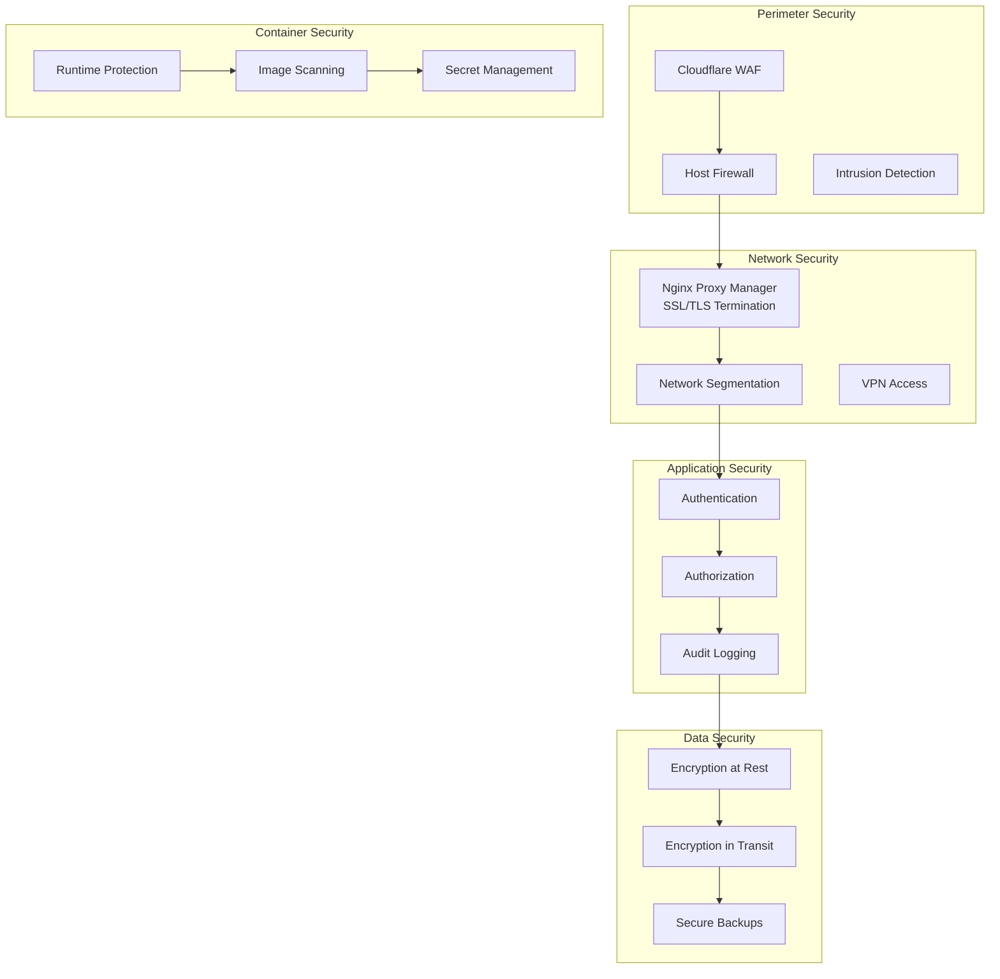

## Authentication Architecture

### 1. Multi-Factor Authentication Flow

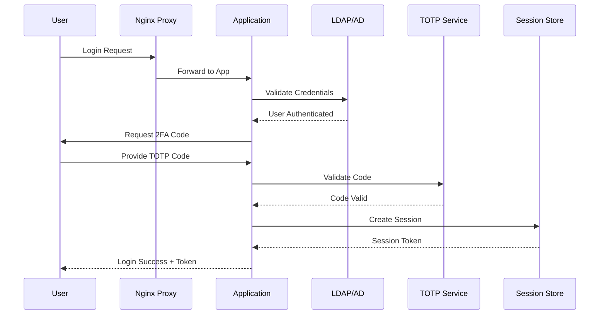

### 2. SSO Integration

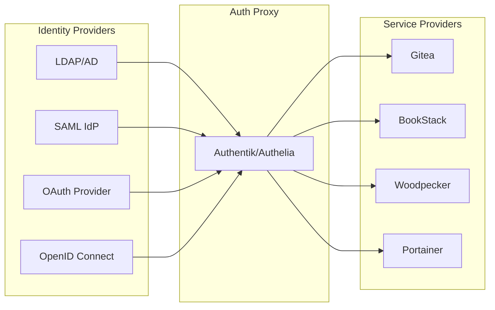

## Authorization Model

### 1. Role-Based Access Control (RBAC)

```yaml
roles:
  - name: admin
    permissions:
      - "*:*:*"  # Full access
    
  - name: developer
    permissions:
      - "gitea:repo:*"
      - "woodpecker:build:*"
      - "bookstack:page:read"
      - "mcp:agent:deploy"
    
  - name: qa_engineer
    permissions:
      - "gitea:repo:read"
      - "woodpecker:build:read"
      - "woodpecker:build:restart"
      - "bookstack:*:*"
    
  - name: viewer
    permissions:
      - "*:*:read"  # Read-only access

permissions:
  format: "service:resource:action"
  services: [gitea, bookstack, woodpecker, portainer, mcp]
  resources: [repo, page, build, container, agent]
  actions: [create, read, update, delete, execute]
```

### 2. Attribute-Based Access Control (ABAC)

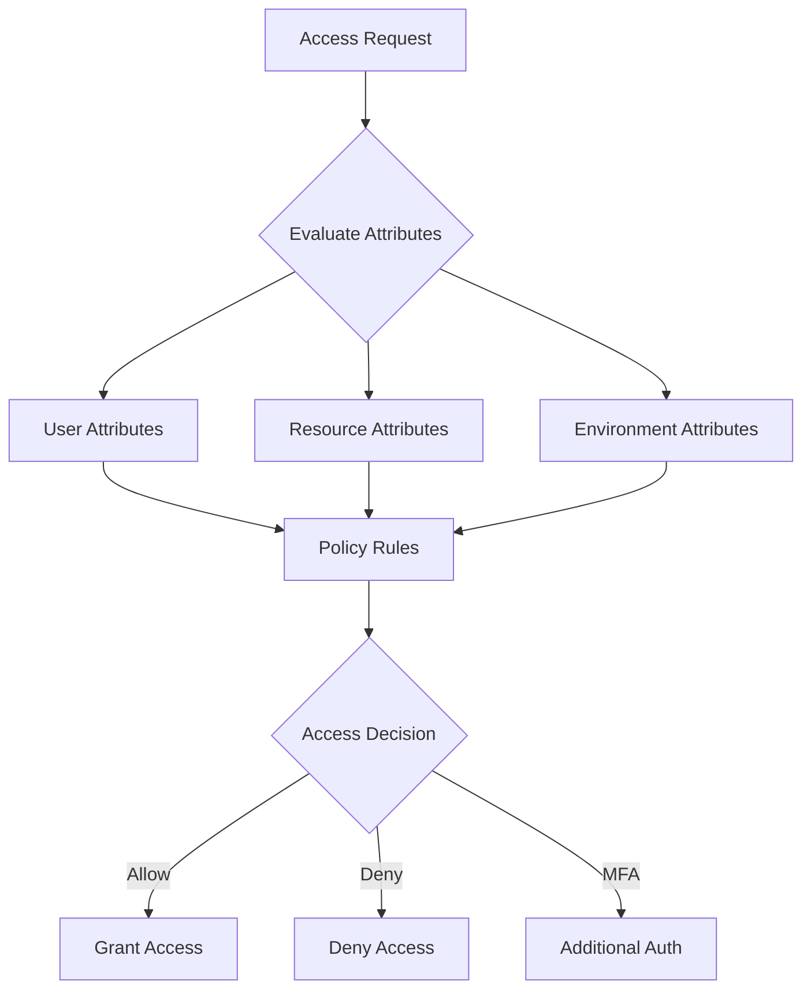

## Network Security

### 1. Zero Trust Network Architecture

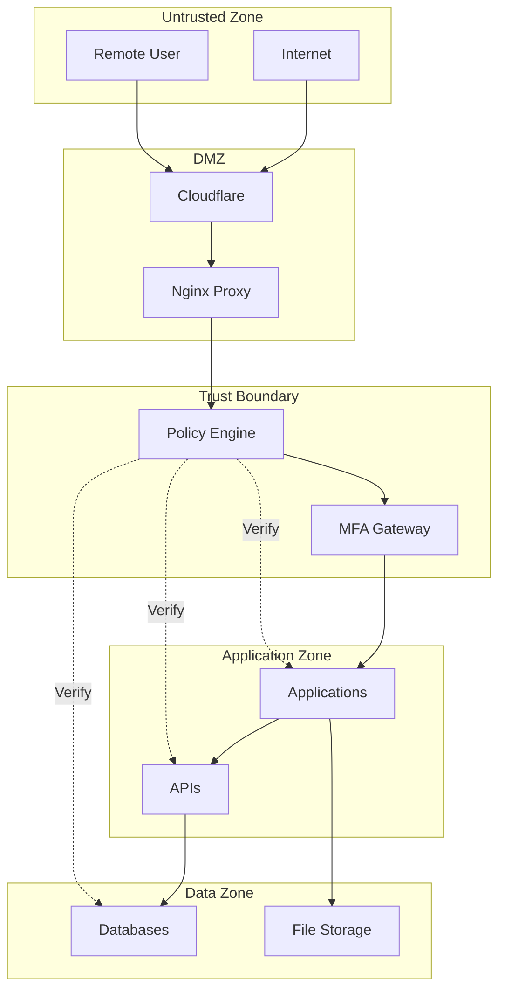

### 2. Network Segmentation

```yaml
networks:
  dmz:
    subnet: 172.20.0.0/24
    services:
      - nginx-proxy-manager
    rules:
      - allow: "80,443 from 0.0.0.0/0"
      - deny: "all from internal"
  
  application:
    subnet: 172.21.0.0/24
    services:
      - gitea
      - bookstack
      - woodpecker
    rules:
      - allow: "from dmz"
      - allow: "to data"
      - deny: "from internet"
  
  data:
    subnet: 172.22.0.0/24
    services:
      - postgresql
      - mariadb
      - redis
    rules:
      - allow: "from application"
      - deny: "from dmz"
      - deny: "from internet"
  
  management:
    subnet: 172.23.0.0/24
    services:
      - portainer
      - monitoring
    rules:
      - allow: "from admin_vpn"
      - deny: "from application"
```

## Data Protection

### 1. Encryption Standards

```yaml
encryption:
  at_rest:
    databases:
      algorithm: AES-256-GCM
      key_management: HashiCorp Vault
      rotation: 90 days
    
    files:
      algorithm: AES-256-CTR
      key_derivation: PBKDF2
      iterations: 100000
    
    backups:
      algorithm: AES-256-CBC
      compression: zstd
      gpg_signing: required
  
  in_transit:
    external:
      protocol: TLS 1.3
      ciphers:
        - TLS_AES_256_GCM_SHA384
        - TLS_CHACHA20_POLY1305_SHA256
      hsts: "max-age=31536000; includeSubDomains"
    
    internal:
      protocol: TLS 1.2+
      mutual_tls: enabled
      certificate_validation: required
```

### 2. Key Management

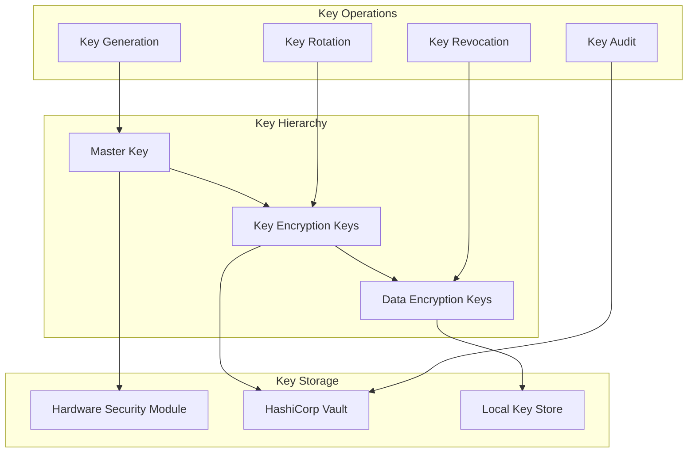

## Container Security

### 1. Image Security Pipeline

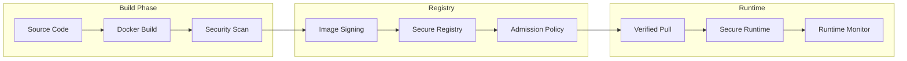

### 2. Runtime Security Policies

```yaml
security_policies:
  pod_security:
    - no_privileged: true
    - read_only_root_fs: true
    - non_root_user: true
    - no_host_network: true
    - no_host_pid: true
    - drop_capabilities:
        - ALL
    - add_capabilities:
        - NET_BIND_SERVICE  # Only if needed
  
  resource_limits:
    cpu: "1000m"
    memory: "1Gi"
    ephemeral_storage: "2Gi"
  
  network_policies:
    ingress:
      - from:
          - podSelector:
              matchLabels:
                app: allowed-app
    egress:
      - to:
          - podSelector:
              matchLabels:
                app: database
```

## Secret Management

### 1. Secret Storage Architecture

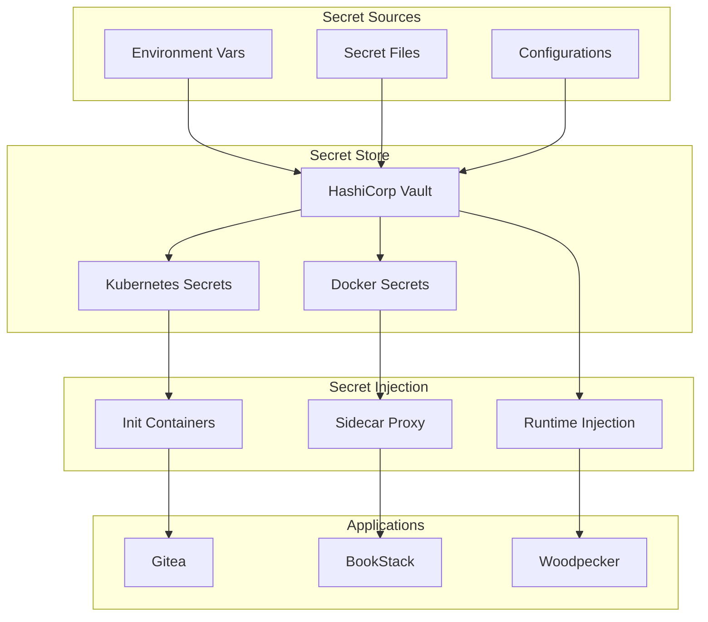

### 2. Secret Rotation

```yaml
secret_rotation:
  database_passwords:
    frequency: 30 days
    method: automatic
    notification: 24 hours before
  
  api_keys:
    frequency: 90 days
    method: manual
    approval: required
  
  certificates:
    frequency: 365 days
    method: automatic
    renewal: 30 days before expiry
  
  ssh_keys:
    frequency: 180 days
    method: manual
    audit: required
```

## Compliance & Auditing

### 1. Audit Architecture

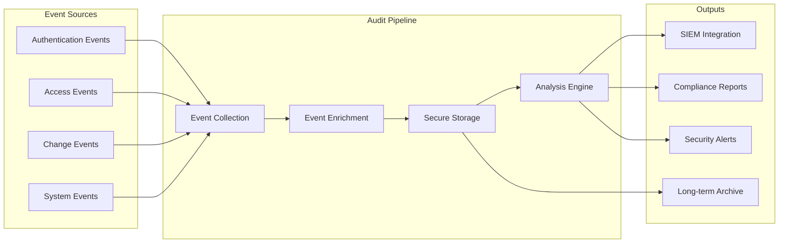

### 2. Compliance Framework

```yaml
compliance:
  standards:
    - name: SOC2 Type II
      controls:
        - access_control
        - encryption
        - monitoring
        - incident_response
    
    - name: HIPAA
      controls:
        - phi_encryption
        - access_logs
        - data_retention
        - breach_notification
    
    - name: GDPR
      controls:
        - data_minimization
        - right_to_erasure
        - consent_management
        - data_portability
  
  audit_schedule:
    internal: monthly
    external: annually
    penetration_testing: quarterly
```

## Incident Response

### 1. Security Incident Flow

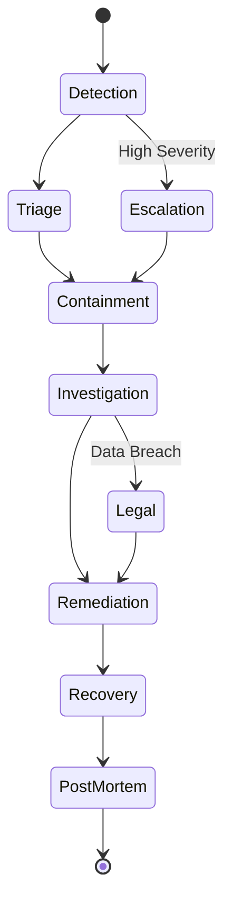

### 2. Response Playbooks

```yaml
playbooks:
  unauthorized_access:
    detection:
      - Failed login threshold exceeded
      - Access from unusual location
      - Privilege escalation attempt
    
    immediate_actions:
      - Block source IP
      - Disable affected account
      - Capture forensic data
    
    investigation:
      - Review access logs
      - Check lateral movement
      - Identify data accessed
    
    remediation:
      - Reset credentials
      - Review permissions
      - Patch vulnerabilities
      - Update security rules
```

## Security Monitoring

### 1. Real-time Monitoring

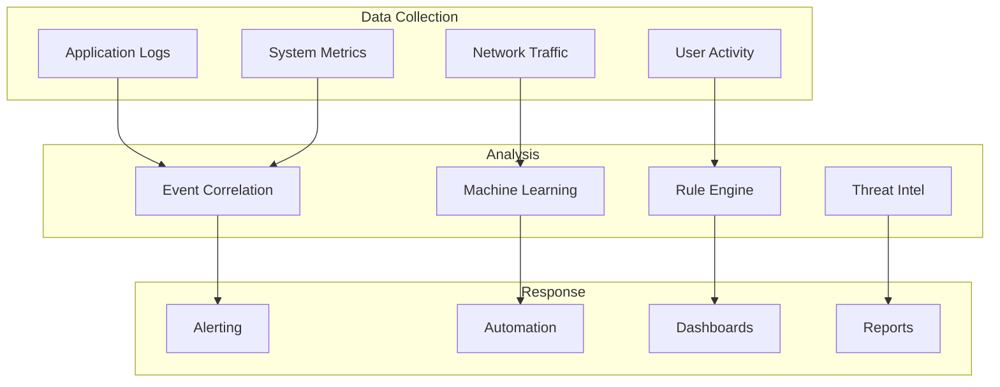

## Security Best Practices

### Development Security
1. **Code Scanning**: All commits scanned for vulnerabilities
2. **Dependency Management**: Automated dependency updates
3. **Secret Scanning**: Prevent secrets in code
4. **SAST/DAST**: Static and dynamic security testing

### Operational Security
1. **Least Privilege**: Minimal permissions by default
2. **Defense in Depth**: Multiple security layers
3. **Zero Trust**: Verify everything, trust nothing
4. **Immutable Infrastructure**: No runtime modifications

### Data Security
1. **Classification**: Data classified by sensitivity
2. **Retention**: Automated data lifecycle management
3. **Anonymization**: PII masked in non-production
4. **Backup Security**: Encrypted, tested backups

## Next Steps

- Review [Deployment Security](../deployment/security-hardening.md) for implementation
- Check [Operations Security](../operations/security-operations.md) for procedures
- See [Incident Response](../operations/incident-response.md) for detailed plans

---

*Last Updated: January 2025 | MosAIc Security Architecture v1.0.0*