# MosAIc Stack Architecture

## Overview

The MosAIc Stack is a modular, enterprise-grade platform for AI-powered software development. Built on a foundation of mandatory MCP (Model Context Protocol), it provides seamless integration between individual developer tools and enterprise orchestration capabilities.

## Core Architecture Principles

### 1. MCP-First Design
All components communicate through the MCP infrastructure:
- Unified state management
- Consistent message passing
- Reliable coordination
- Enterprise scalability

### 2. Modular Components
Each component has clear responsibilities:
- **@tony/core**: AI development framework
- **@mosaic/core**: Enterprise orchestration
- **@mosaic/mcp**: Infrastructure backbone
- **@mosaic/dev**: Development tools

### 3. Progressive Enhancement
Start small, scale to enterprise:
- Individual → Team → Organization
- CLI → Web UI → API Platform
- Local → Cloud → Multi-region
- Single-project → Multi-project → Portfolio

## System Architecture

```
┌─────────────────────────────────────────────────────────────────┐
│                         User Interfaces                          │
├─────────────────────┬─────────────────┬────────────────────────┤
│   Tony CLI (2.8.0)  │  MosAIc Web UI  │   REST/GraphQL APIs   │
└─────────────────────┴─────────────────┴────────────────────────┘
                                │
┌─────────────────────────────────────────────────────────────────┐
│                    Application Layer                             │
├─────────────────────┬─────────────────┬────────────────────────┤
│  @tony/core (2.8.0) │ @mosaic/core    │  Third-party Plugins   │
│  - UPP Methodology  │ - Orchestration  │  - Custom Tools        │
│  - Planning Engine  │ - Web Dashboard  │  - Integrations        │
│  - Agent Management │ - Analytics      │  - Extensions          │
└─────────────────────┴─────────────────┴────────────────────────┘
                                │
┌─────────────────────────────────────────────────────────────────┐
│                 @mosaic/tony-adapter (0.1.0)                    │
│              Seamless Tony ↔ MosAIc Integration                 │
└─────────────────────────────────────────────────────────────────┘
                                │
┌─────────────────────────────────────────────────────────────────┐
│                    @mosaic/mcp (0.1.0)                          │
│                 Infrastructure Foundation                        │
├─────────────────────────────────────────────────────────────────┤
│  • Agent Coordination    • State Management                     │
│  • Message Routing       • Security Layer                       │
│  • Event Streaming       • Performance Monitoring               │
│  • Resource Management   • Audit Logging                        │
└─────────────────────────────────────────────────────────────────┘
                                │
┌─────────────────────────────────────────────────────────────────┐
│                      Data Layer                                  │
├─────────────────────┬─────────────────┬────────────────────────┤
│   SQLite (Local)    │ PostgreSQL      │   Redis Cache          │
│   - Development     │ - Production     │   - Performance        │
└─────────────────────┴─────────────────┴────────────────────────┘
```

## Component Deep Dive

### Tony Framework (@tony/core)

**Purpose**: Core AI development assistant

**Architecture**:
```typescript
interface TonyFramework {
  // Planning engine with UPP methodology
  planning: PlanningEngine;
  
  // Agent orchestration (requires MCP)
  agents: AgentManager;
  
  // Plugin system for extensions
  plugins: PluginSystem;
  
  // MCP integration (mandatory)
  mcp: {
    required: true;
    client: MCPClient;
  };
}
```

**Key Features**:
- UPP task decomposition
- Intelligent agent spawning
- Context management
- Plugin architecture
- Hot-reload capabilities

### MosAIc Core (@mosaic/core)

**Purpose**: Enterprise orchestration platform

**Architecture**:
```typescript
interface MosAIcCore {
  // Multi-project orchestration
  orchestrator: ProjectOrchestrator;
  
  // Web-based UI components
  ui: {
    dashboard: Dashboard;
    analytics: Analytics;
    admin: AdminPanel;
  };
  
  // API layer
  api: {
    rest: RestAPI;
    graphql: GraphQLAPI;
    websocket: RealtimeAPI;
  };
  
  // Tony integration
  tony: TonyAdapter;
}
```

**Key Features**:
- Multi-project coordination
- Team collaboration
- Resource optimization
- Visual planning tools
- Enterprise dashboards

### MosAIc MCP (@mosaic/mcp)

**Purpose**: Infrastructure backbone

**Architecture**:
```typescript
interface MosAIcMCP {
  // Core server
  server: {
    http: HTTPServer;
    websocket: WebSocketServer;
    grpc: GRPCServer;
  };
  
  // Agent coordination
  coordination: {
    registry: AgentRegistry;
    scheduler: TaskScheduler;
    router: MessageRouter;
  };
  
  // State management
  state: {
    store: StateStore;
    sync: StateSynchronizer;
    persistence: PersistenceLayer;
  };
  
  // Security
  security: {
    auth: AuthenticationService;
    rbac: RoleBasedAccess;
    encryption: EncryptionService;
  };
}
```

**Key Features**:
- High-performance message routing
- Distributed state management
- Agent lifecycle management
- Security and compliance
- Performance monitoring

### MosAIc Dev (@mosaic/dev)

**Purpose**: Development tools and SDK

**Architecture**:
```typescript
interface MosAIcDev {
  // Build tools
  build: {
    orchestrator: BuildOrchestrator;
    bundler: Bundler;
    optimizer: Optimizer;
  };
  
  // Testing framework
  testing: {
    unit: UnitTestRunner;
    integration: IntegrationTester;
    performance: PerformanceTester;
  };
  
  // Development utilities
  utils: {
    generators: CodeGenerators;
    migrators: MigrationTools;
    debuggers: DebugTools;
  };
}
```

**Key Features**:
- Unified build system
- Comprehensive testing
- Migration utilities
- Development CLI
- Documentation tools

## Integration Patterns

### 1. Tony-Only Pattern
For individual developers:

```typescript
import { TonyFramework } from '@tony/core';
import { createMCPServer } from '@mosaic/mcp';

const mcp = createMCPServer({ mode: 'local' });
const tony = new TonyFramework({ mcp });

await tony.plan('Build a REST API');
```

### 2. Small Team Pattern
For team coordination:

```typescript
import { TonyFramework } from '@tony/core';
import { MosAIcCore } from '@mosaic/core';
import { createMCPServer } from '@mosaic/mcp';

const mcp = createMCPServer({ mode: 'team' });
const mosaic = new MosAIcCore({ mcp });
const tony = new TonyFramework({ 
  mcp,
  orchestrator: mosaic.orchestrator 
});
```

### 3. Enterprise Pattern
For large organizations:

```typescript
import { MosAIcStack } from '@mosaic/stack';

const stack = new MosAIcStack({
  deployment: 'kubernetes',
  regions: ['us-east', 'eu-west'],
  security: 'enterprise',
  compliance: ['SOC2', 'HIPAA']
});

await stack.deploy();
```

## Communication Flow

### Agent Coordination
```
Tony Agent → MCP Client → MCP Server → Target Agent
    ↑                          ↓
    └── State Update ← State Store
```

### Multi-Project Orchestration
```
Project A ─┐
Project B ─┼→ MosAIc Orchestrator → Resource Scheduler
Project C ─┘         ↓
                Coordination Engine → Agent Assignment
```

### Real-time Updates
```
Agent Activity → Event Stream → WebSocket → UI Updates
       ↓              ↓                         ↓
   Audit Log    Analytics Engine         User Dashboard
```

## Deployment Architecture

### Local Development
```
┌─────────────────┐
│  Local Machine  │
├─────────────────┤
│ • Tony CLI      │
│ • MCP Server    │
│ • SQLite DB     │
│ • File System   │
└─────────────────┘
```

### Team Deployment
```
┌─────────────────┐     ┌─────────────────┐
│  Developer 1    │────→│  Shared Server  │
├─────────────────┤     ├─────────────────┤
│ • Tony CLI      │     │ • MosAIc Core   │
└─────────────────┘     │ • MCP Server    │
                        │ • PostgreSQL    │
┌─────────────────┐     │ • Redis Cache   │
│  Developer 2    │────→│                 │
├─────────────────┤     └─────────────────┘
│ • Tony CLI      │
└─────────────────┘
```

### Enterprise Deployment
```
┌─────────────────────────────────────────┐
│          Load Balancer                  │
└─────────────┬───────────────────────────┘
              │
┌─────────────┴───────────┬───────────────┐
│   MosAIc Web Nodes      │   API Nodes   │
└─────────────┬───────────┴───────────────┘
              │
┌─────────────┴───────────────────────────┐
│         MCP Server Cluster              │
├─────────────────────────────────────────┤
│ • Agent Coordination                    │
│ • State Management                      │
│ • Message Routing                       │
└─────────────┬───────────────────────────┘
              │
┌─────────────┴───────────┬───────────────┐
│   PostgreSQL Cluster    │  Redis Cluster│
└─────────────────────────┴───────────────┘
```

## Security Architecture

### Authentication Flow
```
User → Auth Provider → JWT Token → MCP Server → Resource Access
         ↓                              ↓
    Identity Store              Permission Check
```

### Encryption Layers
1. **Transport**: TLS 1.3 for all communications
2. **Storage**: AES-256 for data at rest
3. **Secrets**: Hardware security module integration
4. **Audit**: Tamper-proof logging

### Access Control
```
User → Role Assignment → Permission Set → Resource Access
         ↓                    ↓                ↓
    Admin/User/Guest    Read/Write/Admin   Project/Agent/Data
```

## Performance Architecture

### Caching Strategy
```
Request → Edge Cache → Application Cache → Database
   ↓          ↓              ↓
  CDN      Redis         Memory Cache
```

### Scaling Patterns
1. **Horizontal**: Add more MCP nodes
2. **Vertical**: Increase node resources
3. **Geographic**: Multi-region deployment
4. **Functional**: Service segregation

### Optimization Points
- Connection pooling
- Query optimization
- Lazy loading
- Event batching
- Resource quotas

## Monitoring Architecture

### Metrics Collection
```
Components → Metrics Agent → Time Series DB → Dashboards
                ↓                               ↓
           Prometheus                      Grafana
```

### Logging Pipeline
```
Application Logs → Log Aggregator → Log Storage → Analysis
                        ↓               ↓            ↓
                   Fluentd         Elasticsearch  Kibana
```

### Alerting Flow
```
Metric Threshold → Alert Manager → Notification Channel
                        ↓               ↓
                  Rule Engine     Email/Slack/PagerDuty
```

## Future Architecture Considerations

### Planned Enhancements
1. **Service Mesh**: Istio integration for microservices
2. **Event Sourcing**: Complete audit trail
3. **CQRS Pattern**: Read/write separation
4. **GraphQL Federation**: Distributed schema
5. **Edge Computing**: Local agent execution

### Extensibility Points
- Plugin API for custom tools
- Webhook system for integrations
- Custom protocol handlers
- Theme and UI customization
- Workflow automation hooks

## Conclusion

The MosAIc Stack architecture provides a solid foundation for AI-powered development at any scale. By mandating MCP as the communication backbone and providing clear component boundaries, the system achieves both flexibility and reliability. The progressive enhancement model ensures teams can adopt the stack at their own pace while maintaining a clear path to enterprise scale.

---

---

## Additional Content (Migrated)

The MosAIc Stack is a modular, enterprise-grade platform for AI-powered software development. Built on a foundation of mandatory MCP (Model Context Protocol), it provides seamless integration between individual developer tools and enterprise orchestration capabilities.

All components communicate through the MCP infrastructure:
- Unified state management
- Consistent message passing
- Reliable coordination
- Enterprise scalability

Each component has clear responsibilities:
- **@tony/core**: AI development framework
- **@mosaic/core**: Enterprise orchestration
- **@mosaic/mcp**: Infrastructure backbone
- **@mosaic/dev**: Development tools

Start small, scale to enterprise:
- Individual → Team → Organization
- CLI → Web UI → API Platform
- Local → Cloud → Multi-region
- Single-project → Multi-project → Portfolio

```
┌─────────────────────────────────────────────────────────────────┐
│                         User Interfaces                          │
├─────────────────────┬─────────────────┬────────────────────────┤
│   Tony CLI (2.8.0)  │  MosAIc Web UI  │   REST/GraphQL APIs   │
└─────────────────────┴─────────────────┴────────────────────────┘
                                │
┌─────────────────────────────────────────────────────────────────┐
│                    Application Layer                             │
├─────────────────────┬─────────────────┬────────────────────────┤
│  @tony/core (2.8.0) │ @mosaic/core    │  Third-party Plugins   │
│  - UPP Methodology  │ - Orchestration  │  - Custom Tools        │
│  - Planning Engine  │ - Web Dashboard  │  - Integrations        │
│  - Agent Management │ - Analytics      │  - Extensions          │
└─────────────────────┴─────────────────┴────────────────────────┘
                                │
┌─────────────────────────────────────────────────────────────────┐
│                 @mosaic/tony-adapter (0.1.0)                    │
│              Seamless Tony ↔ MosAIc Integration                 │
└─────────────────────────────────────────────────────────────────┘
                                │
┌─────────────────────────────────────────────────────────────────┐
│                    @mosaic/mcp (0.1.0)                          │
│                 Infrastructure Foundation                        │
├─────────────────────────────────────────────────────────────────┤
│  • Agent Coordination    • State Management                     │
│  • Message Routing       • Security Layer                       │
│  • Event Streaming       • Performance Monitoring               │
│  • Resource Management   • Audit Logging                        │
└─────────────────────────────────────────────────────────────────┘
                                │
┌─────────────────────────────────────────────────────────────────┐
│                      Data Layer                                  │
├─────────────────────┬─────────────────┬────────────────────────┤
│   SQLite (Local)    │ PostgreSQL      │   Redis Cache          │
│   - Development     │ - Production     │   - Performance        │
└─────────────────────┴─────────────────┴────────────────────────┘
```

**Purpose**: Core AI development assistant

**Architecture**:
```typescript
interface TonyFramework {
  // Planning engine with UPP methodology
  planning: PlanningEngine;
  
  // Agent orchestration (requires MCP)
  agents: AgentManager;
  
  // Plugin system for extensions
  plugins: PluginSystem;
  
  // MCP integration (mandatory)
  mcp: {
    required: true;
    client: MCPClient;
  };
}
```

**Key Features**:
- UPP task decomposition
- Intelligent agent spawning
- Context management
- Plugin architecture
- Hot-reload capabilities

**Purpose**: Enterprise orchestration platform

**Architecture**:
```typescript
interface MosAIcCore {
  // Multi-project orchestration
  orchestrator: ProjectOrchestrator;
  
  // Web-based UI components
  ui: {
    dashboard: Dashboard;
    analytics: Analytics;
    admin: AdminPanel;
  };
  
  // API layer
  api: {
    rest: RestAPI;
    graphql: GraphQLAPI;
    websocket: RealtimeAPI;
  };
  
  // Tony integration
  tony: TonyAdapter;
}
```

**Key Features**:
- Multi-project coordination
- Team collaboration
- Resource optimization
- Visual planning tools
- Enterprise dashboards

**Purpose**: Infrastructure backbone

**Architecture**:
```typescript
interface MosAIcMCP {
  // Core server
  server: {
    http: HTTPServer;
    websocket: WebSocketServer;
    grpc: GRPCServer;
  };
  
  // Agent coordination
  coordination: {
    registry: AgentRegistry;
    scheduler: TaskScheduler;
    router: MessageRouter;
  };
  
  // State management
  state: {
    store: StateStore;
    sync: StateSynchronizer;
    persistence: PersistenceLayer;
  };
  
  // Security
  security: {
    auth: AuthenticationService;
    rbac: RoleBasedAccess;
    encryption: EncryptionService;
  };
}
```

**Key Features**:
- High-performance message routing
- Distributed state management
- Agent lifecycle management
- Security and compliance
- Performance monitoring

**Purpose**: Development tools and SDK

**Architecture**:
```typescript
interface MosAIcDev {
  // Build tools
  build: {
    orchestrator: BuildOrchestrator;
    bundler: Bundler;
    optimizer: Optimizer;
  };
  
  // Testing framework
  testing: {
    unit: UnitTestRunner;
    integration: IntegrationTester;
    performance: PerformanceTester;
  };
  
  // Development utilities
  utils: {
    generators: CodeGenerators;
    migrators: MigrationTools;
    debuggers: DebugTools;
  };
}
```

**Key Features**:
- Unified build system
- Comprehensive testing
- Migration utilities
- Development CLI
- Documentation tools

For individual developers:

```typescript
import { TonyFramework } from '@tony/core';
import { createMCPServer } from '@mosaic/mcp';

const mcp = createMCPServer({ mode: 'local' });
const tony = new TonyFramework({ mcp });

await tony.plan('Build a REST API');
```

For team coordination:

```typescript
import { TonyFramework } from '@tony/core';
import { MosAIcCore } from '@mosaic/core';
import { createMCPServer } from '@mosaic/mcp';

const mcp = createMCPServer({ mode: 'team' });
const mosaic = new MosAIcCore({ mcp });
const tony = new TonyFramework({ 
  mcp,
  orchestrator: mosaic.orchestrator 
});
```

For large organizations:

```typescript
import { MosAIcStack } from '@mosaic/stack';

const stack = new MosAIcStack({
  deployment: 'kubernetes',
  regions: ['us-east', 'eu-west'],
  security: 'enterprise',
  compliance: ['SOC2', 'HIPAA']
});

await stack.deploy();
```

```
Tony Agent → MCP Client → MCP Server → Target Agent
    ↑                          ↓
    └── State Update ← State Store
```

```
Project A ─┐
Project B ─┼→ MosAIc Orchestrator → Resource Scheduler
Project C ─┘         ↓
                Coordination Engine → Agent Assignment
```

```
Agent Activity → Event Stream → WebSocket → UI Updates
       ↓              ↓                         ↓
   Audit Log    Analytics Engine         User Dashboard
```

```
┌─────────────────┐
│  Local Machine  │
├─────────────────┤
│ • Tony CLI      │
│ • MCP Server    │
│ • SQLite DB     │
│ • File System   │
└─────────────────┘
```

```
┌─────────────────┐     ┌─────────────────┐
│  Developer 1    │────→│  Shared Server  │
├─────────────────┤     ├─────────────────┤
│ • Tony CLI      │     │ • MosAIc Core   │
└─────────────────┘     │ • MCP Server    │
                        │ • PostgreSQL    │
┌─────────────────┐     │ • Redis Cache   │
│  Developer 2    │────→│                 │
├─────────────────┤     └─────────────────┘
│ • Tony CLI      │
└─────────────────┘
```

```
┌─────────────────────────────────────────┐
│          Load Balancer                  │
└─────────────┬───────────────────────────┘
              │
┌─────────────┴───────────┬───────────────┐
│   MosAIc Web Nodes      │   API Nodes   │
└─────────────┬───────────┴───────────────┘
              │
┌─────────────┴───────────────────────────┐
│         MCP Server Cluster              │
├─────────────────────────────────────────┤
│ • Agent Coordination                    │
│ • State Management                      │
│ • Message Routing                       │
└─────────────┬───────────────────────────┘
              │
┌─────────────┴───────────┬───────────────┐
│   PostgreSQL Cluster    │  Redis Cluster│
└─────────────────────────┴───────────────┘
```

```
User → Auth Provider → JWT Token → MCP Server → Resource Access
         ↓                              ↓
    Identity Store              Permission Check
```

1. **Transport**: TLS 1.3 for all communications
2. **Storage**: AES-256 for data at rest
3. **Secrets**: Hardware security module integration
4. **Audit**: Tamper-proof logging

```
User → Role Assignment → Permission Set → Resource Access
         ↓                    ↓                ↓
    Admin/User/Guest    Read/Write/Admin   Project/Agent/Data
```

```
Request → Edge Cache → Application Cache → Database
   ↓          ↓              ↓
  CDN      Redis         Memory Cache
```

1. **Horizontal**: Add more MCP nodes
2. **Vertical**: Increase node resources
3. **Geographic**: Multi-region deployment
4. **Functional**: Service segregation

- Connection pooling
- Query optimization
- Lazy loading
- Event batching
- Resource quotas

```
Components → Metrics Agent → Time Series DB → Dashboards
                ↓                               ↓
           Prometheus                      Grafana
```

```
Application Logs → Log Aggregator → Log Storage → Analysis
                        ↓               ↓            ↓
                   Fluentd         Elasticsearch  Kibana
```

```
Metric Threshold → Alert Manager → Notification Channel
                        ↓               ↓
                  Rule Engine     Email/Slack/PagerDuty
```

1. **Service Mesh**: Istio integration for microservices
2. **Event Sourcing**: Complete audit trail
3. **CQRS Pattern**: Read/write separation
4. **GraphQL Federation**: Distributed schema
5. **Edge Computing**: Local agent execution

- Plugin API for custom tools
- Webhook system for integrations
- Custom protocol handlers
- Theme and UI customization
- Workflow automation hooks

The MosAIc Stack architecture provides a solid foundation for AI-powered development at any scale. By mandating MCP as the communication backbone and providing clear component boundaries, the system achieves both flexibility and reliability. The progressive enhancement model ensures teams can adopt the stack at their own pace while maintaining a clear path to enterprise scale.

---

---

# MosAIc Orchestration Architecture Diagrams

This document contains visual representations of the MosAIc orchestration architecture using Mermaid diagrams. These diagrams illustrate the system's components, data flow, and integration points.

## System Architecture Overview

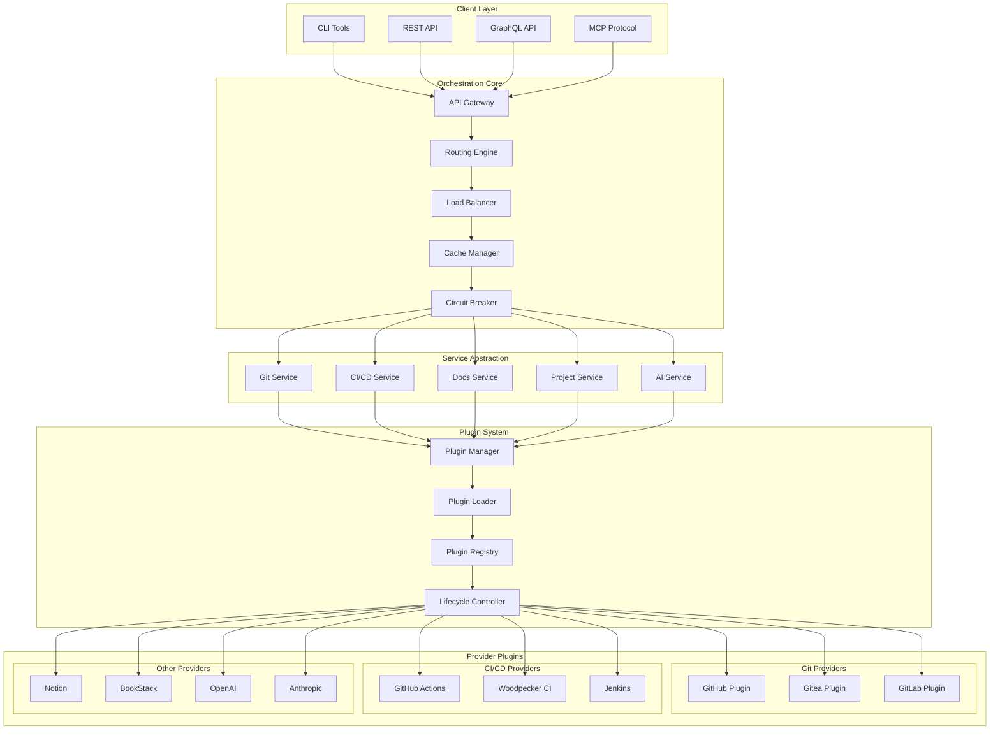

## Request Flow Diagram

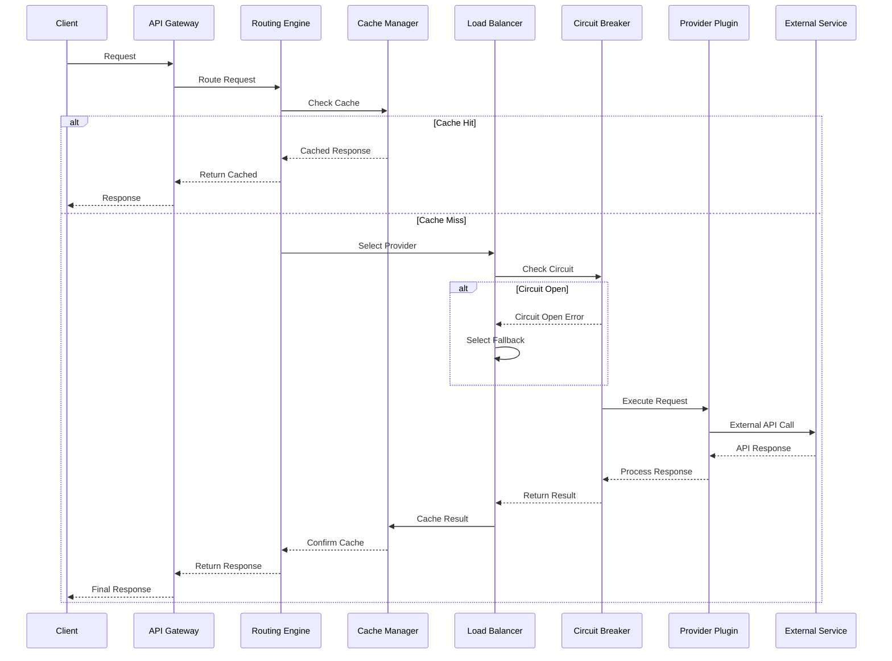

## Plugin Lifecycle Diagram

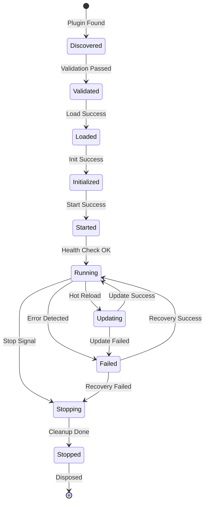

## Multi-Provider Routing Decision Tree

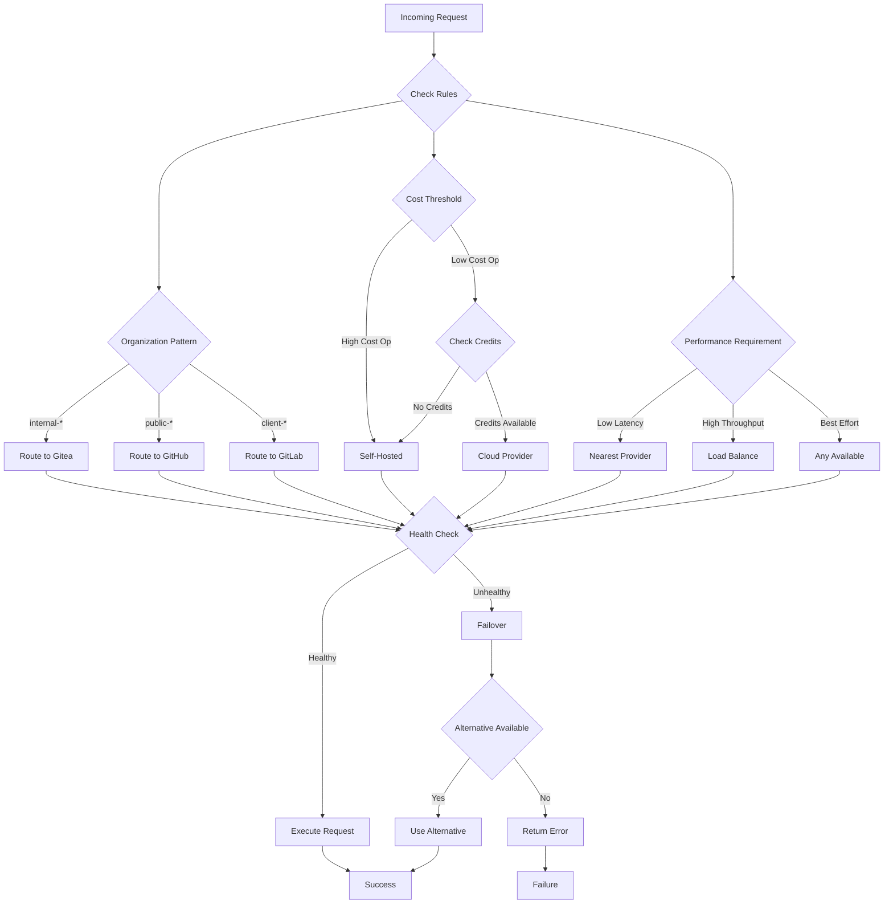

## Cache Architecture

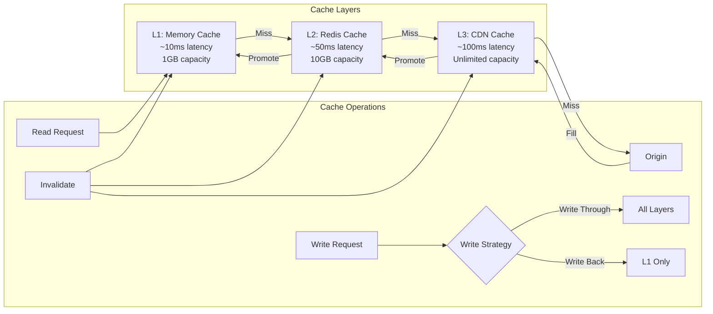

## Load Balancing Strategies

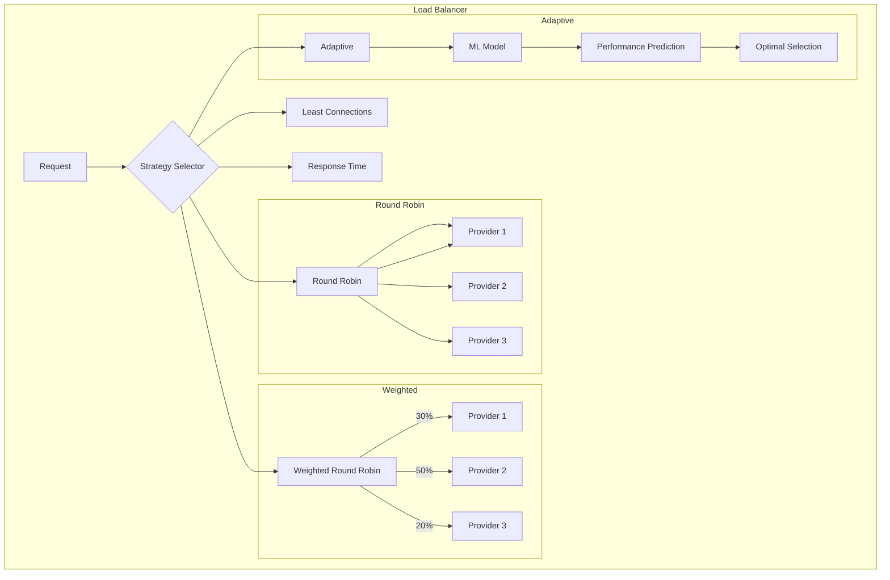

## Circuit Breaker State Machine

```mermaid
stateDiagram-v2
    [*] --> Closed: Initial State
    
    state Closed {
        [*] --> Monitoring
        Monitoring --> Monitoring: Success
        Monitoring --> Counting: Failure
        Counting --> Counting: Failure < Threshold
        Counting --> Opening: Failure >= Threshold
    }
    
    Closed --> Open: Threshold Breached
    
    state Open {
        [*] --> Rejecting
        Rejecting --> Rejecting: Reject All
        Rejecting --> Timer: Start Timer
        Timer --> HalfOpen: Timeout
    }
    
    Open --> HalfOpen: Reset Timeout
    
    state HalfOpen {
        [*] --> Testing
        Testing --> Success: Request Success
        Success --> Success: Count < Required
        Success --> Closed: Count >= Required
        Testing --> Open: Request Failed
    }
    
    HalfOpen --> Closed: Success Threshold
    HalfOpen --> Open: Any Failure
```

## Multi-Tenant Architecture

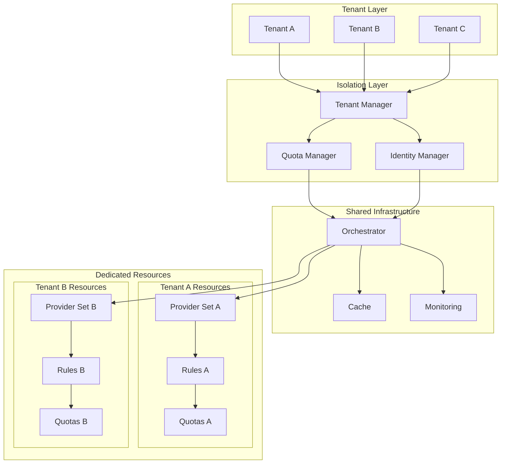

## Monitoring and Observability

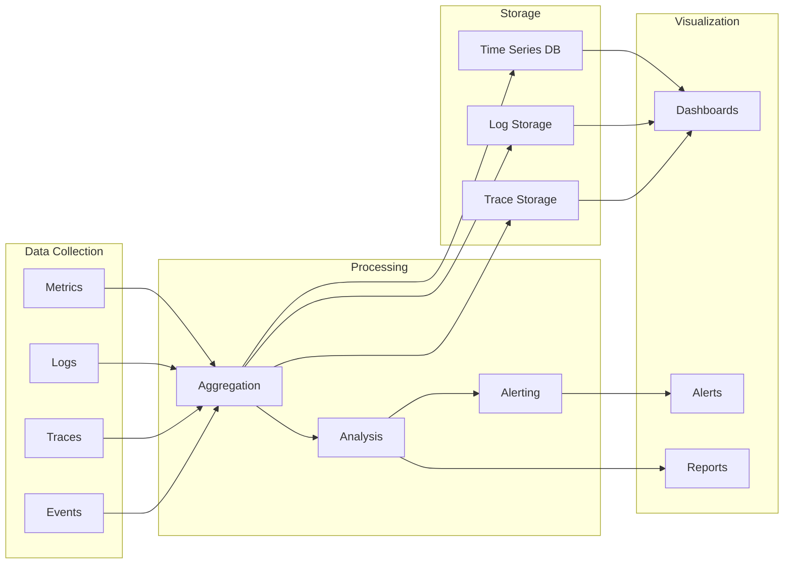

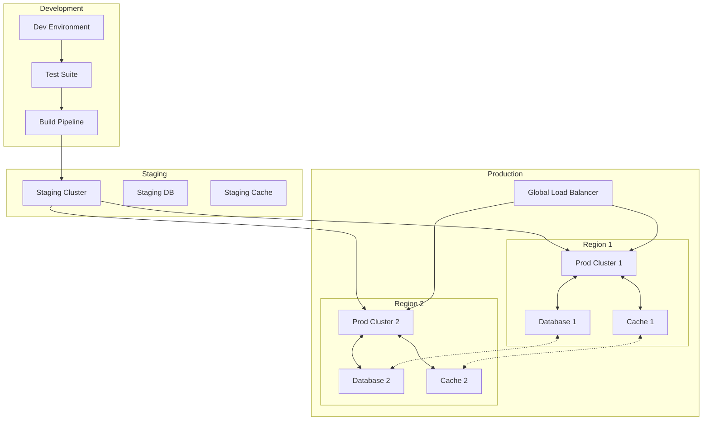

## Data Flow for Multi-Provider Operations

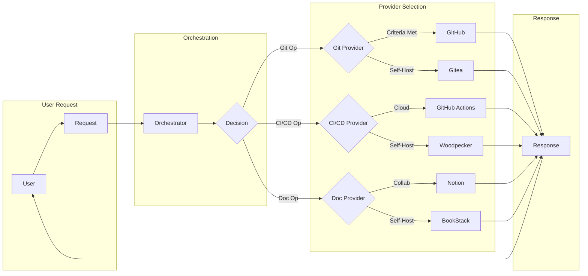

## Error Handling Flow

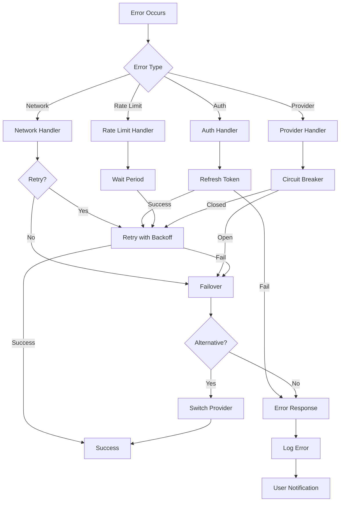

---

These diagrams provide a visual understanding of the MosAIc orchestration architecture, showing how different components interact and how data flows through the system. The diagrams can be rendered using any Mermaid-compatible viewer or documentation system.

---

---

# MosAIc Stack Orchestration Architecture Evolution

## Executive Summary

This document outlines the evolution strategy from the current minimal MCP implementation to a full-scale multi-provider orchestration platform. Building upon the foundation established in Epic E.057, we will transform mosaic-mcp into a comprehensive orchestration engine capable of managing diverse service providers through a unified interface.

## Table of Contents

1. [Current State Analysis](#current-state-analysis)
2. [Vision: Full Orchestration Architecture](#vision-full-orchestration-architecture)
3. [Evolution Roadmap](#evolution-roadmap)
4. [Plugin Architecture Design](#plugin-architecture-design)
5. [Service Abstraction Layer](#service-abstraction-layer)
6. [Intelligent Routing System](#intelligent-routing-system)
7. [Implementation Phases](#implementation-phases)
8. [Benefits and Use Cases](#benefits-and-use-cases)

## Current State Analysis

### Existing Foundation (Epic E.057)
- **MCP Integration**: Basic MCP server with tool registration
- **Service-Specific Packages**: Structure for Gitea, Woodpecker, BookStack, Plane
- **Common Utilities**: Authentication, logging, circuit breaker patterns
- **Repository Tool**: Complete implementation for Gitea operations

### Limitations of Current Architecture
1. **Single-Provider Lock-in**: Each service type has only one provider option
2. **Static Configuration**: No runtime provider switching
3. **Limited Extensibility**: Adding new providers requires code changes
4. **No Intelligent Routing**: All requests go to predefined endpoints
5. **Minimal State Management**: Basic session handling only

## Vision: Full Orchestration Architecture

### Core Principles
1. **Provider Agnostic**: Support multiple providers for each service type
2. **Plugin-Based**: Runtime-loadable provider plugins
3. **Intelligent Routing**: Smart request distribution based on context
4. **Unified Interface**: Consistent API regardless of backend provider
5. **Enterprise Ready**: Scalable, secure, and observable

### Architecture Overview

```
┌─────────────────────────────────────────────────────────────────┐
│                        MosAIc Orchestrator                       │
├─────────────────────────────────────────────────────────────────┤
│                         API Gateway Layer                        │
│  ┌─────────────┐  ┌─────────────┐  ┌──────────────────────┐   │
│  │   REST API  │  │   GraphQL   │  │   MCP Protocol       │   │
│  └─────────────┘  └─────────────┘  └──────────────────────┘   │
├─────────────────────────────────────────────────────────────────┤
│                    Intelligent Routing Engine                    │
│  ┌─────────────┐  ┌─────────────┐  ┌──────────────────────┐   │
│  │Pattern Match│  │Load Balance │  │  Context Analyzer    │   │
│  └─────────────┘  └─────────────┘  └──────────────────────┘   │
├─────────────────────────────────────────────────────────────────┤
│                   Service Abstraction Layer                      │
│  ┌──────────┐  ┌──────────┐  ┌──────────┐  ┌─────────────┐   │
│  │   Git    │  │  CI/CD   │  │   Docs   │  │   Project   │   │
│  │ Service  │  │ Service  │  │ Service  │  │ Management  │   │
│  └──────────┘  └──────────┘  └──────────┘  └─────────────┘   │
├─────────────────────────────────────────────────────────────────┤
│                      Plugin Manager                              │
│  ┌─────────────────────────────────────────────────────────┐   │
│  │  Dynamic Loading │ Lifecycle Mgmt │ Config Validation   │   │
│  └─────────────────────────────────────────────────────────┘   │
├─────────────────────────────────────────────────────────────────┤
│                     Provider Plugins                             │
│  ┌──────────┐  ┌──────────┐  ┌──────────┐  ┌─────────────┐   │
│  │  GitHub  │  │  Gitea   │  │  GitLab  │  │   Bitbucket │   │
│  ├──────────┤  ├──────────┤  ├──────────┤  ├─────────────┤   │
│  │ Actions  │  │Woodpecker│  │ CI/CD    │  │  Pipelines  │   │
│  ├──────────┤  ├──────────┤  ├──────────┤  ├─────────────┤   │
│  │  Notion  │  │BookStack │  │Confluence│  │    Wiki     │   │
│  ├──────────┤  ├──────────┤  ├──────────┤  ├─────────────┤   │
│  │  Linear  │  │  Plane   │  │   Jira   │  │    Asana    │   │
│  └──────────┘  └──────────┘  └──────────┘  └─────────────┘   │
└─────────────────────────────────────────────────────────────────┘
```

## Evolution Roadmap

### Phase 1: Foundation Enhancement (Current → v0.2.0)
- Refactor existing packages to use plugin interfaces
- Create provider abstraction layer
- Implement plugin lifecycle management
- Add configuration schema validation

### Phase 2: Multi-Provider Support (v0.2.0 → v0.3.0)
- Implement GitHub provider plugins
- Add GitLab integration
- Create provider selection logic
- Build unified API layer

### Phase 3: Intelligent Orchestration (v0.3.0 → v0.4.0)
- Implement routing engine
- Add load balancing
- Create caching layer
- Build failover mechanisms

### Phase 4: Enterprise Features (v0.4.0 → v1.0.0)
- Add multi-tenancy support
- Implement advanced security features
- Create monitoring and observability
- Build administration interface

## Plugin Architecture Design

### Plugin Interface Specification

```typescript
// Base Plugin Interface
interface IOrchestrationPlugin {
  // Metadata
  readonly id: string;
  readonly name: string;
  readonly version: string;
  readonly type: ServiceType;
  readonly provider: string;
  
  // Lifecycle
  initialize(config: PluginConfig): Promise<void>;
  start(): Promise<void>;
  stop(): Promise<void>;
  dispose(): Promise<void>;
  
  // Health
  healthCheck(): Promise<HealthStatus>;
  getMetrics(): Promise<PluginMetrics>;
  
  // Capabilities
  getCapabilities(): PluginCapabilities;
  supportsOperation(operation: string): boolean;
}

// Service-Specific Interfaces
interface IGitPlugin extends IOrchestrationPlugin {
  // Repository Operations
  createRepository(params: CreateRepoParams): Promise<Repository>;
  getRepository(params: GetRepoParams): Promise<Repository>;
  updateRepository(params: UpdateRepoParams): Promise<Repository>;
  deleteRepository(params: DeleteRepoParams): Promise<void>;
  listRepositories(params: ListReposParams): Promise<Repository[]>;
  
  // Branch Operations
  createBranch(params: CreateBranchParams): Promise<Branch>;
  mergeBranch(params: MergeBranchParams): Promise<MergeResult>;
  
  // PR/MR Operations
  createPullRequest(params: CreatePRParams): Promise<PullRequest>;
  reviewPullRequest(params: ReviewPRParams): Promise<ReviewResult>;
}

interface ICICDPlugin extends IOrchestrationPlugin {
  // Pipeline Operations
  createPipeline(params: CreatePipelineParams): Promise<Pipeline>;
  triggerPipeline(params: TriggerParams): Promise<PipelineRun>;
  getPipelineStatus(params: StatusParams): Promise<PipelineStatus>;
  
  // Artifact Operations
  uploadArtifact(params: UploadParams): Promise<Artifact>;
  downloadArtifact(params: DownloadParams): Promise<ArtifactData>;
}

interface IDocsPlugin extends IOrchestrationPlugin {
  // Document Operations
  createDocument(params: CreateDocParams): Promise<Document>;
  updateDocument(params: UpdateDocParams): Promise<Document>;
  searchDocuments(params: SearchParams): Promise<SearchResults>;
  
  // Structure Operations
  createSpace(params: CreateSpaceParams): Promise<Space>;
  organizeContent(params: OrganizeParams): Promise<Structure>;
}

interface IProjectPlugin extends IOrchestrationPlugin {
  // Project Operations
  createProject(params: CreateProjectParams): Promise<Project>;
  updateProject(params: UpdateProjectParams): Promise<Project>;
  
  // Issue Operations
  createIssue(params: CreateIssueParams): Promise<Issue>;
  updateIssue(params: UpdateIssueParams): Promise<Issue>;
  linkIssues(params: LinkParams): Promise<LinkResult>;
  
  // Sprint Operations
  createSprint(params: CreateSprintParams): Promise<Sprint>;
  planSprint(params: PlanParams): Promise<SprintPlan>;
}
```

### Plugin Lifecycle Management

```typescript
class PluginManager {
  private plugins: Map<string, IOrchestrationPlugin>;
  private registry: PluginRegistry;
  private loader: PluginLoader;
  
  async loadPlugin(pluginPath: string): Promise<void> {
    // Dynamic import
    const PluginClass = await this.loader.load(pluginPath);
    
    // Validate plugin
    const validation = await this.validatePlugin(PluginClass);
    if (!validation.valid) {
      throw new PluginValidationError(validation.errors);
    }
    
    // Instantiate
    const plugin = new PluginClass();
    
    // Initialize
    await plugin.initialize(this.getPluginConfig(plugin.id));
    
    // Register
    this.plugins.set(plugin.id, plugin);
    this.registry.register(plugin);
    
    // Start
    await plugin.start();
  }
  
  async unloadPlugin(pluginId: string): Promise<void> {
    const plugin = this.plugins.get(pluginId);
    if (!plugin) return;
    
    // Stop
    await plugin.stop();
    
    // Unregister
    this.registry.unregister(pluginId);
    this.plugins.delete(pluginId);
    
    // Dispose
    await plugin.dispose();
  }
  
  async reloadPlugin(pluginId: string): Promise<void> {
    const plugin = this.plugins.get(pluginId);
    if (!plugin) return;
    
    // Hot reload without service interruption
    const newPlugin = await this.loader.reload(plugin);
    
    // Graceful transition
    await this.transitionPlugin(plugin, newPlugin);
  }
}
```

### Configuration Schema

```yaml
orchestration:
  plugins:
    - id: github-git
      type: git
      provider: github
      enabled: true
      config:
        auth:
          type: token
          token: ${GITHUB_TOKEN}
        rateLimit:
          maxRequests: 5000
          windowMs: 3600000
        retry:
          attempts: 3
          backoff: exponential
    
    - id: gitea-git
      type: git
      provider: gitea
      enabled: true
      config:
        baseUrl: https://git.mosaicstack.dev
        auth:
          type: token
          token: ${GITEA_TOKEN}
        ssl:
          verify: true
          cert: /path/to/cert.pem
    
    - id: github-actions
      type: cicd
      provider: github
      enabled: true
      config:
        workflows:
          directory: .github/workflows
          triggerEvents:
            - push
            - pull_request
    
  routing:
    rules:
      - pattern: "org:mosaic-*"
        provider: gitea-git
        priority: 100
      
      - pattern: "org:public-*"
        provider: github-git
        priority: 90
      
      - pattern: "private:true"
        provider: gitea-git
        priority: 100
    
    loadBalancing:
      strategy: round-robin
      healthCheck:
        interval: 30000
        timeout: 5000
    
  cache:
    enabled: true
    provider: redis
    ttl: 300
    maxSize: 1000
```

## Service Abstraction Layer

### Unified Service Interfaces

```typescript
// Abstract Git Service
abstract class GitService {
  protected providers: Map<string, IGitPlugin>;
  protected router: IRoutingEngine;
  
  async createRepository(params: CreateRepoParams): Promise<Repository> {
    // Select provider based on routing rules
    const provider = await this.router.selectProvider(params, this.providers);
    
    // Execute with fallback
    return this.executeWithFallback(
      () => provider.createRepository(params),
      params
    );
  }
  
  private async executeWithFallback<T>(
    operation: () => Promise<T>,
    context: any
  ): Promise<T> {
    try {
      return await operation();
    } catch (error) {
      // Try fallback provider
      const fallback = await this.router.selectFallback(context, this.providers);
      if (fallback) {
        return await fallback.execute(operation);
      }
      throw error;
    }
  }
}

// Concrete implementations for each service type
class UnifiedGitService extends GitService {
  // Git-specific unified operations
}

class UnifiedCICDService extends CICDService {
  // CI/CD-specific unified operations
}

class UnifiedDocsService extends DocsService {
  // Documentation-specific unified operations
}

class UnifiedProjectService extends ProjectService {
  // Project management-specific unified operations
}
```

### Service Registry

```typescript
class ServiceRegistry {
  private services: Map<ServiceType, AbstractService>;
  private providers: Map<string, IOrchestrationPlugin>;
  
  registerService(type: ServiceType, service: AbstractService): void {
    this.services.set(type, service);
  }
  
  registerProvider(plugin: IOrchestrationPlugin): void {
    const service = this.services.get(plugin.type);
    if (service) {
      service.addProvider(plugin);
    }
    this.providers.set(plugin.id, plugin);
  }
  
  getService(type: ServiceType): AbstractService {
    const service = this.services.get(type);
    if (!service) {
      throw new ServiceNotFoundError(type);
    }
    return service;
  }
}
```

## Intelligent Routing System

### Routing Engine Design

```typescript
interface IRoutingEngine {
  selectProvider(context: RequestContext, providers: Map<string, IPlugin>): Promise<IPlugin>;
  selectFallback(context: RequestContext, providers: Map<string, IPlugin>): Promise<IPlugin | null>;
  updateMetrics(provider: string, result: OperationResult): void;
}

class IntelligentRoutingEngine implements IRoutingEngine {
  private rules: RoutingRule[];
  private metrics: MetricsCollector;
  private cache: ICache;
  
  async selectProvider(
    context: RequestContext,
    providers: Map<string, IPlugin>
  ): Promise<IPlugin> {
    // Check cache first
    const cached = await this.cache.get(context.cacheKey);
    if (cached) {
      return providers.get(cached);
    }
    
    // Evaluate routing rules
    const candidates = await this.evaluateRules(context, providers);
    
    // Apply load balancing
    const selected = await this.loadBalance(candidates, context);
    
    // Cache decision
    await this.cache.set(context.cacheKey, selected.id, 300);
    
    return selected;
  }
  
  private async evaluateRules(
    context: RequestContext,
    providers: Map<string, IPlugin>
  ): Promise<IPlugin[]> {
    const candidates: Array<{plugin: IPlugin, score: number}> = [];
    
    for (const [id, provider] of providers) {
      let score = 0;
      
      // Check health
      const health = await provider.healthCheck();
      if (health.status !== 'healthy') continue;
      
      // Evaluate rules
      for (const rule of this.rules) {
        if (rule.matches(context)) {
          if (rule.provider === id) {
            score += rule.priority;
          }
        }
      }
      
      // Consider metrics
      const metrics = await this.metrics.getProviderMetrics(id);
      score += this.calculateMetricScore(metrics);
      
      if (score > 0) {
        candidates.push({ plugin: provider, score });
      }
    }
    
    // Sort by score
    candidates.sort((a, b) => b.score - a.score);
    
    return candidates.map(c => c.plugin);
  }
  
  private async loadBalance(
    candidates: IPlugin[],
    context: RequestContext
  ): Promise<IPlugin> {
    switch (this.strategy) {
      case 'round-robin':
        return this.roundRobin(candidates);
      
      case 'least-connections':
        return this.leastConnections(candidates);
      
      case 'weighted':
        return this.weighted(candidates, context);
      
      default:
        return candidates[0];
    }
  }
}
```

### Routing Rules Engine

```typescript
class RoutingRule {
  constructor(
    private pattern: string,
    private provider: string,
    private priority: number,
    private conditions?: RuleCondition[]
  ) {}
  
  matches(context: RequestContext): boolean {
    // Pattern matching
    if (!this.matchesPattern(context)) {
      return false;
    }
    
    // Additional conditions
    if (this.conditions) {
      return this.conditions.every(cond => cond.evaluate(context));
    }
    
    return true;
  }
  
  private matchesPattern(context: RequestContext): boolean {
    // Support various pattern types
    if (this.pattern.startsWith('org:')) {
      return this.matchesOrg(context, this.pattern.slice(4));
    }
    
    if (this.pattern.startsWith('repo:')) {
      return this.matchesRepo(context, this.pattern.slice(5));
    }
    
    if (this.pattern.startsWith('user:')) {
      return this.matchesUser(context, this.pattern.slice(5));
    }
    
    // Glob pattern
    return minimatch(context.resource, this.pattern);
  }
}
```

### Caching Layer

```typescript
interface ICacheProvider {
  get(key: string): Promise<any | null>;
  set(key: string, value: any, ttl?: number): Promise<void>;
  delete(key: string): Promise<void>;
  clear(): Promise<void>;
}

class OrchestrationCache {
  private providers: Map<string, ICacheProvider>;
  private strategy: CacheStrategy;
  
  async get(key: string): Promise<any | null> {
    // Try multiple cache levels
    for (const [level, provider] of this.providers) {
      const value = await provider.get(key);
      if (value !== null) {
        // Promote to higher levels
        await this.promote(key, value, level);
        return value;
      }
    }
    return null;
  }
  
  async set(key: string, value: any, ttl?: number): Promise<void> {
    // Write-through or write-back based on strategy
    switch (this.strategy) {
      case 'write-through':
        await Promise.all(
          Array.from(this.providers.values()).map(p => p.set(key, value, ttl))
        );
        break;
      
      case 'write-back':
        await this.providers.get('L1').set(key, value, ttl);
        this.scheduleWriteBack(key, value, ttl);
        break;
    }
  }
}
```

## Implementation Phases

### Phase 1: Core Orchestration Engine (2 weeks)
1. **Week 1: Foundation**
   - Plugin interface definitions
   - Plugin lifecycle manager
   - Service abstraction layer
   - Basic routing engine

2. **Week 2: Integration**
   - Refactor existing packages to plugins
   - Configuration management
   - Basic testing framework
   - Documentation

### Phase 2: Provider Plugins (3 weeks)
1. **Week 1: Git Providers**
   - GitHub plugin
   - GitLab plugin
   - Bitbucket plugin
   - Provider-specific features

2. **Week 2: CI/CD Providers**
   - GitHub Actions plugin
   - GitLab CI plugin
   - Jenkins plugin
   - CircleCI plugin

3. **Week 3: Documentation & Project Providers**
   - Notion plugin
   - Confluence plugin
   - Jira plugin
   - Linear plugin

### Phase 3: Advanced Features (2 weeks)
1. **Week 1: Intelligence**
   - Advanced routing rules
   - Load balancing strategies
   - Predictive provider selection
   - Performance optimization

2. **Week 2: Reliability**
   - Caching implementation
   - Failover mechanisms
   - Circuit breaker enhancements
   - Monitoring integration

### Phase 4: Enterprise Capabilities (3 weeks)
1. **Week 1: Multi-tenancy**
   - Tenant isolation
   - Resource quotas
   - Usage tracking
   - Billing integration

2. **Week 2: Security**
   - Advanced authentication
   - Authorization framework
   - Audit logging
   - Compliance features

3. **Week 3: Operations**
   - Admin interface
   - Monitoring dashboard
   - Alert management
   - Backup/restore

## Benefits and Use Cases

### Key Benefits

1. **Provider Flexibility**
   - Switch providers without code changes
   - Use multiple providers simultaneously
   - Gradual migration support
   - Vendor lock-in prevention

2. **Cost Optimization**
   - Route to most cost-effective provider
   - Usage-based provider selection
   - Resource pooling
   - Quota management

3. **Performance Improvements**
   - Intelligent caching
   - Load distribution
   - Parallel operations
   - Latency optimization

4. **Reliability Enhancement**
   - Automatic failover
   - Circuit breaker protection
   - Health-based routing
   - Graceful degradation

5. **Enterprise Scalability**
   - Multi-tenant architecture
   - Horizontal scaling
   - Plugin hot-reload
   - Zero-downtime updates

### Use Cases

#### 1. Hybrid Cloud Development
```yaml
scenario: "Public and Private Repositories"
routing:
  - pattern: "org:internal-*"
    provider: gitea-git  # Self-hosted
  - pattern: "org:opensource-*"
    provider: github-git # Public cloud
benefits:
  - Keep sensitive code on-premise
  - Leverage GitHub's community for OSS
  - Unified interface for developers
```

#### 2. Cost-Optimized CI/CD
```yaml
scenario: "Workload-based CI/CD routing"
routing:
  - condition: "build.size > 10GB"
    provider: self-hosted-jenkins  # No egress costs
  - condition: "build.public == true"
    provider: github-actions      # Free for public repos
  - default:
    provider: woodpecker-ci      # Default self-hosted
benefits:
  - Minimize cloud costs
  - Optimize build times
  - Maintain flexibility
```

#### 3. Multi-Region Documentation
```yaml
scenario: "Geo-distributed documentation"
routing:
  - condition: "user.region == 'EU'"
    provider: eu-bookstack
  - condition: "user.region == 'US'"
    provider: us-confluence
  - condition: "user.region == 'APAC'"
    provider: apac-notion
benefits:
  - Low latency access
  - Compliance with data residency
  - Regional customization
```

#### 4. Progressive Migration
```yaml
scenario: "Gradual GitHub to Gitea migration"
phases:
  - phase: 1
    routing:
      - pattern: "new-repos:*"
        provider: gitea-git
      - default:
        provider: github-git
  
  - phase: 2
    routing:
      - pattern: "org:team-a-*"
        provider: gitea-git
      - default:
        provider: github-git
  
  - phase: 3
    routing:
      - default:
        provider: gitea-git
      - pattern: "legacy:*"
        provider: github-git
benefits:
  - Zero-downtime migration
  - Gradual team onboarding
  - Rollback capability
  - Risk mitigation
```

#### 5. Intelligent Workload Distribution
```yaml
scenario: "AI-driven provider selection"
features:
  - ML-based performance prediction
  - Cost-aware routing
  - SLA-based decisions
  - Automatic optimization
example:
  request: "Build large ML model"
  analysis:
    - Estimated build time: 2 hours
    - Estimated cost on GitHub: $50
    - Estimated cost on self-hosted: $5
    - Current self-hosted load: 30%
  decision: "Route to self-hosted Jenkins"
benefits:
  - Automatic cost optimization
  - SLA compliance
  - Resource efficiency
  - Predictive scaling
```

## Next Steps

1. **Immediate Actions**
   - Review and approve architecture design
   - Set up development environment for plugin system
   - Create plugin SDK and documentation
   - Begin Phase 1 implementation

2. **Team Allocation**
   - Core Team: Plugin architecture and engine
   - Provider Team: Individual plugin development
   - QA Team: Testing framework and validation
   - DevOps Team: Deployment and monitoring

3. **Success Metrics**
   - Plugin development velocity
   - Provider coverage percentage
   - Performance benchmarks
   - Cost reduction metrics
   - Developer satisfaction scores

---

This orchestration evolution transforms MosAIc from a simple MCP integration into a powerful, enterprise-ready orchestration platform that provides unprecedented flexibility and control over multi-provider environments.

---

---

# MosAIc Stack Architecture Overview

## Introduction

The MosAIc Stack is a comprehensive enterprise development platform that integrates multiple services to provide a complete AI-powered development ecosystem. This document provides a high-level overview of the system architecture.

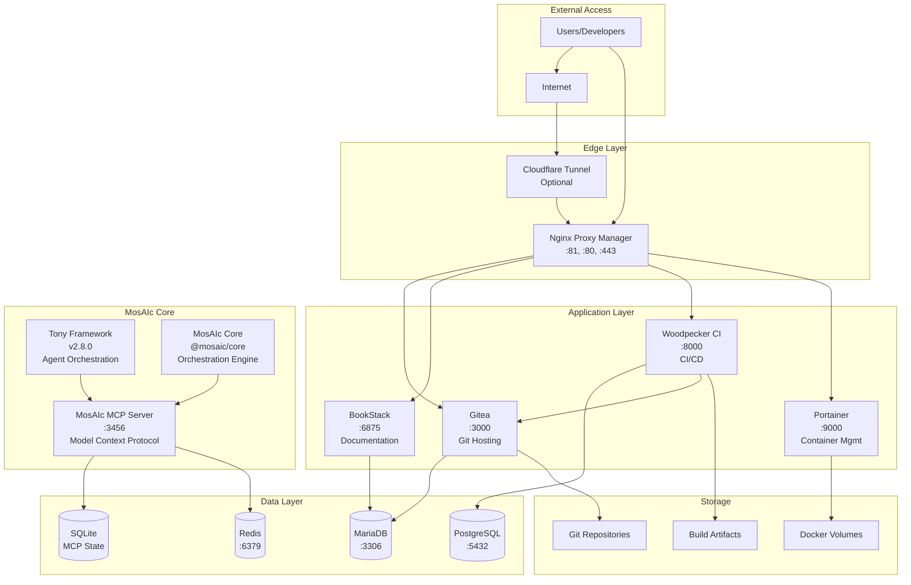

## Component Layers

### 1. Edge Layer
- **Nginx Proxy Manager**: Handles all incoming traffic, SSL termination, and routing
- **Cloudflare Tunnel** (Optional): Secure external access without port forwarding

### 2. Application Layer
- **Gitea**: Self-hosted Git service for source code management
- **BookStack**: Documentation platform for project and API documentation
- **Woodpecker CI**: Continuous integration and deployment pipelines
- **Portainer**: Docker container management interface

### 3. MosAIc Core Layer
- **MosAIc MCP Server**: Model Context Protocol server for AI coordination
- **Tony Framework 2.8.0**: AI agent orchestration with MCP integration
- **@mosaic/core**: Central orchestration engine for multi-project coordination

### 4. Data Layer
- **PostgreSQL**: Primary database for Woodpecker CI and MosAIc Platform
- **MariaDB**: Database for Gitea and BookStack
- **Redis**: Caching and session management
- **SQLite**: Lightweight database for MCP state management

### 5. Storage Layer
- **Docker Volumes**: Persistent storage for all containers
- **Git Repositories**: Source code storage
- **Build Artifacts**: CI/CD build outputs and releases

## Network Architecture

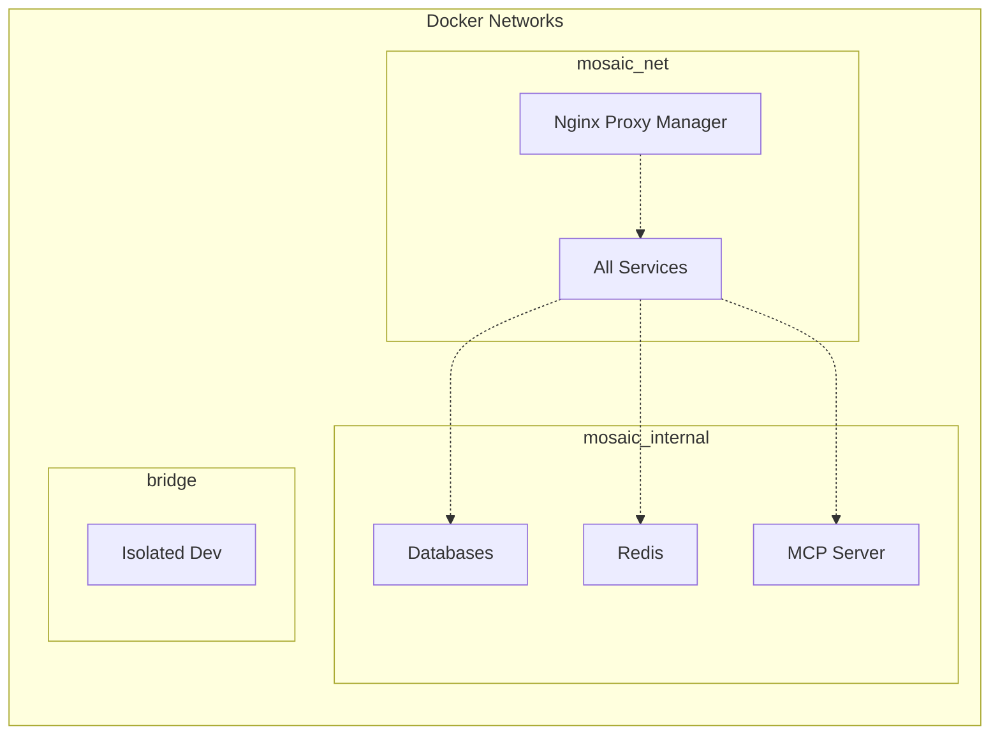

## Port Mapping

| Service | Internal Port | External Port | Purpose |
|---------|--------------|---------------|---------|
| Nginx Proxy Manager | 80, 443, 81 | 80, 443, 81 | HTTP, HTTPS, Admin UI |
| Gitea | 3000 | - | Git hosting (proxied) |
| BookStack | 80 | 6875 | Documentation (proxied) |
| Woodpecker Server | 8000 | - | CI/CD UI (proxied) |
| Woodpecker Agent | 3000 | - | CI/CD agent |
| Portainer | 9000 | 9000 | Container management |
| PostgreSQL | 5432 | - | Database |
| MariaDB | 3306 | - | Database |
| Redis | 6379 | - | Cache |
| MosAIc MCP | 3456 | 3456 | MCP server (dev) |

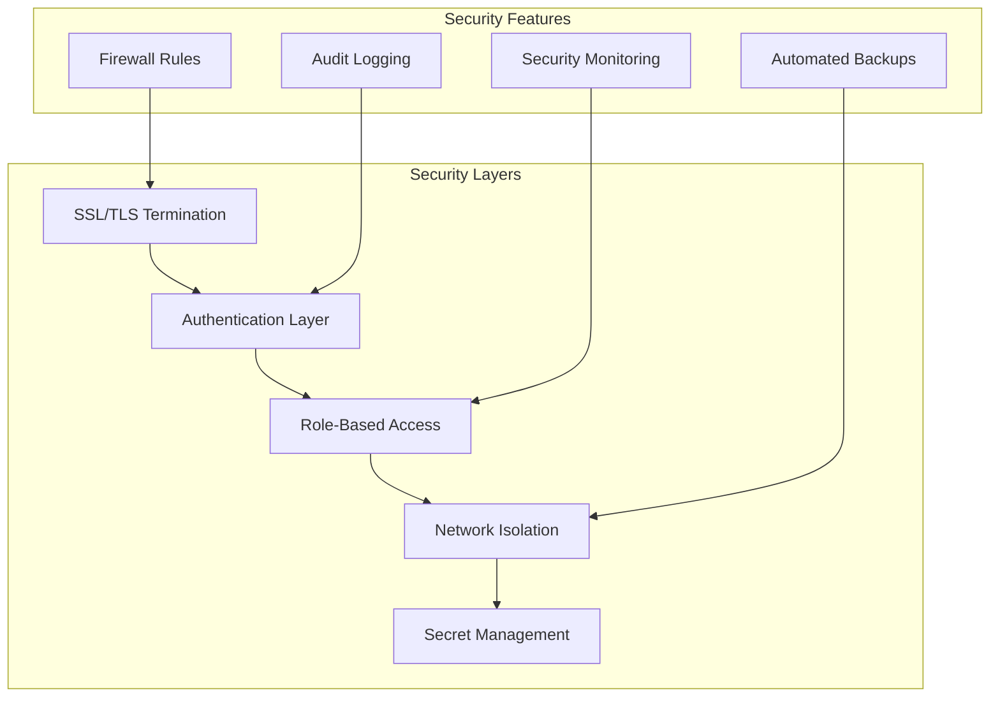

## Data Flow

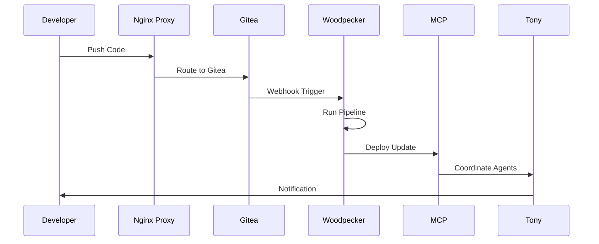

## High Availability Considerations

1. **Load Balancing**: Nginx Proxy Manager can distribute load across multiple instances
2. **Database Replication**: PostgreSQL and MariaDB support master-slave replication
3. **Container Orchestration**: Can be deployed on Docker Swarm or Kubernetes
4. **Backup Strategy**: Automated backups of all persistent data
5. **Monitoring**: Health checks and alerting for all services

## Scalability Design

The MosAIc Stack is designed to scale both vertically and horizontally:

- **Vertical Scaling**: Increase resources for individual services
- **Horizontal Scaling**: Add more instances behind load balancer
- **Microservices**: Each component can scale independently
- **Caching**: Redis reduces database load
- **CDN Integration**: Static assets can be served via CDN

- Review [Service Documentation](../services/) for detailed component information
- Follow the [Deployment Guide](../deployment/complete-deployment-guide.md) to set up MosAIc
- Check [Operations Handbook](../operations/handbook.md) for maintenance procedures

---

*Last Updated: January 2025 | MosAIc Stack Architecture v1.0.0*
