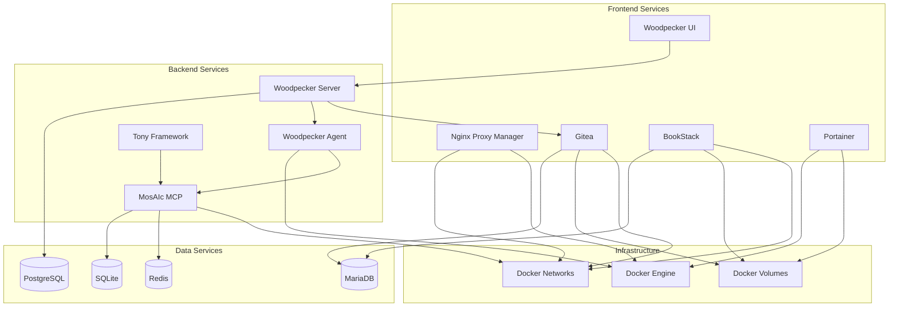
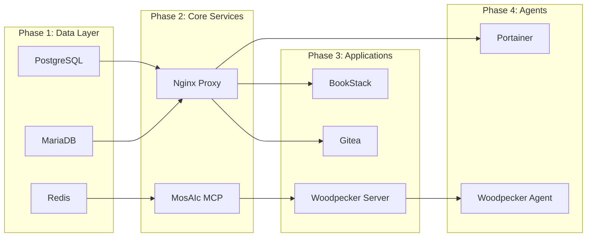

# MosAIc Stack Service Dependencies

## Overview

This document maps out all service dependencies within the MosAIc Stack, helping administrators understand the relationships between components and troubleshoot issues effectively.

## Dependency Matrix



## Service Dependency Details

### Nginx Proxy Manager
**Dependencies:**
- Docker Engine (container runtime)
- Docker Networks (mosaic_net)
- SSL Certificates (Let's Encrypt or custom)

**Dependent Services:**
- All web-accessible services (reverse proxy)

**Critical Requirements:**
- Ports 80, 443, 81 available
- DNS resolution working
- Network connectivity to all proxied services

### Gitea
**Dependencies:**
- MariaDB (database storage)
- Docker Volumes (git repositories)
- Nginx Proxy Manager (web access)

**Dependent Services:**
- Woodpecker CI (webhook integration)
- Developer workstations (git operations)

**Critical Requirements:**
- MariaDB connection string
- Persistent volume for repositories
- SSH keys for git operations

### BookStack
**Dependencies:**
- MariaDB (content storage)
- Docker Volumes (uploads/attachments)
- Nginx Proxy Manager (web access)

**Dependent Services:**
- None (leaf service)

**Critical Requirements:**
- MariaDB database and user
- APP_URL configured correctly
- Mail server for notifications (optional)

### Woodpecker CI
**Server Dependencies:**
- PostgreSQL (job storage)
- Gitea (source repositories)
- Docker Networks (agent communication)

**Agent Dependencies:**
- Woodpecker Server (job assignments)
- Docker Engine (container execution)
- MosAIc MCP (optional, for AI tasks)

**Critical Requirements:**
- WOODPECKER_GITHUB_CLIENT/SECRET or Gitea OAuth
- Agent secret for server-agent communication
- Docker socket access for agent

### MosAIc MCP
**Dependencies:**
- SQLite (state storage)
- Redis (caching/pubsub)
- Docker Networks (service communication)

**Dependent Services:**
- Tony Framework (orchestration)
- Woodpecker Agent (CI/CD integration)
- Development environments

**Critical Requirements:**
- Port 3456 available
- Redis connection
- Proper network access from clients

### Portainer
**Dependencies:**
- Docker Engine (management API)
- Docker Volumes (configuration)

**Dependent Services:**
- None (management interface)

**Critical Requirements:**
- Docker socket mounted
- Admin password set on first run

## Startup Order

The correct startup order ensures all dependencies are satisfied:



### Docker Compose Startup Dependencies
```yaml
services:
  # Phase 1: Databases start first
  postgres:
    # No dependencies
  
  mariadb:
    # No dependencies
  
  redis:
    # No dependencies
  
  # Phase 2: Core infrastructure
  npm:
    depends_on:
      - postgres  # For potential future features
  
  mcp:
    depends_on:
      - redis
  
  # Phase 3: Application services
  gitea:
    depends_on:
      - mariadb
      - npm
  
  bookstack:
    depends_on:
      - mariadb
      - npm
  
  woodpecker-server:
    depends_on:
      - postgres
      - gitea
  
  # Phase 4: Agent services
  woodpecker-agent:
    depends_on:
      - woodpecker-server
      - mcp
  
  portainer:
    depends_on:
      - npm
```

## Health Check Dependencies

### Service Health Checks
```yaml
# PostgreSQL
healthcheck:
  test: ["CMD-SHELL", "pg_isready -U postgres"]
  interval: 10s
  timeout: 5s
  retries: 5

# MariaDB
healthcheck:
  test: ["CMD", "healthcheck.sh", "--connect", "--innodb_initialized"]
  interval: 10s
  timeout: 5s
  retries: 5

# Redis
healthcheck:
  test: ["CMD", "redis-cli", "ping"]
  interval: 10s
  timeout: 5s
  retries: 5

# MosAIc MCP
healthcheck:
  test: ["CMD", "curl", "-f", "http://localhost:3456/health"]
  interval: 30s
  timeout: 10s
  retries: 3
```

## Dependency Failure Scenarios

### Database Failures

#### PostgreSQL Failure
**Affected Services:**
- Woodpecker Server (cannot store/retrieve jobs)
- Woodpecker UI (cannot display job history)

**Symptoms:**
- 500 errors in Woodpecker UI
- Jobs fail to start
- Agent cannot connect to server

**Recovery:**
1. Check PostgreSQL logs
2. Verify disk space
3. Check connection limits
4. Restore from backup if corrupted

#### MariaDB Failure
**Affected Services:**
- Gitea (cannot access repositories)
- BookStack (cannot load pages)

**Symptoms:**
- 500 errors in Gitea/BookStack
- Cannot push/pull git repositories
- Documentation unavailable

**Recovery:**
1. Check MariaDB logs
2. Verify disk space
3. Check max_connections
4. Restore from backup if needed

### Network Dependencies

#### Docker Network Failure
**Affected Services:**
- All services lose inter-container communication

**Symptoms:**
- Services cannot resolve internal DNS names
- Database connection errors
- Proxy returns 502/504 errors

**Recovery:**
```bash
# Restart Docker networks
docker-compose down
docker network prune
docker-compose up -d

# Verify network connectivity
docker network inspect mosaic_net
docker exec npm ping gitea
```

### Service-Specific Dependencies

#### Gitea OAuth Failure
**Affected Services:**
- Woodpecker CI (cannot authenticate)

**Symptoms:**
- Cannot log into Woodpecker
- Webhook deliveries fail
- Repository access denied

**Recovery:**
1. Verify OAuth application in Gitea
2. Check client ID/secret in Woodpecker
3. Regenerate OAuth credentials
4. Update Woodpecker configuration

## Monitoring Dependencies

### Key Metrics to Monitor
```yaml
# Service availability
- service: nginx_proxy_manager
  metric: up
  threshold: 1
  
# Database connections
- service: postgresql
  metric: connections_active
  threshold: < 90% of max_connections
  
# Redis memory
- service: redis
  metric: memory_used_bytes
  threshold: < 1GB
  
# Docker resources
- service: docker
  metric: containers_running
  threshold: < 50
```

### Dependency Chain Alerts
```yaml
alerts:
  - name: DatabaseDependencyFailure
    condition: postgres_up == 0 AND woodpecker_errors > 0
    severity: critical
    message: "PostgreSQL down affecting Woodpecker CI"
    
  - name: ProxyDependencyFailure
    condition: npm_up == 0
    severity: critical
    message: "Nginx Proxy Manager down - all services inaccessible"
    
  - name: MCPDependencyFailure
    condition: mcp_up == 0 AND woodpecker_ai_jobs > 0
    severity: warning
    message: "MCP down - AI features unavailable"
```

## Backup Dependencies

### Backup Order (Ensures Consistency)
1. Stop dependent services
2. Backup databases
3. Backup volumes
4. Backup configurations
5. Restart services

```bash
#!/bin/bash
# Backup script respecting dependencies

# Stop application services
docker-compose stop gitea bookstack woodpecker-server

# Backup databases
docker exec postgres pg_dumpall -U postgres > postgres_backup.sql
docker exec mariadb mysqldump --all-databases > mariadb_backup.sql

# Backup volumes
docker run --rm -v mosaic_gitea:/data -v $(pwd):/backup alpine tar czf /backup/gitea_data.tar.gz /data

# Restart services
docker-compose start gitea bookstack woodpecker-server
```

## Upgrade Dependencies

### Upgrade Order (Prevents Breaking Changes)
1. Backup everything
2. Upgrade databases first
3. Upgrade infrastructure services
4. Upgrade application services
5. Upgrade agents last

### Version Compatibility Matrix
| Component | Min Version | Max Version | Notes |
|-----------|-------------|-------------|--------|
| PostgreSQL | 15.0 | 17.x | Woodpecker requires 15+ |
| MariaDB | 10.11 | 11.x | BookStack tested with 10.11 |
| Redis | 7.0 | 7.2.x | MCP requires Redis 7+ |
| Docker | 24.0 | latest | Compose v2 required |
| Gitea | 1.21.0 | 1.22.x | OAuth changes in 1.21 |
| Woodpecker | 2.0.0 | 3.8.x | Breaking changes in 3.0 |

## Next Steps

- Review [Disaster Recovery](../operations/disaster-recovery.md) for failure scenarios
- Check [Monitoring Setup](../operations/monitoring.md) for dependency monitoring
- See [Troubleshooting Guide](../troubleshooting/common-issues.md) for specific issues

---

*Last Updated: January 2025 | MosAIc Service Dependencies v1.0.0*