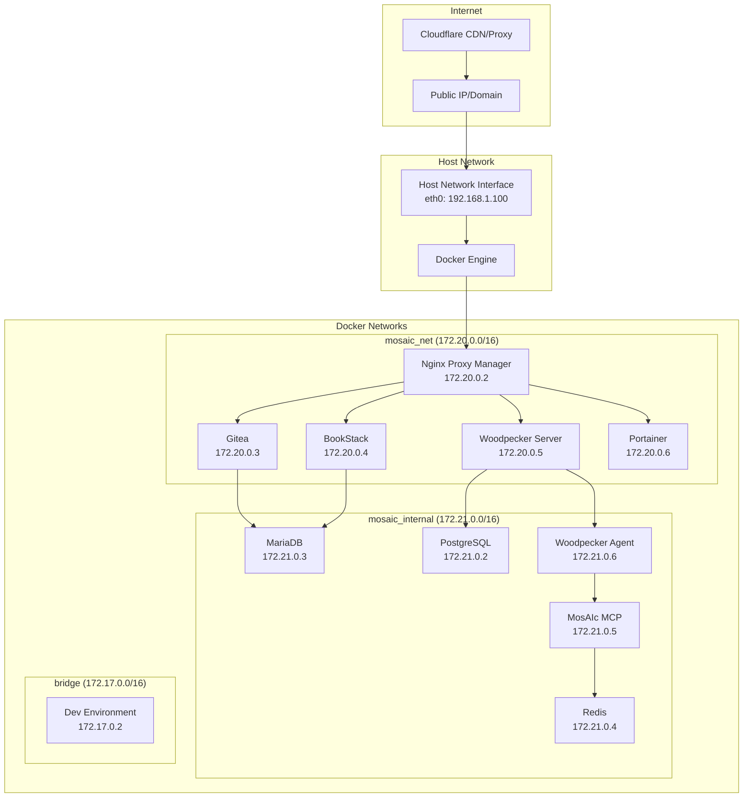
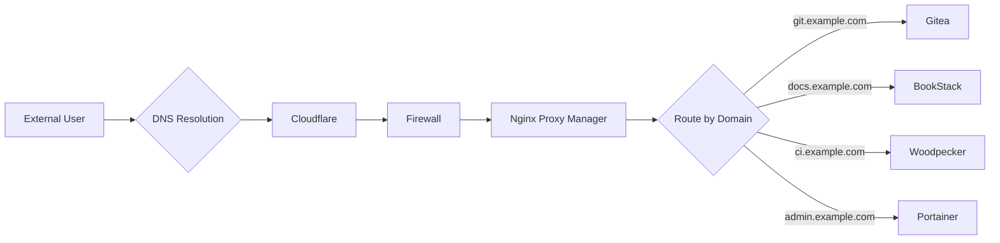
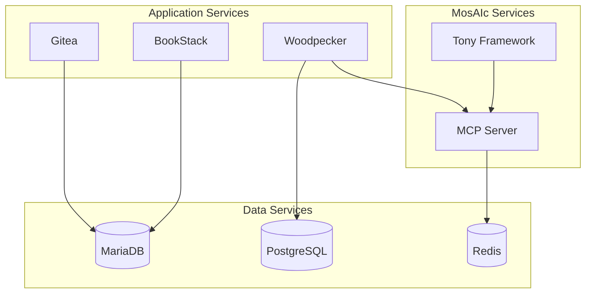

# MosAIc Stack Network Topology

## Overview

This document details the network architecture and topology of the MosAIc Stack, including network segmentation, routing, and security configurations.

## Network Diagram



## Network Segments

### 1. mosaic_net (Public-Facing Services)
**Subnet**: 172.20.0.0/16  
**Purpose**: Services that need external access via reverse proxy

| Service | IP Address | Hostname | Access |
|---------|------------|----------|--------|
| Nginx Proxy Manager | 172.20.0.2 | npm.mosaic.local | Direct & Proxied |
| Gitea | 172.20.0.3 | git.mosaic.local | Proxied Only |
| BookStack | 172.20.0.4 | docs.mosaic.local | Proxied Only |
| Woodpecker Server | 172.20.0.5 | ci.mosaic.local | Proxied Only |
| Portainer | 172.20.0.6 | portainer.mosaic.local | Direct |

### 2. mosaic_internal (Backend Services)
**Subnet**: 172.21.0.0/16  
**Purpose**: Internal services without direct external access

| Service | IP Address | Hostname | Access |
|---------|------------|----------|--------|
| PostgreSQL | 172.21.0.2 | postgres.internal | Internal Only |
| MariaDB | 172.21.0.3 | mariadb.internal | Internal Only |
| Redis | 172.21.0.4 | redis.internal | Internal Only |
| MosAIc MCP | 172.21.0.5 | mcp.internal | Internal Only |
| Woodpecker Agent | 172.21.0.6 | agent.internal | Internal Only |

### 3. bridge (Default Docker Network)
**Subnet**: 172.17.0.0/16  
**Purpose**: Isolated development environments

## Routing Rules

### External Traffic Flow


### Internal Service Communication


## Firewall Configuration

### Host Firewall Rules (iptables/ufw)
```bash
# Allow SSH
ufw allow 22/tcp

# Allow HTTP/HTTPS
ufw allow 80/tcp
ufw allow 443/tcp

# Allow Nginx Proxy Manager Admin
ufw allow 81/tcp

# Allow Portainer
ufw allow 9000/tcp

# Development MCP (restricted to local network)
ufw allow from 192.168.1.0/24 to any port 3456

# Docker management
ufw allow 2375/tcp
ufw allow 2376/tcp

# Default policies
ufw default deny incoming
ufw default allow outgoing
```

### Docker Network Policies
```yaml
# Network isolation rules
mosaic_net:
  - Can communicate with mosaic_internal
  - Cannot communicate with bridge network
  - Exposed to host for reverse proxy

mosaic_internal:
  - Can communicate within network
  - Can communicate with mosaic_net
  - No external exposure

bridge:
  - Isolated from other networks
  - Used for development only
```

## DNS Configuration

### Internal DNS Resolution
```yaml
# Docker Compose DNS aliases
services:
  gitea:
    networks:
      mosaic_net:
        aliases:
          - git.mosaic.local
          - gitea.mosaic.local
  
  postgres:
    networks:
      mosaic_internal:
        aliases:
          - postgres.internal
          - db.internal
```

### External DNS Configuration
```dns
; Example DNS records for production deployment
git.example.com.     A     1.2.3.4
docs.example.com.    A     1.2.3.4
ci.example.com.      A     1.2.3.4
admin.example.com.   A     1.2.3.4

; Or using CNAME for Cloudflare
*.example.com.       CNAME example.cdn.cloudflare.net.
```

## Load Balancing

### Nginx Proxy Manager Configuration
```nginx
# Load balancing for high-traffic services
upstream gitea_backend {
    least_conn;
    server gitea1:3000 weight=3;
    server gitea2:3000 weight=2;
    server gitea3:3000 backup;
}

# Health checks
location /health {
    access_log off;
    return 200 "healthy\n";
}
```

## VPN and Remote Access

### Secure Remote Access Options
1. **Cloudflare Tunnel**: Zero-trust access without exposing ports
2. **WireGuard VPN**: Direct secure access to internal network
3. **Tailscale**: Mesh VPN for distributed teams
4. **SSH Tunneling**: For development access

### Cloudflare Tunnel Configuration
```yaml
tunnel: mosaic-prod
credentials-file: /etc/cloudflared/creds.json

ingress:
  - hostname: git.example.com
    service: http://npm:80
  - hostname: docs.example.com
    service: http://npm:80
  - hostname: ci.example.com
    service: http://npm:80
  - service: http_status:404
```

## Network Security Best Practices

### 1. Network Segmentation
- Separate networks for public and internal services
- Use Docker networks for isolation
- Implement proper firewall rules

### 2. SSL/TLS Configuration
- All external traffic uses HTTPS
- Internal services use TLS where supported
- Regular certificate rotation

### 3. Access Control
- IP whitelisting for sensitive services
- Rate limiting on public endpoints
- DDoS protection via Cloudflare

### 4. Monitoring
- Network traffic monitoring
- Intrusion detection
- Log aggregation and analysis

## Troubleshooting Network Issues

### Common Network Diagnostics
```bash
# Check Docker networks
docker network ls
docker network inspect mosaic_net

# Test connectivity between containers
docker exec gitea ping postgres.internal

# Check listening ports
docker exec npm netstat -tlnp

# DNS resolution test
docker exec gitea nslookup postgres.internal

# Trace network path
docker exec npm traceroute gitea
```

### Network Performance Tuning
```bash
# Increase network buffer sizes
sysctl -w net.core.rmem_max=134217728
sysctl -w net.core.wmem_max=134217728

# TCP optimization
sysctl -w net.ipv4.tcp_congestion_control=bbr
sysctl -w net.core.default_qdisc=fq

# Docker daemon configuration
{
  "mtu": 1450,
  "fixed-cidr": "172.20.0.0/16",
  "default-address-pools": [
    {"base":"172.20.0.0/16","size":24}
  ]
}
```

## Next Steps

- Review [Security Architecture](./security-architecture.md) for detailed security configurations
- Check [Service Dependencies](./service-dependencies.md) for inter-service communication
- Follow [Deployment Guide](../deployment/complete-deployment-guide.md) for implementation

---

*Last Updated: January 2025 | MosAIc Network Topology v1.0.0*