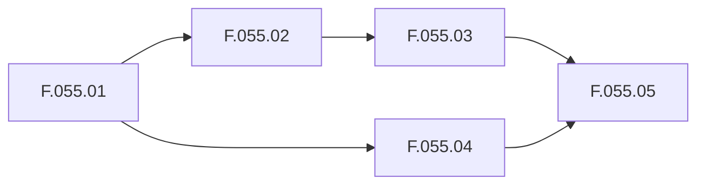

# MosAIc Stack Component Milestones

## Overview

This document outlines the version progression and milestone planning for each component in the MosAIc Stack, from current versions to the 1.0 GA releases.

## Component Version Matrix

| Component | Current | Next | Target GA | Timeline |
|-----------|---------|------|-----------|----------|
| @tony/core | 2.7.0 | 2.8.0 | 3.0.0 | Q1 2025 - Q4 2025 |
| @mosaic/mcp | 0.0.1-beta.1 | 0.1.0 | 1.0.0 | Q1 2025 - Q4 2025 |
| @mosaic/core | - | 0.1.0 | 1.0.0 | Q1 2025 - Q4 2025 |
| @mosaic/dev | - | 0.1.0 | 1.0.0 | Q1 2025 - Q4 2025 |

## Tony Framework (@tony/core)

### 2.8.0 - "MCP Integration" (Q1 2025)
**Theme**: Mandatory MCP integration, removing standalone mode

**Features**:
- ✅ MCP requirement enforced
- ✅ Enhanced agent coordination (Epic E.054)
- ✅ Real-time monitoring and analytics
- ✅ MosAIc Stack integration
- ✅ Migration tools from 2.7.0

**Breaking Changes**:
- Standalone mode removed
- MCP server required for all operations
- Configuration schema updated

### 2.9.0 - "Intelligence Layer" (Q2 2025)
**Theme**: AI-powered optimizations and predictions

**Planned Features**:
- Machine learning integration
- Predictive task assignment
- Intelligent resource allocation
- Advanced pattern recognition
- Automated optimization

### 3.0.0 - "Enterprise Platform" (Q4 2025)
**Theme**: Full enterprise capabilities

**Planned Features**:
- Complete MosAIc integration
- Advanced security features
- Compliance frameworks
- Multi-region support
- Enterprise SLAs

## MosAIc MCP (@mosaic/mcp)

### 0.1.0 - "Production Foundation" (Q1 2025)
**Theme**: First production-ready release

**Features**:
- ✅ Core API stability
- ✅ Tony Framework 2.8.0 compatibility
- ✅ Basic agent coordination
- ✅ State persistence
- ✅ Security hardening
- ✅ Performance benchmarks
- ✅ Migration from beta

**Quality Gates**:
- 95% test coverage
- Zero critical bugs
- Performance benchmarks met
- Security audit passed

### 0.2.0 - "Enhanced Coordination" (Q1 2025)
**Theme**: Advanced coordination capabilities

**Planned Features**:
- Enhanced coordination algorithms
- Advanced agent routing
- Performance optimizations (100+ agents)
- Extended monitoring capabilities
- Real-time analytics dashboard
- Custom coordination rules

### 0.3.0 - "Scale & Performance" (Q2 2025)
**Theme**: Enterprise-scale optimizations

**Planned Features**:
- Multi-region support
- Advanced caching strategies
- Batch operation support
- Enhanced security features
- Load balancing improvements
- Horizontal scaling

### 0.4.0 - "Intelligence Integration" (Q3 2025)
**Theme**: AI-powered coordination

**Planned Features**:
- Machine learning integration
- Predictive agent assignment
- Anomaly detection
- Auto-optimization
- Custom protocol extensions
- Advanced analytics

### 0.5.0 - "Enterprise Features" (Q3 2025)
**Theme**: Enterprise-grade capabilities

**Planned Features**:
- Advanced debugging tools
- Compliance features (SOC2, HIPAA)
- Audit logging
- High availability modes
- Disaster recovery
- Enterprise dashboard

### 1.0.0 - "General Availability" (Q4 2025)
**Theme**: Production-ready for all use cases

**Features**:
- Complete feature set
- Long-term support (LTS)
- Enterprise SLAs
- Comprehensive documentation
- Certified integrations
- Professional support

## MosAIc Core (@mosaic/core)

### 0.1.0 - "Foundation" (Q1 2025)
**Theme**: Basic multi-project orchestration

**Features**:
- Tony Framework integration
- Basic project orchestration
- Simple web dashboard
- CLI management interface
- User authentication
- Project creation/management

### 0.2.0 - "Enhanced UI" (Q1 2025)
**Theme**: Improved user experience

**Planned Features**:
- Advanced web dashboard
- Real-time updates
- Drag-and-drop planning
- Visual task decomposition
- Team collaboration features
- Mobile responsive design

### 0.3.0 - "Advanced Orchestration" (Q2 2025)
**Theme**: Sophisticated coordination

**Planned Features**:
- Cross-project dependencies
- Resource optimization
- Advanced scheduling
- Workflow templates
- Integration marketplace
- API gateway

### 0.4.0 - "Enterprise Dashboard" (Q3 2025)
**Theme**: Enterprise visibility

**Planned Features**:
- Executive dashboards
- Advanced analytics
- Custom reporting
- Cost tracking
- Performance insights
- Predictive analytics

### 0.5.0 - "Platform Maturity" (Q3 2025)
**Theme**: Full platform capabilities

**Planned Features**:
- Plugin ecosystem
- Third-party integrations
- Advanced security
- Compliance tools
- Automation workflows
- DevOps integration

### 1.0.0 - "Enterprise Platform" (Q4 2025)
**Theme**: Complete enterprise solution

**Features**:
- Full feature parity with enterprise needs
- Scalable to 1000+ projects
- Complete API coverage
- Enterprise support
- SLA guarantees
- Global deployment

## MosAIc Dev (@mosaic/dev)

### 0.1.0 - "Unified Tooling" (Q1 2025)
**Theme**: Consolidated development tools

**Features**:
- Merged tony-dev capabilities
- Unified test orchestration
- Build pipeline tools
- Migration utilities
- Documentation generators
- Development CLI

### 0.2.0 - "Enhanced Testing" (Q1 2025)
**Theme**: Advanced testing capabilities

**Planned Features**:
- Integration test framework
- Performance testing tools
- Chaos testing utilities
- Test data generators
- Coverage aggregation
- CI/CD templates

### 0.3.0 - "Developer Experience" (Q2 2025)
**Theme**: Improved DX

**Planned Features**:
- Interactive debugging
- Performance profilers
- Development dashboard
- Code generators
- Template library
- Best practices linter

### 0.4.0 - "Automation Tools" (Q3 2025)
**Theme**: Development automation

**Planned Features**:
- Automated refactoring
- Dependency updates
- Security scanning
- Performance optimization
- Documentation generation
- Release automation

### 0.5.0 - "Platform Tools" (Q3 2025)
**Theme**: Platform development

**Planned Features**:
- Plugin development kit
- Integration testing
- Deployment tools
- Monitoring setup
- Configuration management
- Infrastructure as code

### 1.0.0 - "Complete SDK" (Q4 2025)
**Theme**: Comprehensive development platform

**Features**:
- Full development lifecycle support
- Enterprise tooling
- Professional debugging
- Advanced profiling
- Complete automation
- Developer portal

## Cross-Component Dependencies

### Integration Points
- Tony 2.8.0 requires MosAIc MCP 0.1.0+
- MosAIc Core 0.1.0 requires MosAIc MCP 0.1.0+
- MosAIc Dev 0.1.0 supports all components
- All 1.0 releases will be synchronized

### Compatibility Matrix
```
Tony 2.8.0 ←→ MosAIc MCP 0.1.0-0.x.x
Tony 2.9.0 ←→ MosAIc MCP 0.3.0-0.x.x
Tony 3.0.0 ←→ MosAIc MCP 1.0.0+

MosAIc Core 0.1.0 ←→ MosAIc MCP 0.1.0-0.2.x
MosAIc Core 0.3.0 ←→ MosAIc MCP 0.3.0+
MosAIc Core 1.0.0 ←→ MosAIc MCP 1.0.0+
```

## Release Strategy

### Coordinated Releases
- Major milestones released together
- Compatibility tested before release
- Migration tools provided
- Documentation synchronized
- Announcement coordination

### Quality Gates
Each milestone must meet:
- Feature completeness
- Performance benchmarks
- Security requirements
- Documentation standards
- Test coverage targets
- User acceptance criteria

## Success Metrics

### Adoption Targets
- 0.1.0: 100+ early adopters
- 0.3.0: 1,000+ active users
- 0.5.0: 10,000+ deployments
- 1.0.0: Enterprise adoption

### Performance Targets
- Agent coordination: <2s latency
- Dashboard updates: <500ms
- API response: <100ms
- 99.9% uptime SLA

### Quality Targets
- 95% test coverage
- Zero critical bugs
- <0.1% error rate
- 90+ NPS score

---

---

## Additional Content (Migrated)

# MosAIc Stack Version Roadmap

## Executive Summary

The MosAIc Stack follows a coordinated release strategy where Tony Framework maintains its 2.x versioning while MosAIc components progress from 0.1.0 to 1.0 GA releases. This roadmap outlines the journey from current state to enterprise-ready platform.

## Timeline Overview

```
2025 Q1: Foundation (0.1.0 releases)
2025 Q2: Enhancement (0.3.0 releases)
2025 Q3: Maturity (0.5.0 releases)  
2025 Q4: GA Release (1.0.0)
```

## Q1 2025: Foundation Phase

### January 2025
**Focus**: MCP Transformation & Initial Integration

**Releases**:
- Tony Framework 2.8.0 (MCP Required)
- @mosaic/mcp 0.1.0 (Production Foundation)
- @mosaic/core 0.1.0 (Basic Orchestration)
- @mosaic/dev 0.1.0 (Unified Tooling)

**Key Deliverables**:
- Repository restructuring complete
- MCP mandatory implementation
- Basic multi-project orchestration
- Migration tools available

### February 2025
**Focus**: Stabilization & Enhancement

**Releases**:
- @mosaic/mcp 0.2.0 (Enhanced Coordination)
- @mosaic/core 0.2.0 (Enhanced UI)
- @mosaic/dev 0.2.0 (Enhanced Testing)

**Key Deliverables**:
- Advanced coordination algorithms
- Improved web dashboard
- Comprehensive testing framework
- Performance optimizations

### March 2025
**Focus**: Early Adoption Support

**Updates**:
- Bug fixes and patches
- Documentation improvements
- Community feedback integration
- Performance tuning

## Q2 2025: Enhancement Phase

### April 2025
**Focus**: Scale & Intelligence

**Releases**:
- Tony Framework 2.9.0 (Intelligence Layer)
- @mosaic/mcp 0.3.0 (Scale & Performance)
- @mosaic/core 0.3.0 (Advanced Orchestration)
- @mosaic/dev 0.3.0 (Developer Experience)

**Key Deliverables**:
- ML-powered optimizations
- Multi-region support
- Cross-project dependencies
- Enhanced developer tools

### May-June 2025
**Focus**: Enterprise Features

**Incremental Updates**:
- Security enhancements
- Compliance features
- Performance improvements
- Integration expansion

## Q3 2025: Maturity Phase

### July-August 2025
**Focus**: Platform Completion

**Releases**:
- @mosaic/mcp 0.4.0 (Intelligence Integration)
- @mosaic/core 0.4.0 (Enterprise Dashboard)
- @mosaic/dev 0.4.0 (Automation Tools)

**Key Deliverables**:
- AI-powered coordination
- Executive dashboards
- Automated workflows
- Advanced analytics

### September 2025
**Focus**: Pre-GA Preparation

**Releases**:
- @mosaic/mcp 0.5.0 (Enterprise Features)
- @mosaic/core 0.5.0 (Platform Maturity)
- @mosaic/dev 0.5.0 (Platform Tools)

**Key Deliverables**:
- Feature freeze
- Comprehensive testing
- Documentation completion
- Beta program launch

## Q4 2025: GA Release

### October 2025
**Focus**: Release Candidates

**RC Releases**:
- All components at 1.0.0-rc.1
- Enterprise beta testing
- Final bug fixes
- Performance validation

### November 2025
**Focus**: General Availability

**GA Releases**:
- Tony Framework 3.0.0
- @mosaic/mcp 1.0.0
- @mosaic/core 1.0.0
- @mosaic/dev 1.0.0

**Launch Activities**:
- Official announcement
- Enterprise support launch
- Partner program
- Training materials

### December 2025
**Focus**: Post-GA Support

**Activities**:
- 1.0.1 patch releases
- Enterprise onboarding
- Community building
- 2026 roadmap planning

## Version Compatibility Timeline

### Q1 2025
```
Tony 2.8.0 + MosAIc MCP 0.1.0 = Base Integration
Tony 2.8.0 + MosAIc MCP 0.2.0 = Enhanced Coordination
```

### Q2 2025
```
Tony 2.9.0 + MosAIc MCP 0.3.0 = Intelligence Features
Tony 2.9.x + MosAIc MCP 0.3.x = Stable Enhancement
```

### Q3 2025
```
Tony 2.9.x + MosAIc MCP 0.4.0 = Advanced Features
Tony 2.9.x + MosAIc MCP 0.5.0 = Enterprise Ready
```

### Q4 2025
```
Tony 3.0.0 + MosAIc Stack 1.0.0 = GA Platform
```

## Feature Evolution

### Agent Coordination
- 0.1.0: Basic coordination
- 0.2.0: Enhanced algorithms
- 0.3.0: Multi-region support
- 0.4.0: ML-powered assignment
- 0.5.0: Predictive optimization
- 1.0.0: Full autonomy

### User Interface
- 0.1.0: Basic dashboard
- 0.2.0: Real-time updates
- 0.3.0: Drag-drop planning
- 0.4.0: Executive views
- 0.5.0: Mobile support
- 1.0.0: Complete platform

### Performance
- 0.1.0: 10 agents
- 0.2.0: 50 agents
- 0.3.0: 100+ agents
- 0.4.0: 500+ agents
- 0.5.0: 1000+ agents
- 1.0.0: Unlimited scale

### Security
- 0.1.0: Basic RBAC
- 0.2.0: Encryption
- 0.3.0: Advanced auth
- 0.4.0: Compliance tools
- 0.5.0: Audit complete
- 1.0.0: Enterprise grade

## Migration Windows

### Tony 2.7.0 → 2.8.0
**Window**: January 2025
- Add MCP requirement
- Update configuration
- Test integration
- Deploy changes

### Beta → 0.1.0
**Window**: January 2025
- Package namespace change
- Repository updates
- Configuration migration
- Validation testing

### Pre-GA → 1.0
**Window**: October 2025
- Final migrations
- Performance validation
- Security audit
- Production deployment

## Risk Management

### Technical Risks
- **Integration complexity**: Mitigated by phased approach
- **Performance impact**: Continuous benchmarking
- **Breaking changes**: Clear migration paths

### Adoption Risks
- **Learning curve**: Comprehensive documentation
- **Migration effort**: Automated tools
- **Cost concerns**: Clear ROI metrics

### Mitigation Strategies
- Early adopter program
- Community support
- Professional services
- Enterprise partnerships

## Success Criteria

- 100+ early adopters
- <2% error rate
- 95% test coverage
- Positive feedback

- 1,000+ active users
- <1% error rate
- 99% uptime
- Growing ecosystem

- 10,000+ deployments
- <0.1% error rate
- 99.9% uptime
- Enterprise pilots

- Enterprise adoption
- GA quality metrics
- Market leadership
- Sustainable growth

## Communication Plan

### Monthly Updates
- Release notes
- Feature highlights
- Migration guides
- Community calls

### Quarterly Reviews
- Roadmap updates
- Metric reviews
- Strategy alignment
- Partner updates

### Major Milestones
- Press releases
- Blog posts
- Video demos
- Conference talks

## Conclusion

The MosAIc Stack roadmap represents a carefully planned evolution from experimental framework to enterprise platform. Each milestone builds on the previous, ensuring stability while adding capabilities. The journey to 1.0 is designed to bring early adopters along while preparing for enterprise scale.

---

---

This document outlines the version progression and milestone planning for each component in the MosAIc Stack, from current versions to the 1.0 GA releases.

| Component | Current | Next | Target GA | Timeline |
|-----------|---------|------|-----------|----------|
| @tony/core | 2.7.0 | 2.8.0 | 3.0.0 | Q1 2025 - Q4 2025 |
| @mosaic/mcp | 0.0.1-beta.1 | 0.1.0 | 1.0.0 | Q1 2025 - Q4 2025 |
| @mosaic/core | - | 0.1.0 | 1.0.0 | Q1 2025 - Q4 2025 |
| @mosaic/dev | - | 0.1.0 | 1.0.0 | Q1 2025 - Q4 2025 |

**Theme**: Mandatory MCP integration, removing standalone mode

**Features**:
- ✅ MCP requirement enforced
- ✅ Enhanced agent coordination (Epic E.054)
- ✅ Real-time monitoring and analytics
- ✅ MosAIc Stack integration
- ✅ Migration tools from 2.7.0

**Breaking Changes**:
- Standalone mode removed
- MCP server required for all operations
- Configuration schema updated

**Theme**: AI-powered optimizations and predictions

**Planned Features**:
- Machine learning integration
- Predictive task assignment
- Intelligent resource allocation
- Advanced pattern recognition
- Automated optimization

**Theme**: Full enterprise capabilities

**Planned Features**:
- Complete MosAIc integration
- Advanced security features
- Compliance frameworks
- Multi-region support
- Enterprise SLAs

**Theme**: First production-ready release

**Features**:
- ✅ Core API stability
- ✅ Tony Framework 2.8.0 compatibility
- ✅ Basic agent coordination
- ✅ State persistence
- ✅ Security hardening
- ✅ Performance benchmarks
- ✅ Migration from beta

**Quality Gates**:
- 95% test coverage
- Zero critical bugs
- Performance benchmarks met
- Security audit passed

**Theme**: Advanced coordination capabilities

**Planned Features**:
- Enhanced coordination algorithms
- Advanced agent routing
- Performance optimizations (100+ agents)
- Extended monitoring capabilities
- Real-time analytics dashboard
- Custom coordination rules

**Theme**: Enterprise-scale optimizations

**Planned Features**:
- Multi-region support
- Advanced caching strategies
- Batch operation support
- Enhanced security features
- Load balancing improvements
- Horizontal scaling

**Theme**: AI-powered coordination

**Planned Features**:
- Machine learning integration
- Predictive agent assignment
- Anomaly detection
- Auto-optimization
- Custom protocol extensions
- Advanced analytics

**Theme**: Enterprise-grade capabilities

**Planned Features**:
- Advanced debugging tools
- Compliance features (SOC2, HIPAA)
- Audit logging
- High availability modes
- Disaster recovery
- Enterprise dashboard

**Theme**: Production-ready for all use cases

**Features**:
- Complete feature set
- Long-term support (LTS)
- Enterprise SLAs
- Comprehensive documentation
- Certified integrations
- Professional support

**Theme**: Basic multi-project orchestration

**Features**:
- Tony Framework integration
- Basic project orchestration
- Simple web dashboard
- CLI management interface
- User authentication
- Project creation/management

**Theme**: Improved user experience

**Planned Features**:
- Advanced web dashboard
- Real-time updates
- Drag-and-drop planning
- Visual task decomposition
- Team collaboration features
- Mobile responsive design

**Theme**: Sophisticated coordination

**Planned Features**:
- Cross-project dependencies
- Resource optimization
- Advanced scheduling
- Workflow templates
- Integration marketplace
- API gateway

**Theme**: Enterprise visibility

**Planned Features**:
- Executive dashboards
- Advanced analytics
- Custom reporting
- Cost tracking
- Performance insights
- Predictive analytics

**Theme**: Full platform capabilities

**Planned Features**:
- Plugin ecosystem
- Third-party integrations
- Advanced security
- Compliance tools
- Automation workflows
- DevOps integration

**Theme**: Complete enterprise solution

**Features**:
- Full feature parity with enterprise needs
- Scalable to 1000+ projects
- Complete API coverage
- Enterprise support
- SLA guarantees
- Global deployment

**Theme**: Consolidated development tools

**Features**:
- Merged tony-dev capabilities
- Unified test orchestration
- Build pipeline tools
- Migration utilities
- Documentation generators
- Development CLI

**Theme**: Advanced testing capabilities

**Planned Features**:
- Integration test framework
- Performance testing tools
- Chaos testing utilities
- Test data generators
- Coverage aggregation
- CI/CD templates

**Theme**: Improved DX

**Planned Features**:
- Interactive debugging
- Performance profilers
- Development dashboard
- Code generators
- Template library
- Best practices linter

**Theme**: Development automation

**Planned Features**:
- Automated refactoring
- Dependency updates
- Security scanning
- Performance optimization
- Documentation generation
- Release automation

**Theme**: Platform development

**Planned Features**:
- Plugin development kit
- Integration testing
- Deployment tools
- Monitoring setup
- Configuration management
- Infrastructure as code

**Theme**: Comprehensive development platform

**Features**:
- Full development lifecycle support
- Enterprise tooling
- Professional debugging
- Advanced profiling
- Complete automation
- Developer portal

- Tony 2.8.0 requires MosAIc MCP 0.1.0+
- MosAIc Core 0.1.0 requires MosAIc MCP 0.1.0+
- MosAIc Dev 0.1.0 supports all components
- All 1.0 releases will be synchronized

```
Tony 2.8.0 ←→ MosAIc MCP 0.1.0-0.x.x
Tony 2.9.0 ←→ MosAIc MCP 0.3.0-0.x.x
Tony 3.0.0 ←→ MosAIc MCP 1.0.0+

MosAIc Core 0.1.0 ←→ MosAIc MCP 0.1.0-0.2.x
MosAIc Core 0.3.0 ←→ MosAIc MCP 0.3.0+
MosAIc Core 1.0.0 ←→ MosAIc MCP 1.0.0+
```

- Major milestones released together
- Compatibility tested before release
- Migration tools provided
- Documentation synchronized
- Announcement coordination

Each milestone must meet:
- Feature completeness
- Performance benchmarks
- Security requirements
- Documentation standards
- Test coverage targets
- User acceptance criteria

- 0.1.0: 100+ early adopters
- 0.3.0: 1,000+ active users
- 0.5.0: 10,000+ deployments
- 1.0.0: Enterprise adoption

- Agent coordination: <2s latency
- Dashboard updates: <500ms
- API response: <100ms
- 99.9% uptime SLA

- 95% test coverage
- Zero critical bugs
- <0.1% error rate
- 90+ NPS score

---

---

# Project Planning Overview

The MosAIc Stack uses a structured approach to project planning based on Tony Framework's UPP (Ultrathink Planning Protocol) methodology.

## Planning Hierarchy

```
PROJECT (P)
├── EPIC (E.XXX) - Major feature areas
│   ├── FEATURE (F.XXX.XX) - Specific capabilities
│   │   ├── STORY (S.XXX.XX.XX) - User-facing changes
│   │   │   ├── TASK (T.XXX.XX.XX.XX) - Development work
│   │   │   │   ├── SUBTASK (ST.XXX.XX.XX.XX.XX) - Detailed steps
│   │   │   │   │   └── ATOMIC (A.XXX.XX.XX.XX.XX.XX) - ≤30 min units
```

## Planning Phases

### Phase 1: Discovery
- Understand project requirements
- Identify stakeholders
- Define success criteria
- Assess constraints and risks

### Phase 2: Architecture
- Design system architecture
- Define component boundaries
- Plan integration points
- Create technical specifications

### Phase 3: Decomposition
- Break down into epics
- Define features and stories
- Create task hierarchies
- Estimate effort and duration

### Phase 4: Execution
- Assign tasks to teams
- Track progress
- Manage dependencies
- Deliver incrementally

## Epic Planning

### Epic Structure
```yaml
epic:
  id: E.055
  title: "MosAIc Stack Infrastructure"
  description: "Complete platform deployment"
  status: active
  priority: high
  start_date: 2025-01-01
  target_date: 2025-03-31
  
  features:
    - id: F.055.01
      title: "Core Services Setup"
      stories: 8
      points: 40
      
    - id: F.055.02
      title: "Monitoring Stack"
      stories: 5
      points: 21
```

### Epic States
- **Planning**: Being defined
- **Ready**: Fully planned
- **Active**: In progress
- **Blocked**: Has impediments
- **Complete**: All features done
- **Cancelled**: Will not complete

## Feature Planning

### Feature Template
```markdown
# Feature F.XXX.XX: [Title]

Brief description of the feature and its value.

## Acceptance Criteria
- [ ] Criterion 1
- [ ] Criterion 2
- [ ] Criterion 3

## Technical Requirements
- Requirement 1
- Requirement 2

## Dependencies
- Depends on: F.XXX.XX
- Blocks: F.XXX.XX

## Stories
1. S.XXX.XX.01: Setup story
2. S.XXX.XX.02: Implementation story
3. S.XXX.XX.03: Testing story
```

## Story Writing

### User Story Format
```
As a [type of user]
I want [goal/desire]
So that [benefit/value]
```

### Story Checklist
- [ ] Clear user value
- [ ] Testable criteria
- [ ] Independent
- [ ] Negotiable
- [ ] Estimable
- [ ] Small (fits in sprint)

### Example Story
```markdown
# Story S.055.01.01: Deploy PostgreSQL

As a platform administrator
I want to deploy PostgreSQL with proper configuration
So that applications can store persistent data

- [ ] PostgreSQL 15+ deployed
- [ ] Persistent volume configured
- [ ] Backup strategy implemented
- [ ] Monitoring enabled
- [ ] Documentation complete

## Tasks
- T.055.01.01.01: Create Docker configuration
- T.055.01.01.02: Configure persistent storage
- T.055.01.01.03: Setup backup scripts
- T.055.01.01.04: Add monitoring
- T.055.01.01.05: Write documentation
```

## Task Management

### Task Properties
```yaml
task:
  id: T.055.01.01.01
  title: "Create Docker configuration"
  type: development
  assignee: "@agent-name"
  estimate: 2h
  actual: 1.5h
  status: complete
  
  subtasks:
    - id: ST.055.01.01.01.01
      title: "Write docker-compose service"
      estimate: 30m
      
    - id: ST.055.01.01.01.02
      title: "Configure environment variables"
      estimate: 30m
```

### Task Types
- **Development**: Code implementation
- **Testing**: Test creation/execution
- **Documentation**: Docs and guides
- **Infrastructure**: System setup
- **Research**: Investigation/POC
- **Review**: Code/design review

## Estimation Techniques

### Story Points
Using Fibonacci sequence:
- 1 point: Trivial change
- 2 points: Simple task
- 3 points: Standard task
- 5 points: Complex task
- 8 points: Very complex
- 13 points: Should split

### Time Estimates
For atomic tasks (≤30 min):
- 5 min: Configuration change
- 10 min: Small code fix
- 15 min: Standard update
- 20 min: Complex change
- 30 min: Maximum atomic

## Dependency Management

### Dependency Types
```yaml
dependencies:
  hard:
    - Must complete X before Y
    - Technical requirements
    
  soft:
    - Preferred order
    - Resource optimization
    
  external:
    - Third-party services
    - External teams
```

### Dependency Tracking


## Progress Tracking

### Metrics
- **Velocity**: Points per sprint
- **Burndown**: Work remaining
- **Cycle Time**: Task duration
- **Throughput**: Tasks completed
- **Quality**: Defect rate

### Status Reports
```markdown
# Epic E.055 Status - Week 3

## Summary
- Progress: 45% complete
- On Track: Yes
- Blockers: None
- At Risk: F.055.03 (resource constraint)

## Completed This Week
- F.055.01: Core services deployed
- F.055.02: Monitoring 50% complete

## Next Week Plan
- Complete F.055.02
- Start F.055.03
- Address risk mitigation
```

### Risk Categories
1. **Technical Risks**
   - Complexity underestimated
   - Integration challenges
   - Performance issues

2. **Resource Risks**
   - Team availability
   - Skill gaps
   - Budget constraints

3. **External Risks**
   - Dependency delays
   - Requirement changes
   - Third-party issues

### Risk Matrix
| Risk | Probability | Impact | Mitigation |
|------|------------|--------|------------|
| Database scaling | Medium | High | Plan sharding early |
| API changes | Low | Medium | Version APIs |
| Team illness | Medium | Medium | Cross-training |

## Planning Tools

### Templates
- [Epic Planning Template](../../templates/epic-template.md)
- [Feature Specification](../../templates/feature-template.md)
- [Story Template](../../templates/story-template.md)
- [Risk Register](../../templates/risk-template.md)

### Automation
```bash
# Generate epic structure
tony plan create-epic "New Feature Area"

# Decompose epic
tony plan decompose E.056

# Generate status report
tony plan status E.055 --week 3
```

## Best Practices

1. **Keep It Simple**: Don't over-plan
2. **Stay Flexible**: Adapt as needed
3. **Communicate Often**: Daily standups
4. **Track Everything**: Maintain visibility
5. **Learn Continuously**: Retrospectives
6. **Automate Repetitive**: Use tools
7. **Focus on Value**: User outcomes
8. **Manage Dependencies**: Actively

---

For detailed planning guides:
- [Epic Management](./02-epic-management.md)
- [Story Writing](./03-story-writing.md)
- [Task Decomposition](./04-task-decomposition.md)
- [Progress Tracking](./05-progress-tracking.md)
