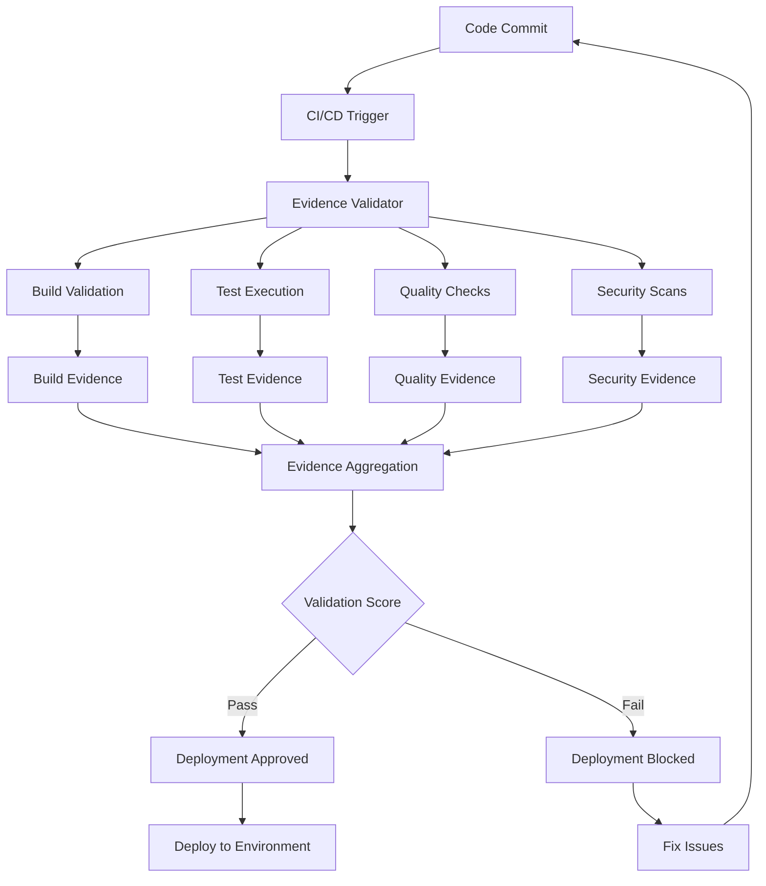

# CI/CD Integration User Guide

**Automated Build Validation and Deployment Pipeline Integration for Tony Framework v2.2.0**

## 🔧 Overview

The CI/CD Integration Layer provides comprehensive build validation, testing automation, and deployment pipeline support for the Tony Framework. This system ensures code quality, automates testing, and integrates with popular CI/CD platforms to provide evidence-based validation for all development activities.

**Supported Platforms**:
- 🚀 **GitHub Actions**: Complete integration with workflows
- 🦊 **GitLab CI/CD**: Full pipeline support
- 🔵 **Azure DevOps**: Build and release pipelines
- 🟢 **Jenkins**: Plugin and script integration
- ⚡ **Generic Webhooks**: Universal webhook support

---

## 🚀 Quick Start

### Basic CI/CD Setup

```bash
# Initialize CI/CD integration
./docs/task-management/cicd/evidence-validator.sh init

# Validate current build
./docs/task-management/cicd/evidence-validator.sh validate-build

# Check CI/CD status
./docs/task-management/cicd/webhooks/webhook-handler.sh status

# Generate pipeline templates
./docs/task-management/cicd/evidence-validator.sh generate-templates
```

### Integration with Tony Tasks

```bash
# Run CI/CD validation through Tony interface
./scripts/tony-tasks.sh cicd validate

# Generate CI/CD report
./scripts/tony-tasks.sh cicd report

# Setup CI/CD monitoring
./scripts/tony-tasks.sh cicd monitor
```

---

## 🏗️ CI/CD Architecture

### Integration Components

```
docs/task-management/cicd/
├── evidence-validator.sh          # Build and test validation
├── evidence/                      # Evidence collection
│   ├── build-artifacts/          # Build output artifacts
│   ├── test-results/             # Test execution results
│   ├── coverage-reports/         # Code coverage data
│   └── quality-metrics/          # Code quality metrics
├── pipelines/                     # CI/CD pipeline templates
│   ├── github-actions.yml        # GitHub Actions workflow
│   ├── gitlab-ci.yml             # GitLab CI configuration
│   ├── azure-pipelines.yml       # Azure DevOps pipeline
│   ├── jenkins-pipeline.groovy   # Jenkins pipeline script
│   └── docker-compose.ci.yml     # Docker-based CI setup
├── webhooks/                      # Webhook handlers
│   ├── webhook-handler.sh         # Main webhook processor
│   ├── github-webhook.sh          # GitHub-specific handler
│   ├── gitlab-webhook.sh          # GitLab-specific handler
│   └── generic-webhook.sh         # Universal webhook handler
└── monitoring/                    # CI/CD monitoring
    ├── pipeline-monitor.sh        # Pipeline status monitoring
    ├── metrics-collector.sh       # CI/CD metrics collection
    └── alerts/                    # CI/CD alert configuration
```

### Evidence-Based Validation Flow



---

## 🔍 Evidence Validation System

### Build Evidence Validation

```bash
# Validate build artifacts
./docs/task-management/cicd/evidence-validator.sh validate-build

# Evidence checks performed:
# ✅ Build process completion
# ✅ No critical build errors
# ✅ All dependencies resolved
# ✅ Artifacts generated successfully
# ✅ Build reproducibility
```

### Test Evidence Validation

```bash
# Validate test execution and coverage
./docs/task-management/cicd/evidence-validator.sh validate-tests

# Test evidence includes:
# ✅ All tests executed successfully
# ✅ Test coverage meets threshold (>80%)
# ✅ No failing tests
# ✅ Performance tests within limits
# ✅ Integration tests passed
```

### Quality Evidence Validation

```bash
# Validate code quality metrics
./docs/task-management/cicd/evidence-validator.sh validate-quality

# Quality checks include:
# ✅ Linting passes without errors
# ✅ Code style compliance
# ✅ Complexity metrics within limits
# ✅ Technical debt analysis
# ✅ Documentation coverage
```

### Security Evidence Validation

```bash
# Validate security requirements
./docs/task-management/cicd/evidence-validator.sh validate-security

# Security evidence includes:
# ✅ Vulnerability scan passed
# ✅ No critical security issues
# ✅ Dependency security check
# ✅ Static security analysis
# ✅ Secrets detection passed
```

### Comprehensive Evidence Report

```bash
# Generate complete evidence report
./docs/task-management/cicd/evidence-validator.sh generate-report

# Example report output:
# ┌─────────────────────────────────────────────┐
# │          CI/CD Evidence Report              │
# ├─────────────────────────────────────────────┤
# │ Build Evidence:     ✅ 98/100 (Excellent)  │
# │ Test Evidence:      ✅ 92/100 (Good)       │
# │ Quality Evidence:   ✅ 88/100 (Good)       │
# │ Security Evidence:  ✅ 95/100 (Excellent)  │
# ├─────────────────────────────────────────────┤
# │ Overall Score:      ✅ 93/100 (Excellent)  │
# │ Deployment Status:  ✅ APPROVED            │
# │ Evidence Timestamp: 2025-07-01 14:30:00    │
# └─────────────────────────────────────────────┘
```

---

## 🔗 Platform-Specific Integration

### GitHub Actions Integration

#### Workflow Template

```yaml
# .github/workflows/tony-integration.yml
name: Tony Framework CI/CD Integration

on:
  push:
    branches: [main, develop]
  pull_request:
    branches: [main]

jobs:
  tony-validation:
    runs-on: ubuntu-latest
    
    steps:
      - name: Checkout code
        uses: actions/checkout@v3
        
      - name: Setup project environment
        run: |
          # Project-specific setup commands
          npm install  # or pip install, go mod tidy, etc.
          
      - name: Tony Evidence Validation
        run: |
          chmod +x docs/task-management/cicd/evidence-validator.sh
          ./docs/task-management/cicd/evidence-validator.sh validate-all
          
      - name: Security Validation
        run: |
          chmod +x security/vulnerability-scanner.sh
          ./security/vulnerability-scanner.sh dependencies
          
      - name: Generate Evidence Report
        run: |
          ./docs/task-management/cicd/evidence-validator.sh generate-report
          
      - name: Upload Evidence Artifacts
        uses: actions/upload-artifact@v3
        with:
          name: tony-evidence
          path: docs/task-management/cicd/evidence/
          
      - name: Tony Webhook Notification
        run: |
          ./docs/task-management/cicd/webhooks/github-webhook.sh notify-completion
```

#### GitHub Webhook Setup

```bash
# Configure GitHub webhook
./docs/task-management/cicd/webhooks/webhook-handler.sh setup-github

# Webhook configuration:
# URL: https://your-domain.com/tony-webhook
# Content type: application/json
# Events: push, pull_request, release
# Secret: [automatically generated]
```

### GitLab CI/CD Integration

#### GitLab CI Template

```yaml
# .gitlab-ci.yml
stages:
  - validate
  - test
  - security
  - deploy

variables:
  TONY_EVIDENCE_PATH: "docs/task-management/cicd/evidence"

before_script:
  - chmod +x docs/task-management/cicd/evidence-validator.sh
  - chmod +x security/vulnerability-scanner.sh

tony-build-validation:
  stage: validate
  script:
    - ./docs/task-management/cicd/evidence-validator.sh validate-build
  artifacts:
    paths:
      - $TONY_EVIDENCE_PATH/build-artifacts/
    expire_in: 1 week

tony-test-validation:
  stage: test
  script:
    - ./docs/task-management/cicd/evidence-validator.sh validate-tests
  artifacts:
    paths:
      - $TONY_EVIDENCE_PATH/test-results/
      - $TONY_EVIDENCE_PATH/coverage-reports/
    expire_in: 1 week
  coverage: '/Coverage: \d+\.\d+%/'

tony-security-validation:
  stage: security
  script:
    - ./security/vulnerability-scanner.sh full
    - ./docs/task-management/cicd/evidence-validator.sh validate-security
  artifacts:
    paths:
      - $TONY_EVIDENCE_PATH/security-reports/
    expire_in: 1 month

tony-evidence-report:
  stage: deploy
  script:
    - ./docs/task-management/cicd/evidence-validator.sh generate-report
  artifacts:
    reports:
      junit: $TONY_EVIDENCE_PATH/test-results/junit.xml
    paths:
      - $TONY_EVIDENCE_PATH/evidence-report.json
  only:
    - main
    - develop
```

#### GitLab Webhook Setup

```bash
# Configure GitLab webhook
./docs/task-management/cicd/webhooks/webhook-handler.sh setup-gitlab

# Webhook settings:
# URL: https://your-domain.com/tony-webhook/gitlab
# Trigger: Push events, Merge request events, Pipeline events
# Secret token: [automatically generated]
```

### Azure DevOps Integration

#### Azure Pipeline Template

```yaml
# azure-pipelines.yml
trigger:
  branches:
    include:
      - main
      - develop

pool:
  vmImage: 'ubuntu-latest'

variables:
  tonyEvidencePath: 'docs/task-management/cicd/evidence'

stages:
- stage: Validation
  displayName: 'Tony Evidence Validation'
  jobs:
  - job: BuildValidation
    displayName: 'Build Evidence Validation'
    steps:
    - script: |
        chmod +x docs/task-management/cicd/evidence-validator.sh
        ./docs/task-management/cicd/evidence-validator.sh validate-build
      displayName: 'Validate Build Evidence'
      
  - job: TestValidation
    displayName: 'Test Evidence Validation'
    steps:
    - script: |
        ./docs/task-management/cicd/evidence-validator.sh validate-tests
      displayName: 'Validate Test Evidence'
    - task: PublishTestResults@2
      inputs:
        testResultsFormat: 'JUnit'
        testResultsFiles: '$(tonyEvidencePath)/test-results/*.xml'
        
  - job: SecurityValidation
    displayName: 'Security Evidence Validation'
    steps:
    - script: |
        chmod +x security/vulnerability-scanner.sh
        ./security/vulnerability-scanner.sh full
        ./docs/task-management/cicd/evidence-validator.sh validate-security
      displayName: 'Validate Security Evidence'
      
- stage: Reporting
  displayName: 'Evidence Reporting'
  jobs:
  - job: GenerateReport
    displayName: 'Generate Evidence Report'
    steps:
    - script: |
        ./docs/task-management/cicd/evidence-validator.sh generate-report
      displayName: 'Generate Tony Evidence Report'
    - task: PublishBuildArtifacts@1
      inputs:
        pathToPublish: '$(tonyEvidencePath)'
        artifactName: 'tony-evidence'
```

### Jenkins Integration

#### Jenkins Pipeline Script

```groovy
// Jenkinsfile
pipeline {
    agent any
    
    environment {
        TONY_EVIDENCE_PATH = 'docs/task-management/cicd/evidence'
    }
    
    stages {
        stage('Preparation') {
            steps {
                script {
                    sh 'chmod +x docs/task-management/cicd/evidence-validator.sh'
                    sh 'chmod +x security/vulnerability-scanner.sh'
                }
            }
        }
        
        stage('Build Validation') {
            steps {
                script {
                    sh './docs/task-management/cicd/evidence-validator.sh validate-build'
                }
            }
        }
        
        stage('Test Validation') {
            steps {
                script {
                    sh './docs/task-management/cicd/evidence-validator.sh validate-tests'
                }
            }
            post {
                always {
                    publishTestResults testResultsPattern: "${TONY_EVIDENCE_PATH}/test-results/*.xml"
                    publishHTML([
                        allowMissing: false,
                        alwaysLinkToLastBuild: true,
                        keepAll: true,
                        reportDir: "${TONY_EVIDENCE_PATH}/coverage-reports",
                        reportFiles: 'index.html',
                        reportName: 'Coverage Report'
                    ])
                }
            }
        }
        
        stage('Security Validation') {
            steps {
                script {
                    sh './security/vulnerability-scanner.sh full'
                    sh './docs/task-management/cicd/evidence-validator.sh validate-security'
                }
            }
        }
        
        stage('Evidence Report') {
            steps {
                script {
                    sh './docs/task-management/cicd/evidence-validator.sh generate-report'
                }
            }
            post {
                always {
                    archiveArtifacts artifacts: "${TONY_EVIDENCE_PATH}/**/*", fingerprint: true
                }
            }
        }
    }
    
    post {
        always {
            script {
                // Send webhook notification
                sh './docs/task-management/cicd/webhooks/webhook-handler.sh notify-jenkins'
            }
        }
    }
}
```

---

## 🎯 Quality Gates and Thresholds

### Quality Gate Configuration

```json
{
  "quality_gates": {
    "build_evidence": {
      "minimum_score": 80,
      "critical_errors": 0,
      "warning_threshold": 5
    },
    "test_evidence": {
      "minimum_coverage": 80,
      "test_success_rate": 95,
      "performance_threshold": "2s"
    },
    "quality_evidence": {
      "lint_errors": 0,
      "complexity_threshold": 10,
      "technical_debt_ratio": 5
    },
    "security_evidence": {
      "critical_vulnerabilities": 0,
      "high_vulnerabilities": 2,
      "security_score": 85
    }
  },
  "deployment_rules": {
    "minimum_overall_score": 85,
    "require_all_gates": true,
    "allow_override": false
  }
}
```

### Customizing Quality Gates

```bash
# Update quality gate thresholds
./docs/task-management/cicd/evidence-validator.sh set-threshold build 85
./docs/task-management/cicd/evidence-validator.sh set-threshold test 90
./docs/task-management/cicd/evidence-validator.sh set-threshold quality 80
./docs/task-management/cicd/evidence-validator.sh set-threshold security 90

# View current thresholds
./docs/task-management/cicd/evidence-validator.sh show-thresholds

# Reset to default thresholds
./docs/task-management/cicd/evidence-validator.sh reset-thresholds
```

---

## 📊 CI/CD Monitoring and Metrics

### Pipeline Monitoring

```bash
# Monitor pipeline status
./docs/task-management/cicd/monitoring/pipeline-monitor.sh status

# View pipeline history
./docs/task-management/cicd/monitoring/pipeline-monitor.sh history

# Get pipeline metrics
./docs/task-management/cicd/monitoring/pipeline-monitor.sh metrics

# Monitor specific pipeline
./docs/task-management/cicd/monitoring/pipeline-monitor.sh watch "pipeline-id"
```

### CI/CD Metrics Collection

```bash
# Collect CI/CD metrics
./docs/task-management/cicd/monitoring/metrics-collector.sh collect

# Metrics collected:
# - Build success/failure rates
# - Test execution times
# - Coverage trends
# - Quality score trends
# - Security issue trends
# - Deployment frequency
# - Lead time for changes
# - Mean time to recovery
```

### CI/CD Dashboard

```bash
# View CI/CD dashboard
./docs/task-management/cicd/monitoring/pipeline-monitor.sh dashboard

# Example dashboard output:
# ┌─────────────────────────────────────────────┐
# │             CI/CD Dashboard                 │
# ├─────────────────────────────────────────────┤
# │ Build Success Rate:    ✅ 97.3%            │
# │ Test Coverage:         ✅ 85.2%            │
# │ Quality Score:         ✅ 88.7%            │
# │ Security Score:        ✅ 92.1%            │
# │ Deployment Frequency:  📈 2.3/day          │
# │ Lead Time:             ⏱️  4.2 hours        │
# │ MTTR:                  🔧 23 minutes        │
# ├─────────────────────────────────────────────┤
# │ Last Updated: 2025-07-01 14:30:00          │
# │ Pipeline Status: ✅ All systems operational │
# └─────────────────────────────────────────────┘
```

---

## 🔔 Webhook and Notification System

### Webhook Configuration

```bash
# Setup webhook endpoints
./docs/task-management/cicd/webhooks/webhook-handler.sh setup

# Configure webhook security
./docs/task-management/cicd/webhooks/webhook-handler.sh configure-security

# Test webhook connectivity
./docs/task-management/cicd/webhooks/webhook-handler.sh test

# View webhook logs
./docs/task-management/cicd/webhooks/webhook-handler.sh logs
```

### Notification Channels

```bash
# Configure notification channels
./docs/task-management/cicd/webhooks/webhook-handler.sh configure-notifications

# Available channels:
# - Email notifications
# - Slack integration
# - Microsoft Teams
# - Discord webhooks
# - Custom webhook endpoints
```

### Webhook Event Types

```bash
# Webhook events supported:
# - build_started
# - build_completed
# - build_failed
# - test_completed
# - deployment_started
# - deployment_completed
# - quality_gate_failed
# - security_issue_detected
```

---

## 🐳 Docker Integration

### Docker-Based CI/CD

```yaml
# docker-compose.ci.yml
version: '3.8'

services:
  tony-ci:
    build:
      context: .
      dockerfile: Dockerfile.ci
    volumes:
      - .:/workspace
      - /var/run/docker.sock:/var/run/docker.sock
    environment:
      - TONY_EVIDENCE_PATH=/workspace/docs/task-management/cicd/evidence
    command: |
      bash -c "
        ./docs/task-management/cicd/evidence-validator.sh validate-all &&
        ./security/vulnerability-scanner.sh full &&
        ./docs/task-management/cicd/evidence-validator.sh generate-report
      "
    
  tony-security:
    image: security-scanner:latest
    volumes:
      - .:/workspace
    command: |
      bash -c "
        cd /workspace &&
        ./security/vulnerability-scanner.sh dependencies
      "
```

### Dockerfile for CI

```dockerfile
# Dockerfile.ci
FROM ubuntu:22.04

# Install required tools
RUN apt-get update && apt-get install -y \
    curl \
    git \
    jq \
    build-essential \
    && rm -rf /var/lib/apt/lists/*

# Install language-specific tools
RUN curl -fsSL https://deb.nodesource.com/setup_18.x | bash - && \
    apt-get install -y nodejs

# Copy Tony CI/CD tools
COPY docs/task-management/cicd/ /opt/tony/cicd/
COPY security/ /opt/tony/security/
COPY scripts/tony-tasks.sh /opt/tony/

# Make scripts executable
RUN chmod +x /opt/tony/cicd/*.sh && \
    chmod +x /opt/tony/security/*.sh && \
    chmod +x /opt/tony/tony-tasks.sh

WORKDIR /workspace
```

---

## 🛠️ Troubleshooting CI/CD Issues

### Common CI/CD Issues

#### Issue 1: Evidence Validation Failures
```bash
# Debug evidence validation
./docs/task-management/cicd/evidence-validator.sh debug

# Check specific validation components
./docs/task-management/cicd/evidence-validator.sh validate-build --debug
./docs/task-management/cicd/evidence-validator.sh validate-tests --debug

# View detailed error logs
tail -f docs/task-management/cicd/evidence/validation.log
```

#### Issue 2: Webhook Delivery Failures
```bash
# Check webhook configuration
./docs/task-management/cicd/webhooks/webhook-handler.sh check-config

# Test webhook connectivity
./docs/task-management/cicd/webhooks/webhook-handler.sh test-connectivity

# View webhook logs
./docs/task-management/cicd/webhooks/webhook-handler.sh view-logs
```

#### Issue 3: Pipeline Integration Problems
```bash
# Validate pipeline configuration
./docs/task-management/cicd/monitoring/pipeline-monitor.sh validate

# Check pipeline permissions
./docs/task-management/cicd/monitoring/pipeline-monitor.sh check-permissions

# Reset pipeline configuration
./docs/task-management/cicd/monitoring/pipeline-monitor.sh reset
```

#### Issue 4: Quality Gate Failures
```bash
# Analyze quality gate failures
./docs/task-management/cicd/evidence-validator.sh analyze-failures

# Adjust quality thresholds temporarily
./docs/task-management/cicd/evidence-validator.sh override-threshold build 70

# Generate quality improvement report
./docs/task-management/cicd/evidence-validator.sh improvement-report
```

### Advanced Troubleshooting

```bash
# Complete CI/CD system reset
./docs/task-management/cicd/evidence-validator.sh reset-system

# Regenerate all pipeline templates
./docs/task-management/cicd/evidence-validator.sh regenerate-templates

# Validate CI/CD integration health
./scripts/tony-tasks.sh cicd health-check
```

---

## 🎯 CI/CD Best Practices

### Pipeline Design Best Practices

1. **Fast Feedback**: Optimize for quick feedback on common failures
2. **Parallel Execution**: Run independent validations in parallel
3. **Incremental Validation**: Use incremental builds and tests when possible
4. **Evidence Preservation**: Preserve all validation evidence for audit trails

### Quality Gate Best Practices

1. **Appropriate Thresholds**: Set realistic but challenging quality thresholds
2. **Progressive Enhancement**: Gradually increase quality requirements
3. **Context-Aware Rules**: Adjust rules based on project context and risk
4. **Override Procedures**: Implement emergency override procedures with approval

### Security Integration Best Practices

1. **Shift Left Security**: Integrate security validation early in pipeline
2. **Continuous Scanning**: Implement continuous vulnerability scanning
3. **Secret Management**: Secure handling of secrets and credentials
4. **Compliance Automation**: Automate compliance checks and reporting

### Monitoring and Alerting Best Practices

1. **Comprehensive Metrics**: Track all relevant CI/CD metrics
2. **Proactive Alerting**: Alert on trends, not just failures
3. **Dashboard Design**: Create actionable dashboards for different audiences
4. **Historical Analysis**: Maintain historical data for trend analysis

---

## 📈 Advanced CI/CD Features

### Multi-Environment Deployment

```bash
# Configure multi-environment deployment
./docs/task-management/cicd/evidence-validator.sh configure-environments

# Supported environments:
# - Development (dev)
# - Testing (test)
# - Staging (staging)
# - Production (prod)

# Deploy to specific environment
./docs/task-management/cicd/evidence-validator.sh deploy dev
./docs/task-management/cicd/evidence-validator.sh deploy staging
./docs/task-management/cicd/evidence-validator.sh deploy prod
```

### Blue-Green Deployment Support

```bash
# Enable blue-green deployment
./docs/task-management/cicd/evidence-validator.sh enable-blue-green

# Deploy to blue environment
./docs/task-management/cicd/evidence-validator.sh deploy blue

# Switch traffic to blue
./docs/task-management/cicd/evidence-validator.sh switch-to blue

# Rollback if needed
./docs/task-management/cicd/evidence-validator.sh rollback
```

### Canary Deployment Integration

```bash
# Configure canary deployment
./docs/task-management/cicd/evidence-validator.sh configure-canary

# Deploy canary release
./docs/task-management/cicd/evidence-validator.sh deploy-canary 10%

# Monitor canary metrics
./docs/task-management/cicd/monitoring/pipeline-monitor.sh monitor-canary

# Promote or rollback canary
./docs/task-management/cicd/evidence-validator.sh promote-canary
./docs/task-management/cicd/evidence-validator.sh rollback-canary
```

---

## 🎉 CI/CD Integration Mastery

Congratulations! You now understand the complete CI/CD Integration system. Key takeaways:

### Core Capabilities
- **Evidence-Based Validation**: Comprehensive validation with scoring and evidence collection
- **Multi-Platform Support**: Integration with GitHub, GitLab, Azure DevOps, Jenkins, and more
- **Quality Gates**: Configurable quality gates with deployment controls
- **Real-Time Monitoring**: Comprehensive monitoring and alerting capabilities

### Advanced Features
- **Multi-Environment Support**: Deployment across multiple environments
- **Blue-Green Deployment**: Zero-downtime deployment strategies
- **Canary Releases**: Gradual rollout with monitoring and rollback
- **Security Integration**: Continuous security validation and compliance

### Next Steps
1. **Choose Your Platform**: Configure integration with your preferred CI/CD platform
2. **Set Quality Gates**: Configure appropriate quality thresholds for your project
3. **Setup Monitoring**: Enable comprehensive pipeline monitoring and alerting
4. **Train Your Team**: Ensure team understands CI/CD processes and evidence requirements

**The CI/CD Integration Layer provides enterprise-grade build validation and deployment automation for the Tony Framework!** 🚀

---

**CI/CD User Guide Version**: 2.2.0  
**Last Updated**: July 1, 2025  
**Platform Support**: GitHub Actions, GitLab CI/CD, Azure DevOps, Jenkins  
**Support**: Comprehensive troubleshooting and self-healing capabilities