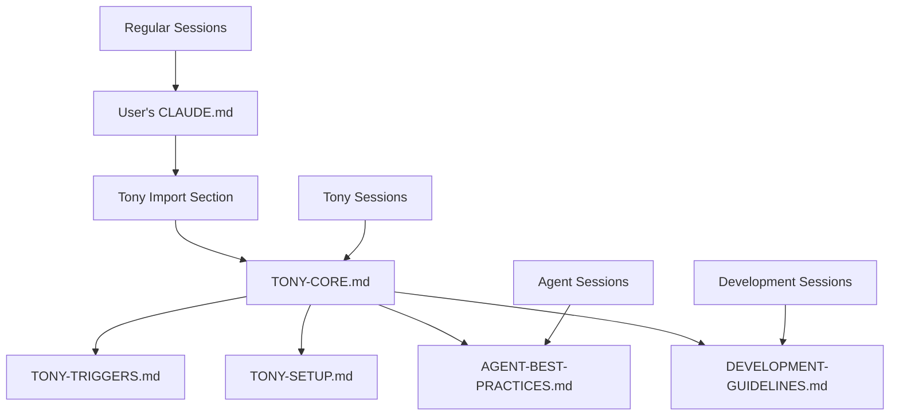

# Tony Framework v2.0 - Modular Architecture Design

**Design Date**: 2025-06-28  
**Architecture Version**: 2.0 Modular  
**Backward Compatibility**: Full support for v1.0 monolithic  
**Status**: Implementation Ready  

## 🏗️ Directory Structure

### User-Level Configuration (Non-Destructive)
```
~/.claude/
├── CLAUDE.md                    # USER'S FILE - never overwritten
├── tony/                        # Tony framework modules
│   ├── TONY-CORE.md            # Core coordination logic
│   ├── TONY-TRIGGERS.md        # Natural language triggers
│   ├── TONY-SETUP.md           # Auto-deployment scripts
│   ├── AGENT-BEST-PRACTICES.md # Agent coordination standards
│   ├── DEVELOPMENT-GUIDELINES.md # Global development standards
│   ├── metadata/
│   │   ├── VERSION             # Framework version tracking
│   │   ├── INSTALL-LOG.md      # Installation audit log
│   │   └── USER-BACKUP.md      # Backup of original user CLAUDE.md
│   └── templates/              # Reusable templates
│       ├── project-templates/  # Project-specific customizations
│       └── agent-templates/    # Agent instruction templates
```

### Project-Level Structure (Generated by Tony)
```
project-root/
├── CLAUDE.md                   # Project-specific instructions
├── .claude/
│   └── commands/
│       └── engage.md           # Session continuity
├── docs/
│   ├── agent-management/       # Agent coordination files
│   └── project-management/     # Project planning files
└── logs/
    ├── agent-tasks/           # Agent execution logs
    └── coordination/          # Tony coordination logs
```

## 📦 Component Architecture

### Component Hierarchy & Dependencies



### 1. TONY-CORE.md (Central Hub)
**Purpose**: Core coordination logic and session management  
**Dependencies**: TONY-TRIGGERS.md, TONY-SETUP.md  
**Load Trigger**: Tony role detection  
**Content**: 
- Identity assignment and mission statement
- Session types and handoff protocols
- Context efficiency strategy
- Universal compatibility framework
- Component orchestration logic

### 2. TONY-TRIGGERS.md (Trigger Detection)
**Purpose**: Natural language trigger phrase detection  
**Dependencies**: None  
**Load Trigger**: All sessions (lightweight detection)  
**Content**:
- Trigger phrase definitions
- Case-insensitive matching patterns
- Auto-deployment sequence triggers
- Context switching logic

### 3. TONY-SETUP.md (Deployment Automation)
**Purpose**: Heavy auto-deployment scripts and infrastructure  
**Dependencies**: TONY-CORE.md  
**Load Trigger**: Tony deployment sequences only  
**Content**:
- Project type detection logic
- Infrastructure creation scripts
- Template deployment automation
- Validation and monitoring setup

### 4. AGENT-BEST-PRACTICES.md (Agent Standards)
**Purpose**: Agent coordination standards (Tony-independent)  
**Dependencies**: None (standalone usable)  
**Load Trigger**: Agent coordination sessions  
**Content**:
- Tool authorization requirements
- Research-driven development standards
- Performance and quality gates
- Session management protocols
- Emergency coordination procedures

### 5. DEVELOPMENT-GUIDELINES.md (Global Standards)
**Purpose**: Universal development practices (Tony-independent)  
**Dependencies**: None (standalone usable)  
**Load Trigger**: All development sessions  
**Content**:
- Task tracking and numbering systems
- Testing and verification requirements
- Documentation standards
- Code standards and style guides
- File organization and git practices

## 🔄 Import Mechanism Design

### Context-Aware Loading Strategy

#### Phase 1: Trigger Detection (Lightweight)
```
Session Start → Load TONY-TRIGGERS.md → Detect Tony Role Request
```

#### Phase 2: Conditional Loading (Tony Sessions Only)
```
Tony Detected → Load TONY-CORE.md → Orchestrate Additional Components
```

#### Phase 3: Component Orchestration (As Needed)
```
TONY-CORE.md → 
    ├── Auto-deployment needed → Load TONY-SETUP.md
    ├── Agent coordination needed → Load AGENT-BEST-PRACTICES.md
    └── Development standards needed → Load DEVELOPMENT-GUIDELINES.md
```

### User CLAUDE.md Integration

#### Option A: Import Section (Recommended)
```markdown
# [User's Existing Content - COMPLETELY PRESERVED]

## 🤖 Tech Lead Tony Framework v2.0 Integration
<!-- AUTO-MANAGED: Framework Version 2.0.0 | Last Updated: 2025-06-28 -->

### Tony Module Loading (Context-Aware)
The Tony framework uses modular, context-aware loading:

**Trigger Detection**: ~/.claude/tony/TONY-TRIGGERS.md (always loaded)
**Core Coordination**: ~/.claude/tony/TONY-CORE.md (Tony sessions only)
**Auto-Deployment**: ~/.claude/tony/TONY-SETUP.md (deployment sequences only)
**Agent Standards**: ~/.claude/tony/AGENT-BEST-PRACTICES.md (agent sessions)
**Dev Guidelines**: ~/.claude/tony/DEVELOPMENT-GUIDELINES.md (development sessions)

### Session Types & Loading
- **Regular Sessions**: Lightweight trigger detection only
- **Tony Sessions**: Full coordination framework loaded
- **Agent Sessions**: Agent best practices + core framework
- **Development Sessions**: Guidelines + applicable standards

### Framework Benefits v2.0
- **Zero User Impact**: Your customizations are never overwritten
- **Context Efficiency**: Load only needed components per session
- **Independent Updates**: Framework updates preserve your content
- **Modular Control**: Enable/disable components as needed

<!-- END AUTO-MANAGED SECTION -->
```

#### Option B: External Reference (Alternative)
```markdown
# [User's Existing Content - COMPLETELY PRESERVED]

## 🤖 Tech Lead Tony Framework
Framework configuration: ~/.claude/tony/TONY-CORE.md
Version: 2.0 Modular Architecture
```

## 🚀 Installation Workflows

### Workflow 1: New Installation (Clean Environment)
```bash
1. Detect ~/.claude/CLAUDE.md → Does not exist
2. Create minimal user CLAUDE.md with Tony integration
3. Deploy modular Tony components to ~/.claude/tony/
4. Generate installation log and version tracking
5. Verify modular installation
```

### Workflow 2: Augmentation (Existing User CLAUDE.md)
```bash
1. Detect ~/.claude/CLAUDE.md → Exists
2. Backup existing file to ~/.claude/tony/metadata/USER-BACKUP.md
3. Scan for existing Tony integration → Remove if found
4. Append new modular integration section
5. Deploy modular Tony components
6. Verify preservation of user content
```

### Workflow 3: Migration (Existing Monolithic Tony)
```bash
1. Detect monolithic Tony installation
2. Extract user customizations (if any)
3. Backup current CLAUDE.md
4. Migrate to modular architecture
5. Preserve functionality and customizations
6. Verify migration success
```

## 🔧 Installation Script Architecture

### Smart Detection Logic
```bash
# Installation type detection
if [ ! -f ~/.claude/CLAUDE.md ]; then
    INSTALL_TYPE="new"
elif grep -q "Tech Lead Tony Auto-Deployment" ~/.claude/CLAUDE.md; then
    if [ -d ~/.claude/tony ]; then
        INSTALL_TYPE="update_modular"
    else
        INSTALL_TYPE="migrate_monolithic"
    fi
else
    INSTALL_TYPE="augment_existing"
fi
```

### Non-Destructive Augmentation
```bash
# Preserve user content completely
backup_user_content() {
    if [ -f ~/.claude/CLAUDE.md ]; then
        cp ~/.claude/CLAUDE.md ~/.claude/tony/metadata/USER-BACKUP-$(date +%s).md
        log_action "User content backed up"
    fi
}

append_tony_integration() {
    cat >> ~/.claude/CLAUDE.md << 'EOF'

## 🤖 Tech Lead Tony Framework v2.0 Integration
<!-- AUTO-MANAGED: Framework Version 2.0.0 -->
[modular integration content]
<!-- END AUTO-MANAGED SECTION -->
EOF
}
```

## 📊 Version Control & Updates

### Framework Versioning
- **Component Versions**: Each module has independent versioning
- **Architecture Version**: Overall framework version (2.0)
- **User Content Protection**: Guaranteed preservation across all updates

### Update Strategy
```bash
# Update only framework components
update_tony_modules() {
    # Update modular components in ~/.claude/tony/
    # Never touch user's main CLAUDE.md content
    # Update only the AUTO-MANAGED section if needed
}
```

### Rollback Capability
```bash
# Complete rollback to user's original state
rollback_installation() {
    # Restore from ~/.claude/tony/metadata/USER-BACKUP.md
    # Remove all Tony components
    # Restore original environment
}
```

## ✅ Quality Assurance

### Installation Validation
- ✅ User content preservation verification
- ✅ Modular component loading tests
- ✅ Backward compatibility validation
- ✅ Functional parity verification
- ✅ Performance impact assessment

### Migration Testing
- ✅ Monolithic → Modular migration
- ✅ User customization preservation
- ✅ Tony functionality continuity
- ✅ Session handoff verification

## 📈 Benefits Summary

### For Users
- **Zero Risk**: No user content ever overwritten
- **Clean Separation**: Framework vs. user customizations
- **Easy Updates**: Framework updates without user impact
- **Flexible Control**: Enable/disable components as needed

### For Framework
- **Maintainable**: Clear component boundaries
- **Testable**: Independent component validation
- **Scalable**: Add new components without user impact
- **Efficient**: Context-aware loading reduces overhead

---

**Implementation Status**: Ready for component creation  
**Next Phase**: Create modular component files  
**Risk Level**: Zero (non-destructive design)  
**Compatibility**: Full backward support for v1.0