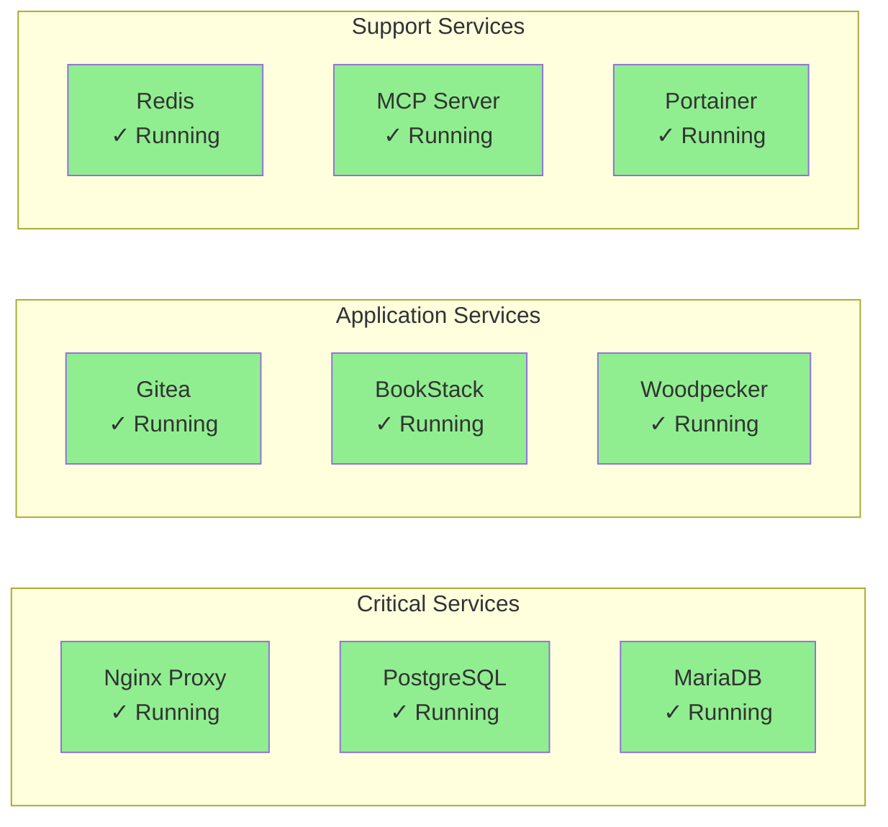
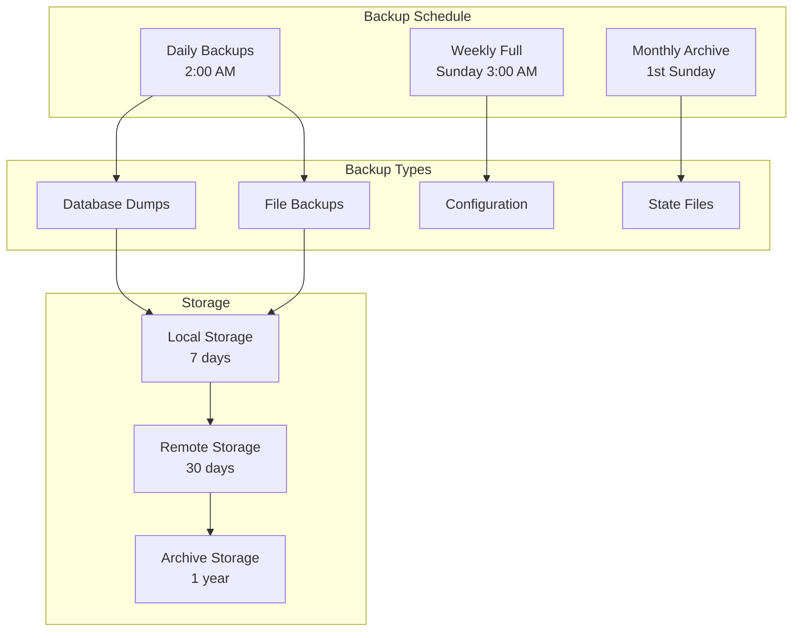
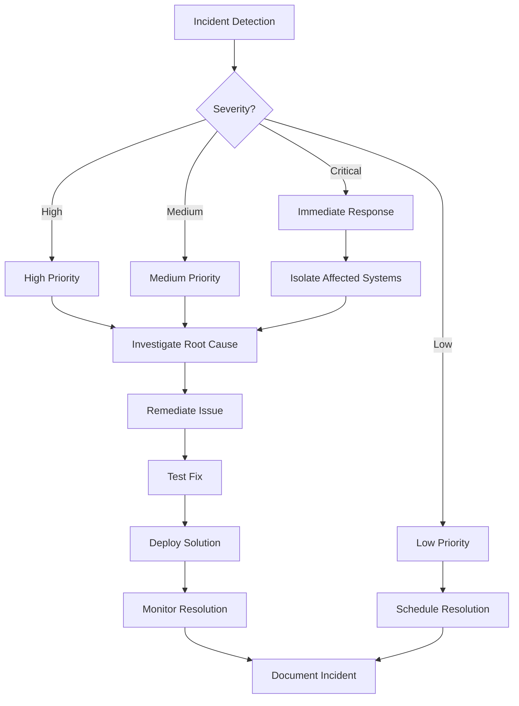
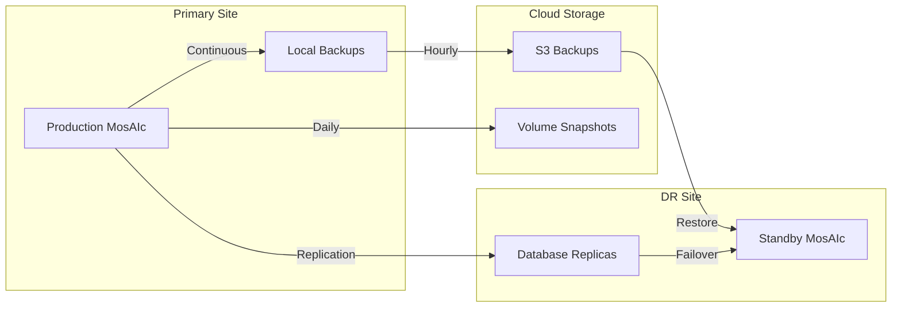

# MosAIc Stack Operations Handbook

## Overview

This handbook provides comprehensive operational procedures for maintaining, monitoring, and troubleshooting the MosAIc Stack in production environments.

## Table of Contents

1. [Daily Operations](#daily-operations)
2. [Monitoring & Alerting](#monitoring--alerting)
3. [Backup & Recovery](#backup--recovery)
4. [Performance Management](#performance-management)
5. [Security Operations](#security-operations)
6. [Incident Response](#incident-response)
7. [Maintenance Procedures](#maintenance-procedures)
8. [Disaster Recovery](#disaster-recovery)

## Daily Operations

### Morning Checklist

```bash
#!/bin/bash
# Daily health check script

echo "=== MosAIc Stack Daily Health Check ==="
echo "Date: $(date)"
echo

# Check all containers are running
echo "1. Container Status:"
docker compose -f /opt/mosaic/docker-compose.mosaicstack.yml ps

# Check disk usage
echo -e "\n2. Disk Usage:"
df -h | grep -E "(^Filesystem|/var/lib/mosaic|/$)"

# Check memory usage
echo -e "\n3. Memory Usage:"
free -h

# Check database connections
echo -e "\n4. Database Connections:"
docker exec mosaic-postgres-1 psql -U postgres -c "SELECT count(*) FROM pg_stat_activity;"
docker exec mosaic-mariadb-1 mysql -uroot -p$MARIADB_ROOT_PASSWORD -e "SHOW STATUS LIKE 'Threads_connected';"

# Check service health endpoints
echo -e "\n5. Service Health:"
curl -s http://localhost:3456/health | jq .
curl -s https://git.example.com/api/healthz
```

### Service Status Dashboard



## Monitoring & Alerting

### Key Metrics to Monitor

#### System Metrics
```yaml
system_metrics:
  cpu_usage:
    warning: 70%
    critical: 90%
    
  memory_usage:
    warning: 80%
    critical: 95%
    
  disk_usage:
    warning: 80%
    critical: 90%
    
  inode_usage:
    warning: 80%
    critical: 90%
```

#### Service Metrics
```yaml
service_metrics:
  response_time:
    gitea:
      warning: 1000ms
      critical: 3000ms
    bookstack:
      warning: 2000ms
      critical: 5000ms
    woodpecker:
      warning: 500ms
      critical: 2000ms
      
  error_rate:
    warning: 1%
    critical: 5%
    
  database_connections:
    postgres:
      warning: 80
      critical: 95
    mariadb:
      warning: 140
      critical: 180
```

### Monitoring Stack Setup

```yaml
# docker-compose.monitoring.yml
version: '3.8'

services:
  prometheus:
    image: prom/prometheus:latest
    volumes:
      - ./prometheus.yml:/etc/prometheus/prometheus.yml
      - prometheus_data:/prometheus
    command:
      - '--config.file=/etc/prometheus/prometheus.yml'
      - '--storage.tsdb.path=/prometheus'
    networks:
      - mosaic_net

  grafana:
    image: grafana/grafana:latest
    volumes:
      - grafana_data:/var/lib/grafana
    environment:
      - GF_SECURITY_ADMIN_PASSWORD=${GRAFANA_PASSWORD}
    networks:
      - mosaic_net

  alertmanager:
    image: prom/alertmanager:latest
    volumes:
      - ./alertmanager.yml:/etc/alertmanager/alertmanager.yml
    networks:
      - mosaic_net

volumes:
  prometheus_data:
  grafana_data:
```

### Alert Rules

```yaml
# prometheus_rules.yml
groups:
  - name: mosaic_alerts
    rules:
      - alert: ServiceDown
        expr: up == 0
        for: 5m
        labels:
          severity: critical
        annotations:
          summary: "Service {{ $labels.job }} is down"
          
      - alert: HighCPUUsage
        expr: cpu_usage > 90
        for: 10m
        labels:
          severity: warning
        annotations:
          summary: "High CPU usage on {{ $labels.instance }}"
          
      - alert: DiskSpaceLow
        expr: disk_free_percent < 10
        for: 5m
        labels:
          severity: critical
        annotations:
          summary: "Low disk space on {{ $labels.instance }}"
```

## Backup & Recovery

### Backup Strategy



### Automated Backup Script

```bash
#!/bin/bash
# /opt/mosaic/scripts/backup.sh

set -euo pipefail

# Configuration
BACKUP_ROOT="/backup/mosaic"
RETENTION_DAYS=7
S3_BUCKET="s3://mosaic-backups"
DATE=$(date +%Y%m%d_%H%M%S)
BACKUP_DIR="${BACKUP_ROOT}/${DATE}"

# Create backup directory
mkdir -p "${BACKUP_DIR}"

# Function to backup database
backup_database() {
    local db_type=$1
    local container=$2
    local output_file=$3
    
    echo "Backing up ${db_type} database..."
    
    case ${db_type} in
        postgres)
            docker exec ${container} pg_dumpall -U postgres > "${output_file}"
            ;;
        mariadb)
            docker exec ${container} mysqldump --all-databases -uroot -p${MARIADB_ROOT_PASSWORD} > "${output_file}"
            ;;
    esac
    
    gzip "${output_file}"
}

# Function to backup volumes
backup_volume() {
    local volume=$1
    local output_file=$2
    
    echo "Backing up volume ${volume}..."
    docker run --rm -v ${volume}:/data -v ${BACKUP_DIR}:/backup alpine \
        tar czf /backup/${output_file} -C /data .
}

# Stop services for consistent backup
echo "Stopping application services..."
docker compose -f /opt/mosaic/docker-compose.mosaicstack.yml stop gitea bookstack woodpecker-server

# Backup databases
backup_database postgres mosaic-postgres-1 "${BACKUP_DIR}/postgres.sql"
backup_database mariadb mosaic-mariadb-1 "${BACKUP_DIR}/mariadb.sql"

# Backup volumes
backup_volume mosaic_gitea_data gitea_data.tar.gz
backup_volume mosaic_bookstack_data bookstack_data.tar.gz
backup_volume mosaic_woodpecker_data woodpecker_data.tar.gz
backup_volume mosaic_mcp_data mcp_data.tar.gz

# Backup configurations
cp -r /opt/mosaic/mosaic-sdk/.env "${BACKUP_DIR}/"
cp -r /opt/mosaic/mosaic-sdk/docker-compose.*.yml "${BACKUP_DIR}/"

# Start services
echo "Starting services..."
docker compose -f /opt/mosaic/docker-compose.mosaicstack.yml start

# Create backup manifest
cat > "${BACKUP_DIR}/manifest.json" << EOF
{
  "timestamp": "$(date -Iseconds)",
  "version": "1.0.0",
  "files": [
    "postgres.sql.gz",
    "mariadb.sql.gz",
    "gitea_data.tar.gz",
    "bookstack_data.tar.gz",
    "woodpecker_data.tar.gz",
    "mcp_data.tar.gz"
  ]
}
EOF

# Upload to S3
if command -v aws &> /dev/null; then
    echo "Uploading to S3..."
    aws s3 sync "${BACKUP_DIR}" "${S3_BUCKET}/${DATE}/"
fi

# Clean old backups
echo "Cleaning old backups..."
find "${BACKUP_ROOT}" -type d -mtime +${RETENTION_DAYS} -exec rm -rf {} +

echo "Backup completed: ${BACKUP_DIR}"
```

### Recovery Procedures

#### Full System Recovery

```bash
#!/bin/bash
# /opt/mosaic/scripts/restore.sh

set -euo pipefail

# Configuration
BACKUP_DIR=$1

if [ -z "${BACKUP_DIR}" ]; then
    echo "Usage: $0 <backup_directory>"
    exit 1
fi

if [ ! -d "${BACKUP_DIR}" ]; then
    echo "Backup directory not found: ${BACKUP_DIR}"
    exit 1
fi

echo "WARNING: This will restore the entire MosAIc stack from backup."
echo "All current data will be lost!"
read -p "Continue? (yes/no): " confirm

if [ "${confirm}" != "yes" ]; then
    echo "Restore cancelled."
    exit 0
fi

# Stop all services
echo "Stopping all services..."
docker compose -f /opt/mosaic/docker-compose.mosaicstack.yml down

# Restore databases
echo "Restoring PostgreSQL..."
docker compose -f /opt/mosaic/docker-compose.mosaicstack.yml up -d postgres
sleep 10
gunzip -c "${BACKUP_DIR}/postgres.sql.gz" | docker exec -i mosaic-postgres-1 psql -U postgres

echo "Restoring MariaDB..."
docker compose -f /opt/mosaic/docker-compose.mosaicstack.yml up -d mariadb
sleep 10
gunzip -c "${BACKUP_DIR}/mariadb.sql.gz" | docker exec -i mosaic-mariadb-1 mysql -uroot -p${MARIADB_ROOT_PASSWORD}

# Restore volumes
for volume in gitea bookstack woodpecker mcp; do
    echo "Restoring ${volume} volume..."
    docker volume rm mosaic_${volume}_data || true
    docker volume create mosaic_${volume}_data
    docker run --rm -v mosaic_${volume}_data:/data -v ${BACKUP_DIR}:/backup alpine \
        tar xzf /backup/${volume}_data.tar.gz -C /data
done

# Restore configuration
cp "${BACKUP_DIR}/.env" /opt/mosaic/mosaic-sdk/

# Start all services
echo "Starting all services..."
docker compose -f /opt/mosaic/docker-compose.mosaicstack.yml up -d

echo "Restore completed successfully!"
```

## Performance Management

### Performance Tuning Checklist

#### Database Optimization

```sql
-- PostgreSQL tuning
ALTER SYSTEM SET shared_buffers = '4GB';
ALTER SYSTEM SET effective_cache_size = '12GB';
ALTER SYSTEM SET maintenance_work_mem = '1GB';
ALTER SYSTEM SET checkpoint_completion_target = 0.9;
ALTER SYSTEM SET wal_buffers = '16MB';
ALTER SYSTEM SET default_statistics_target = 100;
ALTER SYSTEM SET random_page_cost = 1.1;

-- MariaDB tuning
SET GLOBAL innodb_buffer_pool_size = 4294967296;
SET GLOBAL innodb_log_file_size = 536870912;
SET GLOBAL innodb_flush_log_at_trx_commit = 2;
SET GLOBAL innodb_flush_method = O_DIRECT;
SET GLOBAL query_cache_size = 67108864;
SET GLOBAL query_cache_type = 1;
```

#### Container Resource Limits

```yaml
# docker-compose.override.yml
services:
  gitea:
    deploy:
      resources:
        limits:
          cpus: '2'
          memory: 4G
        reservations:
          cpus: '1'
          memory: 2G

  postgres:
    deploy:
      resources:
        limits:
          cpus: '4'
          memory: 8G
        reservations:
          cpus: '2'
          memory: 4G
```

### Performance Monitoring Script

```bash
#!/bin/bash
# /opt/mosaic/scripts/performance-check.sh

echo "=== MosAIc Performance Report ==="
echo "Timestamp: $(date)"
echo

# Container stats
echo "Container Resource Usage:"
docker stats --no-stream --format "table {{.Container}}\t{{.CPUPerc}}\t{{.MemUsage}}\t{{.NetIO}}\t{{.BlockIO}}"

# Database performance
echo -e "\nDatabase Performance:"

# PostgreSQL
docker exec mosaic-postgres-1 psql -U postgres -c "
SELECT 
    datname,
    numbackends as connections,
    xact_commit as commits,
    xact_rollback as rollbacks,
    blks_read as disk_reads,
    blks_hit as cache_hits,
    round(100.0 * blks_hit / (blks_hit + blks_read), 2) as cache_hit_ratio
FROM pg_stat_database
WHERE datname NOT IN ('template0', 'template1', 'postgres')
ORDER BY connections DESC;"

# Response time checks
echo -e "\nService Response Times:"
for service in git docs ci; do
    response_time=$(curl -o /dev/null -s -w "%{time_total}" https://${service}.example.com/api/healthz)
    echo "${service}: ${response_time}s"
done
```

## Security Operations

### Security Checklist

#### Daily Security Tasks
- [ ] Review authentication logs
- [ ] Check for failed login attempts
- [ ] Verify SSL certificate status
- [ ] Review firewall logs
- [ ] Check for security updates

#### Weekly Security Tasks
- [ ] Run vulnerability scans
- [ ] Review user permissions
- [ ] Audit API access logs
- [ ] Check for unused accounts
- [ ] Review security alerts

### Security Monitoring Script

```bash
#!/bin/bash
# /opt/mosaic/scripts/security-check.sh

echo "=== Security Audit Report ==="
echo "Date: $(date)"
echo

# Failed login attempts
echo "1. Failed Login Attempts (last 24h):"
docker logs mosaic-gitea-1 2>&1 | grep -i "failed login" | tail -20

# SSL certificate expiry
echo -e "\n2. SSL Certificate Status:"
for domain in git docs ci admin; do
    expiry=$(echo | openssl s_client -servername ${domain}.example.com -connect ${domain}.example.com:443 2>/dev/null | openssl x509 -noout -dates | grep notAfter | cut -d= -f2)
    echo "${domain}.example.com: expires ${expiry}"
done

# Open ports
echo -e "\n3. Open Ports:"
netstat -tlnp 2>/dev/null | grep LISTEN

# Container security
echo -e "\n4. Container Security:"
for container in $(docker ps --format "{{.Names}}"); do
    user=$(docker exec ${container} whoami 2>/dev/null || echo "N/A")
    echo "${container}: running as ${user}"
done

# Recent security events
echo -e "\n5. Recent Security Events:"
journalctl -u docker --since "24 hours ago" | grep -i -E "(error|warning|critical|failed)" | tail -20
```

## Incident Response

### Incident Response Flowchart



### Incident Response Runbooks

#### Service Down

```bash
#!/bin/bash
# Runbook: Service Down Response

SERVICE=$1

echo "=== Service Down: ${SERVICE} ==="
echo "Time: $(date)"

# 1. Verify service is down
echo "1. Checking service status..."
docker ps | grep ${SERVICE}

# 2. Check logs
echo -e "\n2. Recent logs:"
docker logs --tail 50 mosaic-${SERVICE}-1

# 3. Attempt restart
echo -e "\n3. Attempting restart..."
docker compose -f /opt/mosaic/docker-compose.mosaicstack.yml restart ${SERVICE}

# 4. Wait and verify
sleep 30
if docker ps | grep -q mosaic-${SERVICE}; then
    echo "Service restarted successfully"
else
    echo "Service failed to restart - escalating"
    # Send alert to on-call
fi
```

#### Database Connection Issues

```bash
#!/bin/bash
# Runbook: Database Connection Issues

echo "=== Database Connection Troubleshooting ==="

# 1. Check database status
echo "1. Database Status:"
docker ps | grep -E "(postgres|mariadb)"

# 2. Check connection count
echo -e "\n2. Connection Count:"
docker exec mosaic-postgres-1 psql -U postgres -c "SELECT count(*) FROM pg_stat_activity;"
docker exec mosaic-mariadb-1 mysql -uroot -p${MARIADB_ROOT_PASSWORD} -e "SHOW PROCESSLIST;"

# 3. Kill idle connections
echo -e "\n3. Killing idle connections..."
docker exec mosaic-postgres-1 psql -U postgres -c "
SELECT pg_terminate_backend(pid) 
FROM pg_stat_activity 
WHERE state = 'idle' 
AND state_change < current_timestamp - interval '1 hour';"

# 4. Restart connection pools
echo -e "\n4. Restarting application services..."
docker compose -f /opt/mosaic/docker-compose.mosaicstack.yml restart gitea bookstack woodpecker-server
```

## Maintenance Procedures

### Routine Maintenance Schedule

| Task | Frequency | Procedure |
|------|-----------|-----------|
| Update containers | Weekly | Pull latest images, test in staging |
| Database vacuum | Weekly | Run VACUUM ANALYZE |
| Log rotation | Daily | Rotate and compress logs |
| Certificate renewal | Monthly | Check and renew SSL certs |
| Security patches | As needed | Apply OS and container updates |
| Performance review | Monthly | Analyze metrics and tune |

### Maintenance Mode Script

```bash
#!/bin/bash
# /opt/mosaic/scripts/maintenance-mode.sh

ACTION=$1

enable_maintenance() {
    echo "Enabling maintenance mode..."
    
    # Create maintenance page
    cat > /tmp/maintenance.html << 'EOF'
<!DOCTYPE html>
<html>
<head>
    <title>Maintenance</title>
    <style>
        body { font-family: Arial; text-align: center; padding: 50px; }
        h1 { color: #333; }
    </style>
</head>
<body>
    <h1>System Maintenance</h1>
    <p>We're performing scheduled maintenance. We'll be back shortly!</p>
    <p>Expected completion: <span id="time"></span></p>
    <script>
        document.getElementById('time').textContent = new Date(Date.now() + 3600000).toLocaleTimeString();
    </script>
</body>
</html>
EOF

    # Configure Nginx to serve maintenance page
    docker exec mosaic-npm-1 sh -c 'echo "return 503;" > /etc/nginx/conf.d/maintenance.conf'
    docker exec mosaic-npm-1 nginx -s reload
}

disable_maintenance() {
    echo "Disabling maintenance mode..."
    docker exec mosaic-npm-1 rm -f /etc/nginx/conf.d/maintenance.conf
    docker exec mosaic-npm-1 nginx -s reload
}

case ${ACTION} in
    enable)
        enable_maintenance
        ;;
    disable)
        disable_maintenance
        ;;
    *)
        echo "Usage: $0 {enable|disable}"
        exit 1
        ;;
esac
```

## Disaster Recovery

### DR Strategy



### DR Testing Procedure

```bash
#!/bin/bash
# /opt/mosaic/scripts/dr-test.sh

echo "=== Disaster Recovery Test ==="
echo "Starting: $(date)"

# 1. Create test backup
echo "1. Creating test backup..."
/opt/mosaic/scripts/backup.sh

# 2. Spin up DR environment
echo -e "\n2. Starting DR environment..."
docker compose -f docker-compose.dr.yml up -d

# 3. Restore data
echo -e "\n3. Restoring data to DR environment..."
LATEST_BACKUP=$(ls -t /backup/mosaic | head -1)
/opt/mosaic/scripts/restore.sh /backup/mosaic/${LATEST_BACKUP}

# 4. Verify services
echo -e "\n4. Verifying DR services..."
for service in gitea bookstack woodpecker; do
    if curl -s http://dr-${service}:8080/health > /dev/null; then
        echo "✓ ${service} is running"
    else
        echo "✗ ${service} failed to start"
    fi
done

# 5. Cleanup
echo -e "\n5. Cleaning up DR test..."
docker compose -f docker-compose.dr.yml down -v

echo -e "\nDR test completed: $(date)"
```

### Failover Procedure

1. **Declare Disaster**
   - Confirm primary site failure
   - Notify stakeholders
   - Initiate DR plan

2. **Activate DR Site**
   ```bash
   # On DR site
   cd /opt/mosaic-dr
   ./scripts/activate-dr.sh
   ```

3. **Update DNS**
   - Point domains to DR site
   - Verify SSL certificates

4. **Verify Operations**
   - Test all services
   - Confirm data integrity
   - Monitor performance

5. **Communicate Status**
   - Update status page
   - Notify users
   - Document timeline

## Appendices

### A. Emergency Contacts

| Role | Name | Contact | Escalation |
|------|------|---------|------------|
| Primary On-Call | John Doe | +1-555-0123 | Immediate |
| Secondary On-Call | Jane Smith | +1-555-0124 | 15 min |
| Manager | Bob Johnson | +1-555-0125 | 30 min |
| Vendor Support | Various | See wiki | As needed |

### B. Service Dependencies

```yaml
dependencies:
  gitea:
    requires: [mariadb, redis]
    supports: [woodpecker]
    
  bookstack:
    requires: [mariadb]
    supports: []
    
  woodpecker:
    requires: [postgres, gitea]
    supports: [mcp]
    
  mcp:
    requires: [redis]
    supports: [tony]
```

### C. Configuration Files

Key configuration file locations:
- `/opt/mosaic/mosaic-sdk/.env` - Environment variables
- `/var/lib/mosaic/*/conf/` - Service configurations
- `/opt/mosaic/scripts/` - Operational scripts
- `/backup/mosaic/` - Backup location

---

*Last Updated: January 2025 | MosAIc Operations Handbook v1.0.0*