# MosAIc Orchestration Architecture Diagrams

## Overview

This document contains visual representations of the MosAIc orchestration architecture using Mermaid diagrams. These diagrams illustrate the system's components, data flow, and integration points.

## System Architecture Overview

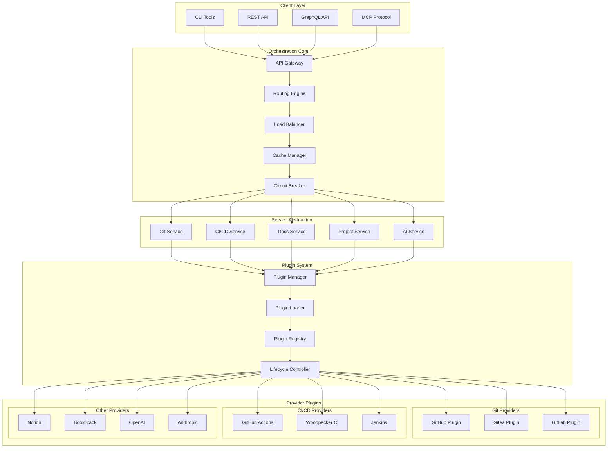

## Request Flow Diagram

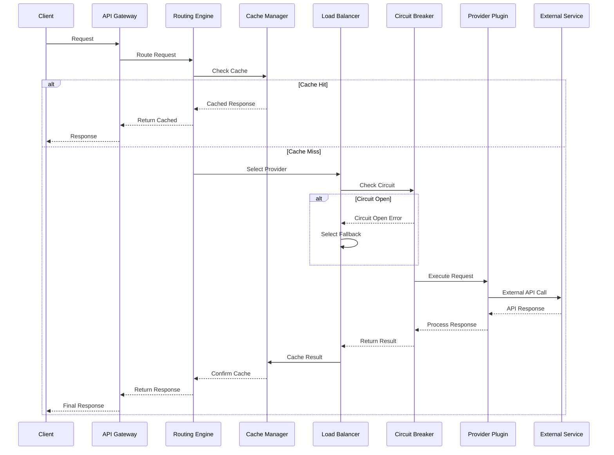

## Plugin Lifecycle Diagram

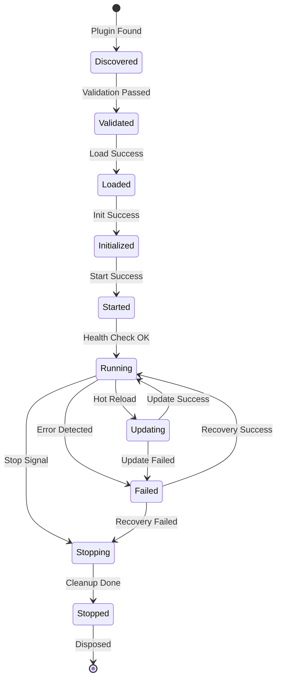

## Multi-Provider Routing Decision Tree

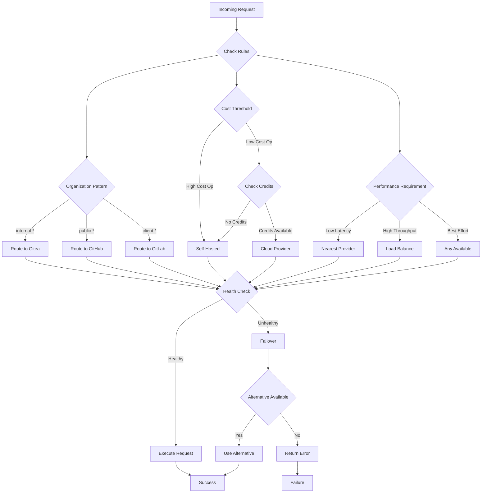

## Cache Architecture

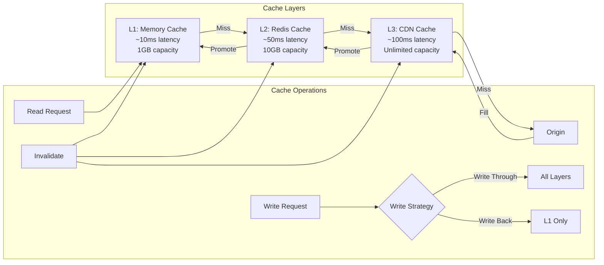

## Load Balancing Strategies

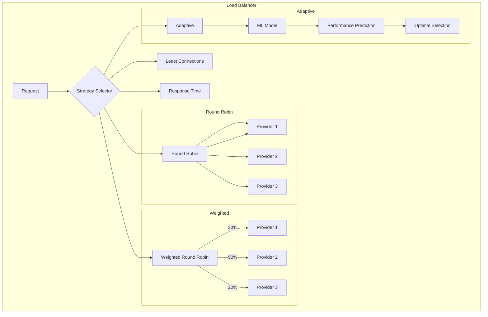

## Circuit Breaker State Machine

```mermaid
stateDiagram-v2
    [*] --> Closed: Initial State
    
    state Closed {
        [*] --> Monitoring
        Monitoring --> Monitoring: Success
        Monitoring --> Counting: Failure
        Counting --> Counting: Failure < Threshold
        Counting --> Opening: Failure >= Threshold
    }
    
    Closed --> Open: Threshold Breached
    
    state Open {
        [*] --> Rejecting
        Rejecting --> Rejecting: Reject All
        Rejecting --> Timer: Start Timer
        Timer --> HalfOpen: Timeout
    }
    
    Open --> HalfOpen: Reset Timeout
    
    state HalfOpen {
        [*] --> Testing
        Testing --> Success: Request Success
        Success --> Success: Count < Required
        Success --> Closed: Count >= Required
        Testing --> Open: Request Failed
    }
    
    HalfOpen --> Closed: Success Threshold
    HalfOpen --> Open: Any Failure
```

## Multi-Tenant Architecture

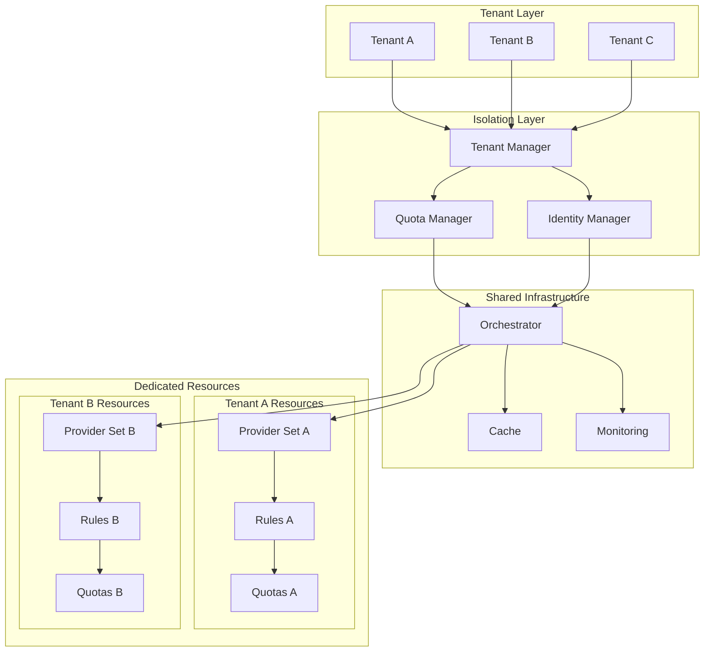

## Monitoring and Observability

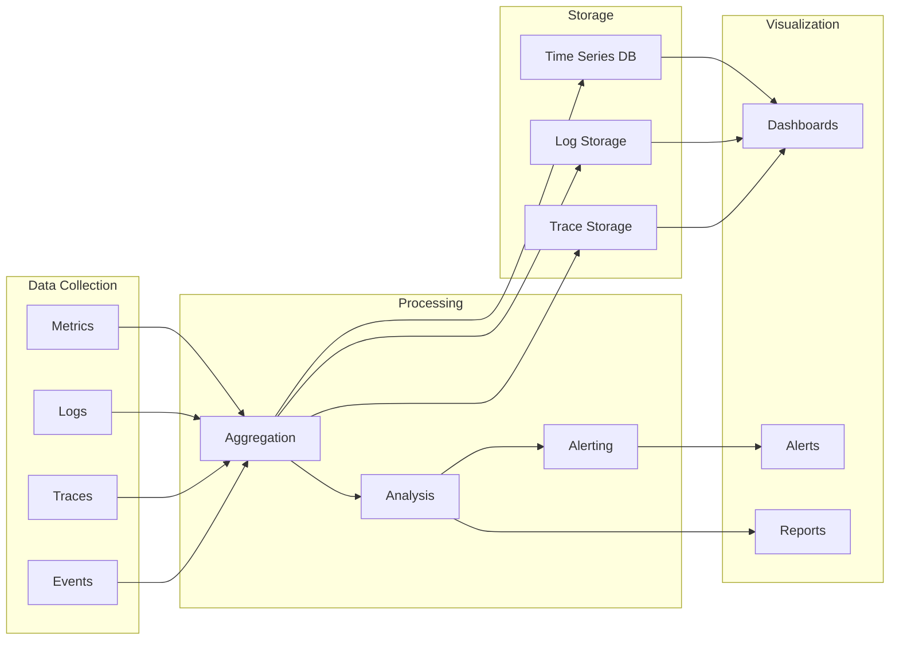

## Deployment Architecture

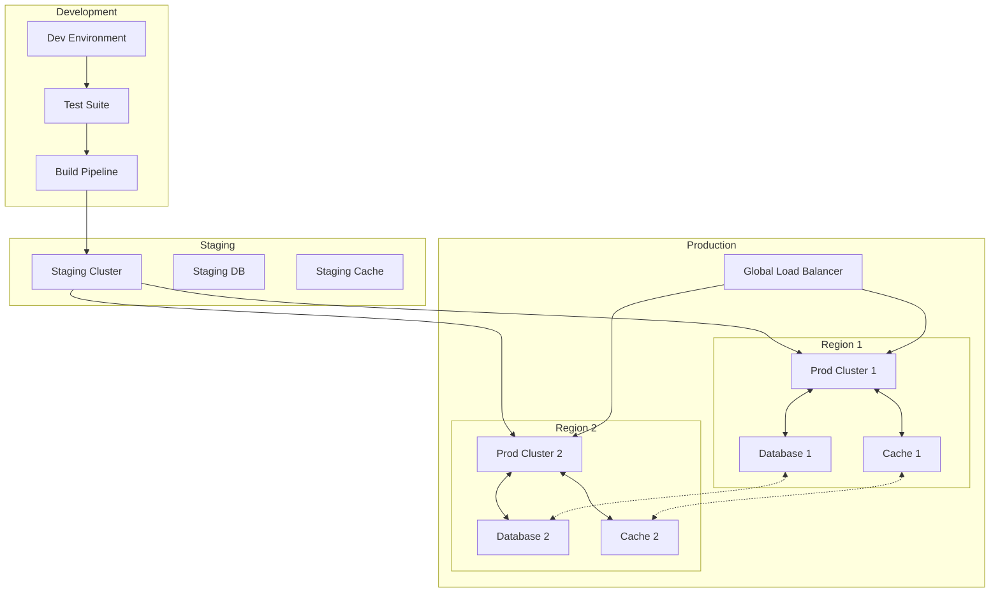

## Data Flow for Multi-Provider Operations

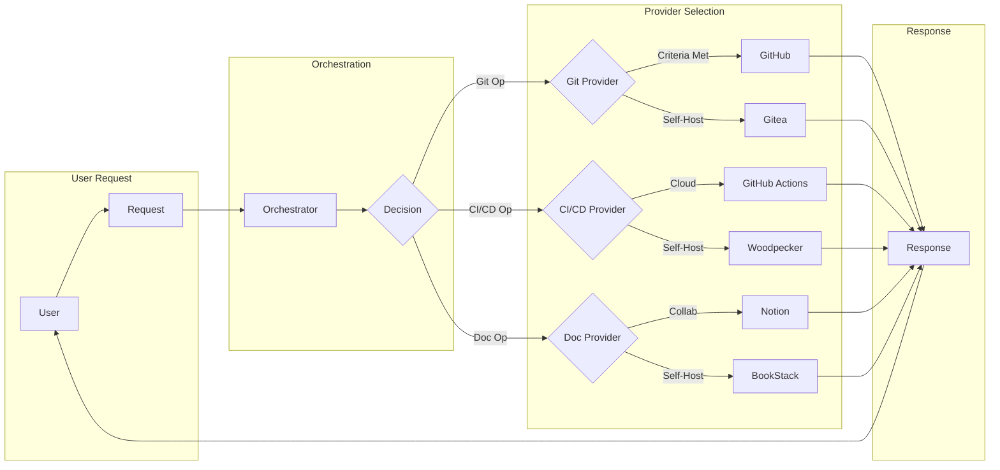

## Error Handling Flow

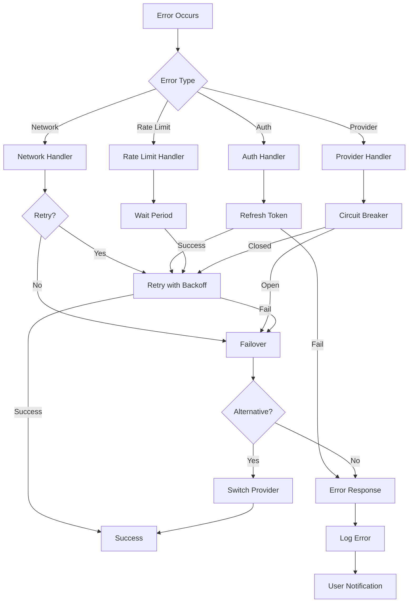

---

These diagrams provide a visual understanding of the MosAIc orchestration architecture, showing how different components interact and how data flows through the system. The diagrams can be rendered using any Mermaid-compatible viewer or documentation system.