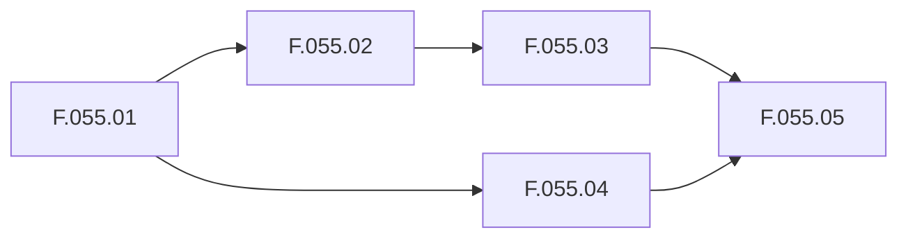

# Project Planning Overview

The MosAIc Stack uses a structured approach to project planning based on Tony Framework's UPP (Ultrathink Planning Protocol) methodology.

## Planning Hierarchy

```
PROJECT (P)
├── EPIC (E.XXX) - Major feature areas
│   ├── FEATURE (F.XXX.XX) - Specific capabilities
│   │   ├── STORY (S.XXX.XX.XX) - User-facing changes
│   │   │   ├── TASK (T.XXX.XX.XX.XX) - Development work
│   │   │   │   ├── SUBTASK (ST.XXX.XX.XX.XX.XX) - Detailed steps
│   │   │   │   │   └── ATOMIC (A.XXX.XX.XX.XX.XX.XX) - ≤30 min units
```

## Planning Phases

### Phase 1: Discovery
- Understand project requirements
- Identify stakeholders
- Define success criteria
- Assess constraints and risks

### Phase 2: Architecture
- Design system architecture
- Define component boundaries
- Plan integration points
- Create technical specifications

### Phase 3: Decomposition
- Break down into epics
- Define features and stories
- Create task hierarchies
- Estimate effort and duration

### Phase 4: Execution
- Assign tasks to teams
- Track progress
- Manage dependencies
- Deliver incrementally

## Epic Planning

### Epic Structure
```yaml
epic:
  id: E.055
  title: "MosAIc Stack Infrastructure"
  description: "Complete platform deployment"
  status: active
  priority: high
  start_date: 2025-01-01
  target_date: 2025-03-31
  
  features:
    - id: F.055.01
      title: "Core Services Setup"
      stories: 8
      points: 40
      
    - id: F.055.02
      title: "Monitoring Stack"
      stories: 5
      points: 21
```

### Epic States
- **Planning**: Being defined
- **Ready**: Fully planned
- **Active**: In progress
- **Blocked**: Has impediments
- **Complete**: All features done
- **Cancelled**: Will not complete

## Feature Planning

### Feature Template
```markdown
# Feature F.XXX.XX: [Title]

## Overview
Brief description of the feature and its value.

## Acceptance Criteria
- [ ] Criterion 1
- [ ] Criterion 2
- [ ] Criterion 3

## Technical Requirements
- Requirement 1
- Requirement 2

## Dependencies
- Depends on: F.XXX.XX
- Blocks: F.XXX.XX

## Stories
1. S.XXX.XX.01: Setup story
2. S.XXX.XX.02: Implementation story
3. S.XXX.XX.03: Testing story
```

## Story Writing

### User Story Format
```
As a [type of user]
I want [goal/desire]
So that [benefit/value]
```

### Story Checklist
- [ ] Clear user value
- [ ] Testable criteria
- [ ] Independent
- [ ] Negotiable
- [ ] Estimable
- [ ] Small (fits in sprint)

### Example Story
```markdown
# Story S.055.01.01: Deploy PostgreSQL

As a platform administrator
I want to deploy PostgreSQL with proper configuration
So that applications can store persistent data

## Acceptance Criteria
- [ ] PostgreSQL 15+ deployed
- [ ] Persistent volume configured
- [ ] Backup strategy implemented
- [ ] Monitoring enabled
- [ ] Documentation complete

## Tasks
- T.055.01.01.01: Create Docker configuration
- T.055.01.01.02: Configure persistent storage
- T.055.01.01.03: Setup backup scripts
- T.055.01.01.04: Add monitoring
- T.055.01.01.05: Write documentation
```

## Task Management

### Task Properties
```yaml
task:
  id: T.055.01.01.01
  title: "Create Docker configuration"
  type: development
  assignee: "@agent-name"
  estimate: 2h
  actual: 1.5h
  status: complete
  
  subtasks:
    - id: ST.055.01.01.01.01
      title: "Write docker-compose service"
      estimate: 30m
      
    - id: ST.055.01.01.01.02
      title: "Configure environment variables"
      estimate: 30m
```

### Task Types
- **Development**: Code implementation
- **Testing**: Test creation/execution
- **Documentation**: Docs and guides
- **Infrastructure**: System setup
- **Research**: Investigation/POC
- **Review**: Code/design review

## Estimation Techniques

### Story Points
Using Fibonacci sequence:
- 1 point: Trivial change
- 2 points: Simple task
- 3 points: Standard task
- 5 points: Complex task
- 8 points: Very complex
- 13 points: Should split

### Time Estimates
For atomic tasks (≤30 min):
- 5 min: Configuration change
- 10 min: Small code fix
- 15 min: Standard update
- 20 min: Complex change
- 30 min: Maximum atomic

## Dependency Management

### Dependency Types
```yaml
dependencies:
  hard:
    - Must complete X before Y
    - Technical requirements
    
  soft:
    - Preferred order
    - Resource optimization
    
  external:
    - Third-party services
    - External teams
```

### Dependency Tracking


## Progress Tracking

### Metrics
- **Velocity**: Points per sprint
- **Burndown**: Work remaining
- **Cycle Time**: Task duration
- **Throughput**: Tasks completed
- **Quality**: Defect rate

### Status Reports
```markdown
# Epic E.055 Status - Week 3

## Summary
- Progress: 45% complete
- On Track: Yes
- Blockers: None
- At Risk: F.055.03 (resource constraint)

## Completed This Week
- F.055.01: Core services deployed
- F.055.02: Monitoring 50% complete

## Next Week Plan
- Complete F.055.02
- Start F.055.03
- Address risk mitigation
```

## Risk Management

### Risk Categories
1. **Technical Risks**
   - Complexity underestimated
   - Integration challenges
   - Performance issues

2. **Resource Risks**
   - Team availability
   - Skill gaps
   - Budget constraints

3. **External Risks**
   - Dependency delays
   - Requirement changes
   - Third-party issues

### Risk Matrix
| Risk | Probability | Impact | Mitigation |
|------|------------|--------|------------|
| Database scaling | Medium | High | Plan sharding early |
| API changes | Low | Medium | Version APIs |
| Team illness | Medium | Medium | Cross-training |

## Planning Tools

### Templates
- [Epic Planning Template](../../templates/epic-template.md)
- [Feature Specification](../../templates/feature-template.md)
- [Story Template](../../templates/story-template.md)
- [Risk Register](../../templates/risk-template.md)

### Automation
```bash
# Generate epic structure
tony plan create-epic "New Feature Area"

# Decompose epic
tony plan decompose E.056

# Generate status report
tony plan status E.055 --week 3
```

## Best Practices

1. **Keep It Simple**: Don't over-plan
2. **Stay Flexible**: Adapt as needed
3. **Communicate Often**: Daily standups
4. **Track Everything**: Maintain visibility
5. **Learn Continuously**: Retrospectives
6. **Automate Repetitive**: Use tools
7. **Focus on Value**: User outcomes
8. **Manage Dependencies**: Actively

---

For detailed planning guides:
- [Epic Management](./02-epic-management.md)
- [Story Writing](./03-story-writing.md)
- [Task Decomposition](./04-task-decomposition.md)
- [Progress Tracking](./05-progress-tracking.md)