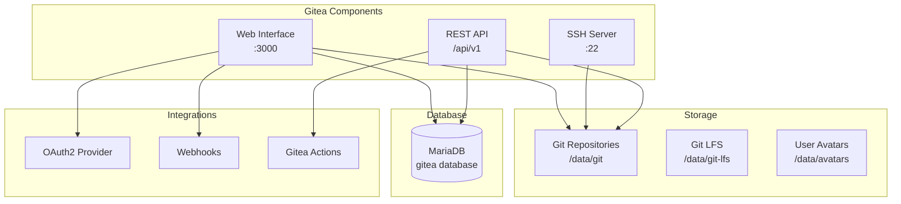

# Gitea Service Documentation

## Overview

Gitea is a lightweight, self-hosted Git service that provides repository hosting, code review, issue tracking, and CI/CD integration for the MosAIc Stack.

## Architecture



## Configuration

### Environment Variables

```env
# Basic Configuration
GITEA__server__DOMAIN=git.example.com
GITEA__server__ROOT_URL=https://git.example.com/
GITEA__server__HTTP_PORT=3000
GITEA__server__SSH_DOMAIN=git.example.com
GITEA__server__SSH_PORT=22

# Database Configuration
GITEA__database__DB_TYPE=mysql
GITEA__database__HOST=mariadb:3306
GITEA__database__NAME=gitea
GITEA__database__USER=gitea
GITEA__database__PASSWD=${MARIADB_PASSWORD}

# Security
GITEA__security__SECRET_KEY=${GITEA_SECRET_KEY}
GITEA__security__INTERNAL_TOKEN=${GITEA_INTERNAL_TOKEN}
GITEA__security__INSTALL_LOCK=true

# Service Configuration
GITEA__service__DISABLE_REGISTRATION=false
GITEA__service__REQUIRE_SIGNIN_VIEW=false
GITEA__service__DEFAULT_KEEP_EMAIL_PRIVATE=true
GITEA__service__DEFAULT_ALLOW_CREATE_ORGANIZATION=true

# Mail Configuration (Optional)
GITEA__mailer__ENABLED=true
GITEA__mailer__PROTOCOL=smtp
GITEA__mailer__SMTP_ADDR=smtp.example.com
GITEA__mailer__SMTP_PORT=587
GITEA__mailer__FROM=gitea@example.com
GITEA__mailer__USER=gitea@example.com
GITEA__mailer__PASSWD=${SMTP_PASSWORD}
```

### Advanced Configuration

#### 1. Git LFS Support

```ini
[server]
LFS_START_SERVER = true
LFS_JWT_SECRET = ${LFS_JWT_SECRET}

[lfs]
PATH = /data/git-lfs
```

#### 2. Repository Settings

```ini
[repository]
ROOT = /data/git/repositories
DEFAULT_BRANCH = main
DEFAULT_PRIVATE = false
MAX_CREATION_LIMIT = -1

[repository.upload]
ENABLED = true
FILE_MAX_SIZE = 50
MAX_FILES = 10
```

#### 3. OAuth2 Configuration

```ini
[oauth2]
ENABLE = true
ACCESS_TOKEN_EXPIRATION_TIME = 3600
REFRESH_TOKEN_EXPIRATION_TIME = 730
INVALIDATE_REFRESH_TOKENS = true
JWT_SIGNING_ALGORITHM = RS256
```

## Features

### 1. Repository Management

**Creating Repositories**:
```bash
# Via API
curl -X POST "https://git.example.com/api/v1/user/repos" \
  -H "Authorization: token YOUR_ACCESS_TOKEN" \
  -H "Content-Type: application/json" \
  -d '{
    "name": "my-project",
    "description": "My awesome project",
    "private": false,
    "auto_init": true,
    "gitignores": "Go",
    "license": "MIT"
  }'
```

**Repository Features**:
- Branch protection
- Code review requirements
- Issue templates
- Pull request templates
- Wiki support
- Project boards

### 2. User Management

**User Roles**:
- **Admin**: Full system access
- **User**: Standard user permissions
- **Restricted**: Limited to specific repos

**Authentication Methods**:
- Local accounts
- LDAP/AD integration
- OAuth2 (GitHub, GitLab, etc.)
- SAML 2.0
- OpenID Connect

### 3. CI/CD Integration

#### Woodpecker CI Webhook

```yaml
# .woodpecker.yml in repository
pipeline:
  build:
    image: golang:1.21
    commands:
      - go build
      - go test ./...
```

#### Gitea Actions (Native CI)

```yaml
# .gitea/workflows/build.yml
name: Build and Test
on: [push, pull_request]

jobs:
  build:
    runs-on: ubuntu-latest
    steps:
      - uses: actions/checkout@v3
      - name: Build
        run: |
          go build
          go test ./...
```

### 4. API Usage

**Authentication**:
```bash
# Generate access token
curl -X POST "https://git.example.com/api/v1/users/login" \
  -H "Content-Type: application/json" \
  -d '{"username": "user", "password": "pass"}'
```

**Common API Operations**:
```bash
# List repositories
curl "https://git.example.com/api/v1/user/repos" \
  -H "Authorization: token YOUR_TOKEN"

# Create issue
curl -X POST "https://git.example.com/api/v1/repos/owner/repo/issues" \
  -H "Authorization: token YOUR_TOKEN" \
  -d '{"title": "Bug report", "body": "Description"}'

# Create pull request
curl -X POST "https://git.example.com/api/v1/repos/owner/repo/pulls" \
  -H "Authorization: token YOUR_TOKEN" \
  -d '{
    "title": "Feature X",
    "head": "feature-branch",
    "base": "main",
    "body": "Implements feature X"
  }'
```

## Administration

### 1. Backup Procedures

```bash
#!/bin/bash
# Gitea backup script

# Stop Gitea
docker stop mosaic-gitea-1

# Backup database
docker exec mosaic-mariadb-1 mysqldump -u root -p$MARIADB_ROOT_PASSWORD gitea > gitea_db_backup.sql

# Backup repositories and data
tar -czf gitea_data_backup.tar.gz -C /var/lib/mosaic/gitea .

# Backup configuration
cp /var/lib/mosaic/gitea/gitea/conf/app.ini gitea_config_backup.ini

# Start Gitea
docker start mosaic-gitea-1
```

### 2. Maintenance Tasks

**Database Optimization**:
```sql
-- Run periodically
OPTIMIZE TABLE repository;
OPTIMIZE TABLE issue;
OPTIMIZE TABLE pull_request;
OPTIMIZE TABLE action;
```

**Repository Garbage Collection**:
```bash
# Run git gc on all repositories
docker exec mosaic-gitea-1 gitea admin repo-gc --all
```

**Clean up old actions logs**:
```bash
docker exec mosaic-gitea-1 gitea admin actions cleanup --days 30
```

### 3. Monitoring

**Health Check Endpoint**:
```bash
curl https://git.example.com/api/healthz
```

**Metrics to Monitor**:
- Repository count and size
- Active user count
- API request rate
- Database connection pool
- Disk usage for repositories

### 4. Security Hardening

**Disable Features**:
```ini
[service]
DISABLE_REGISTRATION = true
REQUIRE_SIGNIN_VIEW = true
ENABLE_CAPTCHA = true

[security]
INSTALL_LOCK = true
SECRET_KEY = ${STRONG_SECRET}
INTERNAL_TOKEN = ${STRONG_TOKEN}
PASSWORD_COMPLEXITY = lower,upper,digit,spec
MIN_PASSWORD_LENGTH = 12
```

**Rate Limiting**:
```ini
[security]
LOGIN_RATE_LIMIT = 10:60  # 10 attempts per 60 seconds
```

## Integrations

### 1. Woodpecker CI Integration

1. Create OAuth2 application in Gitea
2. Configure Woodpecker with client ID/secret
3. Set up webhooks for repositories

### 2. MosAIc MCP Integration

```javascript
// Example: Using Gitea API from MCP
const gitea = new GiteaClient({
  baseUrl: 'https://git.example.com',
  token: process.env.GITEA_TOKEN
});

// Create repository for AI project
await gitea.createRepository({
  name: 'ai-generated-project',
  description: 'Generated by MosAIc AI',
  private: false
});
```

### 3. External Authentication

**LDAP Configuration**:
```ini
[security]
ENABLE_LDAP = true

# Configure via Admin UI
# Settings → Authentication → Add Authentication Source
```

## Troubleshooting

### Common Issues

1. **Cannot push to repository**:
   - Check SSH key is added to account
   - Verify repository permissions
   - Check disk space

2. **Webhooks not firing**:
   - Verify webhook URL is accessible
   - Check webhook logs in repository settings
   - Ensure webhook secret matches

3. **Database connection issues**:
   ```bash
   # Check database connectivity
   docker exec mosaic-gitea-1 mysql -h mariadb -u gitea -p$MARIADB_PASSWORD -e "SELECT 1"
   ```

4. **Performance issues**:
   - Enable caching
   - Optimize database
   - Consider using external object storage for LFS

### Debug Mode

```ini
[log]
MODE = console
LEVEL = debug
ROUTER_LOG_LEVEL = debug
```

## Performance Tuning

### 1. Database Connection Pool

```ini
[database]
MAX_OPEN_CONNS = 100
CONN_MAX_LIFETIME = 3600
MAX_IDLE_CONNS = 10
```

### 2. Caching

```ini
[cache]
ENABLED = true
ADAPTER = redis
HOST = redis:6379
```

### 3. Session Management

```ini
[session]
PROVIDER = redis
PROVIDER_CONFIG = redis:6379
```

## Migration

### From Other Git Services

**From GitHub**:
```bash
# Use Gitea's migration tool
docker exec mosaic-gitea-1 gitea admin migrate \
  --github-token YOUR_GITHUB_TOKEN \
  --github-repo owner/repo \
  --gitea-repo-owner gitea-owner
```

**From GitLab**:
```bash
# Similar migration command
docker exec mosaic-gitea-1 gitea admin migrate \
  --gitlab-token YOUR_GITLAB_TOKEN \
  --gitlab-project-id PROJECT_ID
```

## Best Practices

1. **Repository Organization**:
   - Use organizations for team projects
   - Implement naming conventions
   - Use repository templates

2. **Security**:
   - Enable 2FA for all users
   - Use deploy keys for CI/CD
   - Regular security audits

3. **Performance**:
   - Regular maintenance tasks
   - Monitor repository sizes
   - Archive old repositories

4. **Backup**:
   - Daily automated backups
   - Test restore procedures
   - Off-site backup storage

---

*Last Updated: January 2025 | Gitea Service Documentation v1.0.0*