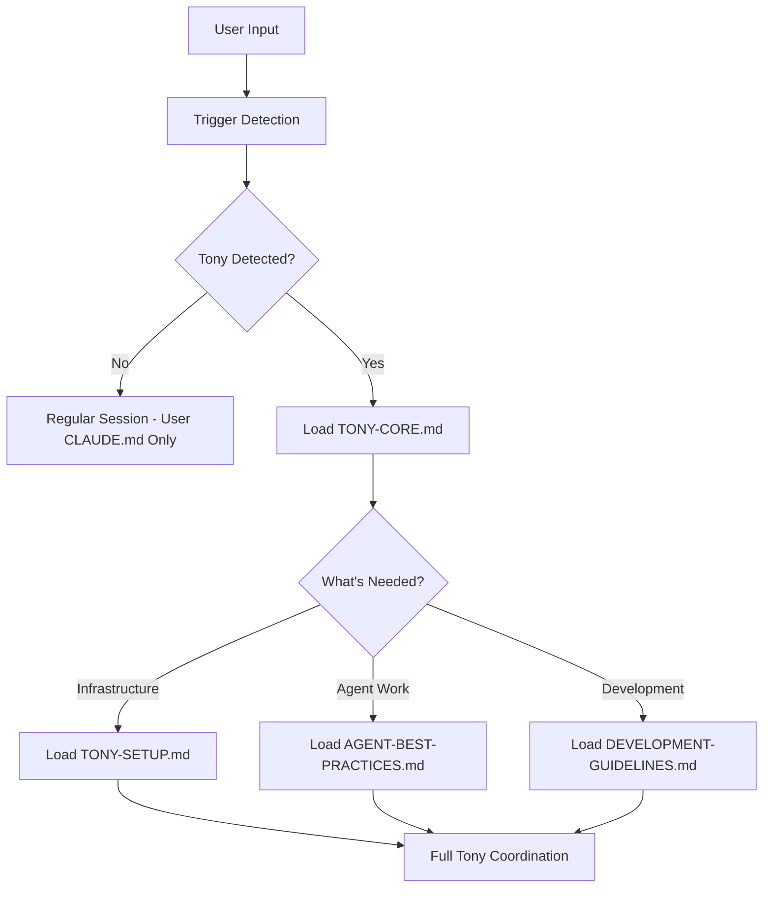

# Tech Lead Tony v2.0 - Modular Agent Coordination Framework

**Revolutionary Multi-Agent Development Coordination**  
**Zero Risk Installation | Complete User Control | Universal Compatibility**

🤖 **Universal AI Agent Coordination System** with intelligent modular architecture for any Claude session and any project type.

## ✨ What is Tech Lead Tony v2.0?

Tech Lead Tony is an intelligent AI agent coordination system that:

- **🛡️ Zero Risk Installation** - Never overwrites existing Claude configurations
- **🚀 Auto-deploys** via natural language triggers ("Hey Tony") 
- **🔄 Maintains session continuity** with zero data loss between Claude sessions
- **⚡ Coordinates multiple concurrent agents** with proper tool authorization and research-driven development
- **🌐 Works universally** across any project type with modular component loading
- **📋 Manages complex projects** with hierarchical task organization and quality gates
- **🎯 Enforces standards** including TypeScript strict mode, ESLint compliance, and 85% test coverage
- **⚡ Performance optimized** with context-aware loading and minimal overhead

## 🚀 Quick Start (2 Minutes)

### Installation (One-Time Setup)
```bash
# Clone and install Tony framework  
git clone https://github.com/your-org/tech-lead-tony.git
cd tech-lead-tony
./quick-setup.sh
```

### Usage (Any Project)
```bash
cd your-project-directory
# Start Claude session and say:
"Hey Tony, deploy infrastructure for this project"
```

**That's it!** Tony auto-deploys project-specific infrastructure and begins coordination.

## 🏗️ Two-Level Architecture

### 🌐 User-Level Installation (One-Time)
- **What**: Install Tony framework components at `~/.claude/tony/`
- **When**: Once per user/machine using `./quick-setup.sh`
- **Safety**: Non-destructive - preserves all existing Claude configurations
- **Updates**: Framework components update independently of user content

### 📁 Project-Level Deployment (Per-Project) 
- **What**: Deploy Tony infrastructure in current project directory
- **When**: First time saying "Hey Tony" in each project
- **How**: Automatic via natural language triggers  
- **Scope**: Project-specific coordination infrastructure

## 🛡️ Zero Risk Installation

### Complete Safety Guarantees
- ✅ **Never overwrites** existing `~/.claude/CLAUDE.md` content
- ✅ **Preserves all customizations** during framework updates  
- ✅ **Full rollback capability** to restore original configuration
- ✅ **Isolated components** - framework updates don't affect user content
- ✅ **Non-destructive augmentation** with clearly marked AUTO-MANAGED sections

### Before Installation
```bash
# Your existing ~/.claude/CLAUDE.md (if any) - PRESERVED
# [Your personal Claude instructions]
```

### After Installation
```bash  
# Your existing ~/.claude/CLAUDE.md - UNCHANGED
# [Your personal Claude instructions - EXACTLY AS BEFORE]

## 🤖 Tech Lead Tony Framework v2.0 Integration
<!-- AUTO-MANAGED: Framework components load contextually -->
# [Tony framework integration - ISOLATED SECTION]
<!-- END AUTO-MANAGED SECTION -->
```

## 🎯 v2.0 Key Features

### ✅ Modular Architecture
- **Component Isolation**: Each function in separate, updatable modules
- **Context-Aware Loading**: Components load only when needed
- **Independent Updates**: Framework updates without user content changes
- **Memory Efficient**: No Tony overhead for regular Claude usage

### ✅ Universal Compatibility  
- **Any project type**: Node.js, Python, Go, Rust, etc.
- **Any development stage**: New projects or existing codebases
- **Any Claude session**: Works without prior project setup
- **Intelligent detection**: Automatic project type recognition and agent recommendations

### ✅ Session Continuity
- **Zero data loss** between Claude sessions
- **Scratchpad system** maintains full project context
- **Automatic context recovery** via `/engage` command
- **Session handoff** protocols for seamless Tony transitions

### ✅ Atomic Task Management
- **ATOMIC TASK PRINCIPLE**: Deploy specialized agents for single, atomic tasks (≤30 minutes) 
- **Time Bounded**: Prevent command fatigue and task pollution
- **Single Objective**: Each agent addresses ONE specific, well-defined task
- **Hierarchical numbering**: P.TTT.SS.AA.MM format for task organization
- **Dependency tracking** and coordination protocols

### ✅ Multi-Agent Coordination
- **Concurrent agent sessions** (max 5) with isolated workspaces
- **Real-time monitoring** and progress tracking  
- **Quality assurance** protocols to prevent false completion claims
- **Research-driven development** with mandatory solution research

## 🚀 Usage Examples

### Starting a New Project
```
User: "Hey Tony, I need to build a React app with a Node.js backend"

Tony: [Auto-deploys project infrastructure]
✅ User-level framework verified
✅ Project type detected: Node.js  
✅ Infrastructure deployed
✅ Context established
✅ Ready to coordinate agents

Recommended agents:
- frontend-agent: React development
- backend-agent: Node.js/Express development
- database-agent: Database design  
- security-agent: Authentication implementation
```

### Continuing Previous Work
```
User: "/engage"

Tony: [Loads previous session context]
✅ Context recovered from scratchpad
✅ Found 3 active agents in progress
✅ 2 tasks completed since last session
✅ Ready to continue coordination

Current status:
- frontend-agent: 80% complete (authentication)
- backend-agent: 60% complete (API endpoints)  
- database-agent: 100% complete (schema design)
```

### Framework Not Installed
```
User: "Hey Tony, coordinate this project"

Tony: ❌ Tony framework not installed at user level

📦 To install Tony framework:
1. Clone repository: git clone https://github.com/your-org/tech-lead-tony.git
2. Run installer: cd tech-lead-tony && ./quick-setup.sh  
3. Return here and say 'Hey Tony' again

🛑 Project-level deployment cannot proceed without user-level framework
```

## 📁 File Structure

### User-Level Framework
```
~/.claude/
├── CLAUDE.md                           # Your content + Tony integration
└── tony/                               # Tony framework (modular)
    ├── TONY-CORE.md                    # Central coordination logic
    ├── TONY-TRIGGERS.md                # Natural language detection
    ├── TONY-SETUP.md                   # Project deployment automation
    ├── AGENT-BEST-PRACTICES.md         # Agent coordination standards
    ├── DEVELOPMENT-GUIDELINES.md       # Universal development standards
    ├── metadata/
    │   ├── VERSION                     # Framework version tracking
    │   ├── INSTALL-LOG.md              # Installation audit log
    │   └── USER-BACKUP*.md             # Original CLAUDE.md backups
    ├── verify-modular-installation.sh  # Verification utility
    └── rollback-installation.sh        # Complete rollback utility
```

### Project-Level Infrastructure (Created by Tony)
```
project-root/
├── .claude/
│   └── commands/
│       └── engage.md                   # Session continuity
├── docs/
│   ├── agent-management/
│   │   ├── tech-lead-tony/
│   │   │   └── scratchpad.md           # Tony session state
│   │   └── templates/
│   │       └── AGENT-TASK-BREAKDOWN-TEMPLATE.md
│   └── project-management/
│       └── MASTER_TASK_LIST.md         # Hierarchical task organization
├── logs/
│   ├── agent-sessions/                 # Individual agent logs
│   └── coordination/                   # Tony coordination logs
└── scripts/
    └── automation/                     # Agent management scripts
```

## 📊 Component Loading Strategy

### Context-Aware Loading


### Session Types & Loading
- **Regular Sessions**: Lightweight trigger detection only (minimal overhead)
- **Tony Sessions**: Full coordination framework loaded on-demand
- **Agent Sessions**: Agent best practices + core framework  
- **Development Sessions**: Guidelines + applicable standards

## 🔧 Management Commands

### Verify Installation
```bash
~/.claude/tony/verify-modular-installation.sh
```

### Complete Rollback
```bash
~/.claude/tony/rollback-installation.sh
```

### Check Framework Status
```bash
cat ~/.claude/tony/metadata/VERSION
```

### View Installation Logs
```bash
cat ~/.claude/tony/metadata/INSTALL-LOG.md
```

### Re-run Installation (Safe)
```bash
cd tech-lead-tony
./quick-setup.sh  # Non-destructive - safe to re-run
```

## 📊 Task Breakdown System

### Hierarchical Numbering: P.TTT.SS.AA.MM
- **P**: Phase Number (1 = Setup, 2 = Development, 3 = Testing, 4 = Deployment)
- **TTT**: Task Number (001-999, resets per phase)
- **SS**: Subtask Number (01-99)  
- **AA**: Atomic Task Number (01-99, ≤30 minutes for atomic tasks)
- **MM**: Micro Task Number (01-99, optional)

### Example Task Structure
```
1.001 - Project Analysis and Requirements
├── 1.001.01 - Technology Stack Assessment
│   ├── 1.001.01.01 - Frontend technology analysis (20 min)
│   ├── 1.001.01.02 - Backend technology analysis (20 min)
│   └── 1.001.01.03 - Database technology analysis (15 min)
├── 1.001.02 - Requirements Documentation  
│   ├── 1.001.02.01 - Functional requirements (25 min)
│   └── 1.001.02.02 - Non-functional requirements (20 min)
```

## 🔧 Advanced Configuration

### Custom Trigger Phrases
Add to your project's `CLAUDE.md`:
```markdown
## Project-Specific Tony Triggers
- "coordinate this project"
- "manage development workflow"
- "activate project lead mode"
```

### Component Customization  
Override framework defaults in project `CLAUDE.md`:
```markdown
## Tony Customizations
- Agent limit: 3 (instead of default 5)
- Task duration: 20 minutes (instead of 30)
- Custom templates: docs/templates/
```

### Monitoring and Debugging
```bash
# Monitor all agent activity
tail -f logs/agent-sessions/*.log

# Check coordination status  
tail -f logs/coordination/coordination-status.log

# Debug Tony session state
cat docs/agent-management/tech-lead-tony/scratchpad.md

# Check framework components
ls -la ~/.claude/tony/*.md
```

## 🆘 Troubleshooting

### Tony Not Responding to "Hey Tony"
```bash
# Check framework installation
~/.claude/tony/verify-modular-installation.sh

# Verify trigger phrases work
grep -A5 "Hey Tony" ~/.claude/tony/TONY-TRIGGERS.md
```

### Installation Issues  
```bash
# Check installation logs
cat ~/.claude/tony/metadata/INSTALL-LOG.md

# Re-run installation (safe - non-destructive)
cd tech-lead-tony && ./quick-setup.sh
```

### Project Deployment Fails
```bash
# Check user-level framework
ls -la ~/.claude/tony/

# Verify components exist
ls ~/.claude/tony/*.md

# Check project permissions
touch test-file && rm test-file  # Should work without errors
```

### Complete Rollback
```bash
# Remove Tony framework completely  
~/.claude/tony/rollback-installation.sh

# Confirms restoration of original CLAUDE.md
```

## 🌐 Universal Compatibility

### Supported Project Types
- **Node.js/JavaScript**: React, Vue, Angular, Express, NestJS
- **Python**: Django, Flask, FastAPI, Data Science, ML projects
- **Go**: APIs, microservices, system tools
- **Rust**: Performance-critical applications, system programming  
- **Java**: Spring Boot, enterprise applications
- **Generic**: Any technology stack with universal templates

### Environment Requirements
- **Claude Code** or **Claude API** access
- **Unix-like system** (Linux, macOS, WSL)
- **Bash shell** for installation scripts
- **Git** for repository cloning
- **Write permissions** to `~/.claude/` directory

## 🔮 What's New in v2.0

### Modular Architecture
- **Component Isolation**: Each function in separate, updatable modules
- **Context Efficiency**: Load only needed components per session
- **Independent Updates**: Framework updates without user content changes

### Enhanced Safety
- **Zero Risk Installation**: Never overwrites existing user content
- **Complete Rollback**: Restore original configuration anytime  
- **Non-Destructive Updates**: Preserve all user customizations

### Improved Performance
- **Lightweight Detection**: Minimal overhead for regular Claude sessions
- **On-Demand Loading**: Components activate only when needed
- **Optimized Memory**: Efficient context usage for all session types

### Better User Experience
- **Two-Level Architecture**: Clear separation of user vs. project concerns
- **Smart Detection**: Automatic installation type detection  
- **Comprehensive Logging**: Full audit trail of all operations

## 🤝 Contributing

This system is designed to be:
- **Self-contained**: No external dependencies
- **Universal**: Works across all project types
- **Extensible**: Easy to customize for specific workflows
- **Maintainable**: Clear documentation and standardized patterns

## 📄 License

MIT License - Use freely in any project or organization.

## 🆘 Support

The system is designed to be self-documenting and self-healing:
- All instructions are embedded in the modular components
- Error handling provides clear guidance
- Validation checks ensure proper deployment
- Session continuity prevents data loss
- Complete rollback capability for any issues

---

**🤖 Tech Lead Tony v2.0 - Modular AI Agent Coordination**  
*Making complex project coordination simple through intelligent automation and zero-risk installation*